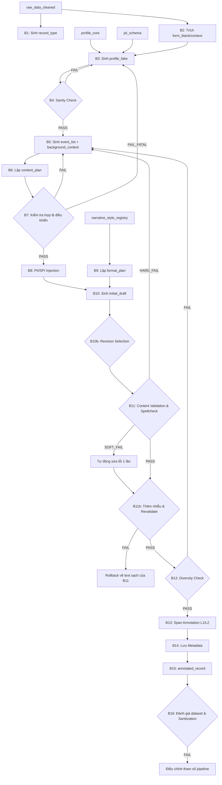

# HƯỚNG DẪN HỆ THỐNG PIPELINE SECUREPREP
 
Tài liệu này cung cấp cái nhìn toàn diện về cấu trúc và cách thức hoạt động của hai hệ thống pipeline cốt lõi trong dự án **SecurePrep**:
1. **Pipeline Sinh Dữ Liệu PII/SPI (16 Bước)**: Quy trình sinh dữ liệu giả lập cho các văn bản hành chính Việt Nam.
2. **Pipeline Sửa Lỗi Nhãn ↔ Giá Trị (Phễu 5 Tầng)**: Quy trình hậu xử lý tối ưu chi phí để làm sạch các lỗi gán nhãn sai trong văn bản.

---

## 1. Pipeline Sinh Dữ Liệu PII/SPI (16 Bước)

### 1.1. Triết Lý Thiết Kế
Hệ thống tuân thủ nguyên tắc **Constraint-First (LLM-as-writer, not LLM-as-thinker)**. Thay vì để LLM tự do suy nghĩ và sinh ra thông tin cá nhân (dẫn đến hallucination và sai lệch nhãn), hệ thống chuẩn bị sẵn dữ liệu điều khiển từ code Python và chỉ yêu cầu LLM đóng vai trò người viết (writer) để ráp nối thông tin vào ngữ cảnh tự nhiên.

### 1.2. Sơ đồ Luồng Artifact
Luồng xử lý từ dữ liệu thô ban đầu đến bản ghi hoàn chỉnh:



### 1.3. Chi Tiết Các Bước Chính
* **B1 - B2**: Chuẩn bị cấu trúc văn bản mẫu (`form_blank`) và ngữ cảnh từ tập dữ liệu thô.
* **B3 - B4 (Profile Generation & Check)**: Sinh hồ sơ cá nhân giả lập (`profile_fake`) dựa trên quy luật khớp giới tính/năm sinh/CCCD và tên riêng khớp với 54 dân tộc Việt Nam.
* **B5 - B8 (Planning & Injection)**: Tách biệt nội dung cần xuất hiện (`content_plan`) và hình thức trình bày (`format_plan`). Đảm bảo 100% các giá trị quan trọng nằm trong danh sách được khóa (`locked_values`) để tiêm (inject) vào văn bản.
* **B10 - B12 (Drafting & Quality Gates)**: LLM sinh văn bản nháp. Chạy qua bộ kiểm duyệt nội dung, tự động sửa lỗi chính tả, tạo nhiễu ngẫu nhiên (giả lập lỗi OCR/nhập liệu), và tính toán độ đa dạng (Cosine Similarity & Vendi score).
* **B13 - B15 (Annotation & Output)**: Tự động đánh dấu tọa độ spans L1/L2 của các PII/SPI và xuất bản ghi hoàn chỉnh dưới dạng JSON.

> [!NOTE]
> Xem chi tiết đặc tả tại [PIPELINE_SPEC.md](file:///d:/Đại Học/SecurePrep/Project/Markdown/docs/PIPELINE_SPEC.md).

---

## 2. Pipeline Sửa Lỗi Nhãn ↔ Giá Trị (Phễu 5 Tầng)

### 2.1. Phát Hiện Then Chốt
Trong quá trình sinh dữ liệu quy mô lớn (với Qwen hoặc Gemma), đôi khi LLM viết sai từ gợi ý (label) trong câu văn xuôi mặc dù nhãn chú thích (span) thì đúng.
* *Ví dụ thực tế*: Câu văn ghi *"số điện thoại 035048152083"*, nhưng `035048152083` thực chất là số **CCCD** và span tại đây được gắn chính xác nhãn `cccd`.
* *Giải pháp*: Thay vì chạy lại LLM gây tốn kém, ta sử dụng **Phễu 5 tầng (Cost Funnel)** tối ưu chi phí.

### 2.2. Kiến Trúc Phễu 5 Tầng

| Tầng | Tên Tầng | Mô Tả Nhiệm Vụ | Chi Phí |
| :---: | :--- | :--- | :---: |
| **A** | **Knowledge Base (KB)** | Nạp cấu hình từ điển nhãn, định dạng trường (regex), và các từ vựng đóng tiếng Việt (giới tính, tôn giáo, 54 dân tộc...). | Miễn phí |
| **B** | **Deterministic Detector** | Quét văn xuôi theo hai chiều: (1) Theo nhãn từ khóa và (2) Theo giá trị thực tế (neo vào span) để phát hiện lệch khớp. | Miễn phí |
| **C** | **Triage (Phân loại)** | Phân loại lỗi thành: **RELABEL** (sửa chữ gợi ý trong văn xuôi), **VALUE-FIX** (thay thế giá trị lạc không có span), hoặc **ESCALATE** (chuyển tiếp ca khó). | Miễn phí |
| **D** | **LLM Escalation** | Chỉ gửi các ca khó (ambiguous) lên Gemini qua gateway trung gian. Gộp lô (batching) và cache context để giảm 99% chi phí token. | Rất rẻ (~3% số ca) |
| **E** | **Apply & Re-validate** | Thực hiện thay thế chuỗi ký tự, **tính toán lại offset của các nhãn spans**, chạy lại bộ quét tầng B để đảm bảo 0 còn lỗi. | Miễn phí |

### 2.3. Quy Tắc Sửa Lỗi Tự Động (Tầng C)
1. **RELABEL (Ưu tiên cao nhất)**: Khi giá trị đã có span đúng kiểu, hệ thống chỉ sửa lại chữ gợi ý trong câu văn xuôi cho đồng bộ.
   * *Trước*: "...có số điện thoại là `035048152083` [span: cccd]..."
   * *Sau*: "...có số căn cước công dân là `035048152083` [span: cccd]..."
2. **VALUE-FIX**: Chỉ áp dụng khi một token đơn lẻ nằm ngoài span và không khớp, hệ thống sẽ ghi đè giá trị đúng từ hồ sơ gốc `profile_fake`.
3. **ESCALATE**: Mọi ca mơ hồ hoặc có bất đồng 3 chiều (định dạng, span, nhãn) sẽ chuyển lên LLM xử lý.

---

## 3. Bản Đồ File & Code Liên Quan

Dưới đây là các tệp tin quan trọng trong codebase thực thi hai pipeline trên:

### 3.1. Các Tệp Thực Thi Pipeline Sinh Dữ Liệu
* **[gen-data-v2.ipynb](file:///d:/Đại Học/SecurePrep/Project/code/gen-data-v2.ipynb)**: Notebook chính chạy quy trình sinh 16 bước, tích hợp kiểm soát trùng lặp CCCD/thông tin.
* **[build_profile_core.py](file:///d:/Đại Học/SecurePrep/Project/data/profile_core/build_profile_core.py)**: Script sinh dữ liệu hồ sơ gốc (`profile_core.json`) tuân thủ phân phối vùng miền Bắc/Trung/Nam (40/20/40).

### 3.2. Các Tệp Thực Thi Pipeline Sửa Lỗi Gán Nhãn
* **[pii_fixer_pipeline.py](file:///d:/Đại Học/SecurePrep/Project/code/dacn1/pii_fixer_pipeline.py)**: Notebook/Script điều phối toàn bộ phễu 5 tầng, gọi API Gemini cho các ca khó và kết xuất shard đã sửa.
* **[pii_fixer_core.py](file:///d:/Đại Học/SecurePrep/Project/code/dacn1/pii_fixer_core.py)**: Chứa bộ lõi xác định (Tầng A, B, C) chạy bằng Python thuần, xử lý định dạng regex và so khớp từ vựng đóng tiếng Việt.
* **[final_real.py](file:///d:/Đại Học/SecurePrep/Project/code/dacn1/final_real.py)**: Script gộp chạy trực tiếp trên máy chủ để tối ưu luồng xử lý song song nhiều phân đoạn (shards) dữ liệu.

---

## 4. Hướng Dẫn Vận Hành & Khởi Chạy

### 4.1. Cấu Hình Biến Môi Trường
Tạo hoặc cập nhật file cấu hình API key trong thư mục gốc dự án:
```bash
# Thêm API Key của cổng vilao.ai hoặc OpenAI/Gemini vào code/dacn1/final_real.py
GEMINI_API_KEY = "sk-..."
```

### 4.2. Chạy Pipeline Sửa Lỗi
Để kiểm tra lỗi và tự động sửa các shard dữ liệu PII/SPI, hãy di chuyển vào thư mục code và chạy:
```powershell
python code/dacn1/final_real.py
```
Hệ thống sẽ:
1. Đọc dữ liệu từ `INPUT_DIR` (mặc định là `data/in/`).
2. Tự động sửa lỗi nhãn-giá trị qua bộ luật xác định (Tầng A-C).
3. Gửi các ca lỗi phức tạp lên Gemini (Tầng D).
4. Tính lại offset spans và lưu kết quả sạch tại `OUTPUT_DIR` (mặc định là `data/out/`).
