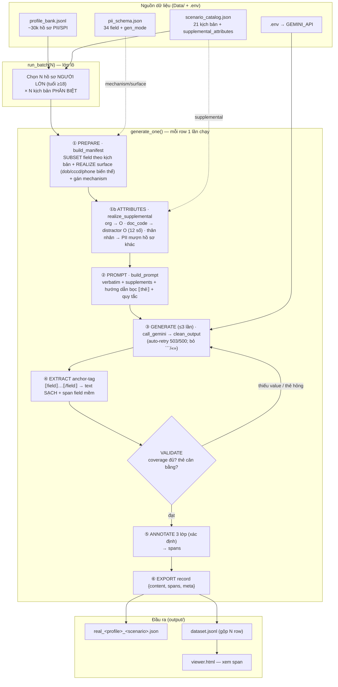
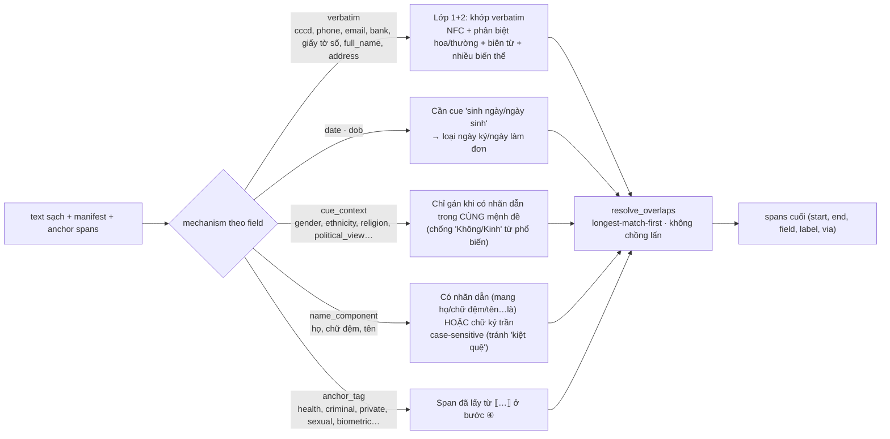

# SecurePrep — Pipeline hiện tại (thuần Python, `generate.py`)

> Sơ đồ khớp đúng code trong `Generation-Data/generate.py` (cập nhật 2026-07-02).
> Mở file này bằng VS Code (Preview) để xem Mermaid render.

## 1. Toàn cảnh: từ nguồn → dataset



## 2. Chi tiết ⑤ ANNOTATE — 3 lớp, xác định, KHÔNG dùng LLM



## 3. Ánh xạ code (file: `Generation-Data/generate.py`)

| Bước | Hàm |
|---|---|
| Chọn lô | `run_batch(n)` — lọc `_age`≥18, `DEFAULT_SCENARIOS` |
| ① PREPARE | `build_manifest(profile, scenario)` (+ `render_dob/cccd/phone`) |
| ①b ATTRIBUTES | `realize_supplemental(profile, scenario, pool, seed)` |
| ② PROMPT | `build_prompt(scenario, manifest, supplements)` |
| ③ GENERATE | `call_gemini(prompt)` + `clean_output(t)` |
| ④ EXTRACT | `extract_anchor_tags(tagged, anchor_fields)` |
| VALIDATE | `coverage(clean, manifest)` (+ regen trong `generate_one`) |
| ⑤ ANNOTATE | `annotate(clean, manifest, anchor_spans)` → `match_verbatim` / `match_cue_context` / `match_name_component` / `resolve_overlaps` |
| ⑥ EXPORT | `generate_one(...)` trả record → ghi `real_*.json` + `dataset.jsonl` |

## 4. Nguyên tắc chốt
- **Constraint-First**: code kiểm soát mọi giá trị (verbatim / seed / mượn) → LLM chỉ viết văn xuôi bao quanh. Không để LLM tự bịa PII.
- **Annotate là bước cuối, xác định**: dò chuỗi trong manifest, không hỏi LLM → offset chính xác 100%.
- **1 PASS**: `generate.py` sinh + annotate chuẩn trong một lần. `reannotate.py` chỉ là công cụ bảo trì (re-annotate data cũ khi đổi logic, khỏi tốn API) — KHÔNG phải bước bắt buộc.

## 5. Chạy
```bash
python Generation-Data/generate.py 10     # sinh 10 row → output/dataset.jsonl
python Generation-Data/generate.py 100    # sinh 100 row
```
