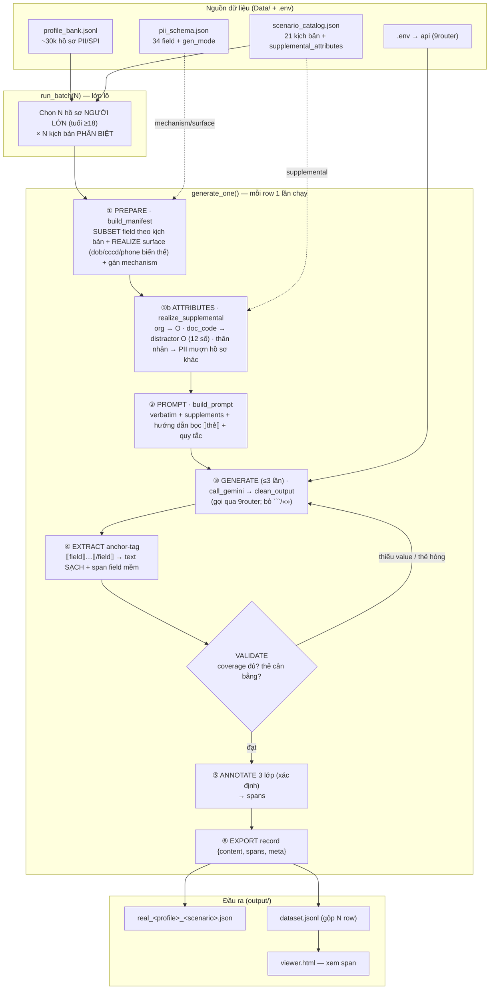
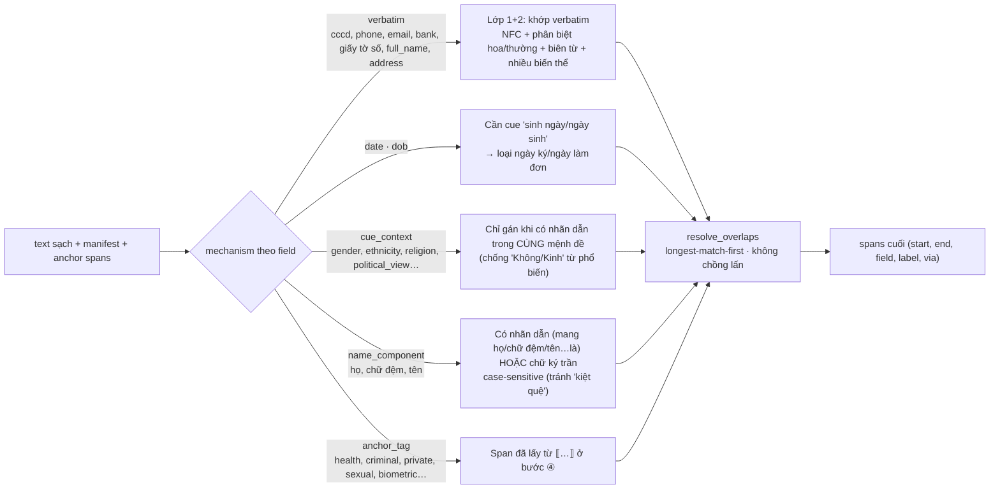

# SecurePrep: Privacy Dataset Generation Pipeline

Hệ thống tự động sinh dữ liệu giả lập tiếng Việt chứa thông tin nhạy cảm (PII/SPI) dựa trên các biểu mẫu thủ tục hành chính và kịch bản thực tế, phục vụ cho việc huấn luyện và đánh giá các mô hình bảo mật thông tin.

Dự án này đã được nâng cấp lên cấu trúc đa tệp tin (multi-file) và tối ưu hóa để chạy thông qua cổng trung chuyển API local **9router** với các mô hình thế hệ mới (như **Gemini 3.5 Flash Lite** hay **Kiro DeepSeek 3.2**).

---

## 1. Sơ đồ hoạt động của Pipeline

### Toàn cảnh: từ nguồn → dataset


```mermaid
flowchart TD
  subgraph SRC["Nguồn dữ liệu (Data/ + .env)"]
    P["profile_bank.jsonl<br/>~30k hồ sơ PII/SPI"]
    S["pii_schema.json<br/>34 field + gen_mode"]
    C["scenario_catalog.json<br/>21 kịch bản + supplemental_attributes"]
    E[".env → api (9router)"]
  end

  subgraph BATCH["run_batch(N)  —  lớp lô"]
    SEL["Chọn N hồ sơ NGƯỜI LỚN (tuổi ≥18)<br/>× N kịch bản PHÂN BIỆT"]
  end

  subgraph ROW["generate_one()  —  mỗi row 1 lần chạy"]
    B1["① PREPARE · build_manifest<br/>SUBSET field theo kịch bản + REALIZE surface (dob/cccd/phone biến thể) + gán mechanism"]
    B1b["①b ATTRIBUTES · realize_supplemental<br/>org → O · doc_code → distractor O (12 số) · thân nhân → PII mượn hồ sơ khác"]
    B2["② PROMPT · build_prompt<br/>verbatim + supplements + hướng dẫn bọc ⟦thẻ⟧ + quy tắc"]
    B3["③ GENERATE (≤3 lần) · call_gemini → clean_output<br/>(gọi qua 9router; bỏ ```/«»)"]
    B4["④ EXTRACT anchor-tag<br/>⟦field⟧…⟦/field⟧ → text SẠCH + span field mềm"]
    B5{"VALIDATE<br/>coverage đủ? thẻ cân bằng?"}
    B6["⑤ ANNOTATE 3 lớp (xác định)<br/>→ spans"]
    B7["⑥ EXPORT record {content, spans, meta}"]
  end

  subgraph OUT["Đầu ra (output/)"]
    O1["real_&lt;profile&gt;_&lt;scenario&gt;.json"]
    O2["dataset.jsonl (gộp N row)"]
    V["viewer.html — xem span"]
  end

  P --> SEL
  C --> SEL
  SEL --> B1 --> B1b --> B2 --> B3 --> B4 --> B5
  S -. mechanism/surface .-> B1
  C -. supplemental .-> B1b
  E --> B3
  B5 -- "thiếu value / thẻ hỏng" --> B3
  B5 -- "đạt" --> B6 --> B7 --> O1
  B7 --> O2 --> V
```

### Chi tiết ⑤ ANNOTATE — 3 lớp, xác định, KHÔNG dùng LLM


```mermaid
flowchart LR
  IN["text sạch + manifest + anchor spans"] --> M{"mechanism theo field"}
  M -->|"verbatim<br/>cccd, phone, email, bank, giấy tờ số, full_name, address"| L2["Lớp 1+2: khớp verbatim<br/>NFC + phân biệt hoa/thường + biên từ + nhiều biến thể"]
  M -->|"date · dob"| D["Cần cue 'sinh ngày/ngày sinh'<br/>→ loại ngày ký/ngày làm đơn"]
  M -->|"cue_context<br/>gender, ethnicity, religion, political_view…"| CU["Chỉ gán khi có nhãn dẫn trong CÙNG mệnh đề<br/>(chống 'Không/Kinh' từ phổ biến)"]
  M -->|"name_component<br/>họ, chữ đệm, tên"| NC["Có nhãn dẫn (mang họ/chữ đệm/tên…là) HOẶC chữ ký trần<br/>case-sensitive (tránh 'kiệt quệ')"]
  M -->|"anchor_tag<br/>health, criminal, private, sexual, biometric…"| AN["Span đã lấy từ ⟦…⟧ ở bước ④"]
  L2 --> R
  D --> R
  CU --> R
  NC --> R
  AN --> R
  R["resolve_overlaps<br/>longest-match-first · không chồng lấn"] --> SP["spans cuối (start, end, field, label, via)"]
```

---

## 📁 Cấu trúc thư mục dự án

```text
├── 3-7-2026/
│   ├── code/              # Toàn bộ mã nguồn xử lý chính
│   │   ├── core/          # Thư viện core (API, config, utils, annotation, manifest)
│   │   ├── track_a/       # Xử lý Track A (Form-driven)
│   │   ├── track_b/       # Xử lý Track B (Scenario-driven)
│   │   └── main.py        # Điểm khởi chạy chính
│   ├── data/              # Cơ sở dữ liệu và schema cấu hình
│   └── output/            # Thư mục lưu trữ bộ dữ liệu đầu ra (.jsonl)
├── luật/                  # Tài liệu tham khảo luật
├── paper/                 # Tài liệu nghiên cứu khoa học tham khảo
├── .gitignore             # Quy tắc loại trừ tệp khi đẩy lên Git
└── README.md              # Tài liệu hướng dẫn sử dụng này
```

---

## 3. Ánh xạ mã nguồn (Bản cấu trúc đa tệp)

| Bước | Hàm | Tệp tin định nghĩa |
|---|---|---|
| **Chọn lô** | `run_batch(n)` | [track_a/main.py](3-7-2026/code/track_a/main.py) & [track_b/main.py](3-7-2026/code/track_b/main.py) |
| **① PREPARE** | `build_manifest(...)` | [core/manifest.py](3-7-2026/code/core/manifest.py) (+ `render_*` trong [core/utils.py](3-7-2026/code/core/utils.py)) |
| **①b ATTRIBUTES** | `realize_supplemental(...)` | [track_a/main.py](3-7-2026/code/track_a/main.py) |
| **② PROMPT** | `build_prompt(...)` | [track_a/prompts.py](3-7-2026/code/track_a/prompts.py) & [track_b/prompts.py](3-7-2026/code/track_b/prompts.py) |
| **③ GENERATE** | `call_gemini(...)` | [core/api.py](3-7-2026/code/core/api.py) (Gọi qua 9router local) |
| **④ EXTRACT** | `extract_anchor_tags(...)` | [core/annotation.py](3-7-2026/code/core/annotation.py) |
| **VALIDATE** | `coverage(...)` | [core/annotation.py](3-7-2026/code/core/annotation.py) |
| **⑤ ANNOTATE** | `annotate(...)` | [core/annotation.py](3-7-2026/code/core/annotation.py) |
| **⑥ EXPORT** | `generate_one(...)` | [track_a/main.py](3-7-2026/code/track_a/main.py) |

---

## ⚡ Yêu cầu hệ thống

1. **Python 3.9+**
2. **9router** đã được cài đặt và đang chạy cục bộ trên máy của bạn (`http://localhost:20128`).
   * Cài đặt qua npm: `npm install -g 9router`

---

## 🚀 Hướng dẫn thiết lập ban đầu

### 1. Tải về các file dữ liệu lớn (Large Files)
Do giới hạn dung lượng file của GitHub, các tệp dữ liệu lớn sau đây đã được loại trừ khỏi git và cần tải về thủ công:
* 📂 **`3-7-2026/data/form.json`** (~115 MB)
* 📂 **`3-7-2026/data/profile_bank.jsonl`** (~60 MB)

👉 **[Link tải dữ liệu từ Google Drive của bạn]** (Vui lòng dán link Drive vào đây)

Sau khi tải về, hãy copy hai tệp này và đặt vào đúng thư mục: **`3-7-2026/data/`**

### 2. Thiết lập tệp môi trường `.env`
Tạo một tệp tin đặt tên là `.env` ở thư mục gốc của dự án và thêm khóa API của 9router của bạn vào:

```env
api = <nhập_api_key_9router_của_bạn_tại_đây>
```

---

## 🛠️ Hướng dẫn sử dụng

Chạy chương trình trực tiếp từ Terminal tại thư mục gốc của dự án:

### **Chạy sinh dữ liệu Track A (Form-driven - Sinh theo biểu mẫu):**
```bash
python 3-7-2026/code/main.py --track A --num 10
```
*(Thay số `10` bằng số lượng dòng dữ liệu bạn cần sinh)*

### **Chạy sinh dữ liệu Track B (Scenario-driven - Sinh theo kịch bản):**
```bash
python 3-7-2026/code/main.py --track B --num 10
```

### **Tùy chỉnh mô hình chạy:**
Mặc định hệ thống sẽ dùng model **`nvidia/deepseek-ai/deepseek-v4-flash`**. Nếu bạn muốn chỉ định model khác (ví dụ: Gemini Flash Lite hoặc Kiro DeepSeek qua 9router), hãy gán biến môi trường trước khi chạy lệnh:

* **Sử dụng Gemini 3.5 Flash Lite:**
  ```powershell
  # Trên Windows PowerShell
  $env:SECUREPI_MODEL="gemini/gemini-3.5-flash-lite"
  python 3-7-2026/code/main.py --track A --num 10
  ```

* **Sử dụng Kiro DeepSeek 3.2:**
  ```powershell
  # Trên Windows PowerShell
  $env:SECUREPI_MODEL="kr/deepseek-3.2"
  python 3-7-2026/code/main.py --track A --num 10
  ```
