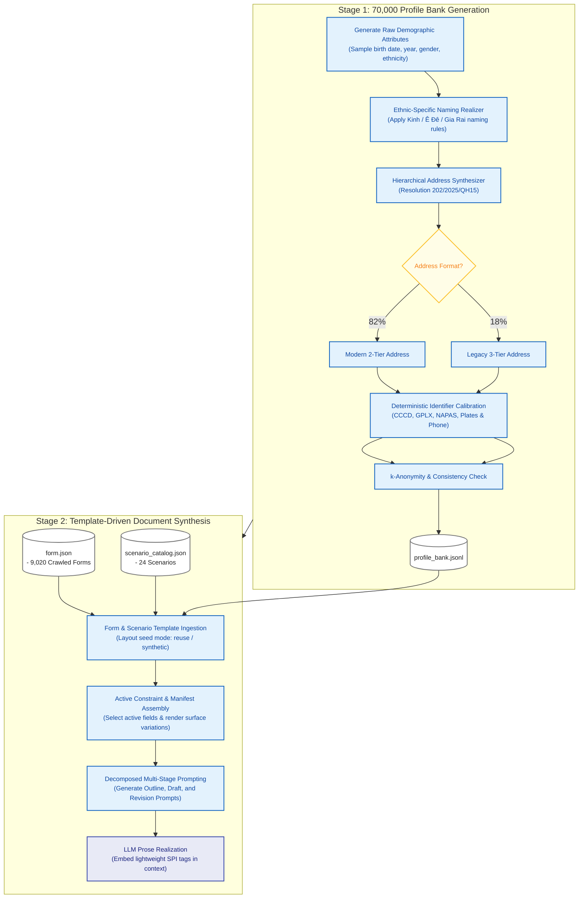
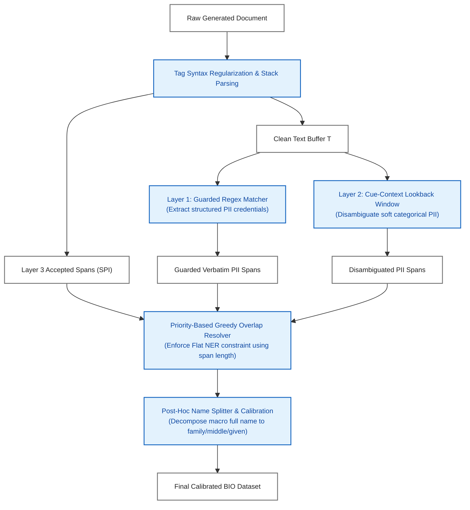
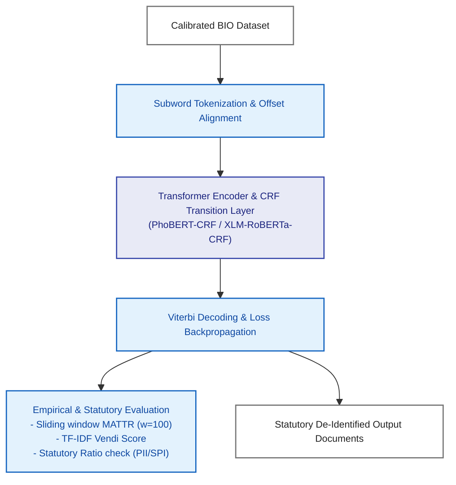

# SecurePrep: Privacy Dataset Generation Pipeline & Sovereign Privacy Framework

Hệ thống tự động sinh dữ liệu giả lập tiếng Việt chứa thông tin nhạy cảm (PII/SPI) dựa trên các biểu mẫu thủ tục hành chính và kịch bản thực tế, phục vụ cho việc huấn luyện và đánh giá các mô hình học sâu bảo mật thông tin (nhận diện thực thể nhạy cảm Flat NER dưới BIO tag).

Hệ thống hỗ trợ cơ chế chạy song song (multi-threaded workers), hỗ trợ chạy qua cổng trung chuyển API local **9router** (mặc định) hoặc gọi trực tiếp API OpenRouter/các API bên thứ ba khác, kết hợp đường ống hiệu chuẩn hậu sinh đơn định (Deterministic Post-Generation Correction) giúp triệt tiêu hoàn toàn lỗi lệch 1 ký tự và đảm bảo tính hợp lệ của cú pháp nhãn BIO.

---

## 1. Sơ đồ hoạt động và Kiến trúc Pipeline

Dưới đây là các sơ đồ kiến trúc và workflow chi tiết của hệ thống **SecurePrep** (các sơ đồ được thiết kế với chuẩn đồ họa Light-background và các mã màu chuyên nghiệp theo chuẩn xuất bản Springer/IEEE/Elsevier).

### Fig. 1: Kiến trúc tổng quan hệ thống (Overall System Architecture)
Mô tả luồng đi từ hạt giống nhân khẩu học gốc (Seeds), qua bộ sinh ngân hàng hồ sơ, bộ tổng hợp văn bản hành chính, bộ hiệu chuẩn dán nhãn 3 lớp đến bước huấn luyện và đánh giá mô hình hạ nguồn.


```mermaid
graph LR
    %% Style Definitions
    classDef process fill:#E3F2FD,stroke:#1565C0,stroke-width:1.5px,color:#0D47A1,font-size:13px;
    classDef decision fill:#FFFDE7,stroke:#FBC02D,stroke-width:1.5px,color:#F57F17,font-size:13px;
    classDef io fill:#FFFFFF,stroke:#757575,stroke-width:1.5px,color:#212121,font-size:13px;
    classDef model fill:#E8EAF6,stroke:#3949AB,stroke-width:1.5px,color:#1A237E,font-size:13px;

    %% Nodes
    A1["Demographic & Sovereign Seeds"]:::io --> B1["Profile Bank Builder"]:::process
    B1 --> B2["70,000 Profile Bank"]:::io
    B2 --> B3["Template-Driven Document Synthesizer"]:::process
    B3 --> B4["Delimited Raw Documents"]:::io
    B4 --> C1["3-Layer Calibration & Overlap Resolver"]:::process
    C1 --> C2["Calibrated BIO Dataset"]:::io
    C2 --> D1["Downstream Model Training<br>(PhoBERT-CRF / XLM-R-CRF)"]:::model
    D1 --> D2["Empirical & Statutory Evaluation"]:::process
```

### Fig. 2: Quy trình Sinh hồ sơ và Tổng hợp Văn bản (Profile Bank Generation & Document Synthesis)
Kết hợp hai giai đoạn: Giai đoạn 1 sinh 70.000 hồ sơ nhân vật giả lập qua các kiểm tra tính trùng lặp và tính chân thực của thông tin liên lạc (k-anonymity); Giai đoạn 2 nạp biểu mẫu mẫu (`form.json`) cùng kịch bản để sinh nháp văn bản thông qua LLM.


```mermaid
graph TD
    %% Style Definitions
    classDef process fill:#E3F2FD,stroke:#1565C0,stroke-width:1.5px,color:#0D47A1,font-size:12px;
    classDef decision fill:#FFFDE7,stroke:#FBC02D,stroke-width:1.5px,color:#F57F17,font-size:12px;
    classDef io fill:#FFFFFF,stroke:#757575,stroke-width:1.5px,color:#212121,font-size:12px;
    classDef model fill:#E8EAF6,stroke:#3949AB,stroke-width:1.5px,color:#1A237E,font-size:12px;

    %% STAGE 1: PROFILE BANK GENERATION
    subgraph Stage1 ["Stage 1: 70,000 Profile Bank Generation"]
        direction LR
        P1["Generate Raw Demographic Attributes<br>(Sample birth date, year, gender, ethnicity)"]:::process --> P2["Ethnic-Specific Naming Realizer<br>(Apply Kinh / Ê Đê / Gia Rai naming rules)"]:::process
        P2 --> P3["Hierarchical Address Synthesizer<br>(Resolution 202/2025/QH15)"]:::process
        P3 --> P4{"Address Format?"}:::decision
        P4 -- "82%" --> P5_New["Modern 2-Tier Address"]:::process
        P4 -- "18%" --> P5_Old["Legacy 3-Tier Address"]:::process
        P5_New & P5_Old --> P6["Deterministic Identifier Calibration<br>(CCCD, GPLX, NAPAS, Plates & Phone)"]:::process
        P6 --> P7["k-Anonymity & Consistency Check"]:::process
        P6 --> P7
        P7 --> P8[("profile_bank.jsonl")]:::io
    end

    %% STAGE 2: DOCUMENT SYNTHESIS
    subgraph Stage2 ["Stage 2: Template-Driven Document Synthesis"]
        direction LR
        S1[("form.json<br>- 9,020 Crawled Forms")]:::io
        S2[("scenario_catalog.json<br>- 24 Scenarios")]:::io
        
        S1 & S2 & P8 --> S3["Form & Scenario Template Ingestion<br>(Layout seed mode: reuse / synthetic)"]:::process
        S3 --> S4["Active Constraint & Manifest Assembly<br>(Select active fields & render surface variations)"]:::process
        S4 --> S5["Decomposed Multi-Stage Prompting<br>(Generate Outline, Draft, and Revision Prompts)"]:::process
        S5 --> S6["LLM Prose Realization<br>(Embed lightweight SPI tags in context)"]:::model
    end

    %% Vertical connection between Stage 1 and Stage 2
    Stage1 --> Stage2
```

### Fig. 3: Bộ gán nhãn 3 lớp và Phân giải chồng lấn thực thể (3-Layer Calibration & Overlap Resolution)
Xử lý các lỗi lệch tọa độ, dán nhãn sai chính tả từ LLM mà không cần gọi lại API sinh. Phân rã văn bản thô, ánh xạ thông tin qua 3 lớp: Lớp 1 (Regex cho thông tin có cấu trúc), Lớp 2 (Lookback Window cho thông tin ngữ cảnh), Lớp 3 (Thẻ sinh trắc/đời tư từ thẻ LLM), sau đó phân giải chồng lấn Flat NER theo cơ chế ưu tiên độ dài lớn nhất (Longest-match-first).


```mermaid
graph TD
    %% Style Definitions
    classDef process fill:#E3F2FD,stroke:#1565C0,stroke-width:1.5px,color:#0D47A1,font-size:12px;
    classDef decision fill:#FFFDE7,stroke:#FBC02D,stroke-width:1.5px,color:#F57F17,font-size:12px;
    classDef io fill:#FFFFFF,stroke:#757575,stroke-width:1.5px,color:#212121,font-size:12px;
    classDef model fill:#E8EAF6,stroke:#3949AB,stroke-width:1.5px,color:#1A237E,font-size:12px;

    %% Row 1: Regularization & Core Stack Parser
    R1["Raw Generated Document"]:::io --> R2["Tag Syntax Regularization & Stack Parsing"]:::process
    
    %% Parallel Outputs
    R2 --> T1["Clean Text Buffer T"]:::io
    R2 --> T2["Layer 3 Accepted Spans (SPI)"]:::io
    
    %% Row 2: Parallel Matchers
    T1 --> L1["Layer 1: Guarded Regex Matcher<br>(Extract structured PII credentials)"]:::process
    T1 --> L2["Layer 2: Cue-Context Lookback Window<br>(Disambiguate soft categorical PII)"]:::process
    
    L1 --> S1["Guarded Verbatim PII Spans"]:::io
    L2 --> S2["Disambiguated PII Spans"]:::io
    
    %% Row 3: Overlap resolution vertical pipeline
    T2 & S1 & S2 --> M1["Priority-Based Greedy Overlap Resolver<br>(Enforce Flat NER constraint using span length)"]:::process
    M1 --> M2["Post-Hoc Name Splitter & Calibration<br>(Decompose macro full name to family/middle/given)"]:::process
    M2 --> M3["Final Calibrated BIO Dataset"]:::io
```

### Fig. 4: Huấn luyện và Đánh giá Mô hình hạ nguồn (Downstream Model Training & Evaluation)
Luồng tiền xử lý, tách từ tiếng Việt (RDRsegmenter), mã hóa qua các Encoder (PhoBERT / XLM-R) và gán nhãn tuần tự Trường Ngẫu nhiên Điều kiện (CRF) qua giải mã Viterbi, kết xuất ra văn bản sạch và các chỉ số đo đạc đa dạng/bảo mật.


```mermaid
graph TD
    %% Style Definitions
    classDef process fill:#E3F2FD,stroke:#1565C0,stroke-width:1.5px,color:#0D47A1,font-size:12px;
    classDef decision fill:#FFFDE7,stroke:#FBC02D,stroke-width:1.5px,color:#F57F17,font-size:12px;
    classDef io fill:#FFFFFF,stroke:#757575,stroke-width:1.5px,color:#212121,font-size:12px;
    classDef model fill:#E8EAF6,stroke:#3949AB,stroke-width:1.5px,color:#1A237E,font-size:12px;

    %% Main Vertical Sequence
    A1["Calibrated BIO Dataset"]:::io --> A2["Subword Tokenization & Offset Alignment"]:::process
    A2 --> A3["Transformer Encoder & CRF Transition Layer<br>(PhoBERT-CRF / XLM-RoBERTa-CRF)"]:::model
    A3 --> A4["Viterbi Decoding & Loss Backpropagation"]:::process
    
    %% Horizontal Branching at the bottom for evaluation metrics
    A4 --> A5_Metrics["Empirical & Statutory Evaluation<br>- Sliding window MATTR (w=100)<br>- TF-IDF Vendi Score<br>- Statutory Ratio check (PII/SPI)"]:::process
    A4 --> A5_Output["Statutory De-Identified Output Documents"]:::io
```

---

## 2. Cấu trúc thư mục dự án

```text
├── 3-7-2026/
│   ├── code/                  # Toàn bộ mã nguồn chính của hệ thống
│   │   ├── core/              # Thư viện dùng chung (API, cấu hình, xử lý thẻ, manifest)
│   │   │   ├── annotation.py  # Xử lý dán nhãn, khớp chuỗi và phân giải thực thể nhạy cảm
│   │   │   ├── api.py         # Gọi API LLM qua 9router hoặc kết nối trực tiếp OpenRouter
│   │   │   ├── config.py      # Định nghĩa tham số, nhãn bọc thẻ và danh mục thực thể PII/SPI
│   │   │   ├── manifest.py    # Xây dựng manifest thông tin cá nhân và distractor
│   │   │   └── utils.py       # Các hàm tiện ích hỗ trợ định dạng dữ liệu
│   │   ├── track_a/           # Track A: Sinh dữ liệu định hướng biểu mẫu thủ tục hành chính
│   │   │   ├── main.py        # Pipeline chính của Track A
│   │   │   └── prompts.py     # Prompt mẫu cho biểu mẫu Track A
│   │   ├── track_b/           # Track B: Sinh dữ liệu định hướng kịch bản thực tế
│   │   │   ├── main.py        # Pipeline chính của Track B
│   │   │   └── prompts.py     # Prompt mẫu cho kịch bản Track B
│   │   ├── evaluate_dataset_stats.py  # Thống kê phân bổ nhãn và mật độ chú thích của dataset
│   │   ├── evaluate_diversity.py      # Đo đạc chất lượng ngôn ngữ (MATTR và Vendi Score)
│   │   ├── run_gpt4o_mini_track_a.py  # Script chạy thử nghiệm với model gpt-4o-mini
│   │   └── main.py            # Điểm khởi chạy hệ thống hợp nhất
│   ├── data/                  # Dữ liệu cấu hình, biểu mẫu mẫu, hồ sơ gốc
│   │   ├── annotate_guideline.md  # Hướng dẫn dán nhãn
│   │   ├── build_profiles.py      # Sinh ngân hàng hồ sơ người dùng
│   │   ├── form.json              # 9.020 cấu trúc biểu mẫu gốc
│   │   ├── form_domains.json      # Phân loại lĩnh vực biểu mẫu
│   │   ├── pii_schema.json        # Định nghĩa 34 loại trường PII/SPI nhạy cảm
│   │   ├── privasis_corpus_sample_100.jsonl # Dữ liệu tham khảo
│   │   ├── profile_bank.jsonl     # Ngân hàng 70.000 hồ sơ PII giả lập
│   │   ├── profile_core.json      # Bộ sinh hồ sơ lõi
│   │   └── scenario_catalog.json  # 24 kịch bản thủ tục nhạy cảm
│   └── output/                # Dữ liệu đầu ra sinh ra (.jsonl, báo cáo JSON)
├── luật/                      # Tài liệu tham chiếu cơ sở pháp lý (Nghị định 13, Luật...)
├── paper/                     # Các bài báo nghiên cứu khoa học tham khảo
├── PROJECT.md                 # Tóm tắt dự án, mốc tiến độ và quản lý yêu cầu
├── pipeline_diagrams.md       # Tổng hợp sơ đồ thiết kế chi tiết xuất bản hệ thống
├── test_verification_suite.py # Bộ kiểm tra tự động thống kê và trích dẫn bản thảo khoa học
├── generate_docs.py           # Công cụ tự động kết xuất Task Backlog Word (.docx)
├── models_list.json           # Danh sách định cấu hình mô hình LLM tương thích
├── .gitignore                 # Cấu hình bỏ qua tệp tin git
└── README.md                  # Hướng dẫn sử dụng hệ thống này
```

---

## 3. Ánh xạ mã nguồn (Bản cấu trúc đa tệp)

Hệ thống được thiết kế theo cấu trúc module rời rạc, dưới đây là ánh xạ các thành phần xử lý chính tới tệp tin tương ứng trong dự án:

| Bước | Hàm | Tệp tin định nghĩa | Mô tả nhiệm vụ |
|---|---|---|---|
| **Chọn lô** | `run_batch(n)` | [`track_a/main.py`](file:///d:/Đại Học/SecurePrep/v1.1/3-7-2026/code/track_a/main.py) & [`track_b/main.py`](file:///d:/Đại Học/SecurePrep/v1.1/3-7-2026/code/track_b/main.py) | Lựa chọn ngẫu nhiên danh sách hồ sơ PII và kịch bản tương ứng |
| **① PREPARE** | `build_manifest(...)` | [`core/manifest.py`](file:///d:/Đại Học/SecurePrep/v1.1/3-7-2026/code/core/manifest.py) | Chuẩn bị manifest thuộc tính cá nhân, sinh biến thể CCCD/Phone/Address |
| **①b ATTRIBUTES**| `realize_supplemental(...)` | [`track_a/main.py`](file:///d:/Đại Học/SecurePrep/v1.1/3-7-2026/code/track_a/main.py) | Xử lý chèn nhiễu distractor và thông tin của người thân mượn chéo |
| **② PROMPT** | `build_prompt(...)` | [`track_a/prompts.py`](file:///d:/Đại Học/SecurePrep/v1.1/3-7-2026/code/track_a/prompts.py) & [`track_b/prompts.py`](file:///d:/Đại Học/SecurePrep/v1.1/3-7-2026/code/track_b/prompts.py) | Ghép thuộc tính và chỉ dẫn bọc thẻ nhãn nhạy cảm thành prompt |
| **③ GENERATE** | `call_gemini(...)` | [`core/api.py`](file:///d:/Đại Học/SecurePrep/v1.1/3-7-2026/code/core/api.py) | Gọi sinh văn bản từ LLM qua cổng 9router cục bộ hoặc trực tiếp API |
| **④ EXTRACT** | `extract_anchor_tags(...)`| [`core/annotation.py`](file:///d:/Đại Học/SecurePrep/v1.1/3-7-2026/code/core/annotation.py) | Trích xuất các thực thể được bọc thẻ anchor tag `⟦field⟧...⟦/field⟧` |
| **VALIDATE** | `coverage(...)` | [`core/annotation.py`](file:///d:/Đại Học/SecurePrep/v1.1/3-7-2026/code/core/annotation.py) | Kiểm tra thẻ đóng/mở cân bằng và độ bao phủ của thuộc tính manifest |
| **⑤ ANNOTATE** | `annotate(...)` | [`core/annotation.py`](file:///d:/Đại Học/SecurePrep/v1.1/3-7-2026/code/core/annotation.py) | Phân giải dán nhãn 3 lớp (Regex, Window-Cue, Component) |
| **⑥ EXPORT** | `generate_one(...)` | [`track_a/main.py`](file:///d:/Đại Học/SecurePrep/v1.1/3-7-2026/code/track_a/main.py) | Tổng hợp cấu trúc xuất ra định dạng JSON/JSONL tiêu chuẩn |
| **ĐO ĐA DẠNG** | `calculate_mattr(...)` | [`evaluate_diversity.py`](file:///d:/Đại Học/SecurePrep/v1.1/3-7-2026/code/evaluate_diversity.py) | Đo đạc chỉ số MATTR (w=100) và Vendi Score cho tập dữ liệu |
| **THỐNG KÊ** | `main()` | [`evaluate_dataset_stats.py`](file:///d:/Đại Học/SecurePrep/v1.1/3-7-2026/code/evaluate_dataset_stats.py) | Tính toán mật độ nhãn PII/SPI và tỷ lệ lỗi định dạng thẻ |

---

## 4. Yêu cầu hệ thống

1. **Python 3.9+**
2. Cài đặt các thư viện cần thiết:
   ```bash
   pip install numpy scikit-learn python-docx
   ```
3. API Gateway hoặc LLM Service:
   * **Chế độ 9Router Proxy (Mặc định)**: Cần cài đặt và chạy `9router` cục bộ tại cổng `http://127.0.0.1:20128`. Cài đặt qua npm:
     ```bash
     npm install -g 9router
     ```
   * **Chế độ Direct API**: Kết nối trực tiếp đến OpenRouter hoặc dịch vụ API tùy chỉnh mà không cần chạy 9router local.

---

## 5. Hướng dẫn thiết lập ban đầu

### Giai đoạn 1: Tải dữ liệu lớn (Large Files)
Do giới hạn dung lượng file của GitHub, các tệp dữ liệu lớn sau đây đã được loại trừ khỏi git và cần tải về thủ công:
* 📂 **`3-7-2026/data/form.json`** (~115 MB) - Lưu trữ 9.020 biểu mẫu gốc.
* 📂 **`3-7-2026/data/profile_bank.jsonl`** (~141 MB) - Ngân hàng 70.000 hồ sơ thông tin PII/SPI.

👉 *Vui lòng tải hai file này từ kho lưu trữ đám mây nội bộ của bạn và đặt trực tiếp vào thư mục:* **`3-7-2026/data/`**

### Giai đoạn 2: Thiết lập tệp môi trường `.env`
Tạo một tệp tin đặt tên là `.env` ở thư mục gốc của dự án. Cấu hình theo một trong hai chế độ:

#### Chế độ A: Gọi qua 9Router Local (Mặc định)
```env
api = <nhập_api_key_9router_của_bạn_tại_đây>
```

#### Chế độ B: Gọi trực tiếp OpenRouter (Bypass 9Router)
```env
DEEPSEEKV4FLASH = <nhập_api_key_openrouter_của_bạn_tại_đây>
```
*(Nếu bạn sử dụng API tùy chỉnh khác, bạn có thể thiết lập biến môi trường `SECUREPI_CUSTOM_URL` làm URL đích).*

---

## 6. Hướng dẫn sử dụng

### 6.1 Chạy sinh tập dữ liệu (Unified Generation Runner)
Chương trình được khởi chạy thông qua `3-7-2026/code/main.py`. Bạn có thể tinh chỉnh các đối số CLI sau:

*   `--track`: Bắt buộc. Chọn `A` (Form-driven) hoặc `B` (Scenario-driven).
*   `--num`: Số lượng bản ghi cần sinh (mặc định: `2`).
*   `--patch`: Chỉ định ID của hồ sơ nhân vật cần sinh lại/hiệu đính riêng trong bộ dữ liệu.
*   `--mode`: Lựa chọn cấu hình độ khó cho Track B (`default`, `vanilla`, hoặc `hard`).
*   `--output`, `-o`: Tên tệp tin kết quả xuất ra (mặc định lưu tại `3-7-2026/output/dataset.jsonl`).
*   `--offset`: Chỉ số offset dòng bắt đầu ghi vào tập dữ liệu.
*   `--profile-offset`: Offset deterministic trong profile bank (mặc định tự động chọn theo model).
*   `--workers`: Số lượng luồng worker xử lý song song (mặc định: `1`).
*   `--direct`: Gọi trực tiếp API mà không thông qua 9Router.

**Ví dụ lệnh chạy:**

1. **Chạy sinh 10 tài liệu theo biểu mẫu thủ tục hành chính (Track A), gọi qua 9Router:**
   ```bash
   python 3-7-2026/code/main.py --track A --num 10
   ```

2. **Chạy sinh 20 tài liệu theo kịch bản độ khó cao (Track B), gọi trực tiếp OpenRouter, chạy 4 luồng song song:**
   ```bash
   python 3-7-2026/code/main.py --track B --num 20 --mode hard --direct --workers 4 --output output_track_b_hard.jsonl
   ```

3. **Gán nhãn hiệu đính bổ sung riêng cho một hồ sơ bị lỗi (ví dụ hồ sơ ID `p_12345`):**
   ```bash
   python 3-7-2026/code/main.py --track A --patch p_12345
   ```

4. **Chỉ định mô hình chạy tùy chọn:**
   Mặc định hệ thống sử dụng model `nvidia/deepseek-ai/deepseek-v4-flash`. Để đổi sang model khác (ví dụ: Gemini Flash Lite hoặc Kiro DeepSeek), gán biến môi trường trước khi khởi chạy:
   *   *PowerShell Windows:*
       ```powershell
       $env:SECUREPI_MODEL="gemini/gemini-3.5-flash-lite"
       python 3-7-2026/code/main.py --track A --num 10
       ```
   *   *CMD Windows:*
       ```cmd
       set SECUREPI_MODEL=gemini/gemini-3.5-flash-lite
       python 3-7-2026/code/main.py --track A --num 10
       ```

---

## 7. Thử nghiệm, Kiểm tra và Đánh giá

### 7.1 Đo đạc chất lượng ngôn ngữ (Diversity)
Sử dụng script `evaluate_diversity.py` để tính toán độ đa dạng từ vựng MATTR (Moving Average Type-Token Ratio, window=100) và độ đa dạng chủ đề ngữ nghĩa Vendi Score:
```bash
python 3-7-2026/code/evaluate_diversity.py --input 3-7-2026/output/dataset.jsonl --output 3-7-2026/output/diversity_report.json
```

### 7.2 Thống kê chi tiết chỉ số thuật toán
Sử dụng script `evaluate_dataset_stats.py` để đo đạc tỷ lệ sinh nhãn hợp lệ, mật độ phân bố PII/SPI và các trường bị bỏ lỡ (missed fields) nhiều nhất:
```bash
python 3-7-2026/code/evaluate_dataset_stats.py --input 3-7-2026/output/dataset.jsonl --output 3-7-2026/output/stats_report.json
```

### 7.3 Kiểm định thống kê của bản thảo preprints
Để chạy bộ kiểm định sự nhất quán song ngữ (bản tiếng Anh và tiếng Việt), tính đúng đắn của các số liệu phân bổ thực nghiệm và độ chính xác của các trích dẫn luật định (Nghị định 13/2023/NĐ-CP):
```bash
python test_verification_suite.py
```

### 7.4 Sinh tài liệu phân công & Backlog Word (.docx)
Nếu cần xuất file Word báo cáo phân công công việc kỹ thuật chuyên nghiệp chứa các công thức toán học và sơ đồ Mermaid chi tiết:
```bash
python generate_docs.py
```
*(Kết quả sẽ được xuất ra file `Task_Assignment_Backlog.docx` ở thư mục gốc của dự án).*
