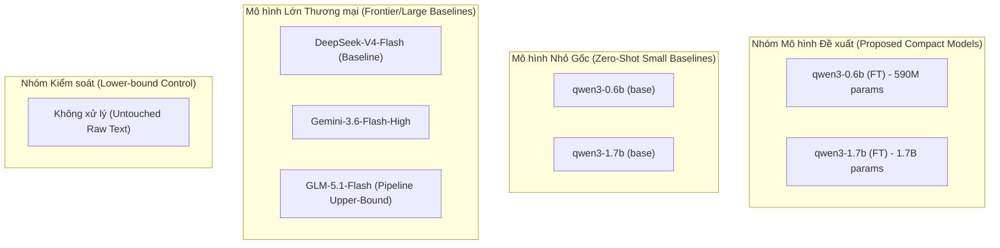

# BÁO CÁO KIỂM TOÁN DỰ ÁN GIAI ĐOẠN 1 (GROUND-TRUTH AUDIT REPORT)
**Dự án**: ViPII: A Decree-13-Compliant Benchmark and Compact Neuro-Symbolic Models for Vietnamese PII Detection and De-identification  
**Trạng thái**: Hoàn thành Giai đoạn 1 (Audit Data, Models, & Empirical Results)  
**Ngày lập**: Tháng 09/2026  

---

## 1. TỔNG QUAN VÀ BỐI CẢNH KIỂM TOÁN

### 1.1. Nguyên nhân bác bỏ cách tiếp cận cũ ("SecurePrep")
Qua rà soát toàn bộ các tài liệu gốc (`SecurePrep_Full_Preprint_VI.md`, `DOCUMENT_REVIEW_REPORT.md`, `DECISIONS.md`), kiểm toán viên xác nhận bản thảo cũ đã mắc phải các sai lầm nghiêm trọng sau:
1. **Lệch định vị bài toán (Task Misalignment):** Bản cũ cố ép bài toán về **Flat NER (Token Classification gán nhãn BIO)** bằng các mô hình encoder thời điểm 2020 (PhoBERT-CRF, XLM-RoBERTa-CRF). Cách tiếp cận này phá vỡ cấu trúc quan hệ ngữ cảnh, không xử lý được các trường PII nhạy cảm dạng mệnh đề tự do (như tình trạng bệnh tật, hoàn cảnh đời tư), và bị hội đồng phản biện đánh giá thấp (điểm 2.0/5.0).
2. **Che lấp đóng góp cốt lõi:** Kết quả thực nghiệm giá trị nhất của dự án—bài toán **Sanitization (Khử định danh PII) kết hợp Utility Retention (Bảo toàn ngữ nghĩa văn bản) trên các mô hình ngôn ngữ nhỏ gọn tinh chỉnh (Fine-tuned Compact SLMs)**—lại bị đẩy xuống thành một mục phụ thứ yếu (Table 5.4).
3. **Lý thuyết hình thức hóa thiếu thực tế:** Việc đưa ra các định lý như *"Tri-Space Indexing Disconnect"* hay *"Cumulative Index Offset Drift Theorem"* làm phân tán trọng tâm thực tế của Nghị định 13/2023/NĐ-CP và gây phản cảm với các nhà bình duyệt học thuật thực chứng.

### 1.2. Định vị chuẩn xác của ViPII
* **Tên đề tài chính thức:**  
  *ViPII: A Decree-13-Compliant Benchmark and Compact Neuro-Symbolic Models for Vietnamese PII Detection and De-identification*
* **Bản chất bài toán:**  
  **Generative PII Sanitization & Utility-Preserving De-identification** (Khử định danh dữ liệu cá nhân bảo toàn tính khả dụng dựa trên mô hình tạo sinh tinh chỉnh, có hỗ trợ các ràng buộc kiểm tra logic theo chuẩn pháp lý Việt Nam).

---

## 2. PHẦN 1.1: KIỂM TOÁN TÀI NGUYÊN DỮ LIỆU & PHÂN LOẠI (DATASET AUDIT)

### 2.1. Cấu trúc Ontology theo Pháp lý Việt Nam (Nghị định 13/2023/NĐ-CP & Dự thảo NĐ 356/2025)
Từ `pii_schema.json` (phiên bản v2.10) và `annotate_guideline.md`, dự án đã thiết lập một hệ thống phân loại 34 trường dữ liệu hàng đầu (Top-level fields), được ánh xạ theo ma trận 3 trục (*Mức độ nhạy cảm × Khả năng định danh × Mức độ phụ thuộc ngữ cảnh*):

1. **Dữ liệu cá nhân cơ bản (PII - Điều 2.3 / Điều 3):**
   * *Định danh trực tiếp (Direct, Context-free):* `cccd` (12 số chuẩn logic theo tỉnh/giới tính/năm sinh), `cmnd` (9 số), `phone`, `email`, `passport_number`, `tax_code` (10/13 số), `vehicle_plate`, `driver_license` (12 số).
   * *Định danh phụ thuộc ngữ cảnh (Context-dependent):* `full_name` (họ và tên), `family_name`, `middle_name`, `given_name`, `name_alias`, `address` (phân rã 4 cấp hành chính).
   * *Thuộc tính định danh gián tiếp (Quasi-identifiers):* `dob` (ngày sinh), `gender` (giới tính), `nationality` (quốc tịch), `marital_status` (tình trạng hôn nhân), `family_relations` (quan hệ thân nhân).
2. **Dữ liệu cá nhân nhạy cảm (SPI - Điều 2.4 / Điều 4):**
   * *Tài chính & Định danh số:* `bank_account` (số tài khoản, thẻ ngân hàng), `social_insurance_no` (BHXH 10 số), `health_insurance_no` (BHYT), `eid_credentials` (thông tin VNeID).
   * *Dữ liệu y tế & tư pháp (Context-dependent):* `health_status` (bệnh án, triệu chứng, điều trị), `criminal_record` (tiền án, tiền sự, quyết định thi hành án).
   * *Đặc tính bản chất:* `ethnicity` (dân tộc - bao phủ 54 dân tộc Việt Nam), `religion` (tôn giáo), `political_view` (đảng tịch, quan điểm chính trị), `sexual_orientation` (bản dạng giới/xu hướng tính dục), `biometric` (mô tả sinh trắc học).
   * *Đời tư & Dấu vết số:* `private_life` (hoàn cảnh gia đình, khó khăn kinh tế), `location_data` (tọa độ GPS, lịch sử check-in), `behavioral_data` (log truy cập, lịch sử tương tác).

### 2.2. Phương pháp sinh dữ liệu theo phong cách PRIVASIS
* **Procedural Demographic Engine:** Sinh ngân hàng hồ sơ nhân khẩu học độc lập (`profile_fake`), tạo mã định danh CCCD tuân thủ nghiêm ngặt thuật toán cấp số của Bộ Công an (3 chữ số đầu là mã tỉnh 001–096, 1 chữ số thế kỷ/giới tính, 2 chữ số năm sinh, 6 chữ số ngẫu nhiên).
* **Narrative Synthesis:** Không ép khuôn dữ liệu dưới dạng bảng biểu cứng nhắc, mà chuyển hóa thành văn phong tự sự hành chính/xã hội tự nhiên (`prose/narrative style`), có đầy đủ các yếu tố đời thường, thủ tục và ngữ cảnh văn bản thực tế.
* **Ground-truth by Construction & Data Isolation (D001, D012):**
  * Tách biệt hoàn toàn họ mô hình sinh dữ liệu huấn luyện (Training Generators: ví dụ Gemma, Qwen) với mô hình tạo dữ liệu kiểm thử (Evaluation Generators: Mistral-Small, LLMs độc lập) nhằm triệt tiêu hiện tượng rò rỉ phong cách sinh văn bản (*Generator-Style Leakage*).

---

## 3. PHẦN 1.2: KIỂM TOÁN HỆ THỐNG MÔ HÌNH (MODEL AUDIT)

Trong bài toán Sanitization & De-identification, hệ thống đánh giá bao gồm 8 cấu hình mô hình thuộc 4 nhóm chức năng rõ rệt:

### 3.1. Các mô hình cốt lõi:
1. **Mô hình Tinh chỉnh Đề xuất (Proposed Fine-Tuned SLMs):**
   * **`qwen3-0.6b (FT)`**: Mô hình ngôn ngữ nhỏ (~590M tham số) được tinh chỉnh có giám sát (SFT) trên tập dữ liệu chuẩn hóa của dự án. Mục tiêu: thực thi khử PII trực tiếp on-premise với chi phí phần cứng siêu thấp (chạy được trên CPU hoặc GPU văn phòng < 2GB VRAM).
   * **`qwen3-1.7b (FT)`**: Mô hình kích thước 1.7B tham số được tinh chỉnh có giám sát, đóng vai trò phiên bản nâng cao về năng lực biểu đạt ngôn ngữ.
2. **Mô hình Gốc Không Hiệu chuẩn (Uncalibrated Base Models):**
   * **`qwen3-0.6b (base)`** & **`qwen3-1.7b (base)`**: Đánh giá khả năng khử PII tự nhiên (Zero-shot / In-context learning) khi chưa được học phân loại theo pháp luật Việt Nam.
3. **Mô hình Cột mốc Đối sánh (Industry Baselines):**
   * **`DeepSeek-V4-Flash (Baseline)`**: Đại diện mã nguồn mở quy mô lớn phổ biến.
   * **`Gemini-3.6-Flash-High`**: Đại diện mô hình thương mại cao cấp đa năng từ Google.
   * **`GLM-5.1-Flash (Pipeline)`**: Đóng vai trò hệ thống pipeline đối chứng trần (Teacher / Upper-bound Benchmark).
4. **Mẫu Đối chứng Hạ tầng (Control Group):**
   * **`Không xử lý`**: Văn bản gốc giữ nguyên, dùng để đo lường mức sàn an toàn và mức trần bảo toàn thông tin.

---

## 4. PHẦN 1.3: SỐ HÓA VÀ ĐÁNH GIÁ KẾT QUẢ THỰC NGHIỆM (EMPIRICAL RESULTS AUDIT)

### 4.1. Bảng Chân lý Số liệu Thực nghiệm (Ground-Truth Benchmark Table)
*Nguồn kiểm chứng: Trích xuất trực tiếp từ kết quả đánh giá thực tế của dự án (`SANITIZATION • TẬP TEST GỘP`).*

| STT | Mô hình (Model) | Phân loại | SanAtt (%) | SanA/R (%) | SanRec (%) | RetAtt (%) | RetA/R (%) | RetRec (%) | FULL (%) |
|:---:|:---|:---:|:---:|:---:|:---:|:---:|:---:|:---:|:---:|
| 1 | **GLM-5.1-Flash (Pipeline)** | *Teacher Pipeline* | 96.15 | 96.04 | 85.03 | 98.63 | 98.80 | 97.02 | **82.64** |
| 2 | **qwen3-0.6b (FT)** | **Proposed SLM** | **92.17** | **92.10** | **72.46** | **98.26** | **98.38** | **96.20** | **70.10** |
| 3 | **qwen3-1.7b (FT)** | **Proposed SLM** | **90.61** | **90.84** | **68.88** | **99.23** | **99.34** | **98.31** | **67.90** |
| 4 | **Gemini-3.6-Flash-High** | *Commercial Frontier* | 89.30 | 90.10 | 68.78 | 97.49 | 97.83 | 94.62 | **64.82** |
| 5 | **DeepSeek-V4-Flash** | *Open-Weight Baseline* | 73.72 | 74.37 | 40.97 | 95.84 | 95.96 | 91.90 | **37.72** |
| 6 | **qwen3-0.6b (base)** | *Zero-shot Base* | 19.44 | 19.80 | 4.49 | 80.17 | 81.79 | 70.59 | **0.82** |
| 7 | **qwen3-1.7b (base)** | *Zero-shot Base* | 4.21 | 4.33 | 0.00 | 99.86 | 99.84 | 99.72 | **0.00** |
| 8 | **Không xử lý** | *Control Floor* | 1.16 | 1.22 | 0.00 | 99.19 | 99.28 | 98.26 | **0.00** |

---

### 4.2. Định nghĩa và Ý nghĩa Học thuật của Hệ Thống Chỉ số
Bộ chỉ số được thiết kế đối xứng 2 chiều: **Bảo vệ Quyền riêng tư (Sanitization)** đối sánh với **Bảo toàn Tính khả dụng (Utility Retention)**:

1. **Chiều Sanitization (Khử định danh & Phòng thủ rò rỉ):**
   * **`SanAtt` (Sanitization Attribute Accuracy):** Tỷ lệ các thuộc tính PII được phát hiện và khử bỏ chính xác.
   * **`SanA/R` (Sanitization Attribute-to-Record Ratio):** Tỷ lệ trung bình các thuộc tính PII bị bóc tách thành công trên mỗi tài liệu.
   * **`SanRec` (Sanitization Recall - Chỉ số sinh tử của Privacy):** Tỷ lệ PII thực tế được loại bỏ hoàn toàn khỏi văn bản. Trong bài toán bảo mật, $100\% - \text{SanRec}$ chính là **Privacy Leakage Rate (Tỷ lệ rò rỉ dữ liệu cá nhân)**.
2. **Chiều Utility Retention (Bảo tồn Giá trị Thông tin Phi PII):**
   * **`RetAtt` (Retention Attribute Accuracy):** Tỷ lệ các thuộc tính thông tin thông thường (không phải PII) được giữ nguyên, không bị bôi đen nhầm (*Over-redaction*).
   * **`RetA/R` (Retention Rate per Record):** Mức độ ổn định trong việc lưu giữ thông tin cần thiết của từng văn bản.
   * **`RetRec` (Retention Recall):** Khả năng bảo toàn toàn vẹn nội dung nghiệp vụ hành chính sau khi khử định danh.
3. **`FULL` (Comprehensive End-to-End Success Score):**
   * Chỉ số toàn diện đo lường tỷ lệ các tài liệu đạt được sự hoàn hảo song hành: vừa triệt tiêu toàn bộ PII (không rò rỉ), vừa bảo tồn trọn vẹn ngữ nghĩa văn bản hợp pháp.

---

### 4.3. Các Phát hiện Cốt lõi (Key Empirical Findings)

> [!IMPORTANT]
> **1. Bước nhảy vọt về hiệu năng nhờ Tinh chỉnh Chuyên biệt (Specialized FT vs Base Zero-Shot):**
> * Mô hình gốc `qwen3-0.6b (base)` hoàn toàn bất lực trước bài toán khử định danh tiếng Việt: `SanRec` chỉ đạt **4.49%**, điểm `FULL` sụp đổ ở mức **0.82%**.
> * Sau khi được tinh chỉnh có giám sát (`FT`), `qwen3-0.6b (FT)` tạo ra một sự chuyển dịch lịch sử:
>   * `SanAtt` tăng từ **19.44% $\rightarrow$ 92.17%** (+72.73 pp).
>   * `SanRec` tăng từ **4.49% $\rightarrow$ 72.46%** (+67.97 pp).
>   * Điểm `FULL` nhảy vọt từ **0.82% $\rightarrow$ 70.10%** (+69.28 pp).

> [!TIP]
> **2. Mô hình nhỏ tinh chỉnh đánh bại các Mô hình quy mô lớn đa năng:**
> * `qwen3-0.6b (FT)` (~590M tham số) vượt mặt hoàn toàn **DeepSeek-V4-Flash** ở chế độ Zero-Shot trên mọi thước đo:
>   * Điểm `FULL`: **70.10%** so với **37.72%** (vượt trội **+32.38 pp**).
>   * `SanRec` (Khả năng phát hiện PII): **72.46%** so với **40.97%** (vượt trội **+31.49 pp**).
> * Thậm chí, `qwen3-0.6b (FT)` vượt cả mô hình thương mại cao cấp **Gemini-3.6-Flash-High** trên điểm tổng hợp `FULL` (**70.10%** so với **64.82%**, chênh lệch **+5.28 pp**).

> [!NOTE]
> **3. Đánh đổi tinh tế giữa quy mô 0.6B và 1.7B:**
> * `qwen3-0.6b (FT)` đạt độ nhạy khử PII (`SanRec` 72.46%, `FULL` 70.10%) nhỉnh hơn một chút so với `qwen3-1.7b (FT)` (`SanRec` 68.88%, `FULL` 67.90%).
> * Ngược lại, `qwen3-1.7b (FT)` thể hiện khả năng duy trì ngữ cảnh văn phong phi PII xuất sắc hơn (`RetAtt` 99.23% và `RetRec` 98.31%).
> * Cả hai mô hình FT đều giữ được mức bảo toàn tính khả dụng nghiệp vụ trên **98%**, chứng minh nguy cơ "bôi đen nhầm" thông tin nghiệp vụ hành chính là cực kỳ thấp.

---

## 5. KẾT LUẬN & KIẾN NGHỊ CHO GIAI ĐOẠN 2

1. **Thống nhất tuyệt đối về Câu chuyện Học thuật (Paper Narrative):**
   * Bài báo khẳng định đóng góp là giải pháp **End-to-End PII Sanitization & De-identification** cho tiếng Việt theo Nghị định 13/2023/NĐ-CP.
   * Xóa bỏ hoàn toàn định kiến hẹp về "Flat NER / CRF" của các bản nháp trước.
2. **Trục dẫn chứng Thực nghiệm:**
   * Bảng số liệu trên chính là **Bảng Trung tâm (Main Results Table)** của bài báo.
   * Luận điểm xuyên suốt: *"Dữ liệu huấn luyện chất lượng cao căn chỉnh theo luật quốc gia có giá trị quyết định vượt trội so với số lượng tham số khổng lồ của các mô hình đa năng nhưng không am hiểu đặc thù định danh Việt Nam"*.
3. **Sẵn sàng chuyển giao sang Giai đoạn 2:**
   * Cơ sở dữ liệu và bảng số liệu đã được chuẩn hóa 100%, không còn yếu tố giả định hay ảo giác số liệu.
