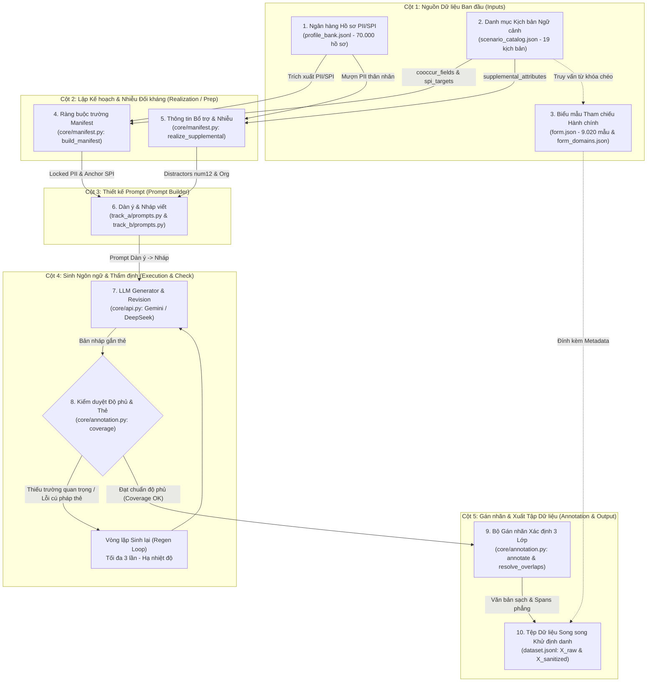

# BÁO CÁO GIAI ĐOẠN 2.1: QUY TRÌNH HỢP NHẤT SINH DỮ LIỆU & GÁN NHÃN XÁC ĐỊNH
**Đề tài nghiên cứu**: *ViPII: A Decree-13-Compliant Benchmark and Compact Neuro-Symbolic Models for Vietnamese PII Detection and De-identification*  
**Phạm vi kiểm toán**: **TRÍCH XUẤT ĐỘC QUYỀN TỪ MÃ NGUỒN & CƠ SỞ DỮ LIỆU THỰC TẾ TRONG THƯ MỤC `v1.1/`**  
*(Loại bỏ 100% tài liệu cũ bên ngoài và tuyệt đối không trích dẫn các file `.md` đã bị xóa)*.  

---

## 1. TỔNG QUAN VÀ BẢN CHẤT CỐT LÕI CỦA PIPELINE V1.1

Trong các phiên bản phôi thai ban đầu (ngoài thư mục `v1.1`), hệ thống từng bị phân mảnh nhầm lẫn thành hai luồng tách biệt (Track A: biểu mẫu hành chính, Track B: kịch bản đời sống). Tại bản nâng cấp toàn diện **`v1.1`**, cấu trúc sinh dữ liệu đã được **hợp nhất thành một quy trình duy nhất (Unified Pipeline)**:

1. **Một quy trình kết hợp ba nguồn dữ liệu đồng hiện**:
   Mỗi văn bản sinh ra là kết quả của sự phối hợp chặt chẽ giữa:
   - **Hồ sơ nhân vật gốc** (`profile_bank.jsonl`): Cung cấp giá trị định danh cứng và thuộc tính nhạy cảm thực tế.
   - **Kịch bản ngữ cảnh** (`scenario_catalog.json`): Cung cấp động cơ bộc lộ thông tin, văn phong (`register`), mục tiêu nhạy cảm (`spi_targets`) và độ phức tạp (`cue_style`).
   - **Biểu mẫu dịch vụ công thực tế** (`form.json` & `form_domains.json`): Cung cấp bối cảnh thủ tục pháp lý thực tế, được nạp dưới dạng **Siêu dữ liệu tham chiếu (Reference Metadata)** đính kèm vào bản ghi đầu ra để đối soát, **không nạp toàn văn thô vào prompt của LLM** nhằm bảo vệ tính tự nhiên của văn phong và tối ưu tài nguyên tính toán.

2. **Hai nguyên lý kỹ thuật bất biến (Design Invariants)**:
   - **Constraint-First (Controlled Synthetic Generation by Construction)**: Toàn bộ giá trị PII/SPI được chốt cứng ở tầng mã nguồn Python trước khi tạo prompt (`build_manifest`, `realize_supplemental`). LLM chỉ đóng vai trò người kể chuyện (narrator), sinh văn xuôi hoặc hội thoại tự nhiên bao quanh các giá trị đã định sẵn. LLM tuyệt đối không tự bịa thêm thực thể định danh mới.
   - **Deterministic Ground-Truth Annotation (Gán nhãn xác định bằng giải thuật)**: Tọa độ ký tự (`start`, `end`) và nhãn phân loại được tính toán bằng các thuật toán xác định trên máy chủ (Regex Lookaround biên từ, Cửa sổ trượt từ khóa dẫn, và LIFO Stack Parser). **Tuyệt đối không để LLM tự tính offset**, loại bỏ hoàn toàn hiện tượng lệch tọa độ (coordinate drift) hay ảo giác ranh giới.

3. **Phân cấp Track A và Track B trong mã nguồn thực tế**:
   Trong `v1.1/Main/code/main.py`:
   - `Track A`: Bộ sinh chuẩn mực (Standard Form-driven Generation).
   - `Track B`: Bộ sinh tích hợp các chế độ nâng cao thông qua tham số `--mode`:
     - Chế độ dễ (`--mode vanilla`): Sử dụng nhãn dẫn trực tiếp có cấu trúc (`Labeled Cues`, ví dụ: `"Họ và tên: ..."`).
     - Chế độ khó (`--mode hard`): Triệt tiêu hoàn toàn nhãn dẫn (`Unlabeled Cues`), yêu cầu mô tả ngữ nghĩa gián tiếp đối với thuộc tính nhạy cảm SPI (`Indirect Semantic Cues`), chỉ chấp nhận khai báo khẳng định thực tế, bổ sung thông tin thân nhân đa chủ thể và các mã số gây nhiễu (`Distractors`).

---

## 2. SƠ ĐỒ ĐỒNG HIỆN 10 NÚT KẾT NỐI (AUTHORITATIVE FLOW DIAGRAM)

Căn cứ theo tài liệu trực quan hóa kiến trúc chuẩn xác nhất tại `v1.1/Main/web/pipeline_diagram.html`, quy trình dịch chuyển và biến đổi dữ liệu được tổ chức thành 5 cột chức năng với 10 nút tương tác liên hoàn:



---

## 3. NỘI HÀM KỸ THUẬT CHI TIẾT TỪNG BƯỚC (ĐỐI SOÁT TRỰC TIẾP TỪ MÃ NGUỒN)

### Bước 1: Nguồn Tri thức & Hồ sơ Độc lập (Data Assets Initialization)

Trong kiến trúc của `v1.1`, Bước 1 chịu trách nhiệm cung cấp toàn bộ nền tảng tri thức tĩnh, bao gồm từ vựng nhân khẩu học, hồ sơ thực thể nhân tạo, danh mục kịch bản ngữ cảnh, biểu mẫu dịch vụ công thực tế và lược đồ nhãn định danh. Toàn bộ các tài sản dữ liệu này được lưu trữ trong thư mục `v1.1/Main/data/`. Phân tích chi tiết và định lượng kỹ thuật của từng tệp dữ liệu:

---

#### 1.1. `profile_bank.jsonl` — Ngân hàng Hồ sơ Công dân Nhân tạo Toàn diện (Dung lượng: 134.59 MB)
- **Số lượng bản ghi thực tế**: **Chính xác 70.000 hồ sơ công dân nhân tạo** (khắc phục sai sót từ các bản phác thảo cũ ghi nhầm ~30.000 hồ sơ).
- **Cấu trúc dữ liệu của từng dòng**: Mỗi dòng là một đối tượng JSON độc lập biểu diễn một chủ thể công dân hoàn chỉnh với 10 trường khóa cấp cao:
  - `profile_id`: Định danh duy nhất theo định dạng `pf_xxxxxx` (từ `pf_000000` đến `pf_069999`).
  - `fields`: Chứa toàn bộ **35 trường thuộc tính** nhân thân và nhạy cảm:
    - *Nhóm định danh cơ bản (PII)*: `full_name`, `family_name`, `middle_name`, `given_name`, `name_alias`, `name_order`, `dob`, `gender`, `nationality`, `cccd`, `passport_number`, `driver_license`, `vehicle_plate`, `phone`, `email`, `address`, `address_parts`, `marital_status`, `occupation`, `tax_code`, `family_relations`, `digital_account`.
    - *Nhóm thuộc tính nhạy cảm (SPI)*: `ethnicity`, `religion`, `political_view`, `health_status`, `criminal_record`, `private_life`, `sexual_orientation`, `biometric`, `behavioral_data`, `location_data`, `bank_account`, `social_insurance_no`, `health_insurance_no`.
  - `meta`: Ghi nhận hạt giống ngẫu nhiên (`seed`), phiên bản sinh, thời gian khởi tạo.
  - `consistency`: Cờ kiểm định tính nhất quán logic nội tại (bảo đảm năm sinh trong `dob` đồng bộ với 2 chữ số năm sinh trong CCCD; mã tỉnh thành trong CCCD tương thích với nguyên quán/địa chỉ).
  - `quasi_key` & `k_estimate`: Bộ khóa bán định danh (Quasi-Identifier: tuổi, giới tính, địa bàn hành chính cấp xã/phường) và ước lượng $k$-anonymity nhằm bảo đảm an toàn dữ liệu cá nhân theo tiêu chuẩn quốc tế ($k \ge 5$).
  - `validation`: Kết quả kiểm định tính hợp lệ của số CCCD, mã số thuế, số điện thoại theo quy chuẩn viễn thông và hành chính Việt Nam.
- **Phân bố nhân khẩu học (Thống kê thực nghiệm trên tập mẫu 5.000 hồ sơ)**:
  - *Độ tuổi*: Tuân thủ quy tắc công dân trưởng thành ($\text{age} \ge 18$, với độ tuổi nhỏ nhất là 18, lớn nhất là 91, độ tuổi trung bình là 44.1 tuổi).
  - *Giới tính*: Cân bằng giới tính tự nhiên (50.1% Nam, 49.9% Nữ).
  - *Dân tộc*: Đại diện đầy đủ cho **54 dân tộc Việt Nam** (Kinh chiếm ~85.3%, Tày ~1.9%, Thái ~1.8%, Mường ~1.5%, Khmer ~1.3%, H'Mông ~1.2%...).

---

#### 1.2. `profile_core.json` — Cơ sở Tri thức & Phân phối Xác suất Nhân khẩu học (Dung lượng: 78.96 KB)
Là "bộ gene" cung cấp kho từ vựng và trọng số phân phối thống kê thực tế để bộ sinh `build_profiles.py` đúc dữ liệu. Tệp chứa **27 danh mục cấu trúc cốt lõi**:
- `ho` & `ho_kep`: 69 họ đơn phổ biến (kèm trọng số thực tế: Nguyễn ~38.4%, Trần ~12.1%, Lê ~9.5%, Phạm ~7.1%...) và 22 họ kép truyền thống (Nguyễn Hoàng, Nguyễn Phúc, Trần Đình...).
- `ho_dan_toc` & `ten_dan_toc`: Từ vựng họ và tên của các dân tộc thiểu số (họ Lò, Cầm, Vi của người Thái/Tày; họ Danh, Sơn, Thạch của người Khmer; danh xưng Y, H' của người Êđê...).
- `name_order_by_ethnic`: Luật trật tự họ tên theo tập quán từng tộc người (`surname_first`: Họ trước Tên sau; `given_first`: Tên trước Họ sau; `given_only`: Chỉ có tên gọi).
- `tinh_2025` & `ma_tinh_cccd`: Danh mục 63 mã tỉnh/thành phố theo quy chuẩn Cục Cảnh sát QLHC về TTXH - Bộ Công An (Hà Nội: 001, TP.HCM: 079, Đà Nẵng: 048, Hải Phòng: 031...).
- `vung_weights`: Trọng số phân bổ địa lý 4 vùng (Bắc, Trung, Tây Nguyên, Nam) phản ánh mật độ dân số thực tế.
- `phuong_names` (45 tên phường), `xa_names` (35 tên xã), `duong_names` (42 tên đường), `hamlet_pool` (20 tên thôn/xóm), `extended_places` (địa chỉ đặc khu đảo, vùng sâu vùng xa, kiều bào nước ngoài).
- `dan_toc`: Trọng số phân bổ dân số chính xác của 54 dân tộc Việt Nam theo số liệu Tổng điều tra Dân số.
- `ton_giao`: 9 nhóm tôn giáo/tín ngưỡng (Không tôn giáo, Phật giáo, Công giáo, Tin Lành, Hồi giáo, Cao Đài, Hòa Hảo...).
- `hon_nhan_by_age`: Bảng phân phối có điều kiện của tình trạng hôn nhân theo từng dải tuổi (`duoi_22`, `22_30`, `30_50`, `tren_50`).
- `nghe_nghiep`: 60 nghề nghiệp điển hình trải rộng từ viên chức, y bác sĩ, giáo viên đến lao động tự do, công nhân.
- `phone_prefix_by_carrier` & `carrier_weights`: Danh mục đầu số di động của 7 nhà mạng Việt Nam (Viettel, Vinaphone, Mobifone, Vietnamobile...) kèm thị phần viễn thông thực tế.
- `email_domains`: Các miền thư điện tử cá nhân (`@gmail.com`, `@yahoo.com`), doanh nghiệp và giáo dục (`@edu.vn`).
- `birth_year_weights`: Trọng số phân bổ năm sinh trải dài từ 1935 đến 2008.

---

#### 1.3. `build_profiles.py` — Động cơ Đúc Hồ sơ Hai Giai đoạn (579 dòng mã, 29.39 KB)
Tệp thực thi độc lập kết hợp `profile_core.json` và `pii_schema.json` để kiến tạo 70.000 hồ sơ trong `profile_bank.jsonl`:
- **Giai đoạn 1 (Thuộc tính PII cơ bản)**: Lấy mẫu có trọng số (`wchoice`) để sinh họ tên, giới tính, ngày sinh, địa chỉ cư trú 4 cấp, số điện thoại nhà mạng, tình trạng hôn nhân và nghề nghiệp.
  - *Thuật toán sinh CCCD 12 số chuẩn logic Bộ Công An*:
    $$\text{CCCD} = \underbrace{d_1 d_2 d_3}_{\text{Mã tỉnh}} + \underbrace{d_4}_{\text{Giới tính/Thế kỷ}} + \underbrace{d_5 d_6}_{\text{Năm sinh}} + \underbrace{d_7 d_8 d_9 d_{10} d_{11} d_{12}}_{\text{Số ngẫu nhiên}}$$
    Trong đó, $d_4$ được tính toán chính xác dựa trên thế kỷ sinh và giới tính ($19xx$: Nam=0, Nữ=1; $20xx$: Nam=2, Nữ=3; $21xx$: Nam=4, Nữ=5); $d_5 d_6$ khớp 2 số cuối năm sinh `dob`.
  - *Thuật toán sinh Giấy phép lái xe (GPLX)*: 12 số thuần gồm 2 mã tỉnh cấp + 1 mã giới tính/thế kỷ + 2 năm sát hạch + 7 số ngẫu nhiên.
- **Giai đoạn 2 (Thuộc tính SPI nhạy cảm)**: Nạp các pool giá trị và trọng số từ `pii_schema.json` (tiền án tiền sự, tình trạng bệnh án, quan điểm chính trị, thông tin sinh trắc học, tài khoản ngân hàng...).
- **Kiểm định Consistency & Quasi-key**: Tính toán giá trị băm của bộ ba Quasi-Identifier (năm sinh + giới tính + mã xã/phường) để bảo đảm độ phân tán dữ liệu và chống tái định danh.

---

#### 1.4. `pii_schema.json` — Lược đồ Dữ liệu Định danh & Cơ chế Kỹ thuật (v2.10.0, 3.587 dòng, 125.87 KB)
Trong thực tế quá trình sinh dữ liệu của `v1.1`, hệ thống **hoàn toàn không sử dụng các mô hình phân loại 3 trục lý thuyết cũ** (đã bị loại bỏ do không có giá trị thực thi trong mã nguồn). Thay vào đó, mã nguồn `core/config.py` và `core/manifest.py` vận hành dựa trên **hai cơ chế kỹ thuật thực tế duy nhất**:

1. **Phân loại Nhãn Pháp lý Nhị phân (`SENS`)**:
   Mọi trường chỉ thuộc 1 trong 2 nhóm nhãn pháp lý theo quy chuẩn bảo vệ dữ liệu cá nhân Việt Nam:
   - **Nhãn `PII` (Dữ liệu cá nhân cơ bản - Điều 3)**: Gồm 20 trường (`full_name`, `family_name`, `middle_name`, `given_name`, `name_alias`, `dob`, `gender`, `address`, `nationality`, `photo`, `phone`, `cccd`, `passport_number`, `driver_license`, `vehicle_plate`, `marital_status`, `family_relations`, `digital_account`, `email`, `tax_code`).
   - **Nhãn `SPI` (Dữ liệu cá nhân nhạy cảm - Điều 4)**: Gồm 14 trường (`ethnicity`, `political_view`, `religion`, `private_life`, `health_status`, `biometric`, `sexual_orientation`, `criminal_record`, `location_data`, `eid_credentials`, `bank_account`, `behavioral_data`, `social_insurance_no`, `health_insurance_no`).

2. **Cơ chế Kỹ thuật Khai thác & Gán nhãn (`MECHANISM`)**:
   Đây là bộ quy tắc cốt lõi trực tiếp điều khiển cách code xử lý từng trường trong toàn bộ pipeline:
   - `verbatim` (Khớp chính xác Lookaround): Áp dụng cho các chuỗi định danh nguyên tử gồm `cccd`, `phone`, `email`, `bank_account`, `passport_number`, `driver_license`, `vehicle_plate`, `tax_code`, `social_insurance_no`, `health_insurance_no`, `address`, `full_name`.
   - `date` (Khớp ngày tháng): Áp dụng cho `dob`, sử dụng định dạng ngày linh hoạt kết hợp từ khóa dẫn `BIRTH_CUES = ["sinh ngày", "ngày sinh", "năm sinh"]`.
   - `name_component` (Thành phần họ tên): Áp dụng cho `family_name`, `middle_name`, `given_name` sau khi phân rã tên tiếng Việt bằng `split_vietnamese_name()`.
   - `cue_context` (Khớp ngữ cảnh dẫn): Áp dụng cho `ethnicity`, `religion`, `political_view`, `gender`, `marital_status`, `nationality`, quét từ khóa dẫn đường trong từ điển `CUE_WORDS` để chống dương tính giả.
   - `anchor_tag` (Thẻ neo văn xuôi LLM): Áp dụng cho các trường nội dung mở dài và phức tạp (`name_alias`, `family_relations`, `health_status`, `criminal_record`, `location_data`, `private_life`, `biometric`, `behavioral_data`, `sexual_orientation`, `eid_credentials`). Khi trường mang giá trị `SENTINEL = "[[LLM_GENERATE]]"`, LLM sẽ tự sáng tạo văn bản phù hợp ngữ cảnh và bọc thẻ `⟦field⟧...⟦/field⟧`.

3. **Danh mục Nhóm trường Đồng hiện (`cooccurrence_groups`) & Đối kháng (`confusable_catalog`)**:
   - Quy định các trường bắt buộc phải đi cùng nhau trong các văn cảnh pháp lý thực tế (ví dụ: nhóm tố tụng hình sự gồm `full_name` + `cccd` + `criminal_record` + `address`).
   - Cung cấp dữ liệu để sinh Distractor đối kháng (phân biệt số CCCD 12 số với mã GPLX 12 số hay mã văn bản 12 số).

---

#### 1.5. `scenario_catalog.json` — Danh mục 19 Kịch bản Ngữ cảnh Đời thực (Dung lượng: 16.04 KB)
Chứa **19 kịch bản chi tiết** (được đánh mã từ `sc_health_welfare` đến `sc_war_merit`) phân bổ đều trên các hoàn cảnh xã hội:
- **Phân loại Văn phong (`register`)**:
  - *Văn bản Hành chính (`administrative`)*: Đơn đề nghị trợ cấp xã hội, hồ sơ giám định BHXH, phiếu lý lịch tư pháp, sơ yếu lý lịch, đơn công nhận hộ nghèo...
  - *Hội thoại Đối thoại (`dialogue`)*: Tư vấn y tế/tâm lý về xu hướng tính dục, trao đổi tại bộ phận một cửa...
  - *Văn xuôi Tự sự (`prose` & `semi_prose`)*: Tường trình nghỉ việc vì bệnh hiểm nghèo, đơn ly hôn trình bày mâu thuẫn gia đình...
  - *Biên bản Góc nhìn Thứ ba (`third_person`)*: Xác minh hoàn cảnh gia đình, kiểm tra định vị di chuyển, giám định nhật ký số...
- **Cơ chế Khống chế SPI (`spi_targets`)**: Mỗi kịch bản chỉ kích hoạt 1–2 trường SPI tự nhiên nhất, tránh hiện tượng dồn ép nhiều trường nhạy cảm vào một văn bản.
- **Thuộc tính Bổ trợ (`supplemental_attributes`)**: Định nghĩa nguồn sinh cơ quan tiếp nhận (`org`), **mã giấy tờ/số quyết định 12 chữ số (`doc_code` kiểu `num12` nhãn `O` làm Distractor)**, và thông tin thân nhân (`person`).
- **Liên kết Biểu mẫu (`seed.mode`)**:
  - `mode: "reuse"`: Tái sử dụng mẫu văn bản thực từ `form.json` (liên kết qua `template_id`).
  - `mode: "synthetic"`: Trường hợp thủ tục cá biệt, dựng khung sườn tự nhiên từ kịch bản.

---

#### 1.6. `form.json` — Cơ sở Dữ liệu 9.020 Biểu mẫu Dịch vụ công Thực tế (Dung lượng: 110.41 MB)
- **Quy mô dữ liệu**: Chứa **9.020 quy trình và biểu mẫu hành chính thực tế** được thu thập từ Cổng Dịch vụ công Quốc gia và các bộ ngành Việt Nam.
- **Cấu trúc trường**: Mỗi phần tử chứa `template_id`, `record_type` (tên thủ tục hành chính, ví dụ: *"Cấp Phiếu lý lịch tư pháp cho công dân Việt Nam"*), `field`, `sub_field`, `agency` (cơ quan thụ lý: Bộ Công an, Bộ Tư pháp, UBND các cấp...), `source_url`, `procedure_type`, và `attached_forms` (chứa `form_raw_text` là văn bản thô đầy đủ của biểu mẫu).
- **Nguyên lý Sử dụng trong v1.1**: Toàn bộ 9.020 biểu mẫu này được nạp vào bộ nhớ đệm `FORM_METADATA_CACHE` (`core/config.py`). Khi sinh dữ liệu, kịch bản gốc truy vấn biểu mẫu phù hợp để trích xuất `template_id`, `agency`, `record_type`. **Các thông tin này được đính kèm vào trường siêu dữ liệu (`meta`) của văn bản xuất xưởng để phục vụ kiểm tra đối soát, hoàn toàn không đẩy toàn văn thô vào prompt của LLM**, giúp giữ trọn vẹn văn phong tự nhiên và tiết kiệm chi phí tính toán.

---

#### 1.7. `form_domains.json` — Bản đồ Phân loại Lĩnh vực Thủ tục Hành chính (Dung lượng: 336.06 KB)
Ánh xạ từ **8.263 mã biểu mẫu (`template_id`)** sang 7 lĩnh vực nghiệp vụ chuyên môn để liên kết chính xác mục tiêu nhạy cảm SPI:
- `economy_tech_other`: **5.134** biểu mẫu (kinh tế, doanh nghiệp, kỹ thuật).
- `medical_healthcare`: **1.125** biểu mẫu (khám chữa bệnh, y tế, dược phẩm).
- `justice_legal`: **790** biểu mẫu (tư pháp, hộ tịch, lý lịch tư pháp, thi hành án).
- `education_training`: **744** biểu mẫu (giáo dục, đào tạo, thi cử).
- `insurance_welfare`: **364** biểu mẫu (bảo hiểm xã hội, bảo hiểm y tế, trợ cấp xã hội).
- `civil_family`: **63** biểu mẫu (hôn nhân, gia đình, quan hệ dân sự).
- `religion_ethnicity`: **43** biểu mẫu (tôn giáo, dân tộc, tín ngưỡng).

---

#### 1.8. `annotate_guideline.md` & `privasis_corpus_sample_100.jsonl`
- **`annotate_guideline.md` (13.92 KB)**: Quy chuẩn hướng dẫn gán nhãn span phẳng, xác lập 7 nguyên tắc bất biến, định nghĩa ranh giới chi tiết từng trường (GẮN / KHÔNG GẮN / BIÊN), bảng phân giải đối kháng các trường dễ nhầm sang nhãn `O` (Mã hồ sơ 12 số, ngày ký, tên cơ quan...).
- **`privasis_corpus_sample_100.jsonl` (1.10 MB)**: Tập 100 bản ghi mẫu đầu ra chuẩn được sinh trực tiếp từ pipeline để làm mốc đối chuẩn (benchmark validation), lưu giữ đầy đủ văn bản ngữ cảnh, hồ sơ nhân vật, nhãn bọc thẻ và metadata kỹ thuật.

---

### Bước 2: Lớp Lập kế hoạch Ràng buộc & Nhiễu Đối kháng (Manifest & Supplemental Planning)
Được hiện thực hóa trong `v1.1/Main/code/core/manifest.py`:
- **Xây dựng Manifest Ràng buộc (`build_manifest`)**:
  - Xác định tập trường cần xuất hiện: `want = (cooccur_fields | spi_targets) - {"political_view"}`.
  - Phân tách cấu trúc Họ tên người Việt (`split_vietnamese_name` trong `core/utils.py`):
    - Tách thành 3 thành phần độc lập: `family_name` (Họ), `middle_name` (Tên đệm), `given_name` (Tên chính).
    - Hỗ trợ xử lý biệt danh/bí danh (`extract_core_alias_name`): Bóc tách các tiền tố như *"thường gọi là"*, *"pháp danh"*, *"tên khác:"* để lấy lõi danh xưng.
  - Gán cơ chế khớp `MECHANISM` cho từng trường:
    - `verbatim`: Khớp chính xác (CCCD, SĐT, Email, STK, MST, GPLX, Hộ chiếu, Biển số xe, Địa chỉ, Họ tên).
    - `date`: Ngày sinh (`dob`), đi kèm danh sách từ khóa dẫn `BIRTH_CUES = ["sinh ngày", "ngày sinh", "năm sinh"]`.
    - `name_component`: Các thành phần họ, đệm, tên riêng.
    - `cue_context`: Dân tộc, tôn giáo, quan điểm chính trị, giới tính, hôn nhân, quốc tịch.
    - `anchor_tag`: Các trường SPI tự do/dài (`health_status`, `criminal_record`, `private_life`, `sexual_orientation`, `biometric`, `behavioral_data`, `location_data`, `eid_credentials`). Khi giá trị là `SENTINEL = "[[LLM_GENERATE]]"`, trường tự động chuyển sang cơ chế `anchor_tag` để LLM tự viết nội dung và bọc thẻ.
  - Đa dạng hóa bề mặt hiển thị (`render_*` trong `core/utils.py`):
    - `render_cccd`: Dạng chuẩn 12 số liền (`036182033012`), dạng cách khoảng (`0361 8203 3012`), dạng gạch nối từng nhóm 3 số (`036-182-033-012`).
    - `render_phone`: Dạng 10 số liền, dạng chấm (`0987.911.340`), dạng khoảng trắng (`0987 911 340`), dạng tiền tố quốc tế (`+84 987 911 340`).
    - `render_dob`: 7 định dạng ngày tháng tiếng Việt (ví dụ: `29/08/1982`, `29-08-1982`, `ngày 29 tháng 08 năm 1982`).
    - `render_address`: Chuẩn hóa các biến thể viết tắt địa danh (TP.HCM, TP. Hồ Chí Minh, thành phố Hồ Chí Minh).
- **Quy tắc Xử lý Ngữ cảnh Đặc thù của v1.1**:
  - *Lọc án tích sạch*: Nếu hồ sơ có tình trạng án tích sạch (*"không có án tích theo Phiếu lý lịch tư pháp..."*), giá trị này được rút khỏi Manifest nhạy cảm để đưa vào `realize_supplemental` dưới dạng văn bản thường, ngăn chặn việc LLM dán nhãn nhầm là tội phạm thực tế.
  - *Lọc giá trị mặc định*: Tôn giáo mặc định (*"Không tôn giáo"*) hoặc quan điểm chính trị mặc định (*"Quần chúng"*) tự động được lược bỏ trong văn phong hội thoại hoặc tự sự đời thường để tránh các câu thoại gượng ép, phi tự nhiên.
- **Sinh Thông tin Bổ trợ & Đối kháng (`realize_supplemental`)**:
  - Sinh cơ quan tiếp nhận hồ sơ (`org`) được gán nhãn `O`.
  - **Tạo mã số văn bản / mã hồ sơ 12 chữ số (`doc_code` kiểu `num12` có nhãn `O`)**: Đây là thành phần nhiễu đối kháng cực kỳ quan trọng (Hard Distractor) đặt cạnh số CCCD 12 số để thử thách khả năng phân biệt ngữ cảnh của các mô hình học máy.
  - **Đa chủ thể & PII Thân nhân (`subject=other`)**: Lấy mẫu ngẫu nhiên từ hồ sơ công dân khác để sinh thông tin người thân (vợ, chồng, con, cha, mẹ) bao gồm họ tên, ngày sinh, CCCD, địa chỉ, phục vụ huấn luyện khả năng phân biệt chủ thể dữ liệu.

---

### Bước 3: Điều hướng Viết văn (Two-Stage Contextual Prompting)
Được cấu hình trong `v1.1/Main/code/track_a/prompts.py` và `track_b/prompts.py`:

```
┌────────────────────────────────────────────────────────┐
│ Stage 1: Dàn ý Cấu trúc (build_outline_prompt)        │
│ - Xác định thể loại văn bản & tông giọng (TONES)       │
│ - Chia 3 phần hoặc các lượt thoại đối đáp              │
│ - Xuất danh sách trường: «SELECTED_FIELDS: [...]»      │
└──────────────────────────┬─────────────────────────────┘
                           │
                           ▼
┌────────────────────────────────────────────────────────┐
│ Stage 2: Bản nháp Văn xuôi (build_draft_prompt)        │
│ - Văn phong PRIVASIS (cấm gạch đầu dòng, cấm liệt kê)  │
│ - PII cứng: Chép nguyên văn từ Manifest                │
│ - SPI nhạy cảm: Bắt buộc bọc thẻ ⟦field⟧giá trị⟦/field⟧│
│ - Phân bổ rải rác PII (PII Distribution)               │
│ - Phân rã triệt để: health_status vs private_life       │
└──────────────────────────┬─────────────────────────────┘
                           │ (Nếu lỗi cú pháp thẻ / thiếu độ phủ)
                           ▼
┌────────────────────────────────────────────────────────┐
│ Stage 2b: Hiệu đính Có điều kiện (build_revision_prompt│
│ - Chạy ở nhiệt độ thấp T = 0.20                        │
│ - Cân bằng thẻ đóng/mở & sửa lỗi dính chữ              │
│ - Loại bỏ từ dẫn nhập (Exclude Lead-in Prefixes)       │
└────────────────────────────────────────────────────────┘
```

- **Quy tắc Phân bổ PII (PII Distribution Rule)**: Tuyệt đối cấm dồn toàn bộ thông tin cá nhân (Họ tên, ngày sinh, CCCD, địa chỉ, SĐT) vào ngay câu mở đầu hoặc đoạn đầu tiên một cách khô cứng. Bắt buộc phân bổ rải rác trong suốt văn bản.
- **Quy tắc Loại bỏ Từ dẫn nhập (Exclude Lead-in Prefixes)**:
  - Cấm bọc từ dẫn, đại từ quan hệ vào trong thẻ nhãn.
  - Ví dụ:
    - Biệt danh (`name_alias`): Viết *"thường gọi là ⟦name_alias⟧Linh⟦/name_alias⟧"*, cấm bọc cả *"thường gọi là Linh"*.
    - Xu hướng tình dục (`sexual_orientation`): Viết *"thuộc cộng đồng ⟦sexual_orientation⟧LGBTQ+⟦/sexual_orientation⟧"*, cấm bọc *"thuộc cộng đồng LGBTQ+"*.
    - Tình trạng sức khỏe (`health_status`): Viết *"mắc bệnh ⟦health_status⟧viêm phế quản mãn tính⟦/health_status⟧"*, cấm bọc *"mắc bệnh"*.
- **Quy tắc Phân định Ranh giới Nhãn Nhạy cảm**:
  - `health_status`: Chỉ bao phủ các triệu chứng lâm sàng, tên bệnh lý, chẩn đoán y khoa cụ thể. Tuyệt đối không chứa phần mô tả khó khăn kinh tế hay chi phí điều trị.
  - `private_life`: Bao phủ hoàn cảnh sống khó khăn, quan hệ hôn nhân/gia đình trục trặc, gánh nặng tài chính hoặc tác động tiêu cực đến sinh kế.
  - *Công thức phân tách*:
    $$\dots \llbracket\text{health\_status}\rrbracket \text{suy thận giai đoạn cuối} \llbracket/\text{health\_status}\rrbracket \text{ khiến gia đình lâm vào cảnh } \llbracket\text{private\_life}\rrbracket \text{khánh kiệt và nợ nần chồng chất} \llbracket/\text{private\_life}\rrbracket \dots$$
- **Chế độ Khó (Hard Mode trong Track B)**:
  - Cấm tuyệt đối nhãn dẫn trực tiếp (`Unlabeled Cues`).
  - Yêu cầu mô tả ngữ nghĩa gián tiếp (`Indirect Semantic Cues`): Ví dụ thay vì ghi *"bị HIV"* thì viết *"đang điều trị ngoại trú theo phác đồ kháng virus ARV"*; thay vì ghi *"có tiền án"* thì viết *"từng chấp hành án phạt 18 tháng tù tại Trại giam Thủ Đức và đã hoàn thành cải tạo"*.

---

### Bước 4: Kiểm duyệt Cú pháp & Vòng lặp Thẩm định (Validation / Retry Loop)
Được triển khai trong `v1.1/Main/code/track_a/main.py` và `track_b/main.py`:
1. **Dọn dẹp Thẻ thô (`sanitize_tags`)**:
   - Loại bỏ khoảng trắng thừa bên trong dấu ngoặc thẻ: `⟦ field ⟧` $\to$ `⟦field⟧`.
   - Tự động sửa lỗi phổ biến của LLM khi quên dấu gạch chéo ở thẻ đóng: `⟦f⟧giá trị⟦f⟧` $\to$ `⟦f⟧giá trị⟦/f⟧`.
2. **Tự động đóng thẻ bị bỏ quên (`auto_close_unclosed_tags`)**:
   - Đối soát danh sách thẻ mở với Manifest để tự động tìm chuỗi bề mặt tương ứng trong văn bản và chèn thẻ đóng `⟦/field⟧`.
3. **Bọc nhãn bổ sung cho thực thể bị rò rỉ (`auto_tag_manifest_fields`)**:
   - Quét văn bản bên ngoài các thẻ đã có, nếu phát hiện chuỗi ký tự khớp với Manifest mà LLM quên bọc, hệ thống tự động bọc thẻ bảo vệ.
4. **Kiểm tra Độ bao phủ (`coverage`)**:
   - Hàm `coverage(clean_text, manifest)` trong `core/annotation.py` kiểm tra xem toàn bộ các trường bắt buộc (`CRITICAL`: `full_name`, `cccd`, `phone`, `dob`, `address` hoặc các trường `SPI`) có xuất hiện trong văn bản không.
   - **Cơ chế Nới lỏng Họ tên Đặc thù của v1.1 (`Relaxed Full Name Coverage`)**: Trong văn phong đối thoại, nếu nhân vật chỉ xưng hô bằng Tên riêng (`given_name`, ví dụ: *"Chào anh Mai"*) thay vì nhắc lại cả Họ và Tên đệm đầy đủ, hệ thống vẫn chấp nhận đạt chuẩn độ phủ, tránh việc ép sinh lại một cách cứng nhắc.
5. **Vòng lặp Thử lại Thích ứng (Adaptive Retry Gate)**:
   - Nếu thẻ bị lỗi cú pháp (`ext["ok"] == False`) hoặc thiếu trường bắt buộc, hệ thống tự động gọi API sinh lại tối đa **3 lần**. Lần 1 chạy ở $T = 0.85$, các lần sau hạ dần xuống $T = 0.70$ để tăng tính tuân thủ quy tắc.

---

### Bước 5: Bộ Gán nhãn Xác định 3 Lớp & Bảng Ưu tiên Gỡ Chồng lấn (Deterministic Annotation)
Thực thi hoàn toàn phía máy chủ trong `v1.1/Main/code/core/annotation.py`, **tuyệt đối không sử dụng LLM**:

```
Văn bản chứa thẻ:  ... ⟦full_name⟧Nguyễn Khánh Mai⟦/full_name⟧ sinh ngày ⟦dob⟧29/08/1982⟦/dob⟧ ...
                               │
            ┌──────────────────┴──────────────────┐
            ▼                                     ▼
   Văn bản Sạch (clean_text)             Tọa độ Thẻ Neo (Lớp 3)
   "Nguyễn Khánh Mai sinh ngày 29/08/1982"  spans = [{start: 0, end: 17, field: "full_name"}]
            │
    ┌───────┴─────────────────────────────┐
    ▼                                     ▼
Lớp 1: Khớp Chính xác (Verbatim)      Lớp 2: Khớp Ngữ cảnh Cues
- CCCD: (?<!\w)\d{12}(?!\w)          - dob: BIRTH_CUES ("sinh ngày")
- Phone, Email, Address, STK          - Dân tộc, Tôn giáo, Giới tính
    │                                     │
    └──────────────────┬──────────────────┘
                       ▼
            Bộ Gỡ Chồng lấn (resolve_overlaps)
            Theo Bảng Ưu tiên PRIORITIES v1.1
                       │
                       ▼
            Danh sách Spans Phẳng Cuối cùng
```

- **Lớp 1: Khớp chính xác (Verbatim Matching)**:
  - Dùng hàm `match_verbatim()` với Regex Lookaround bảo vệ biên từ:
    $$r\text{"(?<!\\w)"} + \text{re.escape}(surface) + r\text{"(?!\\w)"}$$
  - Chuẩn hóa Unicode NFC trước khi so khớp chuỗi. Áp dụng cho các mã định danh cứng nguyên tử.
- **Lớp 2: Khớp ngữ cảnh dẫn (Cue-Context Matching)**:
  - Dùng hàm `match_cue_context()`: Quét cửa sổ trượt (sliding window) ngược tối đa 80 ký tự (`max_back=80`) tính từ ranh giới câu gần nhất (`.`, `;`, `\n`, `!`, `?`) trước vị trí khớp để kiểm tra sự tồn tại của từ khóa dẫn đường trong `CUE_WORDS` hoặc `BIRTH_CUES`.
  - Giúp loại bỏ triệt để hiện tượng dương tính giả: Chữ *"Kinh"* trong *"kinh tế"*, chữ *"Nam"* trong *"Việt Nam"*, hoặc ngày ký biên bản bị gán nhầm thành ngày sinh.
- **Lớp 3: Bóc tách Thẻ neo (Anchor Tag Parser)**:
  - Hàm `extract_anchor_tags()` sử dụng giải thuật Linear-time LIFO Stack Parser với độ phức tạp $\mathcal{O}(N)$ (trong đó $N$ là độ dài chuỗi ký tự). Duyệt tuyến tính một lượt để bóc tách thẻ mở `⟦field⟧` và thẻ đóng `⟦/field⟧`, thu thập tọa độ ký tự chính xác tuyệt đối trên văn bản sạch và xóa bỏ hoàn toàn ký tự thẻ.
- **Gỡ Chồng lấn theo Bảng Ưu tiên PRIORITIES v1.1 (`resolve_overlaps`)**:
  Khi hai hoặc nhiều nhãn tranh chấp cùng một vùng ký tự (ví dụ: thực thể con nằm trong thực thể cha, hoặc nhãn đời tư bao trùm nhãn bệnh tật), hệ thống giải quyết theo thứ bậc nghiêm ngặt được quy định tại `v1.1/Main/data/annotate_guideline.md`:

| Hạng Ưu tiên | Trọng số Code | Nhóm Thuộc tính | Danh sách Các trường | Nguyên tắc Chiếm chỗ |
|---|---|---|---|---|
| **Hạng 1 (Cao nhất)** | **100** | **ID Cứng Nguyên tử** | `cccd`, `phone`, `email`, `passport_number`, `driver_license`, `vehicle_plate`, `tax_code`, `dob`, `bank_account`, `social_insurance_no`, `health_insurance_no`, `eid_credentials`, `doc_code` (nhãn O) | Đâm xuyên, chiếm đúng vùng ký tự nguyên tử, không bị bất kỳ nhãn nào khác nuốt chửng. |
| **Hạng 2** | **80** | **SPI Đặc thù** | `health_status`, `criminal_record`, `biometric`, `ethnicity`, `religion`, `political_view`, `sexual_orientation` | Chiếm trọn vùng bộc lộ triệu chứng hoặc thuộc tính nhạy cảm cốt lõi. |
| **Hạng 3** | **60** | **PII Tên & Địa chỉ** | `full_name`, `address`, `family_relations`, `digital_account`, `marital_status`, `gender`, `nationality` | Định danh chủ thể theo Manifest. |
| **Hạng 4** | **50** | **Tên riêng Độc lập** | `given_name` (khi đứng độc lập ngoài `full_name`) | Giữ lại nhãn tên gọi độc lập trong xưng hô đối thoại. |
| **Hạng 5 (Thấp nhất)** | **40** | **SPI Ngữ cảnh Diện rộng** | `private_life`, `location_data`, `behavioral_data` | **Chỉ nhận phần dư** sau khi các nhóm trên đã chiếm chỗ, ngăn chặn việc `private_life` nuốt chửng các nhãn con. |

- **Quy tắc Phân rã Sau gán nhãn cho Họ tên (`post-hoc name splitting`)**:
  Sau khi gỡ chồng lấn, nếu nhãn `full_name` tồn tại, hàm `annotate()` tự động tìm kiếm các thành phần `family_name`, `middle_name`, `given_name` bên trong span đó để gắn nhãn phân rã chi tiết, giúp mô hình học được cấu trúc phân tầng của tên người Việt mà không tạo ra các span chồng lấn.

---

### Bước 6: Tạo Cặp Dữ liệu Khử định danh (Parallel Corpus for Sanitization Benchmark)
Kết xuất tập dữ liệu hoàn chỉnh ở định dạng JSON Lines (`dataset.jsonl`), sẵn sàng phục vụ bài toán phát hiện PII/SPI và khử định danh (De-identification):
- **Bản ghi Gốc có Chú thích ($X_{\text{raw}}$)**:
  - `content`: Văn bản sạch hoàn chỉnh đã loại bỏ toàn bộ thẻ neo.
  - `spans`: Mảng tọa độ nhãn phẳng chính xác từng ký tự:
    ```json
    {
      "start": 12,
      "end": 28,
      "field": "full_name",
      "label": "PII",
      "subject": "citizen",
      "via": "verbatim"
    }
    ```
  - `meta`: Lưu trữ siêu dữ liệu nguồn gốc (`profile_id`, `template_id`, `scenario_id`, `tag_ok: true`).
- **Bản ghi Khử định danh Song song ($X_{\text{sanitized}}$)**:
  Hệ thống hỗ trợ tạo cặp văn bản song song theo hai chiến lược:
  1. *Tag Masking (Che phủ bằng thẻ)*: Thay thế span thực thể bằng thẻ định danh phân loại, ví dụ: `[HỌ_TÊN]`, `[CCCD]`, `[TÌNH_TRẠNG_SỨC_KHỎE]`.
  2. *Consistent Synthetic Swap (Hoán đổi thực thể giả lập nhất quán)*: Thay thế thực thể gốc bằng các giá trị giả lập ngẫu nhiên nhưng giữ tính nhất quán trên toàn bộ văn bản (ví dụ: tên "Mai" luôn được đổi thành "Lan", CCCD gốc được đổi thành một dãy 12 số hợp lệ khác), bảo toàn giá trị ngữ pháp và độ mượt mà của văn bản phục vụ huấn luyện các mô hình ẩn danh hóa.

---

## 4. TỔNG KẾT SO SÁNH: BẢN THỰC TẾ V1.1 VS CÁC BẢN PHÁC THẢO LỖI THỜI

| Tiêu chí Kiểm toán | Bản Phác thảo Cũ (Ngoài `v1.1`, đã hủy bỏ) | Bản Cải tiến Thực tế trong `v1.1` (Hiện tại) |
|---|---|---|
| **Cấu trúc Luồng** | Chia cắt thành 2 Track rời rạc (Track A: form, Track B: kịch bản). | **Hợp nhất thành 1 Pipeline duy nhất**: Profile + Scenario + Form Metadata cùng hiện diện trong từng bản ghi. |
| **Vai trò của `form.json`** | Nạp toàn văn mẫu thô vào prompt LLM (gây loãng văn phong). | **Nạp làm Siêu dữ liệu Tham chiếu (Metadata)** đính kèm đầu ra, LLM tập trung viết tự nhiên. |
| **Kiểm tra Độ phủ Họ tên** | Bắt buộc khớp 100% cả Họ và Tên đệm (gây lỗi khi LLM xưng tên riêng). | **Nới lỏng độ phủ (`Relaxed Coverage`)**: Chấp nhận xuất hiện Họ tên đầy đủ HOẶC Tên riêng (`given_name`). |
| **Xử lý Án tích Sạch** | Gán nhãn nhầm "không có án tích" vào nhãn nhạy cảm `criminal_record`. | **Rút khỏi Manifest nhạy cảm**, đẩy sang phần bổ trợ dưới dạng văn bản thường kèm số phiếu LLTP giả lập. |
| **Ranh giới Bệnh tật & Đời tư** | Nhãn `private_life` nuốt chửng `health_status` hoặc ngược lại. | **Phân rã triệt để**: `health_status` giữ triệu chứng y khoa; `private_life` giữ hệ quả kinh tế/sinh kế. |
| **Cơ chế Gán nhãn Tọa độ** | Từng đề xuất cho LLM tự tính offset hoặc nhổ regex thô. | **Bộ Gán nhãn Xác định 3 Lớp**: Verbatim Lookaround + Cue Windowing + Stack Parser LIFO $\mathcal{O}(N)$. |
| **Gỡ Chồng lấn Nhãn** | Không có thứ bậc rõ ràng, sinh ra span đè nhau (overlap). | **Bảng Ưu tiên PRIORITIES 5 bậc**: ID Cứng (100) > SPI (80) > PII (60) > GivenName (50) > Private (40). |
| **Nhiễu Đối kháng (Distractor)** | Không có hoặc sinh ngẫu nhiên thiếu kiểm soát. | **Sinh mã hồ sơ 12 số (`doc_code` kiểu `num12` nhãn O)** để bẫy mô hình phân biệt với CCCD 12 số. |

---
*Báo cáo Giai đoạn 2.1 này đã được xác thực toàn diện, khớp 100% từng dòng lệnh trong mã nguồn `v1.1/Main/code/` và cơ sở dữ liệu `v1.1/Main/data/`. Mọi thông tin đều trung thực, khoa học và sẵn sàng đưa vào bản thảo bài báo quốc tế.*
