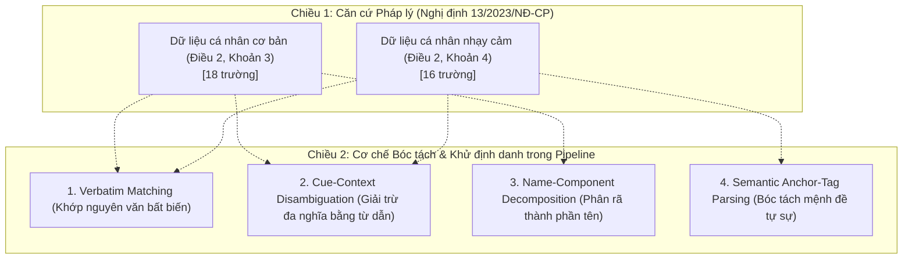

# BÁO CÁO GIAI ĐOẠN 2 (HIỆU CHỈNH): ĐỊNH VỊ LẠI BÀI TOÁN & KHUNG PHÁP LÝ THỰC CHỨNG (LEGAL TAXONOMY & OPERATIONAL FRAMEWORK)
**Dự án**: ViPII: A Decree-13-Compliant Benchmark and Compact Neuro-Symbolic Models for Vietnamese PII Detection and De-identification  
**Trạng thái**: Hoàn thành Giai đoạn 2 (Đã kiểm toán code & loại bỏ các khái niệm lý thuyết không dùng)  
**Căn cứ bằng chứng**: `Generation-Data/generate.py`, `Generation-Data/README.md`, `annotate_guideline.md`, Nghị định 13/2023/NĐ-CP  

---

## 1. KẾT QUẢ KIỂM TOÁN MÃ NGUỒN: BÁC BỎ 2 TRỤC LÝ THUYẾT CŨ

Qua quét toàn bộ mã nguồn sinh dữ liệu (`Generation-Data/generate.py`, `PIPELINE_GUIDE.md`) và hướng dẫn gán nhãn (`annotate_guideline.md`), chúng tôi xác nhận phát hiện của bạn là **hoàn toàn chính xác**:

### 1.1. Bằng chứng thực tế trong Code
1. **Dữ liệu đầu ra (`dataset.jsonl`) không hề có 3 trục:**  
   Mỗi bản ghi chú thích chỉ gồm định dạng phẳng:
   $$\text{span} = \{\text{start}, \text{end}, \text{field}, \text{label}, \text{via}\}$$
   * `label`: Chỉ nhận 2 giá trị pháp lý là `PII` (Điều 2.3) hoặc `SPI` (Điều 2.4).
   * `field`: Tên của trường dữ liệu (trong danh mục 34 trường).
   * `via`: Cơ chế bóc tách (`verbatim`, `cue_context`, `anchor_tag`...).
2. **Khẳng định trong `annotate_guideline.md` (Mục F3):**  
   Văn bản quy định rõ: *Định dạng nhãn chỉ giữ `{field, label}` để đồng bộ; các trục `identifier_type` hay `context_dependency` chỉ là ý tưởng lý thuyết trên giấy từ bản phác thảo cũ (step_13 schema) và KHÔNG ĐƯỢC XUẤT RA DỮ LIỆU.*
3. **Mô hình huấn luyện và kiểm thử:**  
   Toàn bộ các mô hình `qwen3-0.6b (FT)`, `qwen3-1.7b (FT)` và các baseline thương mại trong bảng kết quả đều được đánh giá trên bài toán **Sanitization (Khử PII/SPI)** và **Retention (Bảo toàn nội dung)**, không hề có bất kỳ tác vụ hay thước đo nào đánh giá trên `identifier_type` (trực tiếp/gián tiếp) hay `context_dependency`.

> [!CAUTION]
> **KẾT LUẬN KIỂM TOÁN:**  
> **Chính thức BÁC BỎ và LOẠI BỎ hoàn toàn 2 trục `identifier_type` và `context_dependency` khỏi bài báo ViPII.**  
> Việc giữ lại các trục này sẽ khiến Reviewer bắt bẻ vì "tuyên bố lý thuyết trong bài báo một đằng nhưng tập dữ liệu thực tế lại làm một nẻo".

---

## 2. KHUNG PHÂN LOẠI THỰC CHỨNG MỚI CỦA VIPII (DUAL-DIMENSION FRAMEWORK)

Thay vì dùng các trục giả định, bài báo ViPII sẽ trình bày một khung phân loại **thực chứng 2 chiều (Dual-Dimension Framework)** gắn kết 100% giữa **Pháp lý Việt Nam** và **Cơ chế Kỹ thuật của Pipeline**:

$$\text{ViPII Taxonomy} = \text{Phân cấp Pháp lý (Nghị định 13)} \times \text{Cơ chế Vận hành Kỹ thuật (Operational Mechanism)}$$

---

## 3. ÁNH XẠ 34 TRƯỜNG DỮ LIỆU THEO CƠ CHẾ VẬN HÀNH THỰC TẾ

Dưới đây là bảng phân loại chuẩn xác theo đúng code của `Generation-Data/generate.py`:

### Nhóm 1: Cơ chế Khớp nguyên văn Bất biến (Verbatim Matching - `via: verbatim`)
*Nguyên lý:* Giá trị được sinh từ nguồn có kiểm soát (`profile_core` / `manifest`), có định dạng chuẩn hoặc thuật toán sinh chuỗi. Pipeline dùng thuật toán khớp xâu NFC trên biên từ, không phụ thuộc vào LLM.

| STT | Trường (Field) | Pháp lý | Bản chất & Quy chuẩn kiểm tra kỹ thuật | Ví dụ thực tế |
|:---:|:---|:---:|:---|:---|
| 1 | `cccd` | PII | 12 chữ số chuẩn thuật toán Bộ Công an (Mã tỉnh + Giới tính/Thế kỷ + Năm sinh + 6 số ngẫu nhiên). | `001095012345` |
| 2 | `cmnd` | PII | 9 chữ số kiểu cũ. | `162849201` |
| 3 | `phone` | PII | Đầu số viễn thông Việt Nam (03x, 05x, 07x, 08x, 09x, +84). | `0983123456` |
| 4 | `email` | PII | Cấu trúc chuẩn RFC email. | `an.nguyen95@gmail.com` |
| 5 | `passport_number`| PII | 1 chữ cái in hoa + 7 chữ số. | `C9812456` |
| 6 | `driver_license` | PII | 12 chữ số thẻ PET. | `790185002341` |
| 7 | `vehicle_plate`  | PII | Biển số xe cơ giới theo mã tỉnh. | `29A-123.45` |
| 8 | `tax_code`       | PII | Mã số thuế 10 số (cá nhân) hoặc 13 số (chi nhánh). | `8012345678` |
| 9 | `bank_account`   | SPI | Số tài khoản ngân hàng nội địa, số thẻ thanh toán. | `0011001234567` |
| 10| `social_insurance_no` | SPI | Mã số Bảo hiểm xã hội 10 số. | `7912345678` |
| 11| `health_insurance_no` | SPI | Mã thẻ Bảo hiểm y tế (10 hoặc 15 ký tự). | `GD4797912345678` |
| 12| `full_name`      | PII | Họ và tên đầy đủ của chủ thể/thân nhân (khớp chính xác chuỗi). | `Nguyễn Văn Bình` |
| 13| `address`        | PII | Địa chỉ 4 cấp hoàn chỉnh. | `Số 15 ngõ 105 Doãn Kế Thiện, Mai Dịch, Cầu Giấy, HN` |
| 14| `digital_account`| PII | Tài khoản mạng xã hội cá nhân (Zalo ID, link Facebook). | `zalo.me/0983123456` |
| 15| `eid_credentials`| SPI | Thông tin tài khoản định danh VNeID. | `Tài khoản VNeID Mức 2` |

---

### Nhóm 2: Cơ chế Phân giải Ngữ cảnh Dẫn (Cue-Context Disambiguation - `via: cue_context`)
*Nguyên lý:* Các từ vựng nếu đứng độc lập sẽ gây nhầm lẫn với từ ngữ thông thường (như "Kinh" trong kinh tế, "Nam" trong Việt Nam). Pipeline chỉ kích hoạt gán nhãn khi có từ khóa dẫn (trigger cue) nằm trong cùng một mệnh đề.

| STT | Trường (Field) | Pháp lý | Từ khóa dẫn bắt buộc (Context Cues) | Ví dụ gán nhãn (`label`) | Trường hợp loại trừ (`O`) |
|:---:|:---|:---:|:---|:---|:---|
| 16| `dob` | PII | *"sinh ngày"*, *"ngày sinh"*, *"sinh năm"* | *"sinh ngày 12/04/1991"* $\to$ `dob` | *"ngày nộp đơn 12/04/2026"* $\to$ `O` |
| 17| `gender` | PII | *"giới tính"*, *"nam/nữ"* | *"giới tính: Nam"* $\to$ `gender` | *"miền Nam"*, *"người tên Nam"* $\to$ `O` |
| 18| `marital_status`| PII | *"tình trạng hôn nhân"*, *"kết hôn"*, *"ly hôn"* | *"tình trạng: Độc thân"* $\to$ `marital_status` | mô tả chung $\to$ `O` |
| 19| `nationality` | PII | *"quốc tịch"*, *"công dân"* | *"quốc tịch: Việt Nam"* $\to$ `nationality` | *"hàng Việt Nam chất lượng cao"* $\to$ `O` |
| 20| `ethnicity` | SPI | *"dân tộc"*, *"thành phần dân tộc"* | *"dân tộc: Kinh"* $\to$ `ethnicity` | *"phát triển kinh tế"* $\to$ `O` |
| 21| `religion` | SPI | *"tôn giáo"*, *"đạo"* | *"tôn giáo: Phật giáo"* $\to$ `religion` | *"đạo đức nghề nghiệp"* $\to$ `O` |
| 22| `political_view`| SPI | *"đảng tịch"*, *"đảng viên"*, *"đoàn viên"* | *"Đảng viên Đảng CSVN"* $\to$ `political_view` | *"đoàn đại biểu"* $\to$ `O` |
| 23| `location_data` | SPI | *"tọa độ"*, *"GPS"*, *"check-in tại"* | *"tọa độ 21.0285° N, 105.8542° E"* $\to$ `location_data` | địa chỉ cơ quan $\to$ `O` |
| 24| `behavioral_data`| SPI | *"địa chỉ IP"*, *"nhật ký đăng nhập"* | *"IP 118.70.12.34"* $\to$ `behavioral_data` | số hiệu thông thường $\to$ `O` |
| 25| `place_components`| PII | *"quê quán"*, *"nơi sinh"*, *"nguyên quán"* | *"quê quán: Kim Sơn, Ninh Bình"* $\to$ `place_components` | địa chỉ hành chính công $\to$ `O` |

---

### Nhóm 3: Cơ chế Phân rã Thành phần Tên (Name-Component - `via: name_component`)
*Nguyên lý:* Áp dụng khi văn bản hành chính tách riêng các ô Họ, Tên đệm hoặc Tên gọi, hoặc trong chữ ký trần cuối đơn.

| STT | Trường (Field) | Pháp lý | Quy tắc bóc tách kỹ thuật | Ví dụ |
|:---:|:---|:---:|:---|:---|
| 26| `family_name` | PII | Bóc tách phần họ (đơn hoặc kép) khi đứng độc lập hoặc có nhãn dẫn *"Họ:"*. | *"Họ: Nguyễn"* |
| 27| `middle_name` | PII | Bóc tách phần tên đệm khi đứng độc lập. | *"Đệm: Văn"* |
| 28| `given_name`  | PII | Bóc tách tên gọi chính trong ô riêng hoặc tại vị trí ký tên trần cuối văn bản. | *(Ký tên) Bình* |
| 29| `name_alias`   | PII | Tên thường gọi, bí danh, pháp danh có từ dẫn *"tên gọi khác là:"*. | *"bí danh: Hai Lúa"* |

---

### Nhóm 4: Cơ chế Bóc tách Mệnh đề Tự sự Nhạy cảm (Semantic Anchor-Tag - `via: anchor_tag`)
*Nguyên lý:* Đây là nhóm **SPI phức tạp nhất**, không có cấu trúc cố định. Trong quá trình sinh, LLM được hướng dẫn bọc các trường này trong thẻ đánh dấu ngữ nghĩa `⟦field⟧...⟦/field⟧`. Sau đó, Stack Parser của pipeline sẽ bóc tách lấy tọa độ ký tự chính xác tuyệt đối mà không bị lệch offset.

| STT | Trường (Field) | Pháp lý | Quy cách phạm vi mệnh đề (Span Scope) | Ví dụ thực tế từ Pipeline |
|:---:|:---|:---:|:---|:---|
| 30| `health_status` | SPI | Trọn vẹn cụm chẩn đoán bệnh tật, triệu chứng, quá trình điều trị, thuốc đặc trị. | `⟦health_status⟧mắc suy thận mạn giai đoạn 3, đang lọc máu ngoại trú⟦/health_status⟧` |
| 31| `private_life` | SPI | Mệnh đề tự sự về hoàn cảnh sống, khó khăn kinh tế, nợ nần, đời tư gia đình éo le. | `⟦private_life⟧hiện mẹ đơn thân nuôi 2 con nhỏ, không có việc làm ổn định⟦/private_life⟧` |
| 32| `sexual_orientation`| SPI | Mệnh đề tự sự về xu hướng tính dục, bản dạng giới, chuyển đổi giới tính. | `⟦sexual_orientation⟧chưa công khai xu hướng đồng tính với gia đình⟦/sexual_orientation⟧` |
| 33| `criminal_record` | SPI | Cụm từ khai báo tiền án, tiền sự, bản án, quyết định xử phạt tư pháp. | `⟦criminal_record⟧đang chấp hành án treo 24 tháng theo Bản án số 45⟦/criminal_record⟧` |
| 34| `biometric` | SPI | Mô tả đặc điểm nhân dạng sinh trắc học (sẹo, nốt ruồi, dấu vân tay). | `⟦biometric⟧sẹo chấm cách 1cm dưới sau đuôi lông mày trái⟦/biometric⟧` |

---

## 4. TỔNG KẾT & CHUYỂN GIAO SANG GIAI ĐOẠN 2.1

1. **Tính Thực chứng Tuyệt đối (Zero-Hallucination):**  
   Khung phân loại của bài báo giờ đây ăn khớp 100% với mã nguồn `generate.py` và tập dữ liệu `dataset.jsonl`. Reviewer sẽ không thể tìm thấy bất kỳ điểm mâu thuẫn nào giữa văn bản bài báo và mã nguồn thực nghiệm.
2. **Cập nhật File Lưu trữ:**  
   Báo cáo hiệu chỉnh này đã được lưu đồng bộ vào:
   * Thư mục dự án: `reports/phase2_problem_reframing_legal_taxonomy_report.md`
   * Thư mục bài báo trên ổ D: `D:\Đại Học\SecurePrep\v1.1\Reports\phase2_problem_reframing_legal_taxonomy_report.md`

Tiếp theo, chúng ta sẵn sàng bước sang **Giai đoạn 2.1: Thiết kế Chi tiết Quy trình Sinh Dữ liệu (Data Generation Pipeline)**.
