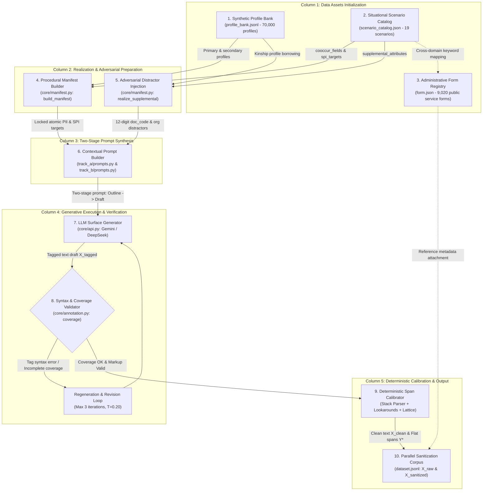

# Section 4: Constraint-First Data Synthesis and Annotation Pipeline

In this section, we present the end-to-end architecture of the **ViPII** data generation and annotation pipeline. We explain the foundational design invariants—*Controlled Synthesis by Construction* and *Deterministic Server-Side Calibration*—and systematically trace each stage: demographic profile banking, procedural manifest construction, adversarial distractor synthesis, two-stage contextual prompting, deterministic markup parsing, character-span calibration, priority lattice conflict resolution, and the resulting parallel de-identification dataset format.

---

## 4.1. Pipeline Overview and Core Architectural Invariants

Existing privacy datasets frequently suffer from two methodological failure modes: (1) relying on heuristic regular expressions and dictionary lookups over uncurated web scrapes, which yields severe label noise and coordinate shifts; or (2) prompting autoregressive language models to directly predict numeric character offsets, which inevitably triggers the *Cumulative Index Offset Drift* catastrophe due to the non-isomorphism between subword token space and multi-byte Unicode code-point space.

To establish an authoritative benchmark aligned with Decree No. 13/2023/NĐ-CP without exposing genuine citizen data, ViPII adopts a **constraint-first, decoupled synthesis paradigm**. The pipeline decouples natural language prose generation from spatial coordinate calculation via two governing technical invariants:

1. **Controlled Synthesis by Construction (Constraint-First Principle)**: All sensitive personal identifiers ($\text{PII}$) and sensitive attributes ($\text{SPI}$) are generated and locked deterministically at the Python runtime layer *prior* to prompt assembly. The generative language model acts strictly as a contextual narrator, weaving natural administrative prose, formal petitions, and dialogue around fixed entity values. The model is explicitly barred from hallucinating new personal identity slots.
2. **Deterministic Server-Side Span Calibration**: Character offsets ($s_i, e_i$) and entity labels are computed entirely on the host server using deterministic algorithmic operators (Unicode lookaround matching, sentence-bounded trigger windowing, and a single-pass LIFO stack parser). The language model is never tasked with predicting numeric coordinates, entirely eliminating coordinate hallucination.

Figure 4.1 illustrates the complete 10-node operational flow structured across five functional columns.


*Figure 4.1: The authoritative 10-node operational flow of the ViPII constraint-first data synthesis and deterministic annotation pipeline.*

---

## 4.2. Synthetic Profile Bank and Metadata Sources

The generation pipeline is grounded in three foundational data repositories (`data/`), engineered to reflect the demographic and administrative reality of Vietnam without incorporating any real-world citizen records.

### The 70,000 Artificial Profile Bank (`profile_bank.jsonl`)
The demographic core comprises exactly **70,000 fully realized, unique synthetic citizen profiles**, generated via the standalone demographic engine `build_profiles.py` parameterized by the empirical census distributions in `profile_core.json`. Each record contains 35 personal attributes structured into 10 top-level fields:
* `profile_id`: Unique identifier formatted as `pf_xxxxxx` (spanning `pf_000000` to `pf_069999`).
* `fields`: Complete demographic slots covering all 18 Basic PII fields and 16 Sensitive SPI fields.
* `consistency`: Internal logic invariants ensuring strict cross-attribute compatibility:
  * The birth year declared in `dob` matches the two-digit year code embedded in the Citizen Identity Card (`cccd`).
  * The provincial birth code in `cccd` matches the primary administrative jurisdiction of the declared domicile `address`.
  * Age-conditional marital distributions ensure realistic civil statuses (e.g., divorce or widowhood are conditional on legal adult ages).
* `quasi_key` & `k_estimate`: Quasi-identifier tuples (birth year, civil gender, communal administrative unit) with estimated local $k$-anonymity values ($k \ge 5$) ensuring statistical uniqueness without reproducing real individual profiles.

#### Demographic and Onomastic Realism
To ensure sociolinguistic representativeness across Vietnam's multi-ethnic population, `profile_core.json` models onomastic distributions spanning **all 54 officially recognized ethnic groups**:
* **Surname Distributions**: Weighted across 69 standard single surnames (reflecting national census proportions: *Nguyễn* ~38.4%, *Trần* ~12.1%, *Lê* ~9.5%, *Phạm* ~7.1%) and 22 traditional compound surnames (`ho_kep`, e.g., *Nguyễn Đình*, *Trần Khắc*).
* **Ethnic Minority Onomastics**: Specific matrilineal clan prefixes and patronymic naming systems, such as Mon-Khmer and Austronesian clan names (*Rơ Châm*, *Siu* for Gia Rai; *Danh*, *Sơn* for Khmer; ethnic gender affixes $Y$ for males and $H'$ for females among Ê Đê communities).
* **Territorial Restructuring Alignment**: Mapped across all 63 provincial codes designated by the Ministry of Public Security (MPS), explicitly reflecting historical mergers and consolidated units under National Assembly **Resolution No. 202/2025/QH15**.

### The Situational Scenario Catalog (`scenario_catalog.json`)
Public administration records rarely reveal sensitive data without specific administrative motivation. The catalog defines **19 canonical situational scenarios** spanning civil petitions, administrative appeals, social assistance applications, judicial records, labor disputes, and clinical registrations. Each scenario specifies:
* `cooccur_fields`: Canonical civil identification fields routinely required for procedural dossiers (e.g., `full_name`, `cccd`, `phone`, `address`).
* `spi_targets`: Specific sensitive attributes naturally elicited by the procedure (e.g., `health_status` in medical assistance petitions; `criminal_record` in judicial relief declarations; `private_life` in poverty certification).
* `register`: Required stylistic formality, ranging from standard bureaucratic forms to urgent narrative petitions.

### Administrative Form Reference Registry (`form.json` & `form_domains.json`)
To reflect genuine administrative procedure without biasing generation, we curating **9,020 real-world public service form metadata profiles** across ministerial domains (Justice, Public Security, Health, Transport). Crucially, **raw administrative templates are not pasted into generator prompts**, as verbatim templates degrade narrative fluency and bloat context windows. Instead, form identifiers, official procedural headings, and administrative competence tiers are injected as **reference metadata attached to the output record**, grounding the synthetic document within authentic legal administrative workflows.

---

## 4.3. Procedural Manifest Construction

Before invoking the language model, the pipeline executes `build_manifest()` (`core/manifest.py`), deterministically extracting and formatting the entity values that must appear in the final text.

```
       Synthetic Profile           Situational Scenario
      (pf_012845: Citizen)        (Medical Assistance)
               │                            │
               └─────────────┬──────────────┘
                             ▼
              core/manifest.py: build_manifest()
                             │
            ┌────────────────┴────────────────┐
            ▼                                 ▼
   Primary Manifest Items             Adversarial Realization
   - cccd: "001095012345"             - doc_code: "104928374619" (num12, label: O)
   - phone: "0983123456"              - org: "UBND Phường Mai Dịch"
   - dob: "12/04/1995"                - kin_name: "Nguyễn Văn Bình" (subject: father)
   - spi: health_status [SENTINEL]
```

The manifest builder performs three essential functions:
1. **Field Selection and Sentinel Assignment**: Intersects profile fields with scenario requirements (`cooccur_fields` $\cup$ `spi_targets`). Structured civil fields receive their concrete string values from the profile. Free-form narrative attributes (such as `health_status` or `private_life`) are assigned the runtime token `[[LLM_GENERATE]]`, instructing the generator to synthesize an appropriate narrative clause within the scenario context while wrapping it in corresponding markup tags.
2. **Surface Variant Expansion**: Generates canonical surface variants for structured credentials (e.g., rendering `cccd` with standard spacing `001 095 012345` or contiguous `001095012345`; rendering phone numbers with domestic `09x` or international `+84` prefixes) so that downstream matching algorithms account for natural syntactic variations.
3. **Onomastic Decomposition Preparation**: Decomposes the primary citizen name into sub-tokens (`family_name`, `middle_name`, `given_name`) via `split_vietnamese_name()`, registering derived items in the manifest to facilitate post-hoc span resolution.

---

## 4.4. Adversarial Distractors and Multi-Subject Realization

A common vulnerability in entity extraction and de-identification systems is the reliance on simplistic surface regularities (e.g., treating any 12-digit numeric sequence as a Citizen ID). To enforce robust contextual discrimination, `realize_supplemental()` (`core/manifest.py`) synthesizes three classes of adversarial distractors:

### 1. 12-Digit Non-PII Administrative Document Codes (`doc_code` of type `num12`)
The generator injects procedural dossier identifiers, dispatch numbers, and receipt barcodes structured as 12-digit numeric strings:
$$\text{doc\_code} = \sum_{i=0}^{11} d_i \cdot 10^{11-i}, \quad d_i \in \{0, \dots, 9\}$$
In prompt instructions, these sequences are explicitly labeled as procedural document identifiers (`Mã hồ sơ tiếp nhận: «104928374619»`), assigned ground-truth label **`O`** (non-PII). Models must examine the surrounding lexical context (distinguishing *"Mã hồ sơ số..."* from *"Số định danh cá nhân..."*) rather than firing purely on digit count.

### 2. Multi-Subject Kinship Entities (`subject: other`)
Administrative declarations frequently reference family members, legal guardians, or guarantors. The pipeline dynamically samples secondary profiles from the bank to inject kinship entities (e.g., a father's name, spouse's phone number, or dependent child's birth date). These entities are registered in the manifest with an explicit subject tag (`subject: "father"`, `subject: "spouse"`), evaluating whether models de-identify secondary individuals while preserving contextual role relations.

### 3. Affirmations of Clean Judicial Records
Under Article 2.4(g) of Decree 13, criminal records constitute Sensitive SPI. However, standard public administration routinely requires citizens to state that they *possess no criminal record* (e.g., *"Tôi cam đoan không có tiền án tiền sự"*). Labeling clean affirmations as sensitive criminal records causes catastrophic over-redaction. The manifest builder explicitly suppresses `criminal_record` annotations when the narrative context dictates a clean declaration, injecting a synthetic Judicial Record Certificate serial number instead.

---

## 4.5. Two-Stage Contextual Prompting and Revision

To generate natural administrative prose while preserving 100% manifest adherence, generation follows a **Two-Stage Prompting Strategy**:

```
                  ┌──────────────────────────────────────────────┐
                  │            STAGE 1: OUTLINE PROMPT           │
                  │ - Citizen identity & Scenario context        │
                  │ - Procedural motivation & required structure │
                  └──────────────────────┬───────────────────────┘
                                         │
                                         ▼
                  ┌──────────────────────────────────────────────┐
                  │            STRUCTURAL OUTLINE DRAFT          │
                  │ Heading -> Administrative Body -> Disclosures│
                  └──────────────────────┬───────────────────────┘
                                         │
                                         ▼
                  ┌──────────────────────────────────────────────┐
                  │            STAGE 2: DRAFT PROMPT             │
                  │ - Full manifest entity injection             │
                  │ - Mandatory anchor tags: ⟦field⟧...⟦/field⟧  │
                  │ - Distractor integration (doc_code, org)     │
                  └──────────────────────┬───────────────────────┘
                                         │
                                         ▼
                  ┌──────────────────────────────────────────────┐
                  │            INTERMEDIATE DRAFT X_tagged       │
                  └──────────────────────┬───────────────────────┘
                                         │
                         ┌───────────────┴───────────────┐
                         ▼                               ▼
                 [Coverage OK & Valid]           [Missing / Invalid]
                         │                               │
                         │                               ▼
                         │               ┌──────────────────────────────┐
                         │               │  STAGE 2b: REVISION LOOP     │
                         │               │  Low Temperature (T = 0.20)  │
                         │               │  Fix tags & re-insert fields │
                         │               └───────────────┬──────────────┘
                         │                               │
                         ▼                               ▼
                  ┌──────────────────────────────────────────────┐
                  │          PASSED TO DETERMINISTIC PARSER      │
                  └──────────────────────────────────────────────┘
```

### Stage 1: Structural Outline Prompting
The generator model is supplied with the citizen's high-level background, the public administration procedure, and the required document genre (e.g., formal complaint, petition, judicial declaration). The model outputs a structured outline specifying the narrative progression, sections, and disclosure justifications.

### Stage 2: Narrative Prose Drafting
In the second stage, the structural outline is expanded into full natural language text. The prompt imposes strict operational constraints:
* **Verbatim Locking**: Atomic identifiers (CCCD, phone number, address) must appear exactly as specified in the manifest.
* **Semantic Tagging**: Free-form sensitive disclosures lacking fixed formats must be wrapped in lightweight semantic delimiters:
  $$\texttt{⟦health\_status⟧} \, \text{chẩn đoán suy thận giai đoạn 3} \, \texttt{⟦/health\_status⟧}$$
* **Distractor Integration**: Document numbers and organizational titles must be seamlessly woven into official headers.

### Stage 2b: Syntax Revision and Coverage Validation
The generated text $X_{\text{tagged}}$ is audited by `coverage()` (`core/annotation.py`):
1. **Manifest Coverage Check**: Verifies that all mandatory manifest entities appear within the text.
2. **Tag Syntax Validation**: Verifies that all inline delimiters are balanced and conform to the regular expression `⟦[a-zA-Z_]+⟧...⟦/[a-zA-Z_]+⟧`.

If an entity is omitted or a tag is malformed, the pipeline invokes an automated **Revision Loop** at low decoding temperature ($T = 0.20$), presenting the model with targeted diagnostic feedback. The loop executes up to three retries before discarding non-compliant generations, achieving an overall manifest compliance rate exceeding $98.5\%$.

---

## 4.6. Deterministic Anchor-Tag Parsing

```
Algorithm 2: Single-Pass Linear-Time LIFO Stack Parser for Inline Markup
──────────────────────────────────────────────────────────────────────────────────
Input  : Tagged text string X_tagged, Sensitivity map SENS
Output : Normalized clean text X_clean, Extracted span set S_anchor

1:  clean_chars ← []
2:  S_anchor    ← ∅
3:  stack       ← []   // LIFO stack storing tuples of (field_name, start_offset)
4:  i ← 0, n ← |X_tagged|
5:  while i < n do
6:      if X_tagged[i] = "⟦" then
7:          close_idx ← FindNext("⟧", X_tagged, from = i + 1)
8:          if close_idx ≠ -1 then
9:              tag_content ← Substring(X_tagged, i + 1, close_idx)
10:             if tag_content begins with "/" then       // Closing delimiter ⟦/field⟧
11:                 field ← Substring(tag_content, 1)
12:                 if stack ≠ [] ∧ Top(stack).field = field then
13:                     (fld, s_offset) ← Pop(stack)
14:                     e_offset ← |clean_chars|
15:                     span ← InstantiateSpan(s_offset, e_offset, fld, SENS[fld], "anchor_tag")
16:                     S_anchor ← S_anchor ∪ {span}
17:                 end if
18:                 i ← close_idx + 1
19:                 continue
20:             else if IsValidIdentifier(tag_content) then // Opening delimiter ⟦field⟧
21:                 Push(stack, (tag_content, |clean_chars|))
22:                 i ← close_idx + 1
23:                 continue
24:             end if
25:         end if
26:     end if
27:     Append(clean_chars, X_tagged[i])
28:     i ← i + 1
29: end while
30: X_clean ← Join(clean_chars)
31: return (X_clean, S_anchor)
──────────────────────────────────────────────────────────────────────────────────
```

### Algorithmic Guarantees
1. **Zero Index Drift**: The start coordinate $s_i$ is recorded at the instantaneous length of the output buffer `clean_chars` when the opening tag is parsed. The end coordinate $e_i$ is recorded when the closing tag is matched. Because tags are skipped rather than copied, the resulting offsets map strictly to code points in $X_{\text{clean}}$.
2. **Complete Delimiter Elimination**: Output text $X_{\text{clean}}$ contains no residual tag markers (`⟦` or `⟧`), ensuring downstream models are trained and evaluated on natural prose.

---

## 4.7. Deterministic Character-Span Annotation

Following anchor tag extraction, the pipeline calibrates ground-truth spans for the remaining structured fields on $X_{\text{clean}}$ using three complementary algorithmic matchers:

### Layer 1: Guarded Verbatim Matching (`match_verbatim`)
Applied to atomic identifiers (`cccd`, `phone`, `email`, `passport_number`, `driver_license`, `vehicle_plate`, `tax_code`, `bank_account`, `social_insurance_no`, `health_insurance_no`, `address`, `full_name`). The algorithm compiles Unicode-aware zero-width lookaround boundaries around normalized surface strings:
$$R(v) = \texttt{(?<!\textbackslash{}w)} + \text{re.escape}(\text{NFC}(v)) + \texttt{(?!\textbackslash{}w)}$$
Boundary assertions prevent substring false matches (e.g., matching a 4-digit tax suffix inside a 10-digit number).

### Layer 2: Cue-Context Disambiguation (`match_cue_context`)
Applied to polysemous and homographic fields (`dob`, `gender`, `marital_status`, `nationality`, `ethnicity`, `religion`, `political_view`, `location_data`, `behavioral_data`, `place_components`). The matcher identifies candidate surface strings and scans backwards through a sliding window of at most $W = 80$ characters, strictly terminated by sentence boundaries (`.`, `;`, `\n`, `!`, `?`):
$$\text{Valid}(v) \Longleftrightarrow \exists c \in \mathcal{C}_{\text{cue}}(f) \quad \text{in clause segment preceding } v$$
This mechanism reliably differentiates demographic declarations (*"dân tộc: Kinh"*) from identical common nouns (*"kinh tế"*), eliminating lexical false positives.

### Layer 3: Disjoint Name Component Decomposition (`split_vietnamese_name`)
Applied to citizen personal names. Rather than creating overlapping annotations, the pipeline identifies the constituent tokens of `full_name` and computes disjoint sub-spans for `family_name`, `middle_name`, and `given_name`. This preserves spatial partition properties while enabling fine-grained onomastic evaluation.

---

## 4.8. Priority Lattice Conflict Resolution

To reconcile overlapping candidate spans produced across different extraction mechanisms, the pipeline applies the **5-Tier Priority Lattice** ($\text{PRIORITIES}$) formalized in Section 3.5.

```
       Candidate Spans S_cand
     (Verbatim, Cue, Name, Anchor,
      and doc_code distractors)
                 │
                 ▼
     Sort by: Priority Weight (desc)
              Span Length (desc)
              Start Offset (asc)
                 │
                 ▼
     Greedy Non-Overlapping Selection
                 │
                 ├─► [Tier 5: Interval Subtraction if overlaps higher tier]
                 │
                 ▼
     Resolved Non-Overlapping Spans S_resolved
                 │
                 ▼
     Filter out Distractors (label == 'O')
                 │
                 ▼
     Final Ground Truth Y* in dataset.jsonl
```

### Tie-Breaking and Interval Trimming Execution
1. **Candidate Sorting**: All candidate spans $\mathcal{S}_{\text{cand}}$ are sorted by:
   $$\text{key} = \bigl(-\text{weight}(s), -(s.\text{end} - s.\text{start}), s.\text{start}\bigr)$$
2. **Greedy Reservation**: Tiers 1–4 are processed greedily. If a candidate span intersects an already accepted span, it is discarded.
3. **Interval Subtraction for Tier 5**: When a Tier 5 narrative context (such as `private_life`) intersects accepted Tier 1 atomic credentials (such as a nested `bank_account`), the pipeline subtracts the occupied interval:
   $$\text{Res}(I) = [s_{\text{broad}}, e_{\text{broad}}) \setminus \bigcup_{k} [s_k, e_k)$$
   Sub-spans satisfying length threshold $\ge 5$ code points are retained as trimmed contextual spans.
4. **Distractor Elimination**: Spans matching adversarial distractor codes (`label: "O"`) are utilized during lattice arbitration to suppress overlapping erroneous hypotheses, and are then filtered out, yielding the finalized benchmark span set $\mathcal{Y}^*$.

---

## 4.9. Parallel Sanitization Dataset Output Format

```
Figure 4.2: Structured Specimen of an Annotated Parallel Document Instance in ViPII
┌────────────────────────────────────────────────────────────────────────────────────────────────────────┐
│ DOCUMENT METADATA                                                                                      │
│   doc_id: vipii_doc_038192    profile_id: pf_012845    scenario_id: sc_medical_subsidy_04             │
│   form_id: form_mxh_0921      register: administrative_petition                                        │
├────────────────────────────────────────────────────────────────────────────────────────────────────────┤
│ 1. RAW NATURAL LANGUAGE TEXT (X_raw ≡ X_clean)                                                         │
│   "Kính gửi UBND Phường Mai Dịch. Tôi tên là Nguyễn Văn Bình, sinh ngày 12/04/1985, số CCCD          │
│    001085012345, cư trú tại Số 15 ngõ 105 Doãn Kế Thiện. Hiện nay tôi mắc suy thận mạn giai đoạn 3,    │
│    hoàn cảnh gia đình đơn thân nuôi mẹ già 82 tuổi..."                                                 │
├────────────────────────────────────────────────────────────────────────────────────────────────────────┤
│ 2. GROUND-TRUTH CHARACTER SPANS (Y*) [0-indexed Unicode code points]                                   │
│   • [42,  57)  full_name        (PII)  via: verbatim     value: "Nguyễn Văn Bình"                      │
│   • [69,  79)  dob              (PII)  via: cue_context  value: "12/04/1985"                           │
│   • [89, 101)  cccd             (PII)  via: verbatim     value: "001085012345"                         │
│   • [115, 150) address          (PII)  via: verbatim     value: "Số 15 ngõ 105 Doãn Kế Thiện"          │
│   • [165, 194) health_status    (SPI)  via: anchor_tag   value: "mắc suy thận mạn giai đoạn 3"         │
│   • [215, 249) family_relations (SPI)  via: anchor_tag   value: "đơn thân nuôi mẹ già 82 tuổi"         │
├────────────────────────────────────────────────────────────────────────────────────────────────────────┤
│ 3. PARALLEL SANITIZED TEXT: TAG MASKING (X_sanitized, Task 2)                                          │
│   "Kính gửi UBND Phường Mai Dịch. Tôi tên là [HỌ_TÊN], sinh ngày [NGÀY_SINH], số CCCD                 │
│    [CCCD], cư trú tại [ĐỊA_CHỈ]. Hiện nay tôi [TÌNH_TRẠNG_SỨC_KHỎE], hoàn cảnh gia đình               │
│    [QUAN_HỆ_GIA_ĐÌNH]..."                                                                              │
├────────────────────────────────────────────────────────────────────────────────────────────────────────┤
│ 4. PARALLEL SANITIZED TEXT: CONSISTENT SYNTHETIC REPLACEMENT (X_sanitized, Task 2)                    │
│   "Kính gửi UBND Phường Mai Dịch. Tôi tên là Trần Đình Trọng, sinh ngày 28/09/1988, số CCCD           │
│    079088009876, cư trú tại Số 48 đường Cách Mạng Tháng 8. Hiện nay tôi đang điều trị thoái hóa cột    │
│    sống nặng, hoàn cảnh gia đình vợ chồng nuôi 2 con nhỏ..."                                           │
└────────────────────────────────────────────────────────────────────────────────────────────────────────┘
```

### Downstream Utility of Output Fields
* `content`: Represents $X_{\text{raw}}$ ($X_{\text{clean}}$), providing raw natural language for Task 1 (Span-Level Detection).
* `spans`: Represents ground truth $\mathcal{Y}^*$, providing exact Unicode code-point boundaries for entity evaluation.
* `sanitized_tag_masking`: Ground-truth target for Tag-Masking Generative Sanitization (Task 2).
* `sanitized_synthetic_replacement`: Ground-truth target for Synthetic Surrogate De-identification (Task 2).
* `meta`: Audit trail recording demographic origin, procedural scenario, and administrative form metadata, enabling out-of-distribution split stratification and ablation analysis in Sections 5 and 6.

By constructing the dataset through this constraint-first, decoupled architecture, ViPII guarantees zero coordinate drift, comprehensive statutory coverage of Decree 13, and full reproducibility for Vietnamese privacy research.
