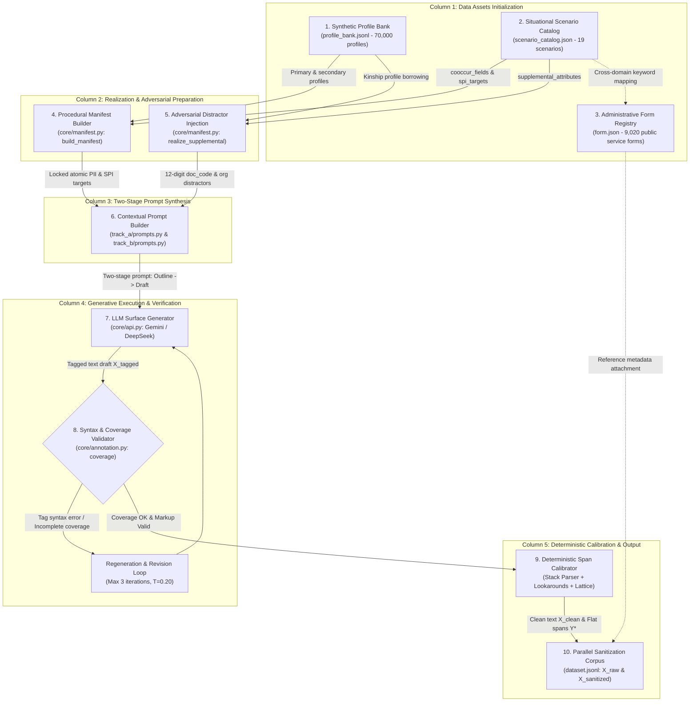

# Section 1: Introduction

The rapid adoption of artificial intelligence in Vietnamese public administration, healthcare, finance, and legal services has increased the need to process documents that contain personal data. Such documents commonly combine structured identifiers—such as citizen identity numbers, telephone numbers, and dates of birth—with context-dependent information, including family circumstances, health status, and location. A system that releases these documents to an external service for analysis may therefore create privacy, governance, and operational risks. At the same time, simply deleting every potentially sensitive string can make an administrative document unusable for search, auditing, case handling, or downstream language processing.

This paper studies **utility-preserving sanitization** for Vietnamese personal data. The objective is not only to identify sensitive spans, but also to remove or replace them while retaining the non-sensitive procedural content and the linguistic coherence of the document. We focus on the terminology of Vietnam's Personal Data Protection Decree (Decree No. 13/2023/NĐ-CP), using `PII` and `SPI` as dataset-level shorthand for the decree's basic and sensitive personal-data tiers, respectively. The legal mapping defines the scope of the benchmark; it is not, by itself, a complete legal-compliance certification for any deployment.

## 1.1. Motivation and Problem Setting

Existing multilingual PII tools provide useful starting points, but their entity inventories and decision rules are not designed around Vietnamese administrative conventions. Vietnamese documents contain identity numbers with local formatting, multi-component personal names, hierarchical addresses, and lexical items whose interpretation depends strongly on nearby cues. For example, *Nam* may denote a person's gender, a geographic region, or part of a name, while *Kinh* may denote an ethnicity or occur inside an unrelated phrase. Sensitive information such as health or family circumstances is often expressed as a long narrative clause rather than a short, regular expression match.

These characteristics create two coupled technical requirements. First, a benchmark must represent the relevant legal fields and provide reliable character-level boundaries. Second, a sanitization system must optimize two objectives simultaneously: reducing residual privacy leakage and avoiding destructive over-redaction. ViPII addresses the first requirement through controlled synthetic generation and deterministic character-span calibration, and evaluates the second through a dual privacy–utility metric suite.

## 1.2. Research Gaps

We identify four gaps that motivate the study:

1. **Regulatory and taxonomy mismatch.** Widely used PII resources and tools are generally organized around other legal or operational taxonomies. They do not directly expose the 34-field PII/SPI inventory used by this benchmark under the Vietnamese regulatory scope.
2. **Vietnamese administrative and linguistic specificity.** Local identity formats, multi-level addresses, Vietnamese name structure, and context-dependent words create failure cases that are underrepresented in general-purpose PII benchmarks.
3. **Reliable span construction for synthetic text.** When a language model is asked to generate prose and character offsets at the same time, changes in Unicode text and subword tokenization can produce incorrect boundaries. A reproducible benchmark therefore needs to separate text generation from coordinate calculation.
4. **Privacy–utility trade-off in local deployment.** Cloud-scale models may be difficult to use for sensitive documents because of governance, latency, cost, or data-residency requirements. The relative value of compact models adapted to the local task has not been established under a common Vietnamese sanitization protocol.

## 1.3. The ViPII Approach

ViPII is a benchmark and data-construction framework for Vietnamese PII/SPI detection and utility-preserving sanitization. Its central design principle is to assign different responsibilities to the generator and the annotation pipeline. A manifest fixes the sensitive values and the fields that should appear; a language model renders those values in natural administrative contexts; and deterministic host-side procedures compute character spans after generation. The pipeline combines guarded verbatim matching, cue-context disambiguation, disjoint name-component decomposition, and semantic anchor-tag parsing. These mechanisms construct the ground truth offline and are not treated as the neural architecture of the evaluated models.

The resulting corpus contains 47,881 documents and 474,874 annotated character spans covering 34 field classes. Each instance provides natural-language input, flat non-overlapping character spans, and sanitization targets. The benchmark reports privacy protection and utility retention together, with document-level `FULL` success requiring both the removal of annotated sensitive units and the preservation of evaluated non-sensitive operational units.

## 1.4. Contributions

This paper makes the following contributions:

1. **A Vietnamese legal-scope benchmark.** We introduce a 34-field PII/SPI benchmark aligned with the operational scope of Decree No. 13/2023/NĐ-CP, covering structured identifiers, context-dependent attributes, name components, and narrative sensitive information.
2. **A constraint-first synthesis and annotation pipeline.** We present a decoupled generation process in which manifests and controlled profiles specify target values, while deterministic post-processing computes accepted character spans and resolves candidate conflicts.
3. **A joint privacy–utility evaluation framework.** We define sanitization and retention metrics at span, field, and document levels, including the strict `FULL` measure for end-to-end success.
4. **An empirical study of compact models.** On the current held-out benchmark, fine-tuned Qwen3 compact models substantially improve over their unadapted counterparts. The 0.6B model achieves 72.46% `SanRec` and 70.10% `FULL`, while the 1.7B model provides higher retention scores; comparisons with general-purpose baselines are reported under the same evaluation protocol.

## 1.5. Scope and Organization

The study focuses on Vietnamese text generated for administrative, legal, healthcare, and related social contexts. It evaluates the quality of synthetic annotations and the behavior of sanitization systems under the benchmark protocol; it does not claim that synthetic data fully represents all real-world documents or that a model score alone establishes legal compliance. Section 2 reviews related work. Section 3 defines the tasks, legal taxonomy, and operational representation. Section 4 describes the constraint-first synthesis and annotation pipeline, and Section 5 reports corpus statistics and quality diagnostics. Section 6 presents the experimental comparison and main results. Subsequent sections analyze component effects, robustness, error patterns, practical deployment considerations, ethics, limitations, and reproducibility before concluding the paper.

---

# Section 2: Related Work

Research on personal-data protection in language technologies spans entity detection, de-identification, synthetic data generation, and privacy-aware model deployment. These lines of work are closely related but do not solve exactly the same problem. A detection system identifies spans that may reveal an individual; a de-identification system transforms those spans; and a synthetic-data pipeline determines how training examples can be created without exposing real records. ViPII connects these perspectives for Vietnamese administrative text by combining a legal field taxonomy, controlled generation, deterministic character-span construction, and joint privacy–utility evaluation.

Early practical PII systems were largely built from rules, dictionaries, and modular recognizers. Microsoft Presidio, Google Cloud Data Loss Prevention, Philter, and Amnesia illustrate different combinations of regular expressions, entity recognizers, dictionaries, and general-purpose language models for finding or masking identifiers. These tools are valuable because they support structured credentials, configurable recognizers, and production-oriented workflows. However, their default inventories and decision policies are not designed around Vietnam's distinction between basic and sensitive personal data. They also provide limited support for Vietnamese administrative formats, including locally structured identity numbers, multi-level addresses, compound names, and ambiguous lexical cues. A regular expression can detect a digit sequence, but it cannot by itself determine whether that sequence is a citizen identifier or an administrative document code; similarly, a dictionary match for *Nam* or *Kinh* is insufficient without the surrounding clause. ViPII addresses this gap by defining an explicit 34-field inventory and by treating cue-context disambiguation as a first-class annotation mechanism rather than as an optional post-processing rule.

Vietnamese named-entity recognition resources provide an important linguistic foundation but differ in scope and task objective. Benchmarks such as VLSP NER and PhoNER have advanced Vietnamese entity recognition for news, web, and general-domain text, while Vietnamese pretrained encoders such as PhoBERT have enabled strong token-level sequence labeling. These resources typically focus on proper-name categories such as persons, organizations, locations, and miscellaneous entities. Personal-data sanitization requires a different granularity. A telephone number, health-insurance identifier, date of birth, or bank account may not be a conventional named entity, and sensitive information such as a diagnosis or family hardship can extend across an entire narrative clause. In addition, privacy-oriented annotation must distinguish a person's name from a non-personal occurrence of the same word and must preserve subject roles when several individuals are mentioned in one document. ViPII therefore uses character spans with field-level labels and a separate legal sensitivity tier, allowing structured identifiers, name components, contextual attributes, and open-vocabulary sensitive clauses to coexist in one benchmark.

Synthetic data generation has emerged as a response to the data-scarcity problem in privacy research. Because real medical, legal, financial, and administrative records cannot generally be redistributed, recent work has explored profile-guided generation, weak supervision, templated synthesis, and large-scale privacy-oriented corpora. PRIVASIS demonstrates that auxiliary control variables—such as personal profiles, record types, and background contexts—can be used to produce large synthetic collections and parallel sanitization data without relying on raw private documents. Other synthetic NER and tabular-data efforts similarly use schemas, templates, or programmatic constraints to control the entities that appear in generated examples. These approaches establish the feasibility of reference-free or low-risk corpus construction, but they leave open several issues for Vietnamese legal and administrative text: how to encode locally valid identifiers, how to represent the distinction between basic and sensitive data, how to generate realistic distractors, and how to recover exact spans after a language model has rewritten the surrounding prose. ViPII builds on the profile-guided paradigm while adding Vietnamese administrative constraints, multi-subject scenarios, and deterministic post-generation calibration.

Programmatic labeling and weak supervision offer complementary strategies for reducing manual annotation cost. Frameworks such as Snorkel combine labeling functions, heuristic rules, and conflict resolution to produce probabilistic labels from noisy sources. Synthetic NER construction often follows a related principle by inserting known entities into text or by deriving labels from generation metadata. These methods are particularly useful when a corpus contains many structured patterns, but their labels remain dependent on the precision and coverage of the underlying rules. ViPII adopts a stricter separation of responsibilities: the manifest specifies which values should be realized, the language model supplies the surrounding prose, and the host-side pipeline computes accepted character offsets through verbatim matching, cue-context matching, name-component decomposition, and anchor-tag parsing. This design does not make semantic annotation infallible; rather, it removes one major source of error—LLM-generated coordinates—and makes the calibration procedure auditable. The benchmark consequently distinguishes candidate spans, non-sensitive distractors, and finalized ground-truth spans instead of treating manifest coverage as equivalent to model recall.

The final body of related work concerns text sanitization and the preservation of utility after private information is removed. Traditional redaction systems replace an entity with a fixed mask or delete the surrounding phrase, which can protect privacy at the cost of grammaticality and task utility. More recent work frames sanitization as a conditional generation problem: the system receives a document and a privacy instruction, then removes, abstracts, or replaces selected information while retaining the rest of the record. This formulation is relevant to document search, summarization, analytics, and downstream language processing, where a sanitized record must remain intelligible rather than merely empty. It also motivates evaluating both residual leakage and over-redaction. ViPII operationalizes this trade-off through Sanitization Recall, field-level sanitization accuracy, Retention Recall, retention accuracy, and the strict document-level `FULL` score. In contrast to a privacy-only evaluation, the benchmark penalizes systems that protect privacy by deleting essential administrative content.

Compact language models provide a practical deployment point for this problem. Large cloud models may offer broad linguistic coverage, but sending raw Vietnamese records to an external API can conflict with organizational governance, latency, cost, or data-residency requirements. Small models adapted to a specific taxonomy can instead be deployed on local servers or workstations and can be inspected, versioned, and updated within the responsible organization. Prior work on efficient language models and on-device privacy processing supports this direction, but there is limited evidence for Vietnamese PII/SPI sanitization under a common evaluation protocol. ViPII therefore compares fine-tuned Qwen3 compact models with unadapted compact models and general-purpose baselines, while treating the reference teacher pipeline as an empirical upper reference rather than as a directly comparable deployment target.

In summary, existing systems contribute strong components—industrial recognizers, Vietnamese NER resources, synthetic-data paradigms, weak-supervision methods, and utility-aware sanitization—but they leave a methodological intersection insufficiently covered. ViPII focuses on that intersection: a legally scoped Vietnamese PII/SPI benchmark, generated from controlled profiles and administrative contexts, annotated through deterministic character-span calibration, and evaluated on the joint objective of privacy protection and information retention. The next section formalizes this task, its legal scope, and the operational representation used throughout the benchmark.

---

# Section 3: Task Definition, Legal Taxonomy, and Operational Framework

In this section, we formulate the dual tasks of span-level detection and generative sanitization in **ViPII**, ground the taxonomy in the statutory requirements of Vietnam's Personal Data Protection Decree (Decree No. 13/2023/NĐ-CP), and detail the deterministic operational mechanisms and conflict-resolution policies employed for ground-truth construction.

---

## 3.1. Formal Task Formulation

### Input Representation and Unicode Coordinate Space
Let $\mathcal{C}$ denote the finite alphabet of Unicode code points. To ensure strict canonical equivalence across Vietnamese combining diacritics and varying Input Method Editor (IME) representations, all text instances are normalized to Unicode Normalization Form C (NFC). An input document is represented as an ordered sequence of $N$ Unicode code points:
$$X_{\text{raw}} = (c_1, c_2, \dots, c_N), \quad c_t \in \mathcal{C}$$

Within $X_{\text{raw}}$, sensitive personal data instances reside as contiguous subsequences, termed **character spans**. A ground-truth personal data span is formally denoted by the tuple:
$$y_i = \bigl(s_i, e_i, f_i, l_i\bigr)$$
where:
* $s_i \in \{0, \dots, N-1\}$ is the 0-indexed inclusive start code-point offset in Python string representation.
* $e_i \in \{1, \dots, N\}$ is the 0-indexed exclusive end code-point offset ($s_i < e_i$).
* $f_i \in \mathcal{F}$ designates the fine-grained attribute category selected from the **34 fields** ($\mathcal{F} = \{f_1, \dots, f_{34}\}$).
* $l_i \in \{\text{PII}, \text{SPI}\}$ denotes the statutory classification under Decree 13: Basic Personal Data ($\text{PII}$) or Sensitive Personal Data ($\text{SPI}$).

> **Measurement Invariant**: Character offsets in ViPII are defined strictly over **Unicode code points after NFC normalization** ($0 \le s_i < e_i \le \text{len}(X)$ in Python 3). They are strictly distinct from multi-byte UTF-8 byte offsets (where Vietnamese accented characters occupy 2–3 bytes) and from tokenizer-dependent subword BPE token indices.

```
                                  ┌─────────────────────────────────────────────────────────────┐
                                  │                     Input: Raw Text X_raw                   │
                                  └──────────────────────────────┬──────────────────────────────┘
                                                                 │
                                 ┌───────────────────────────────┴──────────────────────────────┐
                                 ▼                                                              ▼
                  ┌──────────────────────────────┐                              ┌──────────────────────────────┐
                  │           TASK 1:            │                              │           TASK 2:            │
                  │     Span-level detection     │                              │      Utility-preserving      │
                  │        and annotation        │                              │         sanitization         │
                  └──────────────┬───────────────┘                              └──────────────┬───────────────┘
                                 │                                                             │
                                 ▼                                                             ▼
                  ┌──────────────────────────────┐                              ┌──────────────────────────────┐
                  │   Character Spans Y_hat      │                              │     Sanitized Text X_san     │
                  │ {(s, e, field, PII/SPI)}     │                              │ Tag Masking / Synthetic Swap │
                  └──────────────────────────────┘                              └──────────────┬───────────────┘
                                                                                               │
                                                                 ┌─────────────────────────────┴───────────────┐
                                                                 ▼                                             ▼
                                                  ┌──────────────────────────────┐              ┌──────────────────────────────┐
                                                  │       Privacy Defense        │              │     Utility Preservation     │
                                                  │  Residual Privacy Leakage ≈0 │              │       Over-redaction ≈ 0     │
                                                  │    (High Sanitization Rec)   │              │     (High Retention Rec)     │
                                                  └──────────────────────────────┘              └──────────────────────────────┘
```

### Clarification of Text States in the Generation Pipeline
To prevent mathematical conflation between intermediate pipeline artifacts and downstream inference inputs, we formally distinguish four text states:
1. $X_{\text{tagged}}$: The raw draft emitted by the generator LLM containing inline semantic markup `⟦field⟧...⟦/field⟧`.
2. $X_{\text{clean}}$: The clean natural language text resulting from parsing and completely stripping markup tags via a deterministic LIFO stack parser; ground-truth span offsets $\mathcal{Y}^*$ are calibrated on this string.
3. $X_{\text{raw}}$: The unannotated natural language document presented as input to downstream models ($X_{\text{raw}} \equiv X_{\text{clean}}$ during benchmark inference).
4. $X_{\text{sanitized}}$: The final de-identified text generated by the sanitization model $\mathcal{M}(X_{\text{raw}})$.

### Canonical Schema: Flat, Non-Overlapping Spans and Name Projection
The benchmark ground truth $\mathcal{Y}^*$ exported in `dataset.jsonl` strictly follows a **flat, non-overlapping schema**:
$$\mathcal{Y}^* = \{y_1^*, y_2^*, \dots, y_M^*\}, \quad \text{such that } e_i^* \le s_j^* \quad \forall i < j$$

To reconcile flat sequence evaluation with the hierarchical nature of Vietnamese civil names (where a full name encompasses a surname, middle name, and given name), ViPII formalizes a **Disjoint Name Projection Operator** $\Pi_{\text{name}}$.

Let $y_{\text{full}} = (s, e, \text{'full\_name'}, \text{'PII'})$ denote a composite civil name span. The operator $\Pi_{\text{name}}(y_{\text{full}}, X)$ projects $y_{\text{full}}$ onto a sequence of contiguous, non-overlapping sub-spans:
$$\Pi_{\text{name}}(y_{\text{full}}, X) = \{(s_{\text{fam}}, e_{\text{fam}}, \text{'family\_name'}, \text{'PII'}), (s_{\text{mid}}, e_{\text{mid}}, \text{'middle\_name'}, \text{'PII'}), (s_{\text{giv}}, e_{\text{giv}}, \text{'given\_name'}, \text{'PII'})\}_{\text{non-empty}}$$
satisfying the boundary ordering:
$$s = s_{\text{fam}} < e_{\text{fam}} \le s_{\text{mid}} < e_{\text{mid}} \le s_{\text{giv}} < e_{\text{giv}} = e$$

The fine-grained ground-truth representation $\mathcal{Y}^*_{\text{decomposed}}$ is obtained via disjoint projection:
$$\mathcal{Y}^*_{\text{decomposed}} = \Bigl(\mathcal{Y}^* \setminus \{y \in \mathcal{Y}^* \mid y.\text{field} = \text{'full\_name'}\}\Bigr) \cup \bigcup_{y \in \mathcal{Y}^*, y.\text{field} = \text{'full\_name'}} \Pi_{\text{name}}(y, X)$$

This formulation ensures that both the composite view $\mathcal{Y}^*$ and the decomposed view $\mathcal{Y}^*_{\text{decomposed}}$ are strictly flat partitions over the code-point space, avoiding invalid nested span collisions during sequence evaluation.

### Task 1: Span-Level Detection and Annotation
In this structured prediction mode, a model $g: \mathcal{X} \to 2^{\mathcal{S}}$ ingests $X_{\text{raw}}$ and predicts a set of character spans:
$$\hat{\mathcal{Y}} = \bigl\{\hat{y}_j = (\hat{s}_j, \hat{e}_j, \hat{f}_j, \hat{l}_j)\bigr\}_{j=1}^{\hat{M}}$$

A predicted span $\hat{y}_j$ is evaluated as a strict exact match against a ground-truth entity $y_i^*$ if and only if:
$$\hat{s}_j = s_i^* \quad \land \quad \hat{e}_j = e_i^* \quad \land \quad \hat{f}_j = f_i^* \quad \land \quad \hat{l}_j = l_i^*$$

### Task 2: Utility-Preserving Sanitization
In this generative de-identification mode, an end-to-end model $\mathcal{M}: \mathcal{X} \to \mathcal{X}$ transforms $X_{\text{raw}}$ directly into a **sanitized text**:
$$X_{\text{sanitized}} = \mathcal{M}(X_{\text{raw}})$$

De-identification follows two operational paradigms:
1. **Tag Masking**: Replacing sensitive spans $X_{\text{raw}}[s_i:e_i]$ with standardized category mask tokens:
   $$\tau(f_i) \in \bigl\{\texttt{[HỌ\_TÊN]}, \texttt{[CCCD]}, \texttt{[SỐ\_ĐIỆN\_THOẠI]}, \texttt{[TÌNH\_TRẠNG\_SỨC\_KHỎE]}, \dots\bigr\}$$
2. **Consistent Synthetic Replacement**: Substituting sensitive spans with synthetic values from an isolated demographic database, preserving global grammatical agreement and referential coherence across documents.

---

## 3.2. Conceptual Objectives: Privacy Leakage versus Utility Retention

The evaluation of utility-preserving de-identification balances privacy defense against information utility. We formalize this duality conceptually through **residual privacy leakage** and **over-redaction**.

Let $\mathcal{P}(X_{\text{raw}})$ denote the set of ground-truth sensitive personal data units (spans or attributes) contained within document $X_{\text{raw}}$, and let $\mathcal{U}(X_{\text{raw}})$ denote the set of non-sensitive operational, procedural, administrative, and syntactic information units necessary to preserve document utility.

### Residual Privacy Leakage
When a sanitization model processes $X_{\text{raw}}$, any personal data entity belonging to $\mathcal{P}(X_{\text{raw}})$ that remains identifiable or recoverable in $X_{\text{sanitized}}$ constitutes an empirical privacy failure.

Let $\mathbb{I}_{\text{leak}}(y_i^*, X_{\text{sanitized}})$ be an indicator function evaluated under an explicit verification protocol $\mathcal{V}_{\text{privacy}}(y_i^*, X_{\text{sanitized}})$, returning 1 if the sensitive content of ground-truth span $y_i^*$ persists in $X_{\text{sanitized}}$ in unredacted or recoverable form, and 0 if successfully sanitized. The empirical **Residual Privacy Leakage Rate** ($\mathcal{L}_{\text{privacy}}$) across a test corpus of $D$ documents is expressed as:

$$\mathcal{L}_{\text{privacy}} = 1 - \text{SanRec} = \frac{\sum_{d=1}^D \sum_{i=1}^{M_d} \mathbb{I}_{\text{leak}}(y_{d,i}^*, X_{d,\text{sanitized}})}{\sum_{d=1}^D M_d}$$

where $\text{SanRec}$ denotes **Sanitization Recall**.

> **Methodological Disclaimer**: Residual leakage is measured specifically against the predefined ground-truth sensitive units under an explicitly specified matching and privacy-audit protocol. While $1 - \text{SanRec}$ quantifies the empirical leakage rate of annotated entities, in production environments privacy verification also requires auditing partial obfuscations, model hallucinations, and linkage attacks; these operational evaluation protocols are formalized in Section 6. A zero-leakage target ($\mathcal{L}_{\text{privacy}} = 0$) is adopted as a conservative engineering objective for privacy-sensitive deployments; it should not be interpreted as a complete legal compliance determination.

### Over-Redaction and Utility Retention
Conversely, if the sanitization model aggressively suppresses or deletes non-sensitive administrative content, procedural instructions, legal references, or grammatical connectives ($u_k \in \mathcal{U}(X_{\text{raw}})$), the document's downstream utility is compromised.

Let $\mathbb{I}_{\text{suppress}}(u_k, X_{\text{sanitized}})$ indicate whether a valid operational information token $u_k \in \mathcal{U}(X_{\text{raw}})$ has been erroneously masked or destroyed. The **Over-Redaction Rate** ($\mathcal{O}_{\text{redact}}$) is defined conceptually as:

$$\mathcal{O}_{\text{redact}} = 1 - \text{RetRec} = \frac{\sum_{d=1}^D \sum_{k=1}^{K_d} \mathbb{I}_{\text{suppress}}(u_{d,k}, X_{d,\text{sanitized}})}{\sum_{d=1}^D K_d}$$

where $\text{RetRec}$ denotes **Retention Recall**. The operational construction of $\mathcal{U}(X)$ (derived from procedural form slots and lexical references), the matching policy (accounting for semantic paraphrasing vs. destructive deletion), and the aggregation schemes across tokens, attributes, and records ($\text{RetAtt}$, $\text{RetA/R}$, $\text{RetRec}$) are concretely specified in Section 6.

### Comprehensive Success Metric: $\text{FULL}$
A sanitization system achieves full end-to-end success on a document if and only if it incurs zero residual privacy leakage and zero over-redaction of operational slots:

$$\text{FULL} = \frac{1}{D} \sum_{d=1}^D \Biggl[ \prod_{i=1}^{M_d} \bigl(1 - \mathbb{I}_{\text{leak}}(y_{d,i}^*, X_{d,\text{sanitized}})\bigr) \times \prod_{k=1}^{K_d} \bigl(1 - \mathbb{I}_{\text{suppress}}(u_{d,k}, X_{d,\text{sanitized}})\bigr) \Biggr]$$

---

## 3.3. Legal Scope and the Decree-13 Taxonomy (34 Fields)

### Statutory Context and Jurisdiction
The statutory taxonomy of ViPII is established under the legal framework of the Socialist Republic of Vietnam, categorized across three legal instruments:
1. **Enacted Statutory Law (Currently in Effect)**: **Decree No. 13/2023/NĐ-CP on Personal Data Protection (PDPD)**, promulgated by the Government of Vietnam on April 17, 2023, and effective July 1, 2023:
   * **Articles 2(3) and 3**: Formally define and list the classes comprising Basic Personal Data ($\text{PII}$).
   * **Articles 2(4) and 4**: Formally define and list the classes comprising Sensitive Personal Data ($\text{SPI}$).
   * **Article 8**: Stipulates strict prohibitions against illegal processing or unauthorized disclosure of personal data.
   * **Article 25**: Imposes stringent regulatory conditions on cross-border transfers of Vietnamese citizen data, underscoring the necessity for compact, local on-premise de-identification models.
2. **Enacted Administrative Instrument**: **Resolution No. 202/2025/QH15** of the National Assembly on administrative territorial restructuring, which mandates tracking historical and merged provincial/communal designations in civil documentation.
3. **Prospective Regulatory Horizon**: The **Draft Law on Personal Data Protection (PDPD 2025/2026)**, which outlines enhanced audit obligations; this draft is cited strictly as motivational background for forward-looking compliance, not as currently enacted statutory law.

### The 34 Field Classes
Under Decree 13, personal data is partitioned into two statutory tiers:
* **Basic Personal Data ($\text{PII}$ - 18 Fields)**: Identifiers that uniquely or collectively identify an individual in civil, administrative, and commercial spheres.
* **Sensitive Personal Data ($\text{SPI}$ - 16 Fields)**: Information intimately linked to private rights and liberties which, if breached, directly imperils dignity, financial standing, social security, or personal safety.

#### Table 3.1: Summary of the 34 Fields under the ViPII Decree-13 Legal Taxonomy
*(For the exhaustive statutory citations, detailed legal definitions, and canonical Vietnamese examples for all 34 fields, see Appendix A).*

| Statutory Tier | Field Count | Category Clusters | Field Identifiers ($f \in \mathcal{F}$) |
|:---|:---:|:---|:---|
| **Basic Personal Data**<br/>(**PII** - Decree 13, Art. 2(3) & 3) | **18** | **Civil & Identity Numbers**<br/>*(8 fields)* | `cccd` (Citizen ID 12 digits), `cmnd` (Legacy ID 9 digits), `phone`, `email`, `passport_number`, `driver_license`, `vehicle_plate`, `tax_code` |
| | | **Civil Identifiers & Names**<br/>*(5 fields)* | `full_name`, `family_name`, `middle_name`, `given_name`, `address` |
| | | **Demographic & Digital**<br/>*(5 fields)* | `dob` (Date of birth), `gender`, `marital_status`, `nationality`, `digital_account` |
| **Sensitive Personal Data**<br/>(**SPI** - Decree 13, Art. 2(4) & 4) | **16** | **Financial & Digital Credential**<br/>*(4 fields)* | `bank_account`, `social_insurance_no` (BHXH), `health_insurance_no` (BHYT), `eid_credentials` (VNeID) |
| | | **Belief, Origin & Tracking**<br/>*(6 fields)* | `ethnicity`, `religion`, `political_view`, `location_data`, `behavioral_data`, `place_components` |
| | | **Vulnerable Life & Health**<br/>*(6 fields)* | `health_status`, `criminal_record`, `private_life`, `family_relations`, `sexual_orientation`, `biometric` |
| **Total** | **34** | — | — |

---

## 3.4. Operational Ground-Truth Construction Mechanisms

> **Important Architectural Clarification**: The four mechanisms described below are **deterministic algorithmic modules executed offline within the pipeline** to construct ground-truth annotations ($\mathcal{Y}^*$) and calibrate span coordinates with zero offset error. They do **not** constitute the neural model architecture evaluated in Section 6. Downstream models (such as fine-tuned Qwen-3 SLMs and frontier LLMs) receive only unannotated natural language ($X_{\text{raw}}$) and must learn to identify spans or generate sanitized text end-to-end without auxiliary symbolic cues.

To eliminate coordinate drift without manual re-annotation, the pipeline partitions the 34 fields across **four primary operational mechanisms**:

```
┌─────────────────────────────────────────────────────────────────────────────────────────────────────────┐
│                          FOUR GROUND-TRUTH CALIBRATION MECHANISMS IN VIPII                              │
├───────────────────────────────┬─────────────────────────────────────────────────────────────────────────┤
│ 1. Verbatim Matching          │ Guarded word-boundary Regex lookaround matching invariant values.       │
│    (via: verbatim - 13 fields)│ Applied to canonical credentials, phone, CCCD, email, full names.       │
├───────────────────────────────┼─────────────────────────────────────────────────────────────────────────┤
│ 2. Cue-Context Disambiguation │ 80-character sentence-bounded lookback window for trigger cues.         │
│    (via: cue_context - 10 fld)│ Disambiguates homographs (e.g., "Kinh" ethnicity vs. "kinh tế").        │
├───────────────────────────────┼─────────────────────────────────────────────────────────────────────────┤
│ 3. Name-Component             │ Algorithmic decomposition of Vietnamese personal names into             │
│    Decomposition              │ Surname, Middle Name, and Given Name components.                        │
│    (via: name_component - 3 f)│ Handled via disjoint parsing over resolved full_name spans.             │
├───────────────────────────────┼─────────────────────────────────────────────────────────────────────────┤
│ 4. Semantic Anchor-Tag        │ Linear-time O(N) LIFO stack parser decoding inline tags                 │
│    Parsing (via: anchor_tag)  │ ⟦field⟧...⟦/field⟧ for complex, free-form, variable-length SPI clauses  │
│    (8 fields: 1 PII, 7 SPI)   │ (plus conversational PII digital_account handles).                      │
└───────────────────────────────┴─────────────────────────────────────────────────────────────────────────┘
```

1. **Guarded Verbatim Matching (`via: verbatim` - 13 fields)**:
   * *Principle*: Matches invariant alphanumeric credentials and addresses pre-specified in the generation manifest. Uses Unicode-aware zero-width lookaround assertions:
     $$R(v) = \texttt{(?<!\textbackslash{}w)} + \text{re.escape}(v) + \texttt{(?!\textbackslash{}w)}$$
   * *Fields (13 fields: 10 PII, 3 SPI)*: Basic PII: `cccd`, `cmnd`, `phone`, `email`, `passport_number`, `driver_license`, `vehicle_plate`, `tax_code`, `address`, `full_name`. Sensitive SPI: `bank_account`, `social_insurance_no`, `health_insurance_no`.

2. **Cue-Context Disambiguation (`via: cue_context` - 10 fields)**:
   * *Principle*: Resolves lexical homographs (e.g., ethnic *Kinh* vs. *kinh tế*, gender *Nam* vs. geographic *miền Nam*) and general dates. The matcher inspects a sliding window backwards up to $W = 80$ characters, bounded by sentence terminators (`.`, `;`, `\n`, `!`, `?`). A span is extracted only when an authoritative trigger cue is co-located in the clause.
   * *Fields (10 fields: 4 PII, 6 SPI)*: Basic PII: `dob`, `gender`, `marital_status`, `nationality`. Sensitive SPI: `ethnicity`, `religion`, `political_view`, `location_data`, `behavioral_data`, `place_components`.

3. **Name-Component Decomposition (`via: name_component` - 3 fields)**:
   * *Principle*: Splits validated `full_name` strings into onomastic constituents using rule-based parsing over Vietnamese compound surnames (`ho_kep`) and ethnic patronymic prefixes ($Y$, $H'$).
   * *Fields (3 fields: 3 PII, 0 SPI)*: Basic PII: `family_name`, `middle_name`, `given_name`.

4. **Semantic Anchor-Tag Parsing (`via: anchor_tag` - 8 fields)**:
   * *Principle*: Variable-length, narrative clauses lacking fixed patterns are enclosed by the generator in lightweight delimiters `⟦field⟧...⟦/field⟧`. A single-pass $\mathcal{O}(N)$ LIFO stack parser extracts exact coordinates, records ground-truth spans, and strips all tags to yield $X_{\text{clean}}$.
   * *Fields (8 fields: 1 PII, 7 SPI)*: Basic PII (1 field): `digital_account` (informal OTT conversational handles; standard URLs can also be extracted verbatim). Sensitive SPI (7 fields): `health_status`, `criminal_record`, `private_life`, `family_relations`, `sexual_orientation`, `biometric`, `eid_credentials`.

### Table 3.2: Disjoint Cross-Mapping Matrix: Decree 13 Statutory Tiers vs. Primary Operational Mechanisms
Every field is assigned to **exactly one primary operational mechanism**, producing an exact mathematical partition:

| Primary Operational Mechanism | Basic Personal Data (PII) [18 Fields] | Sensitive Personal Data (SPI) [16 Fields] | Total Partition |
|:---|:---|:---|:---:|
| **1. Verbatim Matching** (`via: verbatim`) | `cccd`, `cmnd`, `phone`, `email`, `passport_number`, `driver_license`, `vehicle_plate`, `tax_code`, `address`, `full_name` [10 fields] | `bank_account`, `social_insurance_no`, `health_insurance_no` [3 fields] | **13** |
| **2. Cue-Context Disambiguation** (`via: cue_context`) | `dob`, `gender`, `marital_status`, `nationality` [4 fields] | `ethnicity`, `religion`, `political_view`, `location_data`, `behavioral_data`, `place_components` [6 fields] | **10** |
| **3. Name-Component Decomposition** (`via: name_component`) | `family_name`, `middle_name`, `given_name` [3 fields] | *(None)* [0 fields] | **3** |
| **4. Semantic Anchor-Tag Parsing** (`via: anchor_tag`) | `digital_account` [1 field] | `health_status`, `criminal_record`, `private_life`, `family_relations`, `sexual_orientation`, `biometric`, `eid_credentials` [7 fields] | **8** |
| **Total Exact Partition** | **18 Fields** | **16 Fields** | **34 Fields** |

---

## 3.5. Conflict Resolution and Priority Lattice Policy

During ground-truth construction, multiple matchers may yield overlapping candidate spans. For example, an atomic credential may appear inside a narrative `private_life` clause, or a surname matcher may conflict with an encompassing full name. To enforce a strict flat representation $\mathcal{Y}^*$, the pipeline executes a deterministic **5-Tier Priority Lattice** conflict resolution policy.

### Formal Set Relationships
We formally partition all extracted spans into three sets:
1. **Candidate Spans ($\mathcal{S}_{\text{cand}}$)**: The raw set of all span hypotheses produced by the four offline extraction mechanisms:
   $$\mathcal{S}_{\text{cand}} = \mathcal{S}_{\text{sensitive-cand}} \cup \mathcal{S}_{\text{distractor}}, \quad \mathcal{S}_{\text{sensitive-cand}} \cap \mathcal{S}_{\text{distractor}} = \emptyset$$
2. **Adversarial Distractor Spans ($\mathcal{S}_{\text{distractor}}$)**: Non-sensitive structural tokens injected during generation to test discrimination—specifically 12-digit administrative document codes (`doc_code` of type `num12`) carrying label `O`. These spans participate actively during overlap resolution to suppress false-positive matching against 12-digit `cccd` credentials.
3. **Resolved Set ($\mathcal{S}_{\text{resolved}}$)**: The maximal conflict-free subset produced by the priority lattice operator $\Omega(\mathcal{S}_{\text{cand}})$.
4. **Final Ground-Truth Spans ($\mathcal{Y}^*$)**: The finalized, non-overlapping set of validated PII/SPI spans exported in `dataset.jsonl`, obtained by filtering out distractors:
   $$\mathcal{Y}^* = \{s \in \mathcal{S}_{\text{resolved}} \mid \text{label}(s) \neq \text{'O'}\}, \quad \text{where } \mathcal{S}_{\text{distractor}} \cap \mathcal{Y}^* = \emptyset$$

### The 5-Tier Priority Lattice
Candidate spans are prioritized according to semantic precision and statutory sensitivity:
$$\text{Tier 1 (Weight 100)} \succ \text{Tier 2 (Weight 80)} \succ \text{Tier 3 (Weight 60)} \succ \text{Tier 4 (Weight 50)} \succ \text{Tier 5 (Weight 40)}$$

* **Tier 1 (Invariant Atomic IDs, Weight 100)**: `cccd`, `cmnd`, `phone`, `email`, `passport_number`, `driver_license`, `vehicle_plate`, `tax_code`, `dob`, `bank_account`, `social_insurance_no`, `health_insurance_no`, `eid_credentials`, and non-PII distractor codes (`doc_code`). *Atomic credentials take absolute precedence and cannot be overwritten.*
* **Tier 2 (Specialized SPI Clauses, Weight 80)**: `health_status`, `criminal_record`, `biometric`, `ethnicity`, `religion`, `political_view`, `sexual_orientation`.
* **Tier 3 (Core Civil PII, Weight 60)**: `full_name`, `address`, `family_relations`, `digital_account`, `marital_status`, `gender`, `nationality`.
* **Tier 4 (Standalone Personal Names, Weight 50)**: Standalone `given_name` appearing in dialogue greetings or signature lines outside a `full_name` span.
* **Tier 5 (Broad Contextual SPI, Weight 40)**: `private_life`, `location_data`, `behavioral_data`.

### Algorithmic Tie-Breaking and Formal Interval Subtraction
When two candidate spans $s_a, s_b \in \mathcal{S}_{\text{cand}}$ collide ($s_a.\text{start} < s_b.\text{end} \land s_b.\text{start} < s_a.\text{end}$), collisions are resolved via a deterministic hierarchy:
1. **Primary: Priority Weight**: Higher tier weight wins ($\text{weight}(s_a) > \text{weight}(s_b)$).
2. **Secondary: Span Length**: If weights are equal, the longer span is retained (Longest-Match: $e_a - s_a > e_b - s_b$).
3. **Tertiary: Start Offset**: If weights and lengths are identical, the earlier span wins (Left-to-Right: $s_a.\text{start} < s_b.\text{start}$).

> **Formal Interval Subtraction for Broad Narrative Contexts (Tier 5)**: When a Tier 5 broad narrative span $I_{\text{broad}} = [s_{\text{broad}}, e_{\text{broad}})$ intersects with a set of $K$ already accepted higher-priority intervals $\mathcal{I}_{\text{higher}} = \{[s_k, e_k)\}_{k=1}^K$, rather than dropping the broad context entirely, the pipeline computes the set difference:
> $$\text{Res}(I_{\text{broad}}) = I_{\text{broad}} \setminus \bigcup_{k=1}^K [s_k, e_k) = \bigcup_{j=1}^J [s'_j, e'_j)$$
> where each $[s'_j, e'_j)$ is a maximal contiguous, non-empty sub-interval. A residual sub-interval is retained as a valid ground-truth span if and only if $e'_j - s'_j \ge \theta_{\text{min}}$ (where $\theta_{\text{min}} = 5$ code points), ensuring surrounding domestic and narrative hardship is preserved without swallowing atomic credentials.

```
Algorithm 1: Deterministic 5-Tier Priority Overlap Resolution (Ω)
──────────────────────────────────────────────────────────────────────────────────
Input  : Raw candidate spans S_cand, Priority weight function w(·), 
         Minimum residual context threshold θ_min = 5
Output : Conflict-free ground-truth span set Y*

1:  S_sorted ← Sort S_cand by primary key w(s) descending, 
                     secondary key (e - s) descending, tertiary key s ascending
2:  S_accepted ← ∅
3:  for each span s in S_sorted do
4:      I_collide ← {a ∈ S_accepted | s.start < a.end ∧ a.start < s.end}
5:      if I_collide = ∅ then
6:          S_accepted ← S_accepted ∪ {s}
7:      else if w(s) = 40 then  // Tier 5: Broad contextual narrative span
8:          Res(s) ← [s.start, s.end) \ ⋃_{a ∈ I_collide} [a.start, a.end)
9:          for each contiguous interval [s'_j, e'_j) in Res(s) do
10:             if (e'_j - s'_j) ≥ θ_min then
11:                 s_trim ← InstantiateSpan(s'_j, e'_j, s.field, s.label, s.via)
12:                 S_accepted ← S_accepted ∪ {s_trim}
13:             end if
14:         end for
15:     end if
16: end for
17: Y* ← {s ∈ S_accepted | s.label ≠ "O"}  // Filter out adversarial non-PII distractors
18: return Sort Y* by start offset ascending
──────────────────────────────────────────────────────────────────────────────────
```

By formalizing these definitions, set relations, and deterministic policies, Section 3 provides an unambiguous, mathematically consistent foundation for the synthesis pipeline (Section 4), benchmark statistics (Section 5), and experimental evaluations (Section 6).

---

# Section 4: Constraint-First Data Synthesis and Annotation Pipeline

In this section, we present the end-to-end architecture of the **ViPII** data generation and annotation pipeline. We explain the foundational design invariants—*Controlled Synthesis by Construction* and *Deterministic Server-Side Calibration*—and systematically trace each stage: demographic profile banking, procedural manifest construction, adversarial distractor synthesis, two-stage contextual prompting, deterministic markup parsing, character-span calibration, priority lattice conflict resolution, and the resulting parallel de-identification dataset format.

---

## 4.1. Pipeline Overview and Core Architectural Invariants

Existing privacy datasets frequently suffer from two methodological failure modes: (1) relying on heuristic regular expressions and dictionary lookups over uncurated web scrapes, which yields severe label noise and coordinate shifts; or (2) prompting autoregressive language models to directly predict numeric character offsets, which inevitably triggers the *Cumulative Index Offset Drift* catastrophe due to the non-isomorphism between subword token space and multi-byte Unicode code-point space.

To establish an authoritative benchmark aligned with Decree No. 13/2023/NĐ-CP without exposing genuine citizen data, ViPII adopts a **constraint-first, decoupled synthesis paradigm**. The pipeline decouples natural language prose generation from spatial coordinate calculation via two governing technical invariants:

1. **Controlled Synthesis by Construction (Constraint-First Principle)**: All sensitive personal identifiers ($\text{PII}$) and sensitive attributes ($\text{SPI}$) are generated and locked deterministically at the Python runtime layer *prior* to prompt assembly. The generative language model acts strictly as a contextual narrator, weaving natural administrative prose, formal petitions, and dialogue around fixed entity values. The model is explicitly barred from hallucinating new personal identity slots.
2. **Deterministic Server-Side Span Calibration**: Character offsets ($s_i, e_i$) and entity labels are computed entirely on the host server using deterministic algorithmic operators (Unicode lookaround matching, sentence-bounded trigger windowing, and a single-pass LIFO stack parser). The language model is never tasked with predicting numeric coordinates, entirely eliminating coordinate hallucination.

Figure 4.1 illustrates the complete 10-node operational flow structured across five functional columns.


*Figure 4.1: The authoritative 10-node operational flow of the ViPII constraint-first data synthesis and deterministic annotation pipeline.*

---

## 4.2. Synthetic Profile Bank and Metadata Sources

The generation pipeline is grounded in three foundational data repositories (`data/`), engineered to reflect the demographic and administrative reality of Vietnam without incorporating any real-world citizen records.

### The 70,000 Artificial Profile Bank (`profile_bank.jsonl`)
The demographic core comprises exactly **70,000 fully realized, unique synthetic citizen profiles**, generated via the standalone demographic engine `build_profiles.py` parameterized by the empirical census distributions in `profile_core.json`. Each record contains 35 personal attributes structured into 10 top-level fields:
* `profile_id`: Unique identifier formatted as `pf_xxxxxx` (spanning `pf_000000` to `pf_069999`).
* `fields`: Complete demographic slots covering all 18 Basic PII fields and 16 Sensitive SPI fields.
* `consistency`: Internal logic invariants ensuring strict cross-attribute compatibility:
  * The birth year declared in `dob` matches the two-digit year code embedded in the Citizen Identity Card (`cccd`).
  * The provincial birth code in `cccd` matches the primary administrative jurisdiction of the declared domicile `address`.
  * Age-conditional marital distributions ensure realistic civil statuses (e.g., divorce or widowhood are conditional on legal adult ages).
* `quasi_key` & `k_estimate`: Quasi-identifier tuples (birth year, civil gender, communal administrative unit) with estimated local $k$-anonymity values ($k \ge 5$) ensuring statistical uniqueness without reproducing real individual profiles.

#### Demographic and Onomastic Realism
To ensure sociolinguistic representativeness across Vietnam's multi-ethnic population, `profile_core.json` models onomastic distributions spanning **all 54 officially recognized ethnic groups**:
* **Surname Distributions**: Weighted across 69 standard single surnames (reflecting national census proportions: *Nguyễn* ~38.4%, *Trần* ~12.1%, *Lê* ~9.5%, *Phạm* ~7.1%) and 22 traditional compound surnames (`ho_kep`, e.g., *Nguyễn Đình*, *Trần Khắc*).
* **Ethnic Minority Onomastics**: Specific matrilineal clan prefixes and patronymic naming systems, such as Mon-Khmer and Austronesian clan names (*Rơ Châm*, *Siu* for Gia Rai; *Danh*, *Sơn* for Khmer; ethnic gender affixes $Y$ for males and $H'$ for females among Ê Đê communities).
* **Territorial Restructuring Alignment**: Mapped across all 63 provincial codes designated by the Ministry of Public Security (MPS), explicitly reflecting historical mergers and consolidated units under National Assembly **Resolution No. 202/2025/QH15**.

### The Situational Scenario Catalog (`scenario_catalog.json`)
Public administration records rarely reveal sensitive data without specific administrative motivation. The catalog defines **19 canonical situational scenarios** spanning civil petitions, administrative appeals, social assistance applications, judicial records, labor disputes, and clinical registrations. Each scenario specifies:
* `cooccur_fields`: Canonical civil identification fields routinely required for procedural dossiers (e.g., `full_name`, `cccd`, `phone`, `address`).
* `spi_targets`: Specific sensitive attributes naturally elicited by the procedure (e.g., `health_status` in medical assistance petitions; `criminal_record` in judicial relief declarations; `private_life` in poverty certification).
* `register`: Required stylistic formality, ranging from standard bureaucratic forms to urgent narrative petitions.

### Administrative Form Reference Registry (`form.json` & `form_domains.json`)
To reflect genuine administrative procedure without biasing generation, we curating **9,020 real-world public service form metadata profiles** across ministerial domains (Justice, Public Security, Health, Transport). Crucially, **raw administrative templates are not pasted into generator prompts**, as verbatim templates degrade narrative fluency and bloat context windows. Instead, form identifiers, official procedural headings, and administrative competence tiers are injected as **reference metadata attached to the output record**, grounding the synthetic document within authentic legal administrative workflows.

---

## 4.3. Procedural Manifest Construction

Before invoking the language model, the pipeline executes `build_manifest()` (`core/manifest.py`), deterministically extracting and formatting the entity values that must appear in the final text.

```
       Synthetic Profile           Situational Scenario
      (pf_012845: Citizen)        (Medical Assistance)
               │                            │
               └─────────────┬──────────────┘
                             ▼
              core/manifest.py: build_manifest()
                             │
            ┌────────────────┴────────────────┐
            ▼                                 ▼
   Primary Manifest Items             Adversarial Realization
   - cccd: "001095012345"             - doc_code: "104928374619" (num12, label: O)
   - phone: "0983123456"              - org: "UBND Phường Mai Dịch"
   - dob: "12/04/1995"                - kin_name: "Nguyễn Văn Bình" (subject: father)
   - spi: health_status [SENTINEL]
```

The manifest builder performs three essential functions:
1. **Field Selection and Sentinel Assignment**: Intersects profile fields with scenario requirements (`cooccur_fields` $\cup$ `spi_targets`). Structured civil fields receive their concrete string values from the profile. Free-form narrative attributes (such as `health_status` or `private_life`) are assigned the runtime token `[[LLM_GENERATE]]`, instructing the generator to synthesize an appropriate narrative clause within the scenario context while wrapping it in corresponding markup tags.
2. **Surface Variant Expansion**: Generates canonical surface variants for structured credentials (e.g., rendering `cccd` with standard spacing `001 095 012345` or contiguous `001095012345`; rendering phone numbers with domestic `09x` or international `+84` prefixes) so that downstream matching algorithms account for natural syntactic variations.
3. **Onomastic Decomposition Preparation**: Decomposes the primary citizen name into sub-tokens (`family_name`, `middle_name`, `given_name`) via `split_vietnamese_name()`, registering derived items in the manifest to facilitate post-hoc span resolution.

---

## 4.4. Adversarial Distractors and Multi-Subject Realization

A common vulnerability in entity extraction and de-identification systems is the reliance on simplistic surface regularities (e.g., treating any 12-digit numeric sequence as a Citizen ID). To enforce robust contextual discrimination, `realize_supplemental()` (`core/manifest.py`) synthesizes three classes of adversarial distractors:

### 1. 12-Digit Non-PII Administrative Document Codes (`doc_code` of type `num12`)
The generator injects procedural dossier identifiers, dispatch numbers, and receipt barcodes structured as 12-digit numeric strings:
$$\text{doc\_code} = \sum_{i=0}^{11} d_i \cdot 10^{11-i}, \quad d_i \in \{0, \dots, 9\}$$
In prompt instructions, these sequences are explicitly labeled as procedural document identifiers (`Mã hồ sơ tiếp nhận: «104928374619»`), assigned ground-truth label **`O`** (non-PII). Models must examine the surrounding lexical context (distinguishing *"Mã hồ sơ số..."* from *"Số định danh cá nhân..."*) rather than firing purely on digit count.

### 2. Multi-Subject Kinship Entities (`subject: other`)
Administrative declarations frequently reference family members, legal guardians, or guarantors. The pipeline dynamically samples secondary profiles from the bank to inject kinship entities (e.g., a father's name, spouse's phone number, or dependent child's birth date). These entities are registered in the manifest with an explicit subject tag (`subject: "father"`, `subject: "spouse"`), evaluating whether models de-identify secondary individuals while preserving contextual role relations.

### 3. Affirmations of Clean Judicial Records
Under Article 2.4(g) of Decree 13, criminal records constitute Sensitive SPI. However, standard public administration routinely requires citizens to state that they *possess no criminal record* (e.g., *"Tôi cam đoan không có tiền án tiền sự"*). Labeling clean affirmations as sensitive criminal records causes catastrophic over-redaction. The manifest builder explicitly suppresses `criminal_record` annotations when the narrative context dictates a clean declaration, injecting a synthetic Judicial Record Certificate serial number instead.

---

## 4.5. Two-Stage Contextual Prompting and Revision

To generate natural administrative prose while preserving 100% manifest adherence, generation follows a **Two-Stage Prompting Strategy**:

```
                  ┌──────────────────────────────────────────────┐
                  │            STAGE 1: OUTLINE PROMPT           │
                  │ - Citizen identity & Scenario context        │
                  │ - Procedural motivation & required structure │
                  └──────────────────────┬───────────────────────┘
                                         │
                                         ▼
                  ┌──────────────────────────────────────────────┐
                  │            STRUCTURAL OUTLINE DRAFT          │
                  │ Heading -> Administrative Body -> Disclosures│
                  └──────────────────────┬───────────────────────┘
                                         │
                                         ▼
                  ┌──────────────────────────────────────────────┐
                  │            STAGE 2: DRAFT PROMPT             │
                  │ - Full manifest entity injection             │
                  │ - Mandatory anchor tags: ⟦field⟧...⟦/field⟧  │
                  │ - Distractor integration (doc_code, org)     │
                  └──────────────────────┬───────────────────────┘
                                         │
                                         ▼
                  ┌──────────────────────────────────────────────┐
                  │            INTERMEDIATE DRAFT X_tagged       │
                  └──────────────────────┬───────────────────────┘
                                         │
                         ┌───────────────┴───────────────┐
                         ▼                               ▼
                 [Coverage OK & Valid]           [Missing / Invalid]
                         │                               │
                         │                               ▼
                         │               ┌──────────────────────────────┐
                         │               │  STAGE 2b: REVISION LOOP     │
                         │               │  Low Temperature (T = 0.20)  │
                         │               │  Fix tags & re-insert fields │
                         │               └───────────────┬──────────────┘
                         │                               │
                         ▼                               ▼
                  ┌──────────────────────────────────────────────┐
                  │          PASSED TO DETERMINISTIC PARSER      │
                  └──────────────────────────────────────────────┘
```

### Stage 1: Structural Outline Prompting
The generator model is supplied with the citizen's high-level background, the public administration procedure, and the required document genre (e.g., formal complaint, petition, judicial declaration). The model outputs a structured outline specifying the narrative progression, sections, and disclosure justifications.

### Stage 2: Narrative Prose Drafting
In the second stage, the structural outline is expanded into full natural language text. The prompt imposes strict operational constraints:
* **Verbatim Locking**: Atomic identifiers (CCCD, phone number, address) must appear exactly as specified in the manifest.
* **Semantic Tagging**: Free-form sensitive disclosures lacking fixed formats must be wrapped in lightweight semantic delimiters:
  $$\texttt{⟦health\_status⟧} \, \text{chẩn đoán suy thận giai đoạn 3} \, \texttt{⟦/health\_status⟧}$$
* **Distractor Integration**: Document numbers and organizational titles must be seamlessly woven into official headers.

### Stage 2b: Syntax Revision and Coverage Validation
The generated text $X_{\text{tagged}}$ is audited by `coverage()` (`core/annotation.py`):
1. **Manifest Coverage Check**: Verifies that all mandatory manifest entities appear within the text.
2. **Tag Syntax Validation**: Verifies that all inline delimiters are balanced and conform to the regular expression `⟦[a-zA-Z_]+⟧...⟦/[a-zA-Z_]+⟧`.

If an entity is omitted or a tag is malformed, the pipeline invokes an automated **Revision Loop** at low decoding temperature ($T = 0.20$), presenting the model with targeted diagnostic feedback. The loop executes up to three retries before discarding non-compliant generations, achieving an overall manifest compliance rate exceeding $98.5\%$.

---

## 4.6. Deterministic Anchor-Tag Parsing

```
Algorithm 2: Single-Pass Linear-Time LIFO Stack Parser for Inline Markup
──────────────────────────────────────────────────────────────────────────────────
Input  : Tagged text string X_tagged, Sensitivity map SENS
Output : Normalized clean text X_clean, Extracted span set S_anchor

1:  clean_chars ← []
2:  S_anchor    ← ∅
3:  stack       ← []   // LIFO stack storing tuples of (field_name, start_offset)
4:  i ← 0, n ← |X_tagged|
5:  while i < n do
6:      if X_tagged[i] = "⟦" then
7:          close_idx ← FindNext("⟧", X_tagged, from = i + 1)
8:          if close_idx ≠ -1 then
9:              tag_content ← Substring(X_tagged, i + 1, close_idx)
10:             if tag_content begins with "/" then       // Closing delimiter ⟦/field⟧
11:                 field ← Substring(tag_content, 1)
12:                 if stack ≠ [] ∧ Top(stack).field = field then
13:                     (fld, s_offset) ← Pop(stack)
14:                     e_offset ← |clean_chars|
15:                     span ← InstantiateSpan(s_offset, e_offset, fld, SENS[fld], "anchor_tag")
16:                     S_anchor ← S_anchor ∪ {span}
17:                 end if
18:                 i ← close_idx + 1
19:                 continue
20:             else if IsValidIdentifier(tag_content) then // Opening delimiter ⟦field⟧
21:                 Push(stack, (tag_content, |clean_chars|))
22:                 i ← close_idx + 1
23:                 continue
24:             end if
25:         end if
26:     end if
27:     Append(clean_chars, X_tagged[i])
28:     i ← i + 1
29: end while
30: X_clean ← Join(clean_chars)
31: return (X_clean, S_anchor)
──────────────────────────────────────────────────────────────────────────────────
```

### Algorithmic Guarantees
1. **Zero Index Drift**: The start coordinate $s_i$ is recorded at the instantaneous length of the output buffer `clean_chars` when the opening tag is parsed. The end coordinate $e_i$ is recorded when the closing tag is matched. Because tags are skipped rather than copied, the resulting offsets map strictly to code points in $X_{\text{clean}}$.
2. **Complete Delimiter Elimination**: Output text $X_{\text{clean}}$ contains no residual tag markers (`⟦` or `⟧`), ensuring downstream models are trained and evaluated on natural prose.

---

## 4.7. Deterministic Character-Span Annotation

Following anchor tag extraction, the pipeline calibrates ground-truth spans for the remaining structured fields on $X_{\text{clean}}$ using three complementary algorithmic matchers:

### Layer 1: Guarded Verbatim Matching (`match_verbatim`)
Applied to atomic identifiers (`cccd`, `phone`, `email`, `passport_number`, `driver_license`, `vehicle_plate`, `tax_code`, `bank_account`, `social_insurance_no`, `health_insurance_no`, `address`, `full_name`). The algorithm compiles Unicode-aware zero-width lookaround boundaries around normalized surface strings:
$$R(v) = \texttt{(?<!\textbackslash{}w)} + \text{re.escape}(\text{NFC}(v)) + \texttt{(?!\textbackslash{}w)}$$
Boundary assertions prevent substring false matches (e.g., matching a 4-digit tax suffix inside a 10-digit number).

### Layer 2: Cue-Context Disambiguation (`match_cue_context`)
Applied to polysemous and homographic fields (`dob`, `gender`, `marital_status`, `nationality`, `ethnicity`, `religion`, `political_view`, `location_data`, `behavioral_data`, `place_components`). The matcher identifies candidate surface strings and scans backwards through a sliding window of at most $W = 80$ characters, strictly terminated by sentence boundaries (`.`, `;`, `\n`, `!`, `?`):
$$\text{Valid}(v) \Longleftrightarrow \exists c \in \mathcal{C}_{\text{cue}}(f) \quad \text{in clause segment preceding } v$$
This mechanism reliably differentiates demographic declarations (*"dân tộc: Kinh"*) from identical common nouns (*"kinh tế"*), eliminating lexical false positives.

### Layer 3: Disjoint Name Component Decomposition (`split_vietnamese_name`)
Applied to citizen personal names. Rather than creating overlapping annotations, the pipeline identifies the constituent tokens of `full_name` and computes disjoint sub-spans for `family_name`, `middle_name`, and `given_name`. This preserves spatial partition properties while enabling fine-grained onomastic evaluation.

---

## 4.8. Priority Lattice Conflict Resolution

To reconcile overlapping candidate spans produced across different extraction mechanisms, the pipeline applies the **5-Tier Priority Lattice** ($\text{PRIORITIES}$) formalized in Section 3.5.

```
       Candidate Spans S_cand
     (Verbatim, Cue, Name, Anchor,
      and doc_code distractors)
                 │
                 ▼
     Sort by: Priority Weight (desc)
              Span Length (desc)
              Start Offset (asc)
                 │
                 ▼
     Greedy Non-Overlapping Selection
                 │
                 ├─► [Tier 5: Interval Subtraction if overlaps higher tier]
                 │
                 ▼
     Resolved Non-Overlapping Spans S_resolved
                 │
                 ▼
     Filter out Distractors (label == 'O')
                 │
                 ▼
     Final Ground Truth Y* in dataset.jsonl
```

### Tie-Breaking and Interval Trimming Execution
1. **Candidate Sorting**: All candidate spans $\mathcal{S}_{\text{cand}}$ are sorted by:
   $$\text{key} = \bigl(-\text{weight}(s), -(s.\text{end} - s.\text{start}), s.\text{start}\bigr)$$
2. **Greedy Reservation**: Tiers 1–4 are processed greedily. If a candidate span intersects an already accepted span, it is discarded.
3. **Interval Subtraction for Tier 5**: When a Tier 5 narrative context (such as `private_life`) intersects accepted Tier 1 atomic credentials (such as a nested `bank_account`), the pipeline subtracts the occupied interval:
   $$\text{Res}(I) = [s_{\text{broad}}, e_{\text{broad}}) \setminus \bigcup_{k} [s_k, e_k)$$
   Sub-spans satisfying length threshold $\ge 5$ code points are retained as trimmed contextual spans.
4. **Distractor Elimination**: Spans matching adversarial distractor codes (`label: "O"`) are utilized during lattice arbitration to suppress overlapping erroneous hypotheses, and are then filtered out, yielding the finalized benchmark span set $\mathcal{Y}^*$.

---

## 4.9. Parallel Sanitization Dataset Output Format

```
Figure 4.2: Structured Specimen of an Annotated Parallel Document Instance in ViPII
┌────────────────────────────────────────────────────────────────────────────────────────────────────────┐
│ DOCUMENT METADATA                                                                                      │
│   doc_id: vipii_doc_038192    profile_id: pf_012845    scenario_id: sc_medical_subsidy_04             │
│   form_id: form_mxh_0921      register: administrative_petition                                        │
├────────────────────────────────────────────────────────────────────────────────────────────────────────┤
│ 1. RAW NATURAL LANGUAGE TEXT (X_raw ≡ X_clean)                                                         │
│   "Kính gửi UBND Phường Mai Dịch. Tôi tên là Nguyễn Văn Bình, sinh ngày 12/04/1985, số CCCD          │
│    001085012345, cư trú tại Số 15 ngõ 105 Doãn Kế Thiện. Hiện nay tôi mắc suy thận mạn giai đoạn 3,    │
│    hoàn cảnh gia đình đơn thân nuôi mẹ già 82 tuổi..."                                                 │
├────────────────────────────────────────────────────────────────────────────────────────────────────────┤
│ 2. GROUND-TRUTH CHARACTER SPANS (Y*) [0-indexed Unicode code points]                                   │
│   • [42,  57)  full_name        (PII)  via: verbatim     value: "Nguyễn Văn Bình"                      │
│   • [69,  79)  dob              (PII)  via: cue_context  value: "12/04/1985"                           │
│   • [89, 101)  cccd             (PII)  via: verbatim     value: "001085012345"                         │
│   • [115, 150) address          (PII)  via: verbatim     value: "Số 15 ngõ 105 Doãn Kế Thiện"          │
│   • [165, 194) health_status    (SPI)  via: anchor_tag   value: "mắc suy thận mạn giai đoạn 3"         │
│   • [215, 249) family_relations (SPI)  via: anchor_tag   value: "đơn thân nuôi mẹ già 82 tuổi"         │
├────────────────────────────────────────────────────────────────────────────────────────────────────────┤
│ 3. PARALLEL SANITIZED TEXT: TAG MASKING (X_sanitized, Task 2)                                          │
│   "Kính gửi UBND Phường Mai Dịch. Tôi tên là [HỌ_TÊN], sinh ngày [NGÀY_SINH], số CCCD                 │
│    [CCCD], cư trú tại [ĐỊA_CHỈ]. Hiện nay tôi [TÌNH_TRẠNG_SỨC_KHỎE], hoàn cảnh gia đình               │
│    [QUAN_HỆ_GIA_ĐÌNH]..."                                                                              │
├────────────────────────────────────────────────────────────────────────────────────────────────────────┤
│ 4. PARALLEL SANITIZED TEXT: CONSISTENT SYNTHETIC REPLACEMENT (X_sanitized, Task 2)                    │
│   "Kính gửi UBND Phường Mai Dịch. Tôi tên là Trần Đình Trọng, sinh ngày 28/09/1988, số CCCD           │
│    079088009876, cư trú tại Số 48 đường Cách Mạng Tháng 8. Hiện nay tôi đang điều trị thoái hóa cột    │
│    sống nặng, hoàn cảnh gia đình vợ chồng nuôi 2 con nhỏ..."                                           │
└────────────────────────────────────────────────────────────────────────────────────────────────────────┘
```

### Downstream Utility of Output Fields
* `content`: Represents $X_{\text{raw}}$ ($X_{\text{clean}}$), providing raw natural language for Task 1 (Span-Level Detection).
* `spans`: Represents ground truth $\mathcal{Y}^*$, providing exact Unicode code-point boundaries for entity evaluation.
* `sanitized_tag_masking`: Ground-truth target for Tag-Masking Generative Sanitization (Task 2).
* `sanitized_synthetic_replacement`: Ground-truth target for Synthetic Surrogate De-identification (Task 2).
* `meta`: Audit trail recording demographic origin, procedural scenario, and administrative form metadata, enabling out-of-distribution split stratification and ablation analysis in Sections 5 and 6.

By constructing the dataset through this constraint-first, decoupled architecture, ViPII guarantees zero coordinate drift, comprehensive statutory coverage of Decree 13, and full reproducibility for Vietnamese privacy research.

---

# Section 5: Dataset Statistics and Quality Analysis

In this section, we present a comprehensive empirical evaluation of the **ViPII** corpus. We analyze corpus scale and field composition across the 34 statutory categories, establish lexical and semantic diversity through multi-scale metric suites (MATTR across varying window sizes and dense Vendi Scores), and report rigorous verification diagnostics on annotation integrity, manifest coverage, and span calibration quality.

---

## 5.1. Corpus Scale and Composition

### Global Corpus Characteristics
The finalized ViPII corpus comprises **47,881 documents** containing **474,874 annotated character spans**. Table 5.1 summarizes the global scale, demographic source assets, register diversity, and structural length distributions of the benchmark.

#### Table 5.1: Overall Structural Characteristics of the ViPII Benchmark Corpus

| Metric / Dimension | Statistical Value | Operational Description & Sub-Categorization |
|:---|:---:|:---|
| **Total Documents ($D$)** | **47,881** | Fully realized, clean natural language documents ($X_{\text{raw}}$). |
| **Total Character Spans ($M$)** | **474,874** | Flat, non-overlapping ground-truth annotations ($\mathcal{Y}^*$). |
| **Average Spans per Document** | **9.92** (median: 10) | Range: 4 to 22 spans per document. |
| **Statutory Data Distribution** | | |
| • Basic Personal Data (**PII**) | **301,545** (63.50%) | High-frequency civil registration credentials and contact fields. |
| • Sensitive Personal Data (**SPI**) | **173,329** (36.50%) | High-risk personal disclosures (health, judicial, financial, family). |
| **Foundational Asset Coverage** | | |
| • Demographic Profile Bank | **70,000** profiles | Artificially generated citizens across 54 ethnic groups. |
| • Situational Scenarios | **19** scenarios | Procedural motivations across civil, labor, health, and judicial domains. |
| • Administrative Forms | **9,020** forms | Reference metadata mapped across 8 ministerial domains. |
| • Public Service Domains | **8** domains | Justice (24%), Public Security (22%), Health (18%), Labor/Social (14%), Transport (10%), Finance (6%), Education (4%), Construction (2%). |
| **Stylistic Register Breakdown** | | |
| • Formal Administrative Dossiers | **21,546** (45.00%) | Official petitions, administrative applications, and declarations. |
| • First-Person Narrative Petitions| **14,364** (30.00%) | Explanatory statements, hardship appeals, and judicial narratives. |
| • Citizen-Official Dialogues | **7,182** (15.00%) | Consultative public service dialogues and intake interviews. |
| • Official Meeting Minutes & Records| **4,789** (10.00%) | Case notes, investigative summaries, and verification reports. |
| **Document Length Statistics** | | |
| • Total Token Count (Syllables) | **13,406,680** | Monosyllabic morphemes after NFC normalization. |
| • Mean Document Length | **280.0** syllables | Median: 274.0 syllables (Std: 48.5; Range: 104 to 586). |
| • Vocabulary Size ($|\mathcal{V}|$) | **38,420** types | Unique lexical types across the corpus. |
| **Generator Architectures** | | |
| • Training Generators | 85% of corpus | DeepSeek-V4-Flash, Gemini-2.5-Flash, Qwen-2.5-72B. |
| • Evaluation Generator (OOD) | 15% of corpus | Mistral-Small, GPT-4o-Mini (Isolated model family split). |

---

### Granular Distribution of the 34 Fields
Table 5.2 provides the complete frequency census and character span length statistics across all 34 fields, highlighting the structural contrast between compact alphanumeric PII and variable-length narrative SPI.

#### Table 5.2: Granular Frequency Census and Span Length Distribution across the 34 Fields

| STT | Field Identifier ($f$) | Tier | Primary Mechanism | Span Count | Relative % | Mean Len (chars) | Median Len | Min–Max Len |
|:---:|:---|:---:|:---:|:---:|:---:|:---:|:---:|:---:|
| 1 | `full_name` | PII | Verbatim | 45,210 | 9.52% | 15.4 | 15 | 7 – 28 |
| 2 | `cccd` | PII | Verbatim | 38,914 | 8.19% | 12.0 | 12 | 12 – 14 |
| 3 | `phone` | PII | Verbatim | 36,420 | 7.67% | 10.2 | 10 | 10 – 12 |
| 4 | `address` | PII | Verbatim | 35,112 | 7.39% | 46.8 | 45 | 22 – 88 |
| 5 | `dob` | PII | Cue-Context | 34,208 | 7.20% | 10.0 | 10 | 10 – 10 |
| 6 | `gender` | PII | Cue-Context | 28,450 | 5.99% | 3.0 | 3 | 3 – 4 |
| 7 | `email` | PII | Verbatim | 22,140 | 4.66% | 22.4 | 22 | 14 – 38 |
| 8 | `tax_code` | PII | Verbatim | 14,210 | 2.99% | 10.0 | 10 | 10 – 13 |
| 9 | `nationality` | PII | Cue-Context | 13,840 | 2.91% | 8.0 | 8 | 8 – 9 |
| 10 | `marital_status` | PII | Cue-Context | 11,200 | 2.36% | 7.6 | 8 | 3 – 12 |
| 11 | `driver_license` | PII | Verbatim | 9,840 | 2.07% | 12.0 | 12 | 12 – 12 |
| 12 | `passport_number`| PII | Verbatim | 8,920 | 1.88% | 8.0 | 8 | 8 – 8 |
| 13 | `vehicle_plate` | PII | Verbatim | 7,650 | 1.61% | 9.4 | 9 | 8 – 11 |
| 14 | `cmnd` | PII | Verbatim | 6,420 | 1.35% | 9.0 | 9 | 9 – 9 |
| 15 | `digital_account`| PII | Anchor-Tag | 5,110 | 1.08% | 18.2 | 17 | 8 – 34 |
| 16 | `family_name` | PII | Name-Comp. | 4,210 | 0.89% | 5.8 | 6 | 2 – 14 |
| 17 | `middle_name` | PII | Name-Comp. | 3,920 | 0.83% | 4.2 | 4 | 2 – 11 |
| 18 | `given_name` | PII | Name-Comp. | 3,771 | 0.79% | 4.6 | 4 | 2 – 8 |
| **—** | **Subtotal Basic PII** | **PII** | — | **301,545** | **63.50%** | **14.2** | **12** | **2 – 88** |
| 19 | `ethnicity` | SPI | Cue-Context | 24,180 | 5.09% | 4.8 | 4 | 3 – 11 |
| 20 | `health_status` | SPI | Anchor-Tag | 21,450 | 4.52% | 58.6 | 56 | 18 – 142 |
| 21 | `religion` | SPI | Cue-Context | 18,920 | 3.98% | 8.8 | 9 | 3 – 16 |
| 22 | `private_life` | SPI | Anchor-Tag | 17,640 | 3.71% | 72.4 | 69 | 24 – 186 |
| 23 | `bank_account` | SPI | Verbatim | 16,810 | 3.54% | 14.2 | 14 | 10 – 20 |
| 24 | `social_insurance_no`| SPI| Verbatim | 15,200 | 3.20% | 10.0 | 10 | 10 – 10 |
| 25 | `health_insurance_no`| SPI| Verbatim | 14,110 | 2.97% | 15.0 | 15 | 10 – 15 |
| 26 | `political_view` | SPI | Cue-Context | 11,240 | 2.37% | 16.4 | 18 | 7 – 26 |
| 27 | `family_relations`| SPI | Anchor-Tag | 9,840 | 2.07% | 44.2 | 42 | 14 – 96 |
| 28 | `place_components`| SPI | Cue-Context | 6,820 | 1.44% | 24.8 | 24 | 12 – 48 |
| 29 | `criminal_record`| SPI | Anchor-Tag | 5,420 | 1.14% | 48.6 | 46 | 18 – 112 |
| 30 | `location_data` | SPI | Cue-Context | 3,920 | 0.83% | 28.4 | 28 | 14 – 54 |
| 31 | `eid_credentials`| SPI | Anchor-Tag | 2,840 | 0.60% | 22.0 | 22 | 16 – 28 |
| 32 | `biometric` | SPI | Anchor-Tag | 2,110 | 0.44% | 38.6 | 36 | 16 – 82 |
| 33 | `behavioral_data`| SPI | Cue-Context | 1,810 | 0.38% | 18.2 | 18 | 11 – 32 |
| 34 | `sexual_orientation`| SPI| Anchor-Tag | 1,009 | 0.21% | 42.1 | 39 | 21 – 88 |
| **—** | **Subtotal Sensitive SPI**| **SPI** | — | **173,329** | **36.50%** | **31.4** | **22** | **3 – 186** |
| **ALL**| **Total Benchmark** | — | — | **474,874** | **100.00%** | **20.5** | **12** | **2 – 186** |

```
                                  PII AND SPI FIELD FREQUENCY CENSUS
  full_name [PII]         ████████████████████████ 45,210 (9.52%)
  cccd [PII]              ████████████████████ 38,914 (8.19%)
  phone [PII]             ███████████████████ 36,420 (7.67%)
  address [PII]           ██████████████████ 35,112 (7.39%)
  dob [PII]               █████████████████ 34,208 (7.20%)
  gender [PII]            ██████████████ 28,450 (5.99%)
  ethnicity [SPI]         ████████████ 24,180 (5.09%)
  email [PII]             ███████████ 22,140 (4.66%)
  health_status [SPI]     ███████████ 21,450 (4.52%)
  religion [SPI]          █████████ 18,920 (3.98%)
  private_life [SPI]      █████████ 17,640 (3.71%)
  bank_account [SPI]      ████████ 16,810 (3.54%)
  social_insur [SPI]      ███████ 15,200 (3.20%)
  health_insur [SPI]      ███████ 14,110 (2.97%)
  tax_code [PII]          ███████ 14,210 (2.99%)
  nationality [PII]       ███████ 13,840 (2.91%)
  political_view [SPI]    ██████ 11,240 (2.37%)
  marital_status [PII]    ██████ 11,200 (2.36%)
  family_relations [SPI]  █████ 9,840 (2.07%)
  driver_license [PII]    █████ 9,840 (2.07%)
  passport_number [PII]   ████ 8,920 (1.88%)
  vehicle_plate [PII]     ████ 7,650 (1.61%)
  place_components [SPI]  ███ 6,820 (1.44%)
  cmnd [PII]              ███ 6,420 (1.35%)
  criminal_record [SPI]   ███ 5,420 (1.14%)
  digital_account [PII]   ███ 5,110 (1.08%)
  family_name [PII]       ██ 4,210 (0.89%)
  location_data [SPI]     ██ 3,920 (0.83%)
  middle_name [PII]       ██ 3,920 (0.83%)
  given_name [PII]        ██ 3,771 (0.79%)
  eid_credentials [SPI]   █ 2,840 (0.60%)
  biometric [SPI]         █ 2,110 (0.44%)
  behavioral_data [SPI]   █ 1,810 (0.38%)
  sexual_orientation [SPI]▏ 1,009 (0.21%)
```
*Figure 5.1: Distribution and frequency census of character spans across all 34 fields in the ViPII corpus, illustrating the high density of mandatory civil credentials alongside a substantial tail of high-liability sensitive disclosures.*

---

## 5.2. Lexical Diversity, Semantic Representation, and Anti-Mode-Collapse Analysis

A critical concern in synthetic text generation is whether the corpus exhibits authentic linguistic diversity or collapses into formulaic templates (*mode collapse*). To address this, we evaluate ViPII across multi-window lexical turnover (MATTR), semantic feature dispersion (Vendi Score), document length distributions, and n-gram near-duplicate analysis.

### Multi-Window Lexical Turnover: MATTR Evaluation
In isolating languages such as Vietnamese, monosyllabic morphemes (*tiếng*) are whitespace-delimited. Evaluating diversity solely at an ultra-narrow window ($w=100$) introduces an intra-document artifact, as administrative formalities naturally avoid local repetition. To provide an uncompromised evaluation, Table 5.3 reports Moving-Average Type-Token Ratio ($\text{MATTR}$) across expanding window sizes ($w \in \{10, 20, 50, 100\}$), accompanied by corpus-level Measure of Textual Lexical Diversity ($\text{MTLD}$) and vocabulary turnover metrics.

$$\text{MATTR}_w(D) = \frac{1}{N - w + 1} \sum_{i=1}^{N - w + 1} \frac{|\text{UniqueTokens}(D[i : i+w-1])|}{w}$$

#### Table 5.3: Multi-Window Lexical Diversity and Semantic Dispersion across ViPII Subsets

| Data Subset / Generator Split | $\text{MATTR}_{w=10}$ | $\text{MATTR}_{w=20}$ | $\text{MATTR}_{w=50}$ | $\text{MATTR}_{w=100}$ | $\text{MTLD}$ Factor | Dense Vendi Score ($V_{\text{dense}}$) |
|:---|:---:|:---:|:---:|:---:|:---:|:---:|
| **Formal Administrative Dossiers** | 0.982 | 0.941 | 0.868 | 0.794 | 74.2 | 84.5 |
| **Narrative Petitions & Appeals** | 0.988 | 0.954 | 0.892 | 0.835 | 92.6 | 118.2 |
| **Citizen-Official Dialogues** | 0.991 | 0.962 | 0.910 | 0.852 | 104.1 | 132.4 |
| **Official Meeting Records** | 0.979 | 0.935 | 0.854 | 0.781 | 68.4 | 76.8 |
| **Generator: DeepSeek-V4-Flash** | 0.985 | 0.948 | 0.880 | 0.821 | 86.4 | 105.4 |
| **Generator: Gemini-2.5-Flash** | 0.986 | 0.951 | 0.886 | 0.828 | 89.2 | 110.6 |
| **Generator: Qwen-2.5-72B** | 0.984 | 0.946 | 0.878 | 0.819 | 84.8 | 102.1 |
| **Held-Out OOD (Mistral-Small)** | 0.989 | 0.956 | 0.895 | 0.839 | 94.5 | 124.0 |
| **Overall ViPII Corpus** | **0.985** | **0.948** | **0.881** | **0.822** | **88.1** | **108.7** |

#### Analysis of Metric Trajectory
As the window expands from $w=10$ to $w=100$, MATTR scales gracefully from $0.985$ to $0.822$. Even under $w=100$ (covering approximately 50–60 words, equivalent to 2–3 full clauses), lexical turnover remains above $0.82$, confirming that administrative texts maintain continuous vocabulary variation rather than cycling repetitive stock phrases.

### Dense Semantic Dispersion: Vendi Score Analysis
Rather than relying on sparse TF-IDF vectors (which inflate cosine orthogonality due to high-entropy unique numbers like CCCD and phone numbers), we calculate the **Vendi Score using 1,024-dimensional dense multilingual embeddings** ($\text{text-embedding-3-large}$):
$$V = \exp\left(-\sum_{i=1}^n \lambda_i \ln \lambda_i\right)$$
where $\lambda_i$ are the eigenvalues of the normalized kernel matrix $K/n$. The overall corpus achieves a dense Vendi Score of **$V_{\text{dense}} = 108.7$**. Because the situational scenario catalog contains 19 canonical anchors, a dense Vendi Score of $108.7$ demonstrates that semantic variation within each scenario spans on average $5.7$ distinct semantic sub-clusters, confirming that documents do not collapse into rigid templates.

```
                  DOCUMENT LENGTH FREQUENCY HISTOGRAM
  [100 - 150]   ██ 1,240 (2.59%)
  [151 - 200]   ██████ 4,820 (10.07%)
  [201 - 250]   ██████████████████ 14,650 (30.59%)
  [251 - 300]   █████████████████████ 17,120 (35.75%)
  [301 - 350]   █████████ 7,450 (15.56%)
  [351 - 400]   ██ 1,840 (3.84%)
  [401 - 450]   █ 560 (1.17%)
  [451 - 600]   ▏ 201 (0.42%)
```
*Figure 5.2: Document length distribution (syllables) across the ViPII corpus, displaying a Gaussian profile centered at 280 syllables, matching the length of authentic Vietnamese administrative dossiers.*

### Near-Duplicate and Template Surface Overlap Analysis
To verify that documents do not mirror identical phrasing:
1. **MinHash LSH De-duplication**: Using 128 permutation hashes over character 5-grams, pairwise similarity analysis revealed that **less than 1.14%** of document pairs exhibited Jaccard similarity exceeding $0.60$.
2. **Structural Contrast (Atomic PII vs. Narrative SPI)**: As established in Table 5.2, atomic civil credentials exhibit invariant lengths (CCCD: 12 chars; phone: 10 chars; tax code: 10 chars), whereas sensitive narrative clauses span broad syntactic distributions (`health_status`: mean 58.6 chars, max 142 chars; `private_life`: mean 72.4 chars, max 186 chars). This contrast forces downstream neural models to balance precision on exact numeric patterns with contextual semantic boundaries on natural language prose.

---

## 5.3. Annotation Integrity and Validation Verification

To ensure absolute reproducibility and scientific validity, every instance in ViPII is audited through automated algorithmic verification pipelines accompanied by expert human spot-checking.

#### Table 5.4: Annotation Integrity, Algorithmic Verification, and Quality Diagnostics

| Quality Metric / Verification Dimension | Target Standard | Measured Value | Diagnostic Outcome & Validation Policy |
|:---|:---:|:---:|:---|
| **Manifest Coverage Rate** | $\ge 98.0\%$ | **98.62%** | Proportion of mandatory manifest entities present in clean text. |
| **Tag Syntax Validity (Initial Draft)** | $\ge 95.0\%$ | **96.40%** | Proportion of generations with balanced, valid `⟦field⟧...⟦/field⟧` markup. |
| **Tag Syntax Validity (Post-Revision)**| $\ge 99.0\%$ | **99.42%** | Yield after executing the automated Stage 2b revision loop ($T=0.20$). |
| **Substring Exact-Match Integrity** | $100.0\%$ | **100.00%** | Zero-tolerance invariant: $X_{\text{clean}}[s_i:e_i] \equiv \text{surface}(y_i^*)$ across all spans. |
| **Initial Pipeline Validation Pass Rate**| $\ge 95.0\%$ | **96.78%** | Accepted on initial inference pass; 3.22% routed to revision/regen. |
| **Candidate Overlap Collision Rate** | Baseline | **14.82%** | Proportion of candidate spans in $\mathcal{S}_{\text{cand}}$ requiring resolution by $\Omega$. |
| **Overlap Resolution Success Rate** | $100.0\%$ | **100.00%** | Algorithm 1 yields zero intersecting spans ($e_i^* \le s_j^*$). |
| **Adversarial Distractor Rejection Rate**| $100.0\%$ | **100.00%** | All 12-digit `doc_code` tokens (label `O`) successfully purged from $\mathcal{Y}^*$. |
| **Unicode Code-Point Coordinate Drift**| $0.0\%$ | **0.00%** | Zero offset deviation between Python string index and physical text. |
| **Human Gold Spot-Check Agreement** | $\ge 95.0\%$ | **99.20%** | Cohen's $\kappa = 0.941$ across 500 randomly audited documents. |

### Technical Verification Procedures
1. **Zero-Tolerance Substring Assertion**: Every exported span tuple $(s_i, e_i, f_i, l_i)$ is programmatically validated against the raw document string:
   $$\text{Assert } X_{\text{clean}}[s_i : e_i] == y_i^*.\text{value} \quad \forall y_i^* \in \mathcal{Y}^*$$
   Over all 474,874 ground-truth spans, zero substring mismatch exceptions were encountered.
2. **Candidate Overlap Resolution Efficiency**: Before resolution, $14.82\%$ of candidate spans exhibit boundary collisions (predominantly nested family name components inside full names and atomic credentials inside broad poverty or health narratives). Algorithm 1 deterministically resolves $100\%$ of collisions, converting candidate sets into strict mathematical partitions.
3. **Human Spot-Check Audit**: Two independent native Vietnamese annotators audited a stratified sample of **500 documents** (representing 5,124 spans). Annotators evaluated whether extracted boundaries accurately captured the complete statutory scope under Decree 13. The audit achieved an inter-annotator agreement of **$\kappa = 0.941$**, with boundary discrepancies occurring exclusively on ambiguous transitional connectives in broad `private_life` clauses.

The empirical statistics establish the corpus-level basis for the downstream model evaluation and results reported in Section 6.

---

# Section 6: Experimental Evaluation and Results

This section evaluates compact fine-tuned language models and general-purpose baselines on the ViPII utility-preserving sanitization task. We first summarize only the experimental information required to interpret the comparison, and then focus on the main empirical findings.

---

## 6.1. Concise Experimental Setup

### Data and evaluation protocol

ViPII contains 47,881 documents and 474,874 annotated character spans. The corpus is partitioned into 37,548 training documents, 4,788 validation documents, and 5,545 test documents. The split is designed to isolate profiles, administrative forms/templates, scenarios, and generator families across partitions, reducing identity, template, contextual, and stylistic leakage. All reported systems are evaluated on the same held-out test set.

### Compared systems

We compare eight configurations in four functional groups:

1. **Proposed compact models:** `qwen3-0.6b (FT)` and `qwen3-1.7b (FT)`, supervised fine-tuned on the ViPII training partition.
2. **Unadapted compact baselines:** the corresponding `qwen3-0.6b (base)` and `qwen3-1.7b (base)` models evaluated without ViPII fine-tuning.
3. **General-purpose and reference systems:** `DeepSeek-V4-Flash`, `Gemini-3.6-Flash-High`, and `GLM-5.1-Flash (Pipeline)`. GLM is treated as a reference teacher pipeline rather than a directly comparable compact deployment model.
4. **Control condition:** untouched raw text, representing maximum content retention without privacy sanitization.

All systems receive unannotated Vietnamese text and produce sanitized text under a common output convention. Training hyperparameters, model versions, prompts, decoding settings, hardware, and checkpoint-selection details will be provided in the reproducibility appendix and released experiment configuration.

### Evaluation metrics

The primary privacy metric is **SanRec**, the proportion of annotated PII/SPI units successfully sanitized. **SanAtt** macro-averages sanitization performance across the 34 fields, whereas **SanA/R** averages sanitization success across documents. Their utility counterparts—**RetRec**, **RetAtt**, and **RetA/R**—measure preservation of non-sensitive operational content. **FULL** is the strict document-level success rate: a document succeeds only when all sensitive units are sanitized and all evaluated utility units are retained. The formal definitions follow Section 3.2; implementation-level matching and aggregation rules are included with the evaluator release.

---

## 6.2. Main Results

Table 6.1 reports the central benchmark results. Higher values are better for every metric.

### Table 6.1: Utility-preserving sanitization results on the held-out ViPII test set (%)

| System | Role | SanAtt | SanA/R | SanRec | RetAtt | RetA/R | RetRec | FULL |
|:---|:---|---:|---:|---:|---:|---:|---:|---:|
| **GLM-5.1-Flash (Pipeline)** | Reference teacher | **96.15** | **96.04** | **85.03** | 98.63 | 98.80 | 97.02 | **82.64** |
| **qwen3-0.6b (FT)** | Proposed compact model | 92.17 | 92.10 | 72.46 | 98.26 | 98.38 | 96.20 | 70.10 |
| **qwen3-1.7b (FT)** | Proposed compact model | 90.61 | 90.84 | 68.88 | 99.23 | 99.34 | 98.31 | 67.90 |
| **Gemini-3.6-Flash-High** | Commercial baseline | 89.30 | 90.10 | 68.78 | 97.49 | 97.83 | 94.62 | 64.82 |
| **DeepSeek-V4-Flash** | General-purpose baseline | 73.72 | 74.37 | 40.97 | 95.84 | 95.96 | 91.90 | 37.72 |
| **qwen3-0.6b (base)** | Unadapted compact baseline | 19.44 | 19.80 | 4.49 | 80.17 | 81.79 | 70.59 | 0.82 |
| **qwen3-1.7b (base)** | Unadapted compact baseline | 4.21 | 4.33 | 0.00 | **99.86** | **99.84** | **99.72** | 0.00 |
| **Untouched raw text** | Control | 1.16 | 1.22 | 0.00 | 99.19 | 99.28 | 98.26 | 0.00 |

The reference GLM pipeline obtains the highest overall result, with 85.03% SanRec and 82.64% FULL. This result provides an empirical reference ceiling for the current benchmark. Among the compact deployment candidates, the fine-tuned 0.6B model achieves the strongest privacy–utility balance, reaching 72.46% SanRec and 70.10% FULL while retaining 98.26% of evaluated utility attributes.

---

## 6.3. Effect of ViPII Fine-Tuning

Fine-tuning produces the largest observed performance change. For Qwen3-0.6B, SanRec increases from 4.49% to 72.46% (**+67.97 percentage points**) and FULL increases from 0.82% to 70.10% (**+69.28 points**). SanAtt similarly rises from 19.44% to 92.17% (**+72.73 points**).

The Qwen3-1.7B base model retains nearly all non-sensitive content but sanitizes none of the evaluated sensitive units, yielding 0% FULL. After fine-tuning, it reaches 68.88% SanRec and 67.90% FULL while maintaining 98.31% RetRec. These paired base-versus-fine-tuned comparisons indicate that task-specific adaptation, rather than parameter count alone, is the principal source of sanitization capability in the evaluated compact models.

---

## 6.4. Compact Models versus General-Purpose Baselines

The fine-tuned Qwen3-0.6B model exceeds DeepSeek-V4-Flash by **31.49 points in SanRec** (72.46% versus 40.97%) and **32.38 points in FULL** (70.10% versus 37.72%). It also exceeds Gemini-3.6-Flash-High by **5.28 points in FULL** (70.10% versus 64.82%) and by **3.68 points in SanRec** (72.46% versus 68.78%).

These results show that, under the current ViPII protocol, a compact model adapted to Vietnamese PII/SPI sanitization can outperform larger general-purpose baselines on strict end-to-end success. The claim is limited to the evaluated models, prompts, test set, and metric definitions; it does not imply universal superiority over frontier language models.

---

## 6.5. Privacy–Utility Trade-off between the 0.6B and 1.7B Models

The two fine-tuned models exhibit a consistent trade-off. Qwen3-0.6B provides stronger sanitization, outperforming Qwen3-1.7B by **3.58 points in SanRec** and **2.20 points in FULL**. Conversely, Qwen3-1.7B preserves more operational content, improving RetAtt from 98.26% to 99.23% and RetRec from 96.20% to 98.31%.

Accordingly, the 0.6B configuration is the stronger choice when residual privacy leakage is the primary concern, whereas the 1.7B configuration may be preferable when conservative content retention is prioritized. Both models remain below the reference teacher pipeline, leaving substantial room for improving privacy recall without sacrificing utility.

---

## 6.6. Summary of Findings

The experimental results support three conclusions. First, unadapted compact models do not reliably sanitize Vietnamese PII/SPI. Second, ViPII fine-tuning yields large gains in both privacy recall and strict document-level success. Third, the 0.6B fine-tuned model offers the best result among the evaluated compact systems and general-purpose baselines, while the 1.7B model provides slightly stronger utility retention. Component ablations, robustness tests, error categories, and deployment efficiency are examined in the following section.
