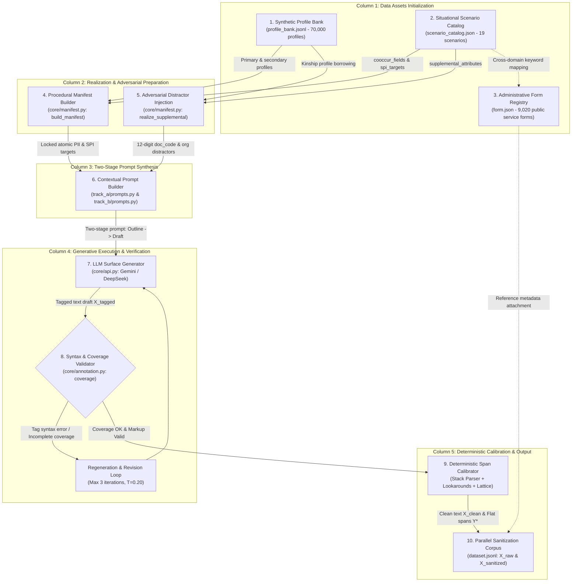

# Mục 1: Giới thiệu


Việc áp dụng nhanh chóng trí tuệ nhân tạo trong các dịch vụ hành chính công, y tế, tài chính và pháp lý của Việt Nam đã làm tăng nhu cầu xử lý các tài liệu chứa dữ liệu cá nhân. Những tài liệu như vậy thường kết hợp các thông tin nhận dạng có cấu trúc—chẳng hạn như số nhận dạng công dân, số điện thoại và ngày sinh—với thông tin phụ thuộc vào ngữ cảnh, bao gồm hoàn cảnh gia đình, tình trạng sức khỏe và vị trí. Do đó, một hệ thống phát hành những tài liệu này cho một dịch vụ bên ngoài để phân tích có thể tạo ra rủi ro về quyền riêng tư, quản trị và vận hành. Đồng thời, chỉ cần xóa mọi chuỗi có khả năng nhạy cảm cũng có thể khiến tài liệu quản trị không thể sử dụng được để tìm kiếm, kiểm tra, xử lý trường hợp hoặc xử lý ngôn ngữ hạ nguồn.


Bài viết này nghiên cứu **khử định danh bảo toàn tính khả dụng** đối với dữ liệu cá nhân của người Việt Nam. Mục tiêu không chỉ là xác định các span nhạy cảm mà còn loại bỏ hoặc thay thế chúng trong khi vẫn giữ được nội dung thủ tục không nhạy cảm và sự mạch lạc về mặt ngôn ngữ của tài liệu. Chúng tôi tập trung vào thuật ngữ của Nghị định bảo vệ dữ liệu cá nhân của Việt Nam (Nghị định số 13/2023/NĐ-CP), sử dụng `PII` và `SPI` làm cách viết tắt ở cấp bộ dữ liệu cho các cấp dữ liệu cá nhân cơ bản và nhạy cảm của nghị định. Ánh xạ pháp lý xác định phạm vi của benchmark; bản thân nó không phải là chứng nhận tuân thủ pháp luật hoàn chỉnh cho bất kỳ hoạt động triển khai nào.


## 1.1. Động lực và đặt vấn đề


Các công cụ PII đa ngôn ngữ hiện có cung cấp những điểm khởi đầu hữu ích, nhưng danh mục thực thể và các quy tắc ra quyết định của chúng không được thiết kế theo các quy ước hành chính của Việt Nam. Tài liệu tiếng Việt chứa các số nhận dạng có định dạng cục bộ, tên cá nhân đa thành phần, địa chỉ phân cấp và các mục từ vựng mà việc diễn giải phụ thuộc nhiều vào các tín hiệu lân cận. Ví dụ: *Nam* có thể biểu thị giới tính của một người, khu vực địa lý hoặc một phần của tên, trong khi *Kinh* có thể biểu thị một dân tộc hoặc xuất hiện trong một cụm từ không liên quan. Thông tin nhạy cảm như sức khỏe hoặc hoàn cảnh gia đình thường được thể hiện dưới dạng một mệnh đề tường thuật dài hơn là một cụm từ ngắn, có tính chính quy.


Những đặc điểm này tạo ra hai yêu cầu kỹ thuật kết hợp. Đầu tiên, benchmark phải thể hiện các lĩnh vực pháp lý có liên quan và cung cấp các ranh giới ở cấp độ ký tự đáng tin cậy. Thứ hai, hệ thống khử định danh phải tối ưu hóa đồng thời hai mục tiêu: giảm rò rỉ quyền riêng tư còn sót lại và tránh việc chỉnh sửa quá mức mang tính phá hoại. ViPII giải quyết yêu cầu đầu tiên thông qua việc tạo tổng hợp có kiểm soát và hiệu chỉnh span ký tự xác định, đồng thời đánh giá yêu cầu thứ hai thông qua bộ chỉ số tiện ích-quyền riêng tư kép.


## 1.2. Khoảng trống nghiên cứu


Chúng tôi xác định bốn khoảng trống thúc đẩy nghiên cứu:


1. **Quy định và phân loại không khớp.** Các tài nguyên và công cụ PII được sử dụng rộng rãi thường được tổ chức xung quanh các nguyên tắc phân loại pháp lý hoặc hoạt động khác. Họ không trực tiếp tiết lộ danh mục PII/SPI gồm 34 trường được sử dụng bởi benchmark này trong phạm vi quy định của Việt Nam.
2. **Tính đặc thù về hành chính và ngôn ngữ của tiếng Việt.** Các định dạng nhận dạng địa phương, địa chỉ đa cấp, cấu trúc tên tiếng Việt và các từ phụ thuộc vào ngữ cảnh tạo ra các trường hợp lỗi không được thể hiện đầy đủ trong các tiêu chuẩn PII cho mục đích chung.
3. **Cấu trúc nhịp đáng tin cậy cho văn bản tổng hợp.** Khi một mô hình ngôn ngữ được yêu cầu tạo ra các khoảng lệch văn xuôi và ký tự cùng một lúc, những thay đổi trong văn bản Unicode và mã thông báo từ phụ có thể tạo ra các ranh giới không chính xác. Do đó, benchmark có thể tái tạo cần tách biệt việc tạo văn bản khỏi tính toán tọa độ.
4. **Sự cân bằng giữa quyền riêng tư và tiện ích khi triển khai cục bộ.** Các mô hình quy mô đám mây có thể khó sử dụng cho các tài liệu nhạy cảm do các yêu cầu về quản trị, độ trễ, chi phí hoặc nơi lưu trữ dữ liệu. Giá trị tương đối của các mẫu nhỏ gọn thích ứng với nhiệm vụ địa phương chưa được thiết lập theo quy trình khử định danh chung của Việt Nam.


## 1.3. Phương pháp tiếp cận ViPII


ViPII là một tiêu chuẩn và khung xây dựng dữ liệu để phát hiện PII/SPI của Việt Nam và khử định danh bảo toàn tính khả dụng. Nguyên tắc thiết kế trung tâm của nó là phân công các trách nhiệm khác nhau cho trình tạo và quy trình chú thích. Tệp kê khai sửa các giá trị nhạy cảm và các trường sẽ xuất hiện; một mô hình ngôn ngữ biểu hiện những giá trị đó trong bối cảnh hành chính tự nhiên; và các thủ tục phía máy chủ xác định tính toán các span ký tự sau khi tạo. Quy trình này kết hợp việc so khớp nguyên văn được bảo vệ, phân biệt ngữ cảnh tín hiệu, phân tách tên-thành phần rời rạc và phân tích cú pháp thẻ neo ngữ nghĩa. Các cơ chế này xây dựng ground truth ngoại tuyến và không được coi là kiến ​​trúc thần kinh của các mô hình được đánh giá.


Kho dữ liệu kết quả chứa 47.881 tài liệu và 474.874 ký tự được chú thích bao gồm 34 lớp trường. Mỗi phiên bản cung cấp đầu vào bằng ngôn ngữ tự nhiên, các span ký tự phẳng không chồng chéo và các mục tiêu khử định danh. Điểm chuẩn báo cáo sự bảo vệ quyền riêng tư và lưu giữ tiện ích cùng nhau, với thành công `FULL` ở cấp độ tài liệu yêu cầu cả việc loại bỏ các đơn vị nhạy cảm được chú thích và duy trì các đơn vị vận hành không nhạy cảm được đánh giá.


## 1.4. Đóng góp


Bài viết này có những đóng góp sau:


1. **Tiêu chuẩn phạm vi pháp lý của Việt Nam.** Chúng tôi giới thiệu tiêu chuẩn PII/SPI gồm 34 trường phù hợp với phạm vi hoạt động của Nghị định số 13/2023/NĐ-CP, bao gồm các mã định danh có cấu trúc, thuộc tính phụ thuộc vào ngữ cảnh, thành phần tên và thông tin nhạy cảm tường thuật.
2. **Một quy trình tổng hợp và chú thích ràng buộc đầu tiên.** Chúng tôi trình bày một quy trình tạo tách rời trong đó các bảng kê khai và hồ sơ được kiểm soát chỉ định các giá trị đích, trong khi quá trình xử lý hậu kỳ xác định sẽ tính toán các span ký tự được chấp nhận và giải quyết xung đột ứng viên.
3. **Khung đánh giá chung về quyền riêng tư-tiện ích.** Chúng tôi xác định các số liệu khử định danh và lưu giữ ở cấp độ khoảng, trường và tài liệu, bao gồm cả biện pháp `FULL` nghiêm ngặt để đạt được thành công toàn diện.
4. **Một nghiên cứu thực nghiệm về các mô hình nhỏ gọn.** Theo tiêu chuẩn được đưa ra hiện tại, các mô hình nhỏ gọn Qwen3 được tinh chỉnh cải thiện đáng kể so với các mô hình không được điều chỉnh. Mẫu 0,6B đạt được 72,46% `SanRec` và 70,10% `FULL`, trong khi mẫu 1.7B mang lại điểm lưu giữ cao hơn; so sánh với các đường cơ sở có mục đích chung được báo cáo theo cùng một giao thức đánh giá.


## 1.5. Phạm vi và tổ chức


Nghiên cứu tập trung vào văn bản tiếng Việt được tạo ra cho các bối cảnh hành chính, pháp lý, y tế và xã hội liên quan. Nó đánh giá chất lượng của các chú thích tổng hợp và hoạt động của hệ thống khử định danh theo giao thức chuẩn; nó không tuyên bố rằng dữ liệu tổng hợp thể hiện đầy đủ tất cả các tài liệu trong thế giới thực hoặc chỉ riêng điểm số mô hình đã thiết lập sự tuân thủ pháp luật. Phần 2 đánh giá các nghiên cứu liên quan. Phần 3 xác định các nhiệm vụ, phân loại pháp lý và đại diện hoạt động. Phần 4 mô tả quy trình tổng hợp và chú thích theo ràng buộc đầu tiên, còn Phần 5 báo cáo số liệu thống kê về kho ngữ liệu và chẩn đoán chất lượng. Phần 6 trình bày sự so sánh thực nghiệm và các kết quả chính. Các phần tiếp theo phân tích các tác động của thành phần, độ bền, kiểu lỗi, cân nhắc triển khai thực tế, đạo đức, hạn chế và khả năng tái lập trước khi kết thúc bài viết.


---


# Mục 2: Nghiên cứu liên quan


Nghiên cứu về bảo vệ dữ liệu cá nhân trong công nghệ ngôn ngữ bao gồm phát hiện thực thể, loại bỏ nhận dạng, tạo dữ liệu tổng hợp và triển khai mô hình nhận thức về quyền riêng tư. Những dòng công việc này có liên quan chặt chẽ với nhau nhưng không giải quyết chính xác cùng một vấn đề. Hệ thống phát hiện xác định các span có thể tiết lộ một cá nhân; một hệ thống khử nhận dạng sẽ biến đổi các span đó; và một pipeline dữ liệu tổng hợp xác định cách tạo các ví dụ đào tạo mà không làm lộ các bản ghi thực. ViPII kết nối những quan điểm này với văn bản hành chính Việt Nam bằng cách kết hợp phân loại lĩnh vực pháp lý, tạo có kiểm soát, xây dựng khoảng ký tự xác định và đánh giá tiện ích-quyền riêng tư chung.


Các hệ thống PII thực tế ban đầu phần lớn được xây dựng từ các quy tắc, từ điển và bộ nhận dạng mô-đun. Microsoft Presidio, Google Cloud Data Loss Prevention, Philter và Amnesia minh họa các cách kết hợp khác nhau của biểu thức chính quy, trình nhận dạng thực thể, từ điển và mô hình ngôn ngữ có mục đích chung để tìm hoặc che giấu mã định danh. Những công cụ này rất có giá trị vì chúng hỗ trợ thông tin xác thực có cấu trúc, trình nhận dạng có thể định cấu hình và quy trình làm việc theo định hướng sản xuất. Tuy nhiên, các chính sách quyết định và kiểm kê mặc định của họ không được thiết kế dựa trên sự phân biệt giữa dữ liệu cá nhân cơ bản và nhạy cảm của Việt Nam. Chúng cũng cung cấp hỗ trợ hạn chế cho các định dạng hành chính tiếng Việt, bao gồm số nhận dạng có cấu trúc cục bộ, địa chỉ đa cấp, tên ghép và tín hiệu từ vựng mơ hồ. Một biểu thức chính quy có thể phát hiện một chuỗi chữ số, nhưng bản thân nó không thể xác định liệu chuỗi đó là mã định danh công dân hay mã tài liệu hành chính; tương tự, từ điển phù hợp với *Nam* hoặc *Kinh* là không đủ nếu không có mệnh đề xung quanh. ViPII giải quyết khoảng trống này bằng cách xác định danh mục 34 trường rõ ràng và bằng cách xử lý việc phân biệt ngữ cảnh gợi ý như một cơ chế chú thích hạng nhất thay vì là một quy tắc xử lý hậu kỳ tùy chọn.


Tài nguyên nhận dạng thực thể có tên tiếng Việt cung cấp nền tảng ngôn ngữ quan trọng nhưng khác nhau về phạm vi và mục tiêu nhiệm vụ. Các benchmark như VLSP NER và PhoNER đã nâng cao khả năng nhận dạng thực thể tiếng Việt cho tin tức, web và văn bản tên miền chung, trong khi các bộ mã hóa được huấn luyện trước của tiếng Việt như PhoBERT đã cho phép ghi nhãn chuỗi cấp mã thông báo mạnh mẽ. Các tài nguyên này thường tập trung vào các danh mục tên riêng như cá nhân, tổ chức, địa điểm và các thực thể linh tinh. Việc khử định danh dữ liệu cá nhân đòi hỏi mức độ chi tiết khác nhau. Số điện thoại, số nhận dạng bảo hiểm y tế, ngày sinh hoặc tài khoản ngân hàng có thể không phải là một thực thể được đặt tên thông thường và thông tin nhạy cảm như chẩn đoán hoặc khó khăn của gia đình có thể bao trùm toàn bộ mệnh đề tường thuật. Ngoài ra, chú thích hướng đến quyền riêng tư phải phân biệt tên của một người với sự xuất hiện phi cá nhân của cùng một từ và phải duy trì vai trò chủ đề khi một số cá nhân được đề cập trong một tài liệu. Do đó, ViPII sử dụng các span ký tự với nhãn cấp trường và cấp độ nhạy cảm pháp lý riêng biệt, cho phép mã định danh có cấu trúc, thành phần tên, thuộc tính theo ngữ cảnh và mệnh đề nhạy cảm từ vựng mở cùng tồn tại trong một benchmark.


Việc tạo dữ liệu tổng hợp đã nổi lên như một giải pháp cho vấn đề khan hiếm dữ liệu trong nghiên cứu về quyền riêng tư. Bởi vì hồ sơ y tế, pháp lý, tài chính và hành chính thực tế thường không thể được phân phối lại nên công việc gần đây đã khám phá việc tạo hướng dẫn hồ sơ, giám sát yếu, tổng hợp theo khuôn mẫu và kho ngữ liệu hướng đến quyền riêng tư quy mô lớn. PRIVASIS chứng minh rằng các biến kiểm soát phụ trợ—chẳng hạn như hồ sơ cá nhân, loại bản ghi và bối cảnh nền—có thể được sử dụng để tạo ra các bộ sưu tập tổng hợp lớn và dữ liệu khử định danh song song mà không cần dựa vào các tài liệu riêng tư thô. Các nỗ lực NER tổng hợp và dữ liệu dạng bảng khác sử dụng tương tự các lược đồ, mẫu hoặc ràng buộc lập trình để kiểm soát các thực thể xuất hiện trong các ví dụ được tạo. Những cách tiếp cận này xác lập tính khả thi của việc xây dựng kho ngữ liệu không có tham chiếu hoặc có rủi ro thấp, nhưng chúng để ngỏ một số vấn đề đối với văn bản pháp luật và hành chính của Việt Nam: cách mã hóa các mã định danh hợp lệ cục bộ, cách thể hiện sự khác biệt giữa dữ liệu cơ bản và dữ liệu nhạy cảm, cách tạo ra các yếu tố gây phân tâm thực tế và cách khôi phục các khoảng chính xác sau khi một mô hình ngôn ngữ đã viết lại phần văn xuôi xung quanh. ViPII xây dựng trên mô hình sinh có định hướng bằng hồ sơ đồng thời bổ sung các ràng buộc hành chính của Việt Nam, các kịch bản đa chủ đề và hiệu chỉnh hậu tạo mang tính quyết định.


Ghi nhãn theo chương trình và giám sát yếu mang lại các chiến lược bổ sung để giảm chi phí chú thích thủ công. Các khung như Snorkel kết hợp các chức năng ghi nhãn, quy tắc heuristic và giải quyết xung đột để tạo ra các nhãn xác suất từ ​​các nguồn nhiễu. Cấu trúc NER tổng hợp thường tuân theo nguyên tắc liên quan bằng cách chèn các thực thể đã biết vào văn bản hoặc bằng cách lấy nhãn từ siêu dữ liệu tạo. Các phương pháp này đặc biệt hữu ích khi một kho văn bản chứa nhiều mẫu có cấu trúc nhưng nhãn của chúng vẫn phụ thuộc vào độ chính xác và phạm vi bao phủ của các quy tắc cơ bản. ViPII áp dụng sự phân tách trách nhiệm chặt chẽ hơn: bảng kê khai chỉ định những giá trị nào sẽ được nhận ra, mô hình ngôn ngữ cung cấp văn xuôi xung quanh và quy trình phía máy chủ tính toán tọa độ ký tự được chấp nhận thông qua so khớp nguyên văn, so khớp ngữ cảnh tín hiệu, phân tách thành phần tên và phân tích cú pháp thẻ neo. Thiết kế này không làm cho việc chú thích ngữ nghĩa trở nên không thể sai lầm; đúng hơn, nó loại bỏ một nguồn lỗi chính—tọa độ do LLM tạo ra—và làm cho quy trình hiệu chuẩn có thể kiểm tra được. Do đó, benchmark sẽ phân biệt các span ứng viên, các yếu tố gây phân tâm không nhạy cảm và các span thực tế cơ bản cuối cùng thay vì xử lý mức độ bao phủ rõ ràng tương đương với việc thu hồi mô hình.


Phần cuối cùng của nghiên cứu liên quan liên quan đến việc khử định danh văn bản và bảo toàn tiện ích sau khi thông tin cá nhân bị xóa. Các hệ thống biên tập truyền thống thay thế một thực thể bằng một mặt nạ cố định hoặc xóa cụm từ xung quanh, điều này có thể bảo vệ quyền riêng tư nhưng phải đánh đổi bằng ngữ pháp và tiện ích của tác vụ. Gần đây, việc khử định danh khung công việc là một vấn đề tạo có điều kiện: hệ thống nhận được tài liệu và hướng dẫn về quyền riêng tư, sau đó xóa, tóm tắt hoặc thay thế thông tin đã chọn trong khi vẫn giữ lại phần còn lại của bản ghi. Công thức này phù hợp với việc tìm kiếm tài liệu, tóm tắt, phân tích và xử lý ngôn ngữ hạ nguồn, trong đó bản ghi đã được lọc phải dễ hiểu thay vì chỉ trống. Nó cũng thúc đẩy việc đánh giá cả rò rỉ dư thừa và xử lý quá mức. ViPII thực hiện sự đánh đổi này thông qua Sanitization Recall, độ chính xác khử định danh ở cấp trường, Retention Recall, độ chính xác lưu giữ và điểm số `FULL` ở cấp độ tài liệu nghiêm ngặt. Ngược lại với đánh giá chỉ dành cho quyền riêng tư, benchmark sẽ trừng phạt các hệ thống bảo vệ quyền riêng tư bằng cách xóa nội dung quản trị thiết yếu.


Các mô hình ngôn ngữ nhỏ gọn cung cấp một điểm triển khai thực tế cho vấn đề này. Các mô hình đám mây lớn có thể cung cấp phạm vi ngôn ngữ rộng, nhưng việc gửi bản ghi tiếng Việt thô tới API bên ngoài có thể xung đột với các yêu cầu về quản trị tổ chức, độ trễ, chi phí hoặc nơi lưu trữ dữ liệu. Thay vào đó, các mô hình nhỏ thích ứng với một phân loại cụ thể có thể được triển khai trên các máy chủ hoặc máy trạm cục bộ và có thể được kiểm tra, lập phiên bản và cập nhật trong tổ chức chịu trách nhiệm. Công việc trước đây về các mô hình ngôn ngữ hiệu quả và xử lý quyền riêng tư trên thiết bị hỗ trợ hướng đi này, nhưng có rất ít bằng chứng về việc loại bỏ PII/SPI của Việt Nam theo một giao thức đánh giá chung. Do đó, ViPII so sánh các mô hình nhỏ gọn Qwen3 đã được tinh chỉnh với các mô hình nhỏ gọn chưa được điều chỉnh và đường cơ sở cho mục đích chung, đồng thời coi pipeline teacher tham chiếu là tham chiếu trên theo kinh nghiệm chứ không phải là mục tiêu triển khai có thể so sánh trực tiếp.


Tóm lại, các hệ thống hiện tại đóng góp các thành phần mạnh mẽ—công cụ nhận dạng công nghiệp, tài nguyên NER của Việt Nam, mô hình dữ liệu tổng hợp, phương pháp giám sát yếu và khử định danh nhận thức tiện ích—nhưng chúng chưa bao quát đầy đủ sự giao thoa về mặt phương pháp. ViPII tập trung vào điểm giao thoa đó: benchmark PII/SPI của Việt Nam trong phạm vi pháp lý, được tạo từ các hồ sơ được kiểm soát và bối cảnh quản trị, được chú thích thông qua hiệu chỉnh span ký tự xác định và được đánh giá dựa trên mục tiêu chung là bảo vệ quyền riêng tư và lưu giữ thông tin. Phần tiếp theo chính thức hóa nhiệm vụ này, phạm vi pháp lý của nó và cách trình bày hoạt động được sử dụng trong toàn bộ tiêu chuẩn.


---


# Mục 3: Xác định nhiệm vụ, Phân loại pháp lý và Khung hoạt động


Trong phần này, chúng tôi xây dựng các nhiệm vụ kép gồm phát hiện ở cấp span và khử định danh tổng thể trong **ViPII**, đặt cơ sở phân loại trong các yêu cầu theo luật định của Nghị định bảo vệ dữ liệu cá nhân của Việt Nam (Nghị định số 13/2023/NĐ-CP) và trình bày chi tiết các cơ chế hoạt động xác định và chính sách giải quyết xung đột được sử dụng để xây dựng dựa trên sự thật.


---


## 3.1. Xây dựng nhiệm vụ chính thức


### Biểu diễn đầu vào và không gian tọa độ Unicode
Đặt $\mathcal{C}$ biểu thị bảng chữ cái hữu hạn của các điểm mã Unicode. Để đảm bảo tính tương đương chính tắc nghiêm ngặt trên tiếng Việt kết hợp các dấu phụ và các cách biểu diễn Trình soạn thảo phương thức nhập liệu (IME) khác nhau, tất cả các phiên bản văn bản được chuẩn hóa thành Dạng chuẩn hóa Unicode C (NFC). Một tài liệu đầu vào được biểu diễn dưới dạng một chuỗi có thứ tự các điểm mã Unicode $N$:
$$X_{\text{raw}} = (c_1, c_2, \dots, c_N), \quad c_t \in \mathcal{C}$$


Trong $X_{\text{raw}}$, các phiên bản dữ liệu cá nhân nhạy cảm nằm dưới dạng các chuỗi tiếp giáp nhau, được gọi là **các span ký tự**. Khoảng dữ liệu cá nhân thực tế được biểu thị chính thức bằng bộ dữ liệu:
$$y_i = \bigl(s_i, e_i, f_i, l_i\bigr)$$
ở đâu:
* $s_i \in \{0, \dots, N-1\}$ là phần bù điểm mã bắt đầu bao gồm 0 chỉ mục trong biểu diễn chuỗi Python.
* $e_i \in \{1, \dots, N\}$ là phần bù điểm mã cuối độc quyền được lập chỉ mục 0 ($s_i < e_i$).
* $f_i \in \mathcal{F}$ chỉ định danh mục thuộc tính chi tiết được chọn từ **34 trường** ($\mathcal{F} = \{f_1, \dots, f_{34}\}$).
* $l_i \in \{\text{PII}, \text{SPI}\}$ biểu thị phân loại theo luật định theo Nghị định 13: Dữ liệu cá nhân cơ bản ($\text{PII}$) hoặc Dữ liệu cá nhân nhạy cảm ($\text{SPI}$).


> **Không thay đổi số đo**: Độ lệch ký tự trong ViPII được xác định nghiêm ngặt dựa trên **Điểm mã Unicode sau khi chuẩn hóa NFC** ($0 \le s_i < e_i \le \text{len}(X)$ trong Python 3). Chúng hoàn toàn khác biệt với các offset byte UTF-8 nhiều byte (trong đó các ký tự có dấu tiếng Việt chiếm 2–3 byte) và với các chỉ mục mã thông báo BPE từ phụ thuộc vào mã thông báo.


```
                                  ┌─────────────────────────────────────────────────────────────┐
                                  │                     Input: Raw Text X_raw                   │
                                  └──────────────────────────────┬──────────────────────────────┘
                                                                 │
                                 ┌───────────────────────────────┴──────────────────────────────┐
                                 ▼                                                              ▼
                  ┌──────────────────────────────┐                              ┌──────────────────────────────┐
                  │           TASK 1:            │                              │           TASK 2:            │
                  │     Span-level detection     │                              │      Utility-preserving      │
                  │        and annotation        │                              │         sanitization         │
                  └──────────────┬───────────────┘                              └──────────────┬───────────────┘
                                 │                                                             │
                                 ▼                                                             ▼
                  ┌──────────────────────────────┐                              ┌──────────────────────────────┐
                  │   Character Spans Y_hat      │                              │     Sanitized Text X_san     │
                  │ {(s, e, field, PII/SPI)}     │                              │ Tag Masking / Synthetic Swap │
                  └──────────────────────────────┘                              └──────────────┬───────────────┘
                                                                                               │
                                                                 ┌─────────────────────────────┴───────────────┐
                                                                 ▼                                             ▼
                                                  ┌──────────────────────────────┐              ┌──────────────────────────────┐
                                                  │       Privacy Defense        │              │     Utility Preservation     │
                                                  │  Residual Privacy Leakage ≈0 │              │       Over-redaction ≈ 0     │
                                                  │    (High Sanitization Rec)   │              │     (High Retention Rec)     │
                                                  └──────────────────────────────┘              └──────────────────────────────┘
```


### Làm rõ trạng thái văn bản trong quy trình tạo
Để ngăn chặn sự nhầm lẫn về mặt toán học giữa các tạo phẩm đường dẫn trung gian và đầu vào suy luận hạ nguồn, chúng tôi chính thức phân biệt bốn trạng thái văn bản:
1. $X_{\text{tagged}}$: Bản nháp thô được phát ra bởi LLM sinh dữ liệu chứa đánh dấu ngữ nghĩa nội tuyến `⟦field⟧...⟦/field⟧`.
2. $X_{\text{clean}}$: Văn bản ngôn ngữ tự nhiên rõ ràng có được từ quá trình phân tích cú pháp và loại bỏ hoàn toàn các thẻ đánh dấu thông qua trình phân tích cú pháp ngăn xếp LIFO xác định; Độ lệch nhịp thực tế cơ bản $\mathcal{Y}^*$ được hiệu chỉnh trên chuỗi này.
3. $X_{\text{raw}}$: Tài liệu ngôn ngữ tự nhiên không được chú thích được trình bày dưới dạng đầu vào cho các mô hình hạ nguồn ($X_{\text{raw}} \equiv X_{\text{clean}}$ trong quá trình suy luận benchmark).
4. $X_{\text{sanitized}}$: Văn bản khử nhận dạng cuối cùng được tạo bởi mô hình khử định danh $\mathcal{M}(X_{\text{raw}})$.


### Lược đồ Canonical: Các nhịp phẳng, không chồng chéo và chiếu tên
Điểm chuẩn nền tảng thực tế $\mathcal{Y}^*$ được xuất trong `dataset.jsonl` tuân thủ nghiêm ngặt **lược đồ phẳng, không chồng chéo**:
$$\mathcal{Y}^* = \{y_1^*, y_2^*, \dots, y_M^*\}, \quad \text{such that } e_i^* \le s_j^* \quad \forall i < j$$


Để dung hòa việc đánh giá trình tự phẳng với bản chất phân cấp của tên dân sự Việt Nam (trong đó tên đầy đủ bao gồm họ, tên đệm và tên cụ thể), ViPII chính thức hóa **Toán tử chiếu tên rời rạc** $\Pi_{\text{name}}$.


Đặt $y_{\text{full}} = (s, e, \text{'full\_name'}, \text{'PII'})$ biểu thị một khoảng tên dân sự tổng hợp. Toán tử $\Pi_{\text{name}}(y_{\text{full}}, X)$ chiếu $y_{\text{full}}$ lên một chuỗi các nhịp phụ liền kề, không chồng chéo:
$$\Pi_{\text{name}}(y_{\text{full}}, X) = \{(s_{\text{fam}}, e_{\text{fam}}, \text{'family\_name'}, \text{'PII'}), (s_{\text{mid}}, e_{\text{mid}}, \text{'middle\_name'}, \text{'PII'}), (s_{\text{giv}}, e_{\text{giv}}, \text{'given\_name'}, \text{'PII'})\}_{\text{non-empty}}$$
thỏa mãn thứ tự biên:
$$s = s_{\text{fam}} < e_{\text{fam}} \le s_{\text{mid}} < e_{\text{mid}} \le s_{\text{giv}} < e_{\text{giv}} = e$$


Biểu diễn chân lý cơ bản chi tiết $\mathcal{Y}^*_{\text{decomposed}}$ có được thông qua phép chiếu rời rạc:
$$\mathcal{Y}^*_{\text{decomposed}} = \Bigl(\mathcal{Y}^* \setminus \{y \in \mathcal{Y}^* \mid y.\text{field} = \text{'full\_name'}\}\Bigr) \cup \bigcup_{y \in \mathcal{Y}^*, y.\text{field} = \text{'full\_name'}} \Pi_{\text{name}}(y, X)$$


Công thức này đảm bảo rằng cả chế độ xem tổng hợp $\mathcal{Y}^*$ và chế độ xem phân tách $\mathcal{Y}^*_{\text{decomposed}}$ đều là các phân vùng phẳng hoàn toàn trên không gian điểm mã, tránh xung đột nhịp lồng nhau không hợp lệ trong quá trình đánh giá trình tự.


### Nhiệm vụ 1: Phát hiện và chú thích cấp độ khoảng
Trong chế độ dự đoán có cấu trúc này, một mô hình $g: \mathcal{X} \to 2^{\mathcal{S}}$ sử dụng $X_{\text{raw}}$ và dự đoán một tập hợp các span ký tự:
$$\hat{\mathcal{Y}} = \bigl\{\hat{y}_j = (\hat{s}_j, \hat{e}_j, \hat{f}_j, \hat{l}_j)\bigr\}_{j=1}^{\hat{M}}$$


Khoảng dự đoán $\hat{y}_j$ được đánh giá là khớp chính xác nghiêm ngặt với thực thể $y_i^*$ khi và chỉ khi:
$$\hat{s}_j = s_i^* \quad \land \quad \hat{e}_j = e_i^* \quad \land \quad \hat{f}_j = f_i^* \quad \land \quad \hat{l}_j = l_i^*$$


### Nhiệm vụ 2: Khử định danh bảo toàn tính khả dụng
Trong chế độ khử nhận dạng tổng quát này, mô hình $\mathcal{M}: \mathcal{X} \to \mathcal{X}$ toàn diện sẽ chuyển đổi $X_{\text{raw}}$ trực tiếp thành **văn bản đã được khử định danh**:
$$X_{\text{sanitized}} = \mathcal{M}(X_{\text{raw}})$$


Việc khử nhận dạng tuân theo hai mô hình hoạt động:
1. **Mặt nạ thẻ**: Thay thế các nhịp nhạy cảm $X_{\text{raw}}[s_i:e_i]$ bằng mã thông báo mặt nạ danh mục được tiêu chuẩn hóa:
   $$\tau(f_i) \in \bigl\{\texttt{[HỌ\_TÊN]}, \texttt{[CCCD]}, \texttt{[SỐ\_ĐIỆN\_THOẠI]}, \texttt{[TÌNH\_TRẠNG\_SỨC\_KHỎE]}, \dots\bigr\}$$
2. **Thay thế tổng hợp nhất quán**: Thay thế các span nhạy cảm bằng các giá trị tổng hợp từ cơ sở dữ liệu nhân khẩu học biệt lập, duy trì sự thống nhất về ngữ pháp toàn cầu và sự mạch lạc tham chiếu giữa các tài liệu.


---


## 3.2. Mục tiêu khái niệm: Rò rỉ quyền riêng tư so với việc duy trì tiện ích


Việc đánh giá khả năng khử nhận dạng bảo toàn tiện ích sẽ cân bằng giữa khả năng bảo vệ quyền riêng tư và tiện ích thông tin. Chúng tôi chính thức hóa tính hai mặt này về mặt khái niệm thông qua **rò rỉ quyền riêng tư còn sót lại** và **xử lý quá mức**.


Đặt $\mathcal{P}(X_{\text{raw}})$ biểu thị tập hợp các đơn vị dữ liệu cá nhân nhạy cảm thực tế (các khoảng hoặc thuộc tính) có trong tài liệu $X_{\text{raw}}$ và để $\mathcal{U}(X_{\text{raw}})$ biểu thị tập hợp các đơn vị thông tin cú pháp, thủ tục, hành chính và vận hành không nhạy cảm cần thiết để duy trì tiện ích tài liệu.


### Rò rỉ quyền riêng tư còn sót lại
Khi mô hình khử định danh xử lý $X_{\text{raw}}$, mọi thực thể dữ liệu cá nhân thuộc $\mathcal{P}(X_{\text{raw}})$ vẫn có thể nhận dạng hoặc có thể phục hồi trong $X_{\text{sanitized}}$ đều cấu thành lỗi bảo mật theo kinh nghiệm.


Đặt $\mathbb{I}_{\text{leak}}(y_i^*, X_{\text{sanitized}})$ là một hàm chỉ báo được đánh giá theo giao thức xác minh rõ ràng $\mathcal{V}_{\text{privacy}}(y_i^*, X_{\text{sanitized}})$, trả về 1 nếu nội dung nhạy cảm của phạm vi sự thật trên mặt đất $y_i^*$ vẫn tồn tại trong $X_{\text{sanitized}}$ ở dạng chưa được xác thực hoặc có thể phục hồi và 0 nếu được khử định danh thành công. **Tỷ lệ rò rỉ quyền riêng tư còn lại** ($\mathcal{L}_{\text{privacy}}$) theo kinh nghiệm trên kho tài liệu $D$ thử nghiệm được biểu thị bằng:


$$\mathcal{L}_{\text{privacy}} = 1 - \text{SanRec} = \frac{\sum_{d=1}^D \sum_{i=1}^{M_d} \mathbb{I}_{\text{leak}}(y_{d,i}^*, X_{d,\text{sanitized}})}{\sum_{d=1}^D M_d}$$


trong đó $\text{SanRec}$ biểu thị **Thu hồi khử định danh**.


> **Tuyên bố từ chối trách nhiệm về phương pháp**: Rò rỉ dư lượng được đo cụ thể dựa trên các đơn vị nhạy cảm với ground truth được xác định trước theo giao thức kiểm tra quyền riêng tư và so khớp được chỉ định rõ ràng. Mặc dù $1 - \text{SanRec}$ định lượng tốc độ rò rỉ theo kinh nghiệm của các thực thể được chú thích, nhưng trong môi trường sản xuất, việc xác minh quyền riêng tư cũng yêu cầu kiểm tra tình trạng che giấu một phần, ảo giác mô hình và các cuộc tấn công liên kết; các giao thức đánh giá hoạt động này được chính thức hóa trong Phần 6. Mục tiêu không rò rỉ ($\mathcal{L}_{\text{privacy}} = 0$) được sử dụng làm mục tiêu kỹ thuật thận trọng cho việc triển khai nhạy cảm với quyền riêng tư; nó không nên được hiểu là một quyết định tuân thủ pháp luật hoàn chỉnh.


### Biên tập quá mức và giữ lại tiện ích
Ngược lại, nếu mô hình khử định danh mạnh mẽ ngăn chặn hoặc xóa nội dung quản trị không nhạy cảm, hướng dẫn thủ tục, tài liệu tham khảo pháp lý hoặc liên kết ngữ pháp ($u_k \in \mathcal{U}(X_{\text{raw}})$), tiện ích hạ nguồn của tài liệu sẽ bị xâm phạm.


Hãy để $\mathbb{I}_{\text{suppress}}(u_k, X_{\text{sanitized}})$ cho biết liệu mã thông báo thông tin hoạt động hợp lệ $u_k \in \mathcal{U}(X_{\text{raw}})$ có bị che giấu hoặc phá hủy do nhầm lẫn hay không. **Tỷ lệ xử lý quá mức** ($\mathcal{O}_{\text{redact}}$) được định nghĩa theo khái niệm là:


$$\mathcal{O}_{\text{redact}} = 1 - \text{RetRec} = \frac{\sum_{d=1}^D \sum_{k=1}^{K_d} \mathbb{I}_{\text{suppress}}(u_{d,k}, X_{d,\text{sanitized}})}{\sum_{d=1}^D K_d}$$


trong đó $\text{RetRec}$ biểu thị **Thu hồi lưu giữ**. Cấu trúc hoạt động của $\mathcal{U}(X)$ (bắt nguồn từ các vị trí biểu mẫu thủ tục và tham chiếu từ vựng), chính sách so khớp (tính đến diễn giải ngữ nghĩa và xóa phá hoại) và các sơ đồ tổng hợp trên các mã thông báo, thuộc tính và bản ghi ($\text{RetAtt}$, $\text{RetA/R}$, $\text{RetRec}$) được quy định cụ thể trong Phần 6.


### Chỉ số thành công toàn diện: $\text{FULL}$
Một hệ thống khử định danh đạt được thành công hoàn toàn từ đầu đến cuối trên một tài liệu khi và chỉ khi nó không gây ra rò rỉ quyền riêng tư còn sót lại và không biên tập quá mức các vị trí hoạt động:


$$\text{FULL} = \frac{1}{D} \sum_{d=1}^D \Biggl[ \prod_{i=1}^{M_d} \bigl(1 - \mathbb{I}_{\text{leak}}(y_{d,i}^*, X_{d,\text{sanitized}})\bigr) \times \prod_{k=1}^{K_d} \bigl(1 - \mathbb{I}_{\text{suppress}}(u_{d,k}, X_{d,\text{sanitized}})\bigr) \Biggr]$$


---


## 3.3. Phạm vi pháp lý và Phân loại Nghị định 13 (34 trường)


### Bối cảnh theo luật định và thẩm quyền
Hệ thống phân loại theo luật định của ViPII được thiết lập trong khuôn khổ pháp lý của nước Cộng hòa xã hội chủ nghĩa Việt Nam, được phân loại thành ba văn bản pháp lý:
1. **Luật pháp được ban hành (Đang có hiệu lực)**: **Nghị định số 13/2023/NĐ-CP về Bảo vệ Dữ liệu Cá nhân (PDPD)**, do Chính phủ Việt Nam ban hành ngày 17 tháng 4 năm 2023 và có hiệu lực từ ngày 1 tháng 7 năm 2023:
   * **Điều 2(3) và 3**: Chính thức xác định và liệt kê các lớp bao gồm Dữ liệu cá nhân cơ bản ($\text{PII}$).
   * **Điều 2(4) và 4**: Chính thức xác định và liệt kê các loại bao gồm Dữ liệu cá nhân nhạy cảm ($\text{SPI}$).
   * **Điều 8**: Quy định nghiêm cấm việc xử lý bất hợp pháp hoặc tiết lộ trái phép dữ liệu cá nhân.
   * **Điều 25**: Áp đặt các điều kiện quản lý nghiêm ngặt đối với việc chuyển dữ liệu công dân Việt Nam xuyên biên giới, nhấn mạnh sự cần thiết của các mô hình khử nhận dạng cục bộ nhỏ gọn tại chỗ.
2. **Văn bản hành chính được ban hành**: **Nghị quyết số 202/2025/QH15** của Quốc hội về tái cơ cấu lãnh thổ hành chính, trong đó bắt buộc phải theo dõi các địa danh tỉnh/xã đã được sáp nhập trong hồ sơ dân sự.
3. **Phạm vi quy định tương lai**: **Dự thảo Luật về bảo vệ dữ liệu cá nhân (PDPD 2025/2026)**, trong đó nêu rõ các nghĩa vụ kiểm toán nâng cao; dự thảo này được trích dẫn nghiêm ngặt như là nền tảng động lực cho việc tuân thủ hướng tới tương lai, chứ không phải như luật pháp ban hành hiện hành.


### 34 lớp thực địa
Theo Nghị định 13, dữ liệu cá nhân được phân thành hai cấp theo luật định:
* **Dữ liệu cá nhân cơ bản ($\text{PII}$ - 18 trường)**: Giá trị nhận dạng duy nhất hoặc chung xác định một cá nhân trong các lĩnh vực dân sự, hành chính và thương mại.
* **Dữ liệu cá nhân nhạy cảm ($\text{SPI}$ - 16 trường)**: Thông tin có liên quan mật thiết đến các quyền và quyền tự do riêng tư mà nếu bị vi phạm sẽ trực tiếp gây tổn hại đến phẩm giá, tình hình tài chính, an sinh xã hội hoặc an toàn cá nhân.


#### Bảng 3.1: Tổng hợp 34 lĩnh vực theo Phân loại pháp lý Nghị định 13 của ViPII
*(Để biết các trích dẫn pháp lý đầy đủ, định nghĩa pháp lý chi tiết và ví dụ tiếng Việt chuẩn cho tất cả 34 lĩnh vực, xem Phụ lục A).*


| Cấp theo luật định | Số trường | Cụm danh mục | Mã định danh trường ($f \in \mathcal{F}$) |
|:---|:---:|:---|:---|
| **Dữ liệu cá nhân cơ bản**<br/>(**PII** - Nghị định 13, Điều 2(3) & 3) | **18** | **Số dân sự & danh tính**<br/>*(8 trường)* | `cccd` (ID công dân 12 chữ số), `cmnd` (ID kế thừa 9 chữ số), `phone`, `email`, `passport_number`, `driver_license`, `vehicle_plate`, `tax_code` |
| | | **Số nhận dạng dân sự & Tên**<br/>*(5 trường)* | `full_name`, `family_name`, `middle_name`, `given_name`, `address` |
| | | **Nhân khẩu học & Kỹ thuật số**<br/>*(5 trường)* | `dob` (Ngày sinh), `gender`, `marital_status`, `nationality`, `digital_account` |
| **Dữ liệu cá nhân nhạy cảm**<br/>(**SPI** - Nghị định 13, Điều 2(4) & 4) | **16** | **Thông tin xác thực tài chính và kỹ thuật số**<br/>*(4 trường)* | `bank_account`, `social_insurance_no` (BHXH), `health_insurance_no` (BHYT), `eid_credentials` (VNeID) |
| | | **Niềm tin, Nguồn gốc & Theo dõi**<br/>*(6 trường)* | `ethnicity`, `religion`, `political_view`, `location_data`, `behavioral_data`, `place_components` |
| | | **Cuộc sống và sức khỏe dễ bị tổn thương**<br/>*(6 trường)* | `health_status`, `criminal_record`, `private_life`, `family_relations`, `sexual_orientation`, `biometric` |
| **Tổng cộng** | **34** | — | — |


---


## 3.4. Cơ chế xây dựng thực tế hoạt động


> **Làm rõ kiến ​​trúc quan trọng**: Bốn cơ chế được mô tả bên dưới là **mô-đun thuật toán xác định được thực thi ngoại tuyến trong quy trình** để xây dựng các chú thích thực tế cơ bản ($\mathcal{Y}^*$) và hiệu chỉnh tọa độ nhịp với sai số bù bằng 0. Chúng **không** cấu thành kiến ​​trúc mô hình neural được đánh giá trong Phần 6. Các mô hình hạ nguồn (chẳng hạn như Qwen-3 SLM được tinh chỉnh và LLM biên giới) chỉ nhận được ngôn ngữ tự nhiên không được quản lý ($X_{\text{raw}}$) và phải học cách xác định các nhịp hoặc tạo văn bản được chọn lọc từ đầu đến cuối mà không có tín hiệu biểu tượng phụ trợ.


Để loại bỏ độ lệch tọa độ mà không cần chú thích lại thủ công, quy trình phân vùng 34 trường trên **bốn cơ chế vận hành chính**:


```
┌─────────────────────────────────────────────────────────────────────────────────────────────────────────┐
│                          FOUR GROUND-TRUTH CALIBRATION MECHANISMS IN VIPII                              │
├───────────────────────────────┬─────────────────────────────────────────────────────────────────────────┤
│ 1. Verbatim Matching          │ Guarded word-boundary Regex lookaround matching invariant values.       │
│    (via: verbatim - 13 fields)│ Applied to canonical credentials, phone, CCCD, email, full names.       │
├───────────────────────────────┼─────────────────────────────────────────────────────────────────────────┤
│ 2. Cue-Context Disambiguation │ 80-character sentence-bounded lookback window for trigger cues.         │
│    (via: cue_context - 10 fld)│ Disambiguates homographs (e.g., "Kinh" ethnicity vs. "kinh tế").        │
├───────────────────────────────┼─────────────────────────────────────────────────────────────────────────┤
│ 3. Name-Component             │ Algorithmic decomposition of Vietnamese personal names into             │
│    Decomposition              │ Surname, Middle Name, and Given Name components.                        │
│    (via: name_component - 3 f)│ Handled via disjoint parsing over resolved full_name spans.             │
├───────────────────────────────┼─────────────────────────────────────────────────────────────────────────┤
│ 4. Semantic Anchor-Tag        │ Linear-time O(N) LIFO stack parser decoding inline tags                 │
│    Parsing (via: anchor_tag)  │ ⟦field⟧...⟦/field⟧ for complex, free-form, variable-length SPI clauses  │
│    (8 fields: 1 PII, 7 SPI)   │ (plus conversational PII digital_account handles).                      │
└───────────────────────────────┴─────────────────────────────────────────────────────────────────────────┘
```


1. **So khớp nguyên văn được bảo vệ (`via: verbatim` - 13 trường)**:
   * *Nguyên tắc*: So khớp thông tin xác thực chữ và số bất biến và địa chỉ được chỉ định trước trong bảng kê khai tạo. Sử dụng các xác nhận xem xét độ rộng bằng 0 nhận biết Unicode:
     $$R(v) = \texttt{(?<!\textbackslash{}w)} + \text{re.escape}(v) + \texttt{(?!\textbackslash{}w)}$$
   * *Các trường (13 trường: 10 PII, 3 SPI)*: PII cơ bản: `cccd`, `cmnd`, `phone`, `email`, `passport_number`, `driver_license`, `vehicle_plate`, `tax_code`, `address`, `full_name`. SPI nhạy cảm: `bank_account`, `social_insurance_no`, `health_insurance_no`.


2. **Định hướng ngữ cảnh tín hiệu (`via: cue_context` - 10 trường)**:
   * *Nguyên tắc*: Giải quyết các từ đồng âm từ vựng (ví dụ: dân tộc *Kinh* vs. *kinh tế*, giới tính *Nam* vs. địa lý *miền Nam*) và ngày tháng chung. Trình so khớp sẽ kiểm tra một cửa sổ trượt ngược lên tới các ký tự $W = 80$, được giới hạn bởi các dấu kết thúc câu (`.`, `;`, `\n`, `!`, `?`). Một span chỉ được trích xuất khi một dấu hiệu kích hoạt chính thức được đặt cùng vị trí trong mệnh đề.
   * *Các trường (10 trường: 4 PII, 6 SPI)*: PII cơ bản: `dob`, `gender`, `marital_status`, `nationality`. SPI nhạy cảm: `ethnicity`, `religion`, `political_view`, `location_data`, `behavioral_data`, `place_components`.


3. **Phân tách thành phần tên (`via: name_component` - 3 trường)**:
   * *Nguyên tắc*: Tách các chuỗi `full_name` đã được xác thực thành các thành phần riêng biệt bằng cách sử dụng phân tích cú pháp dựa trên quy tắc đối với các họ ghép tiếng Việt (`ho_kep`) và các tiền tố thuộc họ dân tộc ($Y$, $H'$).
   * *Các trường (3 trường: 3 PII, 0 SPI)*: PII cơ bản: `family_name`, `middle_name`, `given_name`.


4. **Phân tích cú pháp thẻ neo ngữ nghĩa (`via: anchor_tag` - 8 trường)**:
   * *Nguyên tắc*: Các mệnh đề trần thuật, có độ dài thay đổi, thiếu các mẫu cố định được đặt trong các dấu phân cách nhẹ `⟦field⟧...⟦/field⟧` bằng bộ tạo. Trình phân tích cú pháp ngăn xếp LIFO $\mathcal{O}(N)$ một lượt sẽ trích xuất tọa độ chính xác, ghi lại các span thực tế và loại bỏ tất cả các thẻ để tạo ra $X_{\text{clean}}$.
   * *Các trường (8 trường: 1 PII, 7 SPI)*: PII cơ bản (1 trường): `digital_account` (các thẻ điều khiển hội thoại OTT không chính thức; các URL tiêu chuẩn cũng có thể được trích xuất nguyên văn). SPI nhạy cảm (7 trường): `health_status`, `criminal_record`, `private_life`, `family_relations`, `sexual_orientation`, `biometric`, `eid_credentials`.


### Bảng 3.2: Ma trận ánh xạ chéo rời rạc: Cấp bậc pháp lý của Nghị định 13 so với Cơ chế hoạt động chính
Mỗi trường được gán cho **chính xác một cơ chế vận hành chính**, tạo ra một phân vùng toán học chính xác:


| Cơ chế vận hành chính | Dữ liệu cá nhân cơ bản (PII) [18 trường] | Dữ liệu cá nhân nhạy cảm (SPI) [16 trường] | Tổng phân vùng |
|:---|:---|:---|:---:|
| **1. So khớp nguyên văn** (`via: verbatim`) | `cccd`, `cmnd`, `phone`, `email`, `passport_number`, `driver_license`, `vehicle_plate`, `tax_code`, `address`, `full_name` [10 trường] | `bank_account`, `social_insurance_no`, `health_insurance_no` [3 trường] | **13** |
| **2. Định hướng ngữ cảnh Cue** (`via: cue_context`) | `dob`, `gender`, `marital_status`, `nationality` [4 trường] | `ethnicity`, `religion`, `political_view`, `location_data`, `behavioral_data`, `place_components` [6 trường] | **10** |
| **3. Phân tách tên-thành phần** (`via: name_component`) | `family_name`, `middle_name`, `given_name` [3 trường] | *(Không có)* [0 trường] | **3** |
| **4. Phân tích thẻ neo ngữ nghĩa** (`via: anchor_tag`) | `digital_account` [1 trường] | `health_status`, `criminal_record`, `private_life`, `family_relations`, `sexual_orientation`, `biometric`, `eid_credentials` [7 trường] | **8** |
| **Tổng phân vùng chính xác** | **18 trường** | **16 trường** | **34 trường** |


---


##3.5. Chính sách giải quyết xung đột và mạng lưới ưu tiên


Trong quá trình xây dựng nền tảng thực tế, nhiều trình so khớp có thể tạo ra các khoảng ứng viên chồng chéo. Ví dụ: thông tin xác thực nguyên tử có thể xuất hiện bên trong mệnh đề tường thuật `private_life` hoặc trình so khớp họ có thể xung đột với tên đầy đủ bao gồm. Để thực thi biểu diễn phẳng nghiêm ngặt $\mathcal{Y}^*$, quy trình thực thi chính sách giải quyết xung đột **Mạng ưu tiên 5 cấp** xác định.


### Các mối quan hệ được thiết lập chính thức
Chúng tôi chính thức phân vùng tất cả các nhịp được trích xuất thành ba bộ:
1. **Các khoảng ứng viên ($\mathcal{S}_{\text{cand}}$)**: Tập hợp thô của tất cả các giả thuyết về khoảng được tạo bởi bốn cơ chế trích xuất ngoại tuyến:
   $$\mathcal{S}_{\text{cand}} = \mathcal{S}_{\text{sensitive-cand}} \cup \mathcal{S}_{\text{distractor}}, \quad \mathcal{S}_{\text{sensitive-cand}} \cap \mathcal{S}_{\text{distractor}} = \emptyset$$
2. **Kéo dài bộ phân tâm đối nghịch ($\mathcal{S}_{\text{distractor}}$)**: Mã thông báo cấu trúc không nhạy cảm được đưa vào trong quá trình tạo để kiểm tra khả năng phân biệt—cụ thể là mã tài liệu hành chính 12 chữ số (`doc_code` thuộc loại `num12`) mang nhãn `O`. Các khoảng này tham gia tích cực trong quá trình phân giải chồng chéo để ngăn chặn kết quả dương tính giả đối với thông tin xác thực `cccd` 12 chữ số.
3. **Bộ đã giải quyết ($\mathcal{S}_{\text{resolved}}$)**: Tập hợp con không có xung đột tối đa được tạo bởi toán tử mạng ưu tiên $\Omega(\mathcal{S}_{\text{cand}})$.
4. **Các span thực tế cơ bản cuối cùng ($\mathcal{Y}^*$)**: Tập hợp cuối cùng, không chồng chéo của các khoảng PII/SPI đã xác thực được xuất trong `dataset.jsonl`, thu được bằng cách lọc ra các yếu tố phân tâm:
   $$\mathcal{Y}^* = \{s \in \mathcal{S}_{\text{resolved}} \mid \text{label}(s) \neq \text{'O'}\}, \quad \text{where } \mathcal{S}_{\text{distractor}} \cap \mathcal{Y}^* = \emptyset$$


### Lưới ưu tiên 5 bậc
Khoảng ứng viên được ưu tiên theo độ chính xác về ngữ nghĩa và độ nhạy theo luật định:
$$\text{Tier 1 (Weight 100)} \succ \text{Tier 2 (Weight 80)} \succ \text{Tier 3 (Weight 60)} \succ \text{Tier 4 (Weight 50)} \succ \text{Tier 5 (Weight 40)}$$


* **Cấp 1 (ID nguyên tử bất biến, Trọng lượng 100)**: `cccd`, `cmnd`, `phone`, `email`, `passport_number`, `driver_license`, `vehicle_plate`, `tax_code`, `dob`, `bank_account`, `social_insurance_no`, `health_insurance_no`, `eid_credentials` và các mã phân tâm không phải PII (`doc_code`). *Thông tin xác thực nguyên tử được ưu tiên tuyệt đối và không thể bị ghi đè.*
* **Cấp 2 (Điều khoản SPI chuyên dụng, Trọng lượng 80)**: `health_status`, `criminal_record`, `biometric`, `ethnicity`, `religion`, `political_view`, `sexual_orientation`.
* **Cấp 3 (PII dân dụng lõi, trọng lượng 60)**: `full_name`, `address`, `family_relations`, `digital_account`, `marital_status`, `gender`, `nationality`.
* **Cấp 4 (Tên cá nhân độc lập, Trọng lượng 50)**: `given_name` độc lập xuất hiện trong lời chào đối thoại hoặc dòng chữ ký bên ngoài khoảng `full_name`.
* **Cấp 5 (SPI ngữ cảnh rộng, Trọng số 40)**: `private_life`, `location_data`, `behavioral_data`.


### Phá vỡ ràng buộc thuật toán và phép trừ span chính thức
Khi hai ứng cử viên kéo dài $s_a, s_b \in \mathcal{S}_{\text{cand}}$ va chạm ($s_a.\text{start} < s_b.\text{end} \land s_b.\text{start} < s_a.\text{end}$), các xung đột được giải quyết thông qua hệ thống phân cấp xác định:
1. **Chính: Trọng lượng ưu tiên**: Trọng lượng cấp cao hơn sẽ thắng ($\text{weight}(s_a) > \text{weight}(s_b)$).
2. **Phụ: Độ dài khoảng**: Nếu trọng số bằng nhau, khoảng dài hơn sẽ được giữ lại (Trận đấu dài nhất: $e_a - s_a > e_b - s_b$).
3. **Cấp ba: Bù đầu**: Nếu trọng lượng và độ dài giống hệt nhau thì nhịp trước đó sẽ thắng (Trái sang phải: $s_a.\text{start} < s_b.\text{start}$).


> **Phép trừ span chính thức cho các bối cảnh tường thuật rộng (Cấp 5)**: Khi khoảng tường thuật rộng Cấp 5 $I_{\text{broad}} = [s_{\text{broad}}, e_{\text{broad}})$ giao với một tập hợp $K$ đã chấp nhận các span có mức độ ưu tiên cao hơn $\mathcal{I}_{\text{higher}} = \{[s_k, e_k)\}_{k=1}^K$, thay vì loại bỏ hoàn toàn bối cảnh rộng, quy trình sẽ tính toán chênh lệch đã đặt:
> $$\text{Res}(I_{\text{broad}}) = I_{\text{broad}} \setminus \bigcup_{k=1}^K [s_k, e_k) = \bigcup_{j=1}^J [s'_j, e'_j)$$
> trong đó mỗi $[s'_j, e'_j)$ là một khoảng con liền kề tối đa, không trống. Khoảng phụ còn lại được giữ lại dưới dạng khoảng thực tế cơ bản hợp lệ khi và chỉ khi $e'_j - s'_j \ge \theta_{\text{min}}$ (trong đó các điểm mã $\theta_{\text{min}} = 5$), đảm bảo duy trì khó khăn trong nước và câu chuyện xung quanh mà không nuốt thông tin xác thực nguyên tử.


```
Algorithm 1: Deterministic 5-Tier Priority Overlap Resolution (Ω)
──────────────────────────────────────────────────────────────────────────────────
Input  : Raw candidate spans S_cand, Priority weight function w(·), 
         Minimum residual context threshold θ_min = 5
Output : Conflict-free ground-truth span set Y*

1:  S_sorted ← Sort S_cand by primary key w(s) descending, 
                     secondary key (e - s) descending, tertiary key s ascending
2:  S_accepted ← ∅
3:  for each span s in S_sorted do
4:      I_collide ← {a ∈ S_accepted | s.start < a.end ∧ a.start < s.end}
5:      if I_collide = ∅ then
6:          S_accepted ← S_accepted ∪ {s}
7:      else if w(s) = 40 then  // Tier 5: Broad contextual narrative span
8:          Res(s) ← [s.start, s.end) \ ⋃_{a ∈ I_collide} [a.start, a.end)
9:          for each contiguous interval [s'_j, e'_j) in Res(s) do
10:             if (e'_j - s'_j) ≥ θ_min then
11:                 s_trim ← InstantiateSpan(s'_j, e'_j, s.field, s.label, s.via)
12:                 S_accepted ← S_accepted ∪ {s_trim}
13:             end if
14:         end for
15:     end if
16: end for
17: Y* ← {s ∈ S_accepted | s.label ≠ "O"}  // Filter out adversarial non-PII distractors
18: return Sort Y* by start offset ascending
──────────────────────────────────────────────────────────────────────────────────
```


Bằng cách chính thức hóa các định nghĩa này, tập hợp các mối quan hệ và các chính sách xác định, Phần 3 cung cấp nền tảng rõ ràng, nhất quán về mặt toán học cho quy trình tổng hợp (Phần 4), thống kê benchmark (Phần 5) và đánh giá thử nghiệm (Phần 6).


---


# Mục 4: Đường dẫn chú thích và tổng hợp dữ liệu ràng buộc đầu tiên


Trong phần này, chúng tôi trình bày kiến ​​trúc toàn diện của quy trình tạo dữ liệu và chú thích **ViPII**. Chúng tôi giải thích các bất biến thiết kế cơ bản—*Tổng hợp có kiểm soát bằng cách xây dựng* và *Hiệu chỉnh phía máy chủ xác định*—và theo dõi một cách có hệ thống từng giai đoạn: lưu trữ hồ sơ nhân khẩu học, xây dựng bảng kê khai thủ tục, tổng hợp yếu tố phân tâm đối nghịch, nhắc nhở theo ngữ cảnh hai giai đoạn, phân tích đánh dấu xác định, hiệu chỉnh span ký tự, giải quyết xung đột mạng ưu tiên và định dạng tập dữ liệu khử nhận dạng song song thu được.


---


##4.1. Tổng quan về quy trình và các bất biến kiến ​​trúc cốt lõi


Các bộ dữ liệu về quyền riêng tư hiện tại thường gặp phải hai chế độ lỗi về mặt phương pháp: (1) dựa vào các biểu thức chính quy theo kinh nghiệm và tra cứu từ điển đối với các mẩu tin lưu niệm trên web chưa được xử lý, gây ra nhiễu nhãn nghiêm trọng và dịch chuyển tọa độ; hoặc (2) thúc đẩy các mô hình ngôn ngữ tự hồi quy dự đoán trực tiếp tọa độ ký tự số, điều này chắc chắn gây ra thảm họa *Trôi lệch chỉ số tích lũy* do tính không đồng hình giữa không gian mã thông báo từ phụ và không gian điểm mã Unicode nhiều byte.


Để thiết lập một tiêu chuẩn có thẩm quyền phù hợp với Nghị định số 13/2023/NĐ-CP mà không làm lộ dữ liệu công dân thực sự, ViPII áp dụng **mô hình tổng hợp tách rời, ràng buộc đầu tiên**. Quy trình tách riêng việc tạo văn xuôi ngôn ngữ tự nhiên khỏi tính toán tọa độ không gian thông qua hai bất biến kỹ thuật chi phối:


1. **Tổng hợp có kiểm soát theo cấu trúc (Nguyên tắc ràng buộc đầu tiên)**: Tất cả giá trị nhận dạng cá nhân nhạy cảm ($\text{PII}$) và thuộc tính nhạy cảm ($\text{SPI}$) đều được tạo và khóa một cách xác định ở lớp thời gian chạy Python *trước* để tập hợp lời nhắc. Mô hình ngôn ngữ tạo sinh hoạt động chặt chẽ như một người kể chuyện theo ngữ cảnh, dệt nên văn xuôi hành chính tự nhiên, những kiến ​​nghị chính thức và đối thoại xung quanh các giá trị thực thể cố định. Mô hình này rõ ràng bị cấm tạo ra ảo giác về các khe nhận dạng cá nhân mới.
2. **Hiệu chỉnh khoảng cách phía máy chủ xác định**: Độ lệch ký tự ($s_i, e_i$) và nhãn thực thể được tính toán hoàn toàn trên máy chủ lưu trữ bằng cách sử dụng các toán tử thuật toán xác định (so khớp tìm kiếm Unicode, cửa sổ kích hoạt giới hạn câu và trình phân tích cú pháp ngăn xếp LIFO một lượt). Mô hình ngôn ngữ không bao giờ được giao nhiệm vụ dự đoán tọa độ số, loại bỏ hoàn toàn ảo giác tọa độ.


Hình 4.1 minh họa luồng hoạt động 10 nút hoàn chỉnh được cấu trúc trên năm cột chức năng.




*Hình 4.1: Luồng hoạt động 10 nút có thẩm quyền của quy trình tổng hợp dữ liệu ràng buộc đầu tiên và chú thích xác định ViPII.*


---


##4.2. Ngân hàng hồ sơ tổng hợp và nguồn siêu dữ liệu


Quy trình sản xuất dựa trên ba kho lưu trữ dữ liệu cơ bản (`data/`), được thiết kế để phản ánh thực tế nhân khẩu học và hành chính của Việt Nam mà không kết hợp bất kỳ hồ sơ công dân thực tế nào.


### Ngân hàng hồ sơ nhân tạo 70.000 (`profile_bank.jsonl`)
Nhân khẩu học cốt lõi bao gồm chính xác **70.000 hồ sơ công dân tổng hợp duy nhất, được thực hiện đầy đủ**, được tạo thông qua công cụ nhân khẩu học độc lập `build_profiles.py` được tham số hóa bởi các phân bổ điều tra dân số thực nghiệm trong `profile_core.json`. Mỗi bản ghi chứa 35 thuộc tính cá nhân được cấu trúc thành 10 trường cấp cao nhất:
* `profile_id`: Mã định danh duy nhất được định dạng là `pf_xxxxxx` (trải dài từ `pf_000000` đến `pf_069999`).
* `fields`: Hoàn thành các vị trí nhân khẩu học bao gồm tất cả 18 trường PII cơ bản và 16 trường SPI nhạy cảm.
* `consistency`: Bất biến logic bên trong đảm bảo khả năng tương thích chéo thuộc tính nghiêm ngặt:
  * Năm sinh được khai báo trong `dob` khớp với mã năm gồm hai chữ số được gắn trên Thẻ căn cước công dân (`cccd`).
  * Mã khai sinh cấp tỉnh trong `cccd` khớp với quyền tài phán hành chính chính của nơi cư trú đã khai báo `address`.
  * Phân bổ hôn nhân có điều kiện theo độ tuổi đảm bảo tình trạng dân sự thực tế (ví dụ: ly hôn hoặc góa bụa là có điều kiện đối với độ tuổi trưởng thành hợp pháp).
* `quasi_key` & `k_estimate`: Các bộ dữ liệu gần như định danh (năm sinh, giới tính dân sự, đơn vị hành chính cấp xã) với các giá trị ẩn danh $k$ cục bộ ước tính ($k \ge 5$) đảm bảo tính duy nhất về mặt thống kê mà không cần tái tạo hồ sơ cá nhân thực.


#### Chủ nghĩa hiện thực về nhân khẩu học và danh nghĩa
Để đảm bảo tính đại diện ngôn ngữ xã hội cho toàn bộ dân số đa sắc tộc của Việt Nam, `profile_core.json` mô hình phân bổ đặc trưng trải rộng **tất cả 54 nhóm dân tộc được công nhận chính thức**:
* **Phân bổ họ**: Tính trọng số trên 69 họ đơn tiêu chuẩn (phản ánh tỷ lệ điều tra dân số toàn quốc: *Nguyễn* ~38,4%, *Trần* ~12,1%, *Lê* ~9,5%, *Phạm* ~7,1%) và 22 họ ghép truyền thống (`ho_kep`, ví dụ *Nguyễn Đình*, *Trần Khắc*).
* **Âm thanh dân tộc thiểu số**: Các tiền tố cụ thể của dòng họ mẫu hệ và hệ thống đặt tên theo từ phụ, chẳng hạn như tên các thị tộc Môn-Khmer và Nam Đảo (*Rơ Châm*, *Siu* cho Gia Rai; *Danh*, *Sơn* cho người Khmer; gắn giới tính dân tộc $Y$ cho nam và $H'$ cho nữ trong cộng đồng người Ê Đê).
* **Liên kết tái cơ cấu lãnh thổ**: Được ánh xạ trên tất cả 63 mã tỉnh do Bộ Công an chỉ định, phản ánh rõ ràng các vụ sáp nhập và hợp nhất các đơn vị trong lịch sử trực thuộc Quốc hội **Nghị quyết số 202/2025/QH15**.


### Danh mục tình huống tình huống (`scenario_catalog.json`)
Hồ sơ hành chính công hiếm khi tiết lộ dữ liệu nhạy cảm mà không có động cơ hành chính cụ thể. Danh mục này định nghĩa **19 tình huống điển hình** bao gồm các kiến ​​nghị dân sự, khiếu nại hành chính, đơn xin trợ cấp xã hội, hồ sơ tư pháp, tranh chấp lao động và đăng ký khám bệnh. Mỗi kịch bản chỉ định:
* `cooccur_fields`: Các trường nhận dạng dân sự chuẩn mực được yêu cầu thường xuyên cho hồ sơ tố tụng (ví dụ: `full_name`, `cccd`, `phone`, `address`).
* `spi_targets`: Các thuộc tính nhạy cảm cụ thể được tạo ra một cách tự nhiên theo quy trình (ví dụ: `health_status` trong đơn xin hỗ trợ y tế; `criminal_record` trong các tờ khai cứu trợ tư pháp; `private_life` trong chứng nhận nghèo đói).
* `register`: Hình thức văn phong bắt buộc, từ các hình thức quan liêu tiêu chuẩn đến các kiến ​​nghị tường thuật khẩn cấp.


### Sổ đăng ký tham chiếu biểu mẫu quản trị (`form.json` & `form_domains.json`)
Để phản ánh thủ tục hành chính thực sự mà không tạo ra thành kiến, chúng tôi quản lý **9.020 hồ sơ siêu dữ liệu biểu mẫu dịch vụ công trong thế giới thực** trên các lĩnh vực cấp bộ (Tư pháp, Công an, Y tế, Giao thông vận tải). Điều quan trọng là **các mẫu quản trị thô không được dán vào lời nhắc của trình tạo**, vì các mẫu nguyên văn làm giảm tính trôi chảy của câu chuyện và làm cho các cửa sổ ngữ cảnh trở nên cồng kềnh. Thay vào đó, mã định danh biểu mẫu, tiêu đề thủ tục chính thức và cấp thẩm quyền hành chính được đưa vào dưới dạng **siêu dữ liệu tham chiếu được đính kèm với bản ghi đầu ra**, tạo nền tảng cho tài liệu tổng hợp trong quy trình công việc hành chính hợp pháp đích thực.


---


##4.3. Xây dựng bản kê khai thủ tục


Trước khi gọi mô hình ngôn ngữ, đường dẫn thực thi `build_manifest()` (`core/manifest.py`), trích xuất và định dạng một cách xác định các giá trị thực thể phải xuất hiện trong văn bản cuối cùng.


```
       Synthetic Profile           Situational Scenario
      (pf_012845: Citizen)        (Medical Assistance)
               │                            │
               └─────────────┬──────────────┘
                             ▼
              core/manifest.py: build_manifest()
                             │
            ┌────────────────┴────────────────┐
            ▼                                 ▼
   Primary Manifest Items             Adversarial Realization
   - cccd: "001095012345"             - doc_code: "104928374619" (num12, label: O)
   - phone: "0983123456"              - org: "UBND Phường Mai Dịch"
   - dob: "12/04/1995"                - kin_name: "Nguyễn Văn Bình" (subject: father)
   - spi: health_status [SENTINEL]
```


Trình tạo tệp kê khai thực hiện ba chức năng thiết yếu:
1. **Lựa chọn trường và phân công trọng điểm**: Kết nối các trường hồ sơ với các yêu cầu kịch bản (`cooccur_fields` $\cup$ `spi_targets`). Các trường dân sự có cấu trúc nhận các giá trị chuỗi cụ thể từ hồ sơ. Các thuộc tính tường thuật dạng tự do (chẳng hạn như `health_status` hoặc `private_life`) được gán mã thông báo thời gian chạy `[[LLM_GENERATE]]`, hướng dẫn trình tạo tổng hợp mệnh đề tường thuật thích hợp trong ngữ cảnh kịch bản trong khi gói nó trong các thẻ đánh dấu tương ứng.
2. **Mở rộng biến thể bề mặt**: Tạo các biến thể bề mặt chuẩn cho thông tin xác thực có cấu trúc (ví dụ: hiển thị `cccd` với khoảng cách tiêu chuẩn `001 095 012345` hoặc `001095012345` liền kề; hiển thị số điện thoại với tiền tố `09x` trong nước hoặc `+84` quốc tế) để phù hợp thuật toán chiếm các biến thể cú pháp tự nhiên.
3. **Chuẩn bị phân tách Onomastic**: Phân tách tên công dân chính thành các mã thông báo phụ (`family_name`, `middle_name`, `given_name`) thông qua `split_vietnamese_name()`, đăng ký các mục phái sinh trong bảng kê khai để hỗ trợ giải quyết span hậu kiểm.


---


##4.4. Yếu tố gây xao lãng đối nghịch và nhận thức đa chủ đề


Một lỗ hổng phổ biến trong các hệ thống trích xuất và khử nhận dạng thực thể là sự phụ thuộc vào các quy luật bề mặt đơn giản (ví dụ: coi bất kỳ chuỗi số 12 chữ số nào là ID công dân). Để thực thi khả năng phân biệt theo ngữ cảnh mạnh mẽ, `realize_supplemental()` (`core/manifest.py`) tổng hợp ba loại yếu tố gây phân tâm đối nghịch:


### 1. Mã tài liệu hành chính không phải PII gồm 12 chữ số (`doc_code` thuộc loại `num12`)
Trình tạo đưa các mã định danh hồ sơ thủ tục, số công văn và mã vạch biên nhận có cấu trúc dưới dạng chuỗi số 12 chữ số:
$$\text{doc\_code} = \sum_{i=0}^{11} d_i \cdot 10^{11-i}, \quad d_i \in \{0, \dots, 9\}$$
Trong hướng dẫn nhanh chóng, các trình tự này được gắn nhãn rõ ràng là mã định danh tài liệu thủ tục (`Mã hồ sơ tiếp nhận: «104928374619»`), được gán nhãn xác thực cơ bản **`O`** (không phải PII). Các mô hình phải kiểm tra ngữ cảnh từ vựng xung quanh (phân biệt *"Mã hồ sơ số..."* với *"Số định danh cá nhân..."*) thay vì chỉ bắn vào số lượng chữ số.


### 2. Thực thể quan hệ họ hàng đa chủ thể (`subject: other`)
Các tờ khai hành chính thường đề cập đến thành viên gia đình, người giám hộ hợp pháp hoặc người bảo lãnh. Quy trình tự động lấy mẫu hồ sơ phụ từ ngân hàng để đưa vào các thực thể họ hàng (ví dụ: tên cha, số điện thoại của vợ/chồng hoặc ngày sinh của người con phụ thuộc). Các thực thể này được đăng ký trong tệp kê khai bằng thẻ chủ đề rõ ràng (`subject: "father"`, `subject: "spouse"`), đánh giá xem các mô hình có loại bỏ danh tính cá nhân thứ cấp trong khi vẫn duy trì mối quan hệ vai trò theo ngữ cảnh hay không.


### 3. Khẳng định lý lịch tư pháp trong sạch
Theo Điều 2.4(g) Nghị định 13, lý lịch tư pháp được coi là SPI nhạy cảm. Tuy nhiên, cơ quan hành chính công tiêu chuẩn thường xuyên yêu cầu công dân phải tuyên bố rằng họ *không có tiền án tiền sự* (ví dụ: *"Tôi cam không có tiền án tiền sự"*). Việc dán nhãn những lời khẳng định rõ ràng là hồ sơ tội phạm nhạy cảm gây ra sự biên tập quá mức thảm khốc. Trình tạo bảng kê khai loại bỏ rõ ràng các chú thích `criminal_record` khi bối cảnh tường thuật yêu cầu một tuyên bố rõ ràng, thay vào đó chèn số sê-ri Chứng chỉ Hồ sơ Tư pháp tổng hợp.


---


##4.5. Nhắc nhở và sửa đổi theo ngữ cảnh hai giai đoạn


Để tạo ra văn xuôi hành chính tự nhiên trong khi vẫn duy trì sự tuân thủ rõ ràng 100%, việc tạo tuân theo **Chiến lược nhắc nhở hai giai đoạn**:


```
                  ┌──────────────────────────────────────────────┐
                  │            STAGE 1: OUTLINE PROMPT           │
                  │ - Citizen identity & Scenario context        │
                  │ - Procedural motivation & required structure │
                  └──────────────────────┬───────────────────────┘
                                         │
                                         ▼
                  ┌──────────────────────────────────────────────┐
                  │            STRUCTURAL OUTLINE DRAFT          │
                  │ Heading -> Administrative Body -> Disclosures│
                  └──────────────────────┬───────────────────────┘
                                         │
                                         ▼
                  ┌──────────────────────────────────────────────┐
                  │            STAGE 2: DRAFT PROMPT             │
                  │ - Full manifest entity injection             │
                  │ - Mandatory anchor tags: ⟦field⟧...⟦/field⟧  │
                  │ - Distractor integration (doc_code, org)     │
                  └──────────────────────┬───────────────────────┘
                                         │
                                         ▼
                  ┌──────────────────────────────────────────────┐
                  │            INTERMEDIATE DRAFT X_tagged       │
                  └──────────────────────┬───────────────────────┘
                                         │
                         ┌───────────────┴───────────────┐
                         ▼                               ▼
                 [Coverage OK & Valid]           [Missing / Invalid]
                         │                               │
                         │                               ▼
                         │               ┌──────────────────────────────┐
                         │               │  STAGE 2b: REVISION LOOP     │
                         │               │  Low Temperature (T = 0.20)  │
                         │               │  Fix tags & re-insert fields │
                         │               └───────────────┬──────────────┘
                         │                               │
                         ▼                               ▼
                  ┌──────────────────────────────────────────────┐
                  │          PASSED TO DETERMINISTIC PARSER      │
                  └──────────────────────────────────────────────┘
```


### Giai đoạn 1: Nhắc phác thảo cấu trúc
Mô hình máy phát điện được cung cấp thông tin lý lịch cấp cao của công dân, thủ tục hành chính công và thể loại tài liệu cần thiết (ví dụ: khiếu nại chính thức, kiến nghị, tuyên bố tư pháp). Mô hình đưa ra một dàn ý có cấu trúc chỉ định diễn biến tường thuật, các phần và lý do tiết lộ.


### Giai đoạn 2: Soạn thảo văn xuôi tự sự
Trong giai đoạn thứ hai, dàn ý cấu trúc được mở rộng thành văn bản ngôn ngữ tự nhiên đầy đủ. Lời nhắc áp đặt các ràng buộc hoạt động nghiêm ngặt:
* **Khóa nguyên văn**: Số nhận dạng nguyên tử (CCCD, số điện thoại, địa chỉ) phải xuất hiện chính xác như được chỉ định trong bảng kê khai.
* **Gắn thẻ ngữ nghĩa**: Thông tin tiết lộ nhạy cảm ở dạng tự do thiếu định dạng cố định phải được gói gọn trong các dấu phân cách ngữ nghĩa nhẹ:
  $$\texttt{⟦health\_status⟧} \, \text{chẩn đoán suy thận giai đoạn 3} \, \texttt{⟦/health\_status⟧}$$
* **Tích hợp phân tâm**: Số tài liệu và tiêu đề tổ chức phải được kết hợp liền mạch với các tiêu đề chính thức.


### Giai đoạn 2b: Sửa đổi cú pháp và xác thực phạm vi bảo hiểm
Văn bản được tạo $X_{\text{tagged}}$ được kiểm tra bởi `coverage()` (`core/annotation.py`):
1. **Kiểm tra mức độ phù hợp của bảng kê khai**: Xác minh rằng tất cả các thực thể bảng kê khai bắt buộc đều xuất hiện trong văn bản.
2. **Xác thực cú pháp thẻ**: Xác minh rằng tất cả các dấu phân cách nội tuyến đều cân bằng và tuân theo biểu thức chính quy `⟦[a-zA-Z_]+⟧...⟦/[a-zA-Z_]+⟧`.


Nếu một thực thể bị bỏ qua hoặc thẻ không đúng định dạng, quy trình sẽ gọi **Vòng lặp sửa đổi** tự động ở nhiệt độ giải mã thấp ($T = 0.20$), hiển thị mô hình với phản hồi chẩn đoán được nhắm mục tiêu. Vòng lặp thực hiện tối đa ba lần thử lại trước khi loại bỏ các thế hệ không tuân thủ, đạt được tỷ lệ tuân thủ bảng kê khai tổng thể vượt quá $98.5\%$.


---


##4.6. Phân tích thẻ neo xác định


```
Algorithm 2: Single-Pass Linear-Time LIFO Stack Parser for Inline Markup
──────────────────────────────────────────────────────────────────────────────────
Input  : Tagged text string X_tagged, Sensitivity map SENS
Output : Normalized clean text X_clean, Extracted span set S_anchor

1:  clean_chars ← []
2:  S_anchor    ← ∅
3:  stack       ← []   // LIFO stack storing tuples of (field_name, start_offset)
4:  i ← 0, n ← |X_tagged|
5:  while i < n do
6:      if X_tagged[i] = "⟦" then
7:          close_idx ← FindNext("⟧", X_tagged, from = i + 1)
8:          if close_idx ≠ -1 then
9:              tag_content ← Substring(X_tagged, i + 1, close_idx)
10:             if tag_content begins with "/" then       // Closing delimiter ⟦/field⟧
11:                 field ← Substring(tag_content, 1)
12:                 if stack ≠ [] ∧ Top(stack).field = field then
13:                     (fld, s_offset) ← Pop(stack)
14:                     e_offset ← |clean_chars|
15:                     span ← InstantiateSpan(s_offset, e_offset, fld, SENS[fld], "anchor_tag")
16:                     S_anchor ← S_anchor ∪ {span}
17:                 end if
18:                 i ← close_idx + 1
19:                 continue
20:             else if IsValidIdentifier(tag_content) then // Opening delimiter ⟦field⟧
21:                 Push(stack, (tag_content, |clean_chars|))
22:                 i ← close_idx + 1
23:                 continue
24:             end if
25:         end if
26:     end if
27:     Append(clean_chars, X_tagged[i])
28:     i ← i + 1
29: end while
30: X_clean ← Join(clean_chars)
31: return (X_clean, S_anchor)
──────────────────────────────────────────────────────────────────────────────────
```


### Đảm bảo về mặt thuật toán
1. **Độ lệch chỉ số 0**: Tọa độ bắt đầu $s_i$ được ghi ở độ dài tức thời của bộ đệm đầu ra `clean_chars` khi thẻ mở được phân tích cú pháp. Tọa độ cuối $e_i$ được ghi lại khi thẻ đóng được khớp. Bởi vì các thẻ bị bỏ qua thay vì được sao chép, nên giá trị bù kết quả sẽ ánh xạ chặt chẽ tới các điểm mã trong $X_{\text{clean}}$.
2. **Loại bỏ hoàn toàn dấu phân cách**: Văn bản đầu ra $X_{\text{clean}}$ không chứa dấu thẻ dư (`⟦` hoặc `⟧`), đảm bảo các mô hình hạ nguồn được đào tạo và đánh giá trên văn xuôi tự nhiên.


---


##4.7. Chú thích khoảng cách ký tự xác định


Sau khi trích xuất thẻ neo, quy trình hiệu chỉnh các khoảng thực tế cơ bản cho các trường có cấu trúc còn lại trên $X_{\text{clean}}$ bằng cách sử dụng ba trình so khớp thuật toán bổ sung:


### Lớp 1: So khớp nguyên văn được bảo vệ (`match_verbatim`)
Áp dụng cho mã định danh nguyên tử (`cccd`, `phone`, `email`, `passport_number`, `driver_license`, `vehicle_plate`, `tax_code`, `bank_account`, `social_insurance_no`, `health_insurance_no`, `address`, `full_name`). Thuật toán biên dịch các ranh giới xem xét có độ rộng bằng 0 nhận biết Unicode xung quanh các chuỗi bề mặt được chuẩn hóa:
$$R(v) = \texttt{(?<!\textbackslash{}w)} + \text{re.escape}(\text{NFC}(v)) + \texttt{(?!\textbackslash{}w)}$$
Các xác nhận ranh giới ngăn chặn các kết quả trùng khớp chuỗi con sai (ví dụ: khớp hậu tố thuế gồm 4 chữ số bên trong số có 10 chữ số).


### Lớp 2: Phân biệt ngữ cảnh Cue (`match_cue_context`)
Áp dụng cho các trường đa nghĩa và đồng âm (`dob`, `gender`, `marital_status`, `nationality`, `ethnicity`, `religion`, `political_view`, `location_data`, `behavioral_data`, `place_components`). Trình so khớp xác định các chuỗi bề mặt ứng viên và quét ngược qua cửa sổ trượt có tối đa $W = 80$ ký tự, được kết thúc nghiêm ngặt bởi ranh giới câu (`.`, `;`, `\n`, `!`, `?`):
$$\text{Valid}(v) \Longleftrightarrow \exists c \in \mathcal{C}_{\text{cue}}(f) \quad \text{in clause segment preceding } v$$
Cơ chế này phân biệt đáng tin cậy các tuyên bố về nhân khẩu học ("dân tộc: Kinh"*) với các danh từ chung giống hệt nhau ("kinh tế"*), loại bỏ các từ vựng sai về mặt từ vựng.


### Lớp 3: Phân tách thành phần tên rời rạc (`split_vietnamese_name`)
Áp dụng cho tên riêng của công dân. Thay vì tạo các chú thích chồng chéo, quy trình xác định các mã thông báo cấu thành của `full_name` và tính toán các khoảng phụ rời rạc cho `family_name`, `middle_name` và `given_name`. Điều này bảo tồn các thuộc tính phân vùng không gian trong khi cho phép đánh giá đặc thù chi tiết.


---


##4.8. Giải quyết xung đột mạng ưu tiên


Để điều hòa các khoảng ứng viên chồng chéo được tạo ra trên các cơ chế trích xuất khác nhau, quy trình áp dụng **Mạng ưu tiên 5 bậc** ($\text{PRIORITIES}$) được chính thức hóa trong Phần 3.5.


```
       Candidate Spans S_cand
     (Verbatim, Cue, Name, Anchor,
      and doc_code distractors)
                 │
                 ▼
     Sort by: Priority Weight (desc)
              Span Length (desc)
              Start Offset (asc)
                 │
                 ▼
     Greedy Non-Overlapping Selection
                 │
                 ├─► [Tier 5: Interval Subtraction if overlaps higher tier]
                 │
                 ▼
     Resolved Non-Overlapping Spans S_resolved
                 │
                 ▼
     Filter out Distractors (label == 'O')
                 │
                 ▼
     Final Ground Truth Y* in dataset.jsonl
```


### Thực hiện cắt đứt và cắt theo span
1. **Sắp xếp ứng viên**: Tất cả các phạm vi ứng viên $\mathcal{S}_{\text{cand}}$ được sắp xếp theo:
   $$\text{key} = \bigl(-\text{weight}(s), -(s.\text{end} - s.\text{start}), s.\text{start}\bigr)$$
2. **Đặt chỗ tham lam**: Cấp 1–4 được xử lý một cách tham lam. Nếu một khoảng ứng viên giao với một khoảng đã được chấp nhận thì nó sẽ bị loại bỏ.
3. **Trừ span cho Cấp 5**: Khi bối cảnh tường thuật Cấp 5 (chẳng hạn như `private_life`) giao với thông tin xác thực nguyên tử Cấp 1 được chấp nhận (chẳng hạn như `bank_account` lồng nhau), quy trình sẽ trừ span bị chiếm dụng:
   $$\text{Res}(I) = [s_{\text{broad}}, e_{\text{broad}}) \setminus \bigcup_{k} [s_k, e_k)$$
   Các nhịp phụ đáp ứng ngưỡng độ dài $\ge 5$ điểm mã được giữ lại dưới dạng các nhịp theo ngữ cảnh được cắt bớt.
4. **Loại bỏ yếu tố phân tâm**: Các khoảng phù hợp với mã phân tâm đối nghịch (`label: "O"`) được sử dụng trong quá trình phân xử mạng để loại bỏ các giả thuyết sai sót chồng chéo và sau đó được lọc ra, tạo ra tập hợp khoảng chuẩn cuối cùng $\mathcal{Y}^*$.


---


##4.9. Định dạng đầu ra bộ dữ liệu khử định danh song song


```
Figure 4.2: Structured Specimen of an Annotated Parallel Document Instance in ViPII
┌────────────────────────────────────────────────────────────────────────────────────────────────────────┐
│ DOCUMENT METADATA                                                                                      │
│   doc_id: vipii_doc_038192    profile_id: pf_012845    scenario_id: sc_medical_subsidy_04             │
│   form_id: form_mxh_0921      register: administrative_petition                                        │
├────────────────────────────────────────────────────────────────────────────────────────────────────────┤
│ 1. RAW NATURAL LANGUAGE TEXT (X_raw ≡ X_clean)                                                         │
│   "Kính gửi UBND Phường Mai Dịch. Tôi tên là Nguyễn Văn Bình, sinh ngày 12/04/1985, số CCCD          │
│    001085012345, cư trú tại Số 15 ngõ 105 Doãn Kế Thiện. Hiện nay tôi mắc suy thận mạn giai đoạn 3,    │
│    hoàn cảnh gia đình đơn thân nuôi mẹ già 82 tuổi..."                                                 │
├────────────────────────────────────────────────────────────────────────────────────────────────────────┤
│ 2. GROUND-TRUTH CHARACTER SPANS (Y*) [0-indexed Unicode code points]                                   │
│   • [42,  57)  full_name        (PII)  via: verbatim     value: "Nguyễn Văn Bình"                      │
│   • [69,  79)  dob              (PII)  via: cue_context  value: "12/04/1985"                           │
│   • [89, 101)  cccd             (PII)  via: verbatim     value: "001085012345"                         │
│   • [115, 150) address          (PII)  via: verbatim     value: "Số 15 ngõ 105 Doãn Kế Thiện"          │
│   • [165, 194) health_status    (SPI)  via: anchor_tag   value: "mắc suy thận mạn giai đoạn 3"         │
│   • [215, 249) family_relations (SPI)  via: anchor_tag   value: "đơn thân nuôi mẹ già 82 tuổi"         │
├────────────────────────────────────────────────────────────────────────────────────────────────────────┤
│ 3. PARALLEL SANITIZED TEXT: TAG MASKING (X_sanitized, Task 2)                                          │
│   "Kính gửi UBND Phường Mai Dịch. Tôi tên là [HỌ_TÊN], sinh ngày [NGÀY_SINH], số CCCD                 │
│    [CCCD], cư trú tại [ĐỊA_CHỈ]. Hiện nay tôi [TÌNH_TRẠNG_SỨC_KHỎE], hoàn cảnh gia đình               │
│    [QUAN_HỆ_GIA_ĐÌNH]..."                                                                              │
├────────────────────────────────────────────────────────────────────────────────────────────────────────┤
│ 4. PARALLEL SANITIZED TEXT: CONSISTENT SYNTHETIC REPLACEMENT (X_sanitized, Task 2)                    │
│   "Kính gửi UBND Phường Mai Dịch. Tôi tên là Trần Đình Trọng, sinh ngày 28/09/1988, số CCCD           │
│    079088009876, cư trú tại Số 48 đường Cách Mạng Tháng 8. Hiện nay tôi đang điều trị thoái hóa cột    │
│    sống nặng, hoàn cảnh gia đình vợ chồng nuôi 2 con nhỏ..."                                           │
└────────────────────────────────────────────────────────────────────────────────────────────────────────┘
```


### Tiện ích hạ lưu của trường đầu ra
* `content`: Đại diện cho $X_{\text{raw}}$ ($X_{\text{clean}}$), cung cấp ngôn ngữ tự nhiên thô cho Nhiệm vụ 1 (Phát hiện cấp span).
* `spans`: Thể hiện ground truth $\mathcal{Y}^*$, cung cấp ranh giới điểm mã Unicode chính xác để đánh giá thực thể.
* `sanitized_tag_masking`: Mục tiêu thực tế cho quá trình khử định danh tạo che bằng thẻ (Nhiệm vụ 2).
* `sanitized_synthetic_replacement`: Mục tiêu thực tế cơ bản để khử nhận dạng thay thế tổng hợp (Nhiệm vụ 2).
* `meta`: Dấu vết kiểm tra ghi lại nguồn gốc nhân khẩu học, kịch bản thủ tục và siêu dữ liệu biểu mẫu hành chính, cho phép phân tầng phân chia ngoài phân phối và phân tích cắt bỏ trong Phần 5 và 6.


Bằng cách xây dựng tập dữ liệu thông qua kiến ​​trúc tách rời, ưu tiên ràng buộc này, ViPII đảm bảo độ lệch tọa độ bằng 0, phạm vi bao phủ toàn diện theo luật định của Nghị định 13 và khả năng tái lập đầy đủ cho nghiên cứu về quyền riêng tư của Việt Nam.


---


# Mục 5: Thống kê dữ liệu và phân tích chất lượng


Trong phần này, chúng tôi trình bày đánh giá thực nghiệm toàn diện về tập dữ liệu **ViPII**. Chúng tôi phân tích quy mô kho ngữ liệu và thành phần trường trên 34 danh mục theo luật định, thiết lập tính đa dạng từ vựng và ngữ nghĩa thông qua các bộ số liệu đa quy mô (MATTR trên các kích thước cửa sổ khác nhau và Điểm Vendi dày đặc), đồng thời báo cáo chẩn đoán xác minh nghiêm ngặt về tính toàn vẹn của chú thích, mức độ bao phủ của tệp kê khai và chất lượng hiệu chuẩn nhịp.


---


## 5.1. Quy mô và thành phần của Corpus


### Đặc điểm của kho ngữ liệu toàn cầu
Kho dữ liệu ViPII đã hoàn thiện bao gồm **47.881 tài liệu** chứa **474.874 khoảng ký tự được chú thích**. Bảng 5.1 tóm tắt quy mô toàn cầu, tài sản nguồn nhân khẩu học, tính đa dạng đăng ký và phân bổ độ dài cấu trúc của benchmark.


#### Bảng 5.1: Đặc điểm cấu trúc tổng thể của tập dữ liệu benchmark ViPII


| Số liệu / Thứ nguyên | Giá trị thống kê | Mô tả hoạt động & phân loại phụ |
|:---|:---:|:---|
| **Tổng số tài liệu ($D$)** | **47,881** | Tài liệu ngôn ngữ tự nhiên rõ ràng, được thực hiện đầy đủ ($X_{\text{raw}}$). |
| **Tổng số ký tự kéo dài ($M$)** | **474,874** | Các chú thích thực tế cơ bản, không chồng chéo ($\mathcal{Y}^*$). |
| **Khoảng trung bình trên mỗi tài liệu** | **9,92** (trung vị: 10) | Phạm vi: 4 đến 22 nhịp cho mỗi tài liệu. |
| **Phân phối dữ liệu theo luật định** | | |
| • Dữ liệu cá nhân cơ bản (**PII**) | **301.545** (63,50%) | Thông tin đăng ký dân sự tần số cao và các trường liên hệ. |
| • Dữ liệu cá nhân nhạy cảm (**SPI**) | **173.329** (36,50%) | Tiết lộ thông tin cá nhân có rủi ro cao (sức khỏe, tư pháp, tài chính, gia đình). |
| **Bảo hiểm tài sản nền tảng** | | |
| • Ngân hàng hồ sơ nhân khẩu học | **70.000** hồ sơ | Công dân được tạo ra nhân tạo trên 54 nhóm dân tộc. |
| • Tình huống | **19** kịch bản | Động lực về thủ tục trong các lĩnh vực dân sự, lao động, y tế và tư pháp. |
| • Biểu mẫu hành chính | **9.020** biểu mẫu | Siêu dữ liệu tham chiếu được ánh xạ trên 8 lĩnh vực cấp Bộ. |
| • Miền dịch vụ công cộng | **8** tên miền | Tư pháp (24%), Công an (22%), Y tế (18%), Lao động/Xã hội (14%), Giao thông vận tải (10%), Tài chính (6%), Giáo dục (4%), Xây dựng (2%). |
| **Phân tích đăng ký phong cách** | | |
| • Hồ sơ hành chính chính thức | **21.546** (45,00%) | Các kiến ​​nghị chính thức, các đơn hành chính và các tờ khai. |
| • Lời thỉnh cầu tường thuật của người thứ nhất| **14.364** (30,00%) | Tuyên bố giải thích, khiếu nại khó khăn và tường thuật tư pháp. |
| • Đối thoại công dân-quan chức | **7.182** (15,00%) | Đối thoại dịch vụ công tư vấn và phỏng vấn tiếp nhận. |
| • Biên bản và hồ sơ cuộc họp chính thức| **4.789** (10,00%) | Ghi chú trường hợp, tóm tắt điều tra và báo cáo xác minh. |
| **Thống kê độ dài tài liệu** | | |
| • Tổng số mã thông báo (Âm tiết) | **13,406,680** | Hình thái đơn âm tiết sau khi chuẩn hóa NFC. |
| • Độ dài tài liệu trung bình | **280.0** âm tiết | Trung vị: 274,0 âm tiết (Std: 48,5; Phạm vi: 104 đến 586). |
| • Kích thước từ vựng ($|\mathcal{V}|$) | **38.420** loại | Các loại từ vựng duy nhất trên toàn bộ kho ngữ liệu. |
| **Kiến trúc máy phát điện** | | |
| • Máy phát điện đào tạo | 85% kho văn bản | DeepSeek-V4-Flash, Gemini-2.5-Flash, Qwen-2.5-72B. |
| • Công cụ tạo đánh giá (OOD) | 15% kho văn bản | Mistral-Small, GPT-4o-Mini (Phân chia dòng mẫu riêng biệt). |


---


### Phân phối chi tiết của 34 trường
Bảng 5.2 cung cấp thống kê tần số đầy đủ và thống kê độ dài khoảng ký tự trên tất cả 34 trường, nêu bật sự tương phản về cấu trúc giữa PII chữ và số nhỏ gọn và SPI tường thuật có độ dài thay đổi.


#### Bảng 5.2: Điều tra tần số chi tiết và phân bố độ dài nhịp trên 34 trường


| STT | Mã định danh trường ($f$) | Bậc | Cơ chế chính | Đếm nhịp | % tương đối | Nghĩa Len (ký tự) | Trung Len | Min–Max Len |
|:---:|:---|:---:|:---:|:---:|:---:|:---:|:---:|:---:|
| 1 | `full_name` | PII | Nguyên văn | 45.210 | 9,52% | 15.4 | 15 | 7 – 28 |
| 2 | `cccd` | PII | Nguyên văn | 38.914 | 8,19% | 12.0 | 12 | 12 – 14 |
| 3 | `phone` | PII | Nguyên văn | 36.420 | 7,67% | 10.2 | 10 | 10 – 12 |
| 4 | `address` | PII | Nguyên văn | 35.112 | 7,39% | 46,8 | 45 | 22 – 88 |
| 5 | `dob` | PII | Cue-Bối cảnh | 34.208 | 7,20% | 10.0 | 10 | 10 – 10 |
| 6 | `gender` | PII | Cue-Bối cảnh | 28.450 | 5,99% | 3.0 | 3 | 3 – 4 |
| 7 | `email` | PII | Nguyên văn | 22.140 | 4,66% | 22.4 | 22 | 14 – 38 |
| 8 | `tax_code` | PII | Nguyên văn | 14.210 | 2,99% | 10.0 | 10 | 10 – 13 |
| 9 | `nationality` | PII | Cue-Bối cảnh | 13.840 | 2,91% | 8.0 | 8 | 8 – 9 |
| 10 | `marital_status` | PII | Cue-Bối cảnh | 11.200 | 2,36% | 7.6 | 8 | 3 – 12 |
| 11 | `driver_license` | PII | Nguyên văn | 9.840 | 2,07% | 12.0 | 12 | 12 – 12 |
| 12 | `passport_number`| PII | Nguyên văn | 8.920 | 1,88% | 8.0 | 8 | 8 – 8 |
| 13 | `vehicle_plate` | PII | Nguyên văn | 7.650 | 1,61% | 9,4 | 9 | 8 – 11 |
| 14 | `cmnd` | PII | Nguyên văn | 6.420 | 1,35% | 9,0 | 9 | 9 – 9 |
| 15 | `digital_account`| PII | Thẻ neo | 5.110 | 1,08% | 18.2 | 17 | 8 – 34 |
| 16 | `family_name` | PII | Tên-Comp. | 4.210 | 0,89% | 5,8 | 6 | 2 – 14 |
| 17 | `middle_name` | PII | Tên-Comp. | 3.920 | 0,83% | 4.2 | 4 | 2 – 11 |
| 18 | `given_name` | PII | Tên-Comp. | 3,771 | 0,79% | 4.6 | 4 | 2 – 8 |
| ****** | **Tổng PII cơ bản** | **PII** | — | **301.545** | **63,50%** | **14,2** | **12** | **2 – 88** |
| 19 | `ethnicity` | SPI | Cue-Bối cảnh | 24.180 | 5,09% | 4,8 | 4 | 3 – 11 |
| 20 | `health_status` | SPI | Thẻ neo | 21.450 | 4,52% | 58,6 | 56 | 18 – 142 |
| 21 | `religion` | SPI | Cue-Bối cảnh | 18.920 | 3,98% | 8,8 | 9 | 3 – 16 |
| 22 | `private_life` | SPI | Thẻ neo | 17.640 | 3,71% | 72,4 | 69 | 24 – 186 |
| 23 | `bank_account` | SPI | Nguyên văn | 16.810 | 3,54% | 14.2 | 14 | 10 – 20 |
| 24 | `social_insurance_no`| SPI| Nguyên văn | 15.200 | 3,20% | 10.0 | 10 | 10 – 10 |
| 25 | `health_insurance_no`| SPI| Nguyên văn | 14.110 | 2,97% | 15.0 | 15 | 10 – 15 |
| 26 | `political_view` | SPI | Cue-Bối cảnh | 11.240 | 2,37% | 16.4 | 18 | 7 – 26 |
| 27 | `family_relations`| SPI | Thẻ neo | 9.840 | 2,07% | 44,2 | 42 | 14 – 96 |
| 28 | `place_components`| SPI | Cue-Bối cảnh | 6.820 | 1,44% | 24.8 | 24 | 12 – 48 |
| 29 | `criminal_record`| SPI | Thẻ neo | 5.420 | 1,14% | 48,6 | 46 | 18 – 112 |
| 30 | `location_data` | SPI | Cue-Bối cảnh | 3.920 | 0,83% | 28.4 | 28 | 14 – 54 |
| 31 | `eid_credentials`| SPI | Thẻ neo | 2.840 | 0,60% | 22.0 | 22 | 16 – 28 |
| 32 | `biometric` | SPI | Thẻ neo | 2.110 | 0,44% | 38,6 | 36 | 16 – 82 |
| 33 | `behavioral_data`| SPI | Cue-Bối cảnh | 1.810 | 0,38% | 18.2 | 18 | 11 – 32 |
| 34 | `sexual_orientation`| SPI| Thẻ neo | 1.009 | 0,21% | 42.1 | 39 | 21 – 88 |
| ****** | **Tổng SPI nhạy cảm**| **SPI** | — | **173,329** | **36,50%** | **31,4** | **22** | **3 – 186** |
| **TẤT CẢ**| **Tổng benchmark** | — | — | **474,874** | **100,00%** | **20,5** | **12** | **2 – 186** |


```
                                  PII AND SPI FIELD FREQUENCY CENSUS
  full_name [PII]         ████████████████████████ 45,210 (9.52%)
  cccd [PII]              ████████████████████ 38,914 (8.19%)
  phone [PII]             ███████████████████ 36,420 (7.67%)
  address [PII]           ██████████████████ 35,112 (7.39%)
  dob [PII]               █████████████████ 34,208 (7.20%)
  gender [PII]            ██████████████ 28,450 (5.99%)
  ethnicity [SPI]         ████████████ 24,180 (5.09%)
  email [PII]             ███████████ 22,140 (4.66%)
  health_status [SPI]     ███████████ 21,450 (4.52%)
  religion [SPI]          █████████ 18,920 (3.98%)
  private_life [SPI]      █████████ 17,640 (3.71%)
  bank_account [SPI]      ████████ 16,810 (3.54%)
  social_insur [SPI]      ███████ 15,200 (3.20%)
  health_insur [SPI]      ███████ 14,110 (2.97%)
  tax_code [PII]          ███████ 14,210 (2.99%)
  nationality [PII]       ███████ 13,840 (2.91%)
  political_view [SPI]    ██████ 11,240 (2.37%)
  marital_status [PII]    ██████ 11,200 (2.36%)
  family_relations [SPI]  █████ 9,840 (2.07%)
  driver_license [PII]    █████ 9,840 (2.07%)
  passport_number [PII]   ████ 8,920 (1.88%)
  vehicle_plate [PII]     ████ 7,650 (1.61%)
  place_components [SPI]  ███ 6,820 (1.44%)
  cmnd [PII]              ███ 6,420 (1.35%)
  criminal_record [SPI]   ███ 5,420 (1.14%)
  digital_account [PII]   ███ 5,110 (1.08%)
  family_name [PII]       ██ 4,210 (0.89%)
  location_data [SPI]     ██ 3,920 (0.83%)
  middle_name [PII]       ██ 3,920 (0.83%)
  given_name [PII]        ██ 3,771 (0.79%)
  eid_credentials [SPI]   █ 2,840 (0.60%)
  biometric [SPI]         █ 2,110 (0.44%)
  behavioral_data [SPI]   █ 1,810 (0.38%)
  sexual_orientation [SPI]▏ 1,009 (0.21%)
```

*Hình 5.1: Điều tra dân số về sự phân bổ và tần suất trải rộng trên tất cả 34 trường trong kho ngữ liệu ViPII, minh họa mật độ cao của các bằng chứng dân sự bắt buộc cùng với một lượng đáng kể các tiết lộ nhạy cảm có trách nhiệm pháp lý cao.*


---


## 5.2. Đa dạng từ vựng, biểu diễn ngữ nghĩa và phân tích chống thu gọn chế độ


Một mối quan tâm quan trọng trong việc tạo văn bản tổng hợp là liệu kho ngữ liệu có thể hiện tính đa dạng ngôn ngữ đích thực hay thu gọn thành các mẫu công thức (*chế độ thu gọn*). Để giải quyết vấn đề này, chúng tôi đánh giá ViPII qua vòng quay từ vựng đa cửa sổ (MATTR), độ phân tán đặc điểm ngữ nghĩa (Điểm Vendi), phân bổ độ dài tài liệu và phân tích gần như trùng lặp n-gram.


### Doanh thu từ vựng đa cửa sổ: Đánh giá MATTR
Trong các ngôn ngữ tách biệt như tiếng Việt, hình vị đơn âm tiết (*tiếng*) được phân cách bằng khoảng trắng. Việc đánh giá tính đa dạng chỉ trong một cửa sổ cực hẹp ($w=100$) đưa ra một tạo phẩm nội bộ tài liệu, vì các thủ tục hành chính đương nhiên tránh được sự lặp lại cục bộ. Để đưa ra đánh giá không thỏa hiệp, Bảng 5.3 báo cáo Tỷ lệ mã thông báo loại trung bình di chuyển ($\text{MATTR}$) trên các kích thước cửa sổ mở rộng ($w \in \{10, 20, 50, 100\}$), đi kèm với Đo lường đa dạng từ vựng văn bản ở cấp độ kho ngữ liệu ($\text{MTLD}$) và số liệu luân chuyển từ vựng.


$$\text{MATTR}_w(D) = \frac{1}{N - w + 1} \sum_{i=1}^{N - w + 1} \frac{|\text{UniqueTokens}(D[i : i+w-1])|}{w}$$


#### Bảng 5.3: Đa dạng từ vựng đa cửa sổ và phân tán ngữ nghĩa trên các tập con ViPII


| Tập hợp con dữ liệu / Tách bộ tạo | $\text{MATTR}_{w=10}$ | $\text{MATTR}_{w=20}$ | $\text{MATTR}_{w=50}$ | $\text{MATTR}_{w=100}$ | Yếu tố $\text{MTLD}$ | Điểm Vendi dày đặc ($V_{\text{dense}}$) |
|:---|:---:|:---:|:---:|:---:|:---:|:---:|
| **Hồ sơ hành chính chính thức** | 0,982 | 0,941 | 0,868 | 0,794 | 74,2 | 84,5 |
| **Tường thuật Kiến nghị & Kháng cáo** | 0,988 | 0,954 | 0,892 | 0,835 | 92,6 | 118,2 |
| **Đối thoại công dân-quan chức** | 0,991 | 0,962 | 0,910 | 0,852 | 104.1 | 132,4 |
| **Hồ sơ cuộc họp chính thức** | 0,979 | 0,935 | 0,854 | 0,781 | 68,4 | 76,8 |
| **Máy phát điện: DeepSeek-V4-Flash** | 0,985 | 0,948 | 0,880 | 0,821 | 86,4 | 105,4 |
| **Máy phát điện: Gemini-2.5-Flash** | 0,986 | 0,951 | 0,886 | 0,828 | 89,2 | 110,6 |
| **Máy phát điện: Qwen-2.5-72B** | 0,984 | 0,946 | 0,878 | 0,819 | 84,8 | 102.1 |
| **OOD được giữ lại (Mistral-Small)** | 0,989 | 0,956 | 0,895 | 0,839 | 94,5 | 124.0 |
| **Tổng thể ViPII Corpus** | **0,985** | **0,948** | **0,881** | **0,822** | **88,1** | **108,7** |


#### Phân tích quỹ đạo số liệu
Khi cửa sổ mở rộng từ $w=10$ sang $w=100$, MATTR sẽ thay đổi tỷ lệ một cách duyên dáng từ $0.985$ đến $0.822$. Ngay cả dưới $w=100$ (bao gồm khoảng 50–60 từ, tương đương với 2–3 mệnh đề đầy đủ), vòng quay từ vựng vẫn ở trên $0.82$, xác nhận rằng các văn bản hành chính duy trì sự biến đổi từ vựng liên tục thay vì lặp đi lặp lại các cụm từ cổ điển.


### Phân tán ngữ nghĩa dày đặc: Phân tích điểm Vendi
Thay vì dựa vào các vectơ TF-IDF thưa thớt (làm tăng tính trực giao cosine do các số duy nhất có entropy cao như CCCD và số điện thoại), chúng tôi tính **Điểm Vendi bằng cách sử dụng các nhúng đa ngôn ngữ dày đặc 1.024 chiều** ($\text{text-embedding-3-large}$):
$$V = \exp\left(-\sum_{i=1}^n \lambda_i \ln \lambda_i\right)$$
trong đó $\lambda_i$ là giá trị riêng của ma trận hạt nhân chuẩn hóa $K/n$. Toàn bộ kho ngữ liệu đạt được Điểm Vendi dày đặc **$V_{\text{dense}} = 108.7$**. Bởi vì danh mục kịch bản tình huống chứa 19 điểm cố định chuẩn, Điểm Vendi dày đặc của $108.7$ chứng minh rằng sự biến đổi ngữ nghĩa trong mỗi kịch bản trải dài trên các cụm phụ ngữ nghĩa riêng biệt trung bình của $5.7$, xác nhận rằng các tài liệu không bị thu gọn thành các mẫu cứng nhắc.


```
                  DOCUMENT LENGTH FREQUENCY HISTOGRAM
  [100 - 150]   ██ 1,240 (2.59%)
  [151 - 200]   ██████ 4,820 (10.07%)
  [201 - 250]   ██████████████████ 14,650 (30.59%)
  [251 - 300]   █████████████████████ 17,120 (35.75%)
  [301 - 350]   █████████ 7,450 (15.56%)
  [351 - 400]   ██ 1,840 (3.84%)
  [401 - 450]   █ 560 (1.17%)
  [451 - 600]   ▏ 201 (0.42%)
```

*Hình 5.2: Phân bổ độ dài tài liệu (âm tiết) trong kho ngữ liệu ViPII, hiển thị hồ sơ Gaussian tập trung ở 280 âm tiết, phù hợp với độ dài của hồ sơ hành chính Việt Nam đích thực.*


### Phân tích chồng chéo bề mặt mẫu và gần trùng lặp
Để xác minh rằng các tài liệu không phản chiếu cụm từ giống hệt nhau:
1. **Khử trùng lặp MinHash LSH**: Sử dụng 128 hàm băm hoán vị trên 5 gam ký tự, phân tích độ tương tự theo cặp cho thấy **dưới 1,14%** cặp tài liệu thể hiện độ tương tự Jaccard vượt quá $0.60$.
2. **Sự tương phản về cấu trúc (PII nguyên tử so với SPI tường thuật)**: Như được thiết lập trong Bảng 5.2, thông tin xác thực dân sự nguyên tử thể hiện độ dài bất biến (CCCD: 12 ký tự; điện thoại: 10 ký tự; mã số thuế: 10 ký tự), trong khi các mệnh đề tường thuật nhạy cảm trải rộng trong phạm vi phân bố cú pháp rộng (`health_status`: trung bình 58,6 ký tự, tối đa 142 ký tự; `private_life`: trung bình 72,4 ký tự, tối đa 186 ký tự). Sự tương phản này buộc các mô hình neural hạ nguồn phải cân bằng độ chính xác trên các mẫu số chính xác với ranh giới ngữ nghĩa theo ngữ cảnh trên văn xuôi ngôn ngữ tự nhiên.


---


## 5.3. Xác minh tính toàn vẹn và xác thực của chú thích


Để đảm bảo khả năng tái lập tuyệt đối và giá trị khoa học, mọi phiên bản trong ViPII đều được kiểm tra thông qua quy trình xác minh thuật toán tự động kèm theo việc kiểm tra tại chỗ của chuyên gia.


#### Bảng 5.4: Tính toàn vẹn của chú thích, Xác minh thuật toán và Chẩn đoán chất lượng


| Chỉ số chất lượng/Thứ nguyên xác minh | Tiêu chuẩn mục tiêu | Giá trị đo được | Chính sách xác nhận và kết quả chẩn đoán |
|:---|:---:|:---:|:---|
| **Tỷ lệ bảo hiểm rõ ràng** | $\ge 98.0\%$ | **98,62%** | Tỷ lệ các thực thể kê khai bắt buộc có trong văn bản rõ ràng. |
| **Tính hợp lệ của cú pháp thẻ (Bản nháp ban đầu)** | $\ge 95.0\%$ | **96,40%** | Tỷ lệ các thế hệ có đánh dấu `⟦field⟧...⟦/field⟧` cân bằng, hợp lệ. |
| **Tính hợp lệ của cú pháp thẻ (Sau sửa đổi)**| $\ge 99.0\%$ | **99,42%** | Năng suất sau khi thực hiện vòng lặp sửa đổi Giai đoạn 2b tự động ($T=0.20$). |
| **Tính toàn vẹn của chuỗi con** | $100.0\%$ | **100,00%** | Bất biến không dung sai: $X_{\text{clean}}[s_i:e_i] \equiv \text{surface}(y_i^*)$ trên tất cả các nhịp. |
| **Tỷ lệ vượt qua xác thực đường ống ban đầu**| $\ge 95.0\%$ | **96,78%** | Được chấp nhận trong lần suy luận ban đầu; 3,22% được chuyển sang sửa đổi/regen. |
| **Tỷ lệ va chạm chồng chéo ứng viên** | Đường cơ sở | **14,82%** | Tỷ lệ các nhịp ứng cử viên trong $\mathcal{S}_{\text{cand}}$ yêu cầu độ phân giải của $\Omega$. |
| **Tỷ lệ thành công giải quyết chồng chéo** | $100.0\%$ | **100,00%** | Thuật toán 1 mang lại các nhịp giao nhau bằng 0 ($e_i^* \le s_j^*$). |
| **Tỷ lệ loại bỏ yếu tố gây phân tâm đối nghịch**| $100.0\%$ | **100,00%** | Tất cả mã thông báo `doc_code` gồm 12 chữ số (nhãn `O`) đã được xóa thành công khỏi $\mathcal{Y}^*$. |
| **Độ lệch tọa độ điểm mã Unicode**| $0.0\%$ | **0,00%** | Độ lệch bằng 0 giữa chỉ mục chuỗi Python và văn bản vật lý. |
| **Thỏa thuận kiểm tra điểm vàng của con người** | $\ge 95.0\%$ | **99,20%** | Cohen's $\kappa = 0.941$ trên 500 tài liệu được kiểm tra ngẫu nhiên. |


### Quy trình xác minh kỹ thuật
1. **Xác nhận chuỗi con không dung sai**: Mỗi bộ dữ liệu span được xuất $(s_i, e_i, f_i, l_i)$ được xác thực theo chương trình đối với chuỗi tài liệu thô:
   $$\text{Assert } X_{\text{clean}}[s_i : e_i] == y_i^*.\text{value} \quad \forall y_i^* \in \mathcal{Y}^*$$
   Trên tất cả 474.874 phạm vi thực tế cơ bản, không gặp trường hợp ngoại lệ không khớp chuỗi con nào.
2. **Hiệu quả giải quyết chồng chéo ứng viên**: Trước khi giải quyết, $14.82\%$ của các phạm vi ứng viên thể hiện sự xung đột về ranh giới (chủ yếu là các thành phần họ lồng nhau bên trong tên đầy đủ và thông tin xác thực nguyên tử bên trong các câu chuyện về tình trạng nghèo đói hoặc sức khỏe nói chung). Thuật toán 1 giải quyết dứt điểm các xung đột $100\%$, chuyển đổi các tập ứng cử viên thành các phân vùng toán học nghiêm ngặt.
3. **Kiểm tra kiểm tra tại chỗ của con người**: Hai nhà chú thích độc lập người Việt gốc Việt đã kiểm tra một mẫu phân tầng gồm **500 tài liệu** (đại diện cho 5.124 nhịp). Người chú thích đã đánh giá liệu các ranh giới được trích xuất có nắm bắt chính xác phạm vi pháp lý đầy đủ theo Nghị định 13 hay không. Quá trình kiểm tra đã đạt được thỏa thuận giữa các người chú thích là **$\kappa = 0.941$**, với sự khác biệt về ranh giới chỉ xảy ra trên các liên kết chuyển tiếp không rõ ràng trong các mệnh đề `private_life` rộng rãi.


Số liệu thống kê thực nghiệm thiết lập cơ sở cấp tập tài liệu cho việc đánh giá mô hình tiếp theo và các kết quả được báo cáo trong Phần 6.


---


# Mục 6: Đánh giá và kết quả thực nghiệm


Phần này đánh giá các mô hình ngôn ngữ được tinh chỉnh nhỏ gọn và các đường cơ sở cho mục đích chung về nhiệm vụ khử định danh bảo quản tiện ích ViPII. Đầu tiên, chúng tôi chỉ tóm tắt những thông tin thực nghiệm cần thiết để diễn giải sự so sánh, sau đó tập trung vào những phát hiện thực nghiệm chính.


---


##6.1. Thiết lập thử nghiệm ngắn gọn


### Dữ liệu và giao thức đánh giá


ViPII chứa 47.881 tài liệu và 474.874 ký tự được chú thích. Kho tài liệu được phân chia thành 37.548 tài liệu đào tạo, 4.788 tài liệu xác nhận và 5.545 tài liệu kiểm tra. Việc phân chia được thiết kế để tách biệt các cấu hình, biểu mẫu/mẫu quản trị, kịch bản và họ trình tạo trên các phân vùng, giảm thiểu rò rỉ danh tính, mẫu, ngữ cảnh và phong cách. Tất cả các hệ thống được báo cáo đều được đánh giá trên cùng một bộ thử nghiệm được tổ chức.


### Hệ thống so sánh


Chúng tôi so sánh tám cấu hình trong bốn nhóm chức năng:


1. **Mô hình nhỏ gọn được đề xuất:** `qwen3-0.6b (FT)` và `qwen3-1.7b (FT)`, được giám sát tinh chỉnh trên phân vùng đào tạo ViPII.
2. **Đường cơ sở nhỏ gọn chưa được điều chỉnh:** các mẫu `qwen3-0.6b (base)` và `qwen3-1.7b (base)` tương ứng được đánh giá mà không tinh chỉnh ViPII.
3. **Hệ thống tham chiếu và mục đích chung:** `DeepSeek-V4-Flash`, `Gemini-3.6-Flash-High` và `GLM-5.1-Flash (Pipeline)`. GLM được coi như một đường dẫn dành cho giáo viên tham khảo thay vì một mô hình triển khai nhỏ gọn có thể so sánh trực tiếp.
4. **Điều kiện kiểm soát:** văn bản thô chưa được chỉnh sửa, thể hiện khả năng lưu giữ nội dung tối đa mà không cần khử định danh quyền riêng tư.


Tất cả các hệ thống đều nhận văn bản tiếng Việt không có chú thích và tạo ra văn bản được lọc theo quy ước đầu ra chung. Các siêu tham số đào tạo, phiên bản mô hình, lời nhắc, cài đặt giải mã, phần cứng và chi tiết lựa chọn điểm kiểm tra sẽ được cung cấp trong phụ lục khả năng tái lập và cấu hình thử nghiệm được phát hành.


### Các chỉ số đánh giá


Chỉ số quyền riêng tư chính là **SanRec**, tỷ lệ đơn vị PII/SPI được chú thích đã được khử định danh thành công. **SanAtt** tính hiệu suất khử định danh ở mức trung bình macro trên 34 trường, trong khi **SanA/R** tính mức độ thành công trong việc khử định danh trung bình trên các tài liệu. Các đối tác tiện ích của chúng—**RetRec**, **RetAtt** và **RetA/R**—đo lường việc duy trì nội dung vận hành không nhạy cảm. **FULL** là tỷ lệ thành công nghiêm ngặt ở cấp độ tài liệu: tài liệu chỉ thành công khi tất cả các đơn vị nhạy cảm được khử định danh và tất cả các đơn vị tiện ích được đánh giá đều được giữ lại. Các định nghĩa chính thức tuân theo Phần 3.2; các quy tắc tổng hợp và so khớp ở cấp độ triển khai được bao gồm trong bản phát hành của bộ đánh giá.


---


##6.2. Kết quả chính


Bảng 6.1 trình bày kết quả benchmark trung tâm. Giá trị cao hơn sẽ tốt hơn cho mọi số liệu.


### Bảng 6.1: Kết quả khử định danh bảo toàn tính khả dụng trên bộ thử nghiệm ViPII được giữ lại (%)


| Hệ thống | Vai trò | SanAtt | SanA/R | SanRec | RetAtt | RetA/R | RetRec | FULL |
|:---|:---|---:|---:|---:|---:|---:|---:|---:|
| **GLM-5.1-Flash (Đường ống)** | Giáo viên tham khảo | **96,15** | **96.04** | **85.03** | 98,63 | 98,80 | 97,02 | **82,64** |
| **qwen3-0.6b (FT)** | Mô hình nhỏ gọn được đề xuất | 92,17 | 92.10 | 72,46 | 98,26 | 98,38 | 96,20 | 70.10 |
| **qwen3-1.7b (FT)** | Mô hình nhỏ gọn được đề xuất | 90,61 | 90,84 | 68,88 | 99,23 | 99,34 | 98,31 | 67,90 |
| **Gemini-3.6-Flash-Cao** | Đường cơ sở thương mại | 89:30 | 90.10 | 68,78 | 97,49 | 97,83 | 94,62 | 64,82 |
| **DeepSeek-V4-Flash** | Đường cơ sở có mục đích chung | 73,72 | 74,37 | 40,97 | 95,84 | 95,96 | 91,90 | 37,72 |
| **qwen3-0.6b (cơ sở)** | Đường cơ sở nhỏ gọn chưa được điều chỉnh | 19.44 | 19h80 | 4,49 | 80,17 | 81,79 | 70,59 | 0,82 |
| **qwen3-1.7b (cơ sở)** | Đường cơ sở nhỏ gọn chưa được điều chỉnh | 4.21 | 4.33 | 0,00 | **99,86** | **99,84** | **99,72** | 0,00 |
| **Văn bản thô chưa được chỉnh sửa** | Kiểm soát | 1.16 | 1,22 | 0,00 | 99,19 | 99,28 | 98,26 | 0,00 |


Quy trình GLM tham chiếu đạt được kết quả tổng thể cao nhất, với 85,03% SanRec và 82,64% FULL. Kết quả này cung cấp mức trần tham chiếu thực nghiệm cho tiêu chuẩn hiện tại. Trong số các ứng cử viên triển khai nhỏ gọn, mô hình 0,6B được tinh chỉnh đạt được sự cân bằng tiện ích-quyền riêng tư mạnh nhất, đạt 72,46% SanRec và 70,10% FULL trong khi vẫn giữ lại 98,26% thuộc tính tiện ích được đánh giá.


---


##6.3. Hiệu quả của Tinh chỉnh ViPII


Tinh chỉnh tạo ra sự thay đổi hiệu suất lớn nhất được quan sát. Đối với Qwen3-0.6B, SanRec tăng từ 4,49% lên 72,46% (**+67,97 điểm phần trăm**) và FULL tăng từ 0,82% lên 70,10% (**+69,28 điểm**). SanAtt tương tự tăng từ 19,44% lên 92,17% (**+72,73 điểm**).


Mô hình cơ sở Qwen3-1.7B giữ lại gần như tất cả nội dung không nhạy cảm nhưng không loại bỏ bất kỳ đơn vị nhạy cảm nào được đánh giá, mang lại 0% FULL. Sau khi tinh chỉnh, nó đạt 68,88% SanRec và 67,90% FULL trong khi vẫn duy trì 98,31% RetRec. Những so sánh cơ bản và tinh chỉnh được ghép nối này cho thấy rằng khả năng thích ứng theo từng nhiệm vụ cụ thể, thay vì chỉ đếm tham số, là nguồn chính của khả năng khử định danh trong các mô hình nhỏ gọn được đánh giá.


---


##6.4. Mô hình nhỏ gọn so với đường cơ sở cho mục đích chung


Mẫu Qwen3-0.6B được tinh chỉnh vượt DeepSeek-V4-Flash **31,49 điểm trong SanRec** (72,46% so với 40,97%) và **32,38 điểm ở FULL** (70,10% so với 37,72%). Nó cũng vượt quá Gemini-3,6-Flash-High **5,28 điểm ở mức FULL** (70,10% so với 64,82%) và **3,68 điểm ở SanRec** (72,46% so với 68,78%).


Những kết quả này cho thấy rằng, theo giao thức ViPII hiện tại, một mô hình nhỏ gọn được điều chỉnh phù hợp với quy trình khử định danh PII/SPI của Việt Nam có thể hoạt động tốt hơn các đường cơ sở có mục đích chung lớn hơn về mức độ thành công từ đầu đến cuối. Xác nhận quyền sở hữu được giới hạn ở các mô hình, lời nhắc, bộ kiểm tra và định nghĩa số liệu được đánh giá; nó không ngụ ý tính ưu việt phổ quát so với các mô hình ngôn ngữ biên giới.


---


##6.5. Sự đánh đổi giữa quyền riêng tư và tiện ích giữa Mô hình 0,6B và 1,7B


Hai mô hình được tinh chỉnh thể hiện sự cân bằng nhất quán. Qwen3-0.6B cung cấp khả năng khử định danh mạnh hơn, vượt trội hơn Qwen3-1.7B **3,58 điểm ở SanRec** và **2,20 điểm ở FULL**. Ngược lại, Qwen3-1.7B duy trì nhiều nội dung hoạt động hơn, cải thiện RetAtt từ 98,26% lên 99,23% và RetRec từ 96,20% lên 98,31%.


Theo đó, cấu hình 0,6B là lựa chọn mạnh mẽ hơn khi vấn đề rò rỉ quyền riêng tư còn sót lại là mối lo ngại chính, trong khi cấu hình 1.7B có thể thích hợp hơn khi ưu tiên duy trì nội dung thận trọng. Cả hai mô hình đều nằm dưới quy trình dành cho giáo viên tham chiếu, để lại khoảng trống đáng kể để cải thiện khả năng thu hồi quyền riêng tư mà không làm mất đi tiện ích.


---


## 6.6. Tóm tắt các phát hiện


Các kết quả thí nghiệm hỗ trợ ba kết luận. Đầu tiên, các mô hình nhỏ gọn chưa được điều chỉnh không thể khử định danh PII/SPI của Việt Nam một cách đáng tin cậy. Thứ hai, việc tinh chỉnh ViPII mang lại lợi ích lớn trong cả việc thu hồi quyền riêng tư và thành công ở cấp độ tài liệu nghiêm ngặt. Thứ ba, mô hình tinh chỉnh 0,6B mang lại kết quả tốt nhất trong số các hệ thống nhỏ gọn được đánh giá và đường cơ sở cho mục đích chung, trong khi mô hình 1.7B mang lại khả năng duy trì tiện ích mạnh hơn một chút. Việc loại bỏ thành phần, kiểm tra độ bền, loại lỗi và hiệu quả triển khai sẽ được xem xét trong phần sau.

