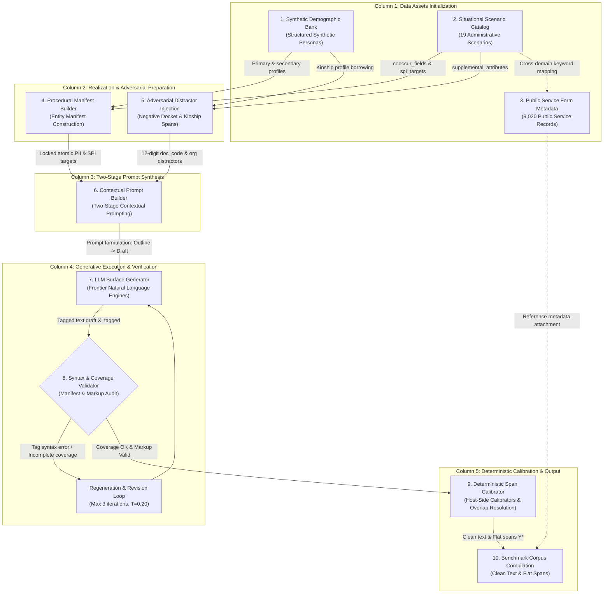

# Section 4: Decoupled Data Synthesis and Deterministic Annotation Pipeline

In this section, we present the end-to-end architecture of the **ViPII** data generation and annotation pipeline. We explain the foundational design invariants—*Controlled Synthesis via Manifest-Guided Value Locking* and *Deterministic Host-Side Calibration*—and systematically trace each stage: demographic profile banking, procedural manifest construction, adversarial distractor synthesis, two-stage contextual prompting, deterministic markup parsing, character-span calibration, conflict resolution, and the benchmark dataset schema.

---

## 4.1. Pipeline Overview and Core Architectural Invariants

Existing privacy datasets frequently suffer from two methodological failure modes: (1) relying on heuristic regular expressions and dictionary lookups over uncurated web scrapes, which yields severe label noise and coordinate shifts; or (2) prompting autoregressive language models to directly predict numeric character offsets, which inevitably triggers index drift due to the non-isomorphism between subword token space and multi-byte Unicode code-point space.

To establish an authoritative benchmark aligned with Decree No. 13/2023/NĐ-CP without exposing genuine citizen data, ViPII adopts a **decoupled synthesis and deterministic annotation paradigm**. The pipeline decouples natural language prose generation from spatial coordinate calculation via two governing technical invariants:

1. **Controlled Synthesis via Manifest-Guided Value Locking**: All sensitive personal identifiers ($\text{PII}$) and sensitive attributes ($\text{SPI}$) are generated and locked deterministically prior to prompt assembly. The generative language model acts strictly as a contextual narrator, weaving natural administrative prose, formal petitions, and dialogue around fixed entity values. The model is explicitly barred from hallucinating new personal identity slots.
2. **Deterministic Server-Side Span Calibration**: Character offsets ($s_i, e_i$) and entity labels are computed entirely on the host server using deterministic algorithmic operators (Unicode lookaround matching, sentence-bounded trigger windowing, and a single-pass LIFO stack parser). The language model is never tasked with predicting numeric coordinates, entirely eliminating coordinate hallucination.

Figure 4.1 illustrates the complete 10-node operational flow structured across five functional columns.


*Figure 4.1: The authoritative 10-node operational flow of the ViPII decoupled data synthesis and deterministic annotation pipeline.*

---

## 4.2. Synthetic Demographic Bank and Metadata Sources

The generation pipeline is grounded in three foundational data repositories, engineered to provide representative demographic and administrative variation without incorporating any genuine private citizen records.

### Synthetic Demographic Bank
The demographic core provides a repository of synthetic citizen profiles constructed to supply varied demographic inputs for prompt synthesis. Each record contains structured personal attributes covering the statutory Basic PII and Sensitive SPI categories:
* `profile_id`: Unique identifier for each synthetic citizen persona.
* `fields`: Structured attributes including personal names, dates of birth, administrative address components, and civil identifiers (e.g., Citizen Identity Card numbers generated following official structural format rules with test prefixes).
* `consistency`: Coherence rules ensuring internal consistency across attributes, such as birth years aligning with identity number formats and realistic age-conditional civil attributes.

#### Onomastic and Regional Representation
To ensure natural linguistic diversity across Vietnamese administrative contexts, the demographic bank incorporates diverse Vietnamese onomastic patterns—spanning common single surnames, compound family names, and diverse regional naming traditions—alongside administrative locations across northern, central, and southern Vietnam. Rather than relying on rigid templates, this profile repository supplies varied personal attributes across documents, preventing repetitive persona patterns.

### Situational Scenario Catalog
Public administration records typically reveal personal disclosures in response to specific administrative motivations. The catalog defines **19 canonical situational scenarios** spanning civil petitions, administrative appeals, social assistance applications, judicial records, labor disputes, and clinical registrations. Each scenario specifies:
* `cooccur_fields`: Canonical civil identification fields routinely required for procedural dossiers (e.g., `full_name`, `cccd`, `phone`, `address`).
* `spi_targets`: Specific sensitive attributes naturally elicited by the procedure (e.g., `health_status` in medical assistance petitions; `criminal_record` in judicial relief declarations; `private_life` in poverty certification).
* `register`: Required stylistic formality (`administrative`, `third_person`, or `dialogue`).

### Administrative Form Reference Metadata
To reflect genuine administrative procedure without biasing generation, the system curates **9,020 real-world public service form metadata profiles** across ministerial domains (Justice, Public Security, Health, Transport). Crucially, **raw administrative templates are not pasted into generator prompts**, as verbatim templates degrade narrative fluency and bloat context windows. Instead, form identifiers, official procedural headings, and administrative competence tiers are injected as **reference metadata attached to the output record**, grounding the synthetic document within authentic legal administrative workflows.

---

## 4.3. Procedural Manifest Construction

Before invoking the language model, the pipeline deterministically constructs an operational entity manifest, extracting and formatting the entity values that must appear in the final text.

```
       Synthetic Persona           Situational Scenario
       (Citizen Profile)           (Medical Assistance)
               │                            │
               └─────────────┬──────────────┘
                             ▼
              Procedural Manifest Construction
                             │
            ┌────────────────┴────────────────┐
            ▼                                 ▼
   Primary Manifest Items             Adversarial Realization
   - cccd: "001095012345"             - doc_code: "104928374619" (num12)
   - phone: "0983123456"              - org: "UBND Phường Mai Dịch"
   - dob: "12/04/1995"                - kin_name: "Nguyễn Văn Bình" (subject: father)
   - spi: health_status [SENTINEL]
```

The manifest builder performs three essential functions:
1. **Field Selection and Sentinel Assignment**: Intersects profile fields with scenario requirements (`cooccur_fields` $\cup$ `spi_targets`). Structured civil fields receive their concrete string values from the profile. Free-form narrative attributes (such as `health_status` or `private_life`) are assigned the runtime token `[[LLM_GENERATE]]`, instructing the generator to synthesize an appropriate narrative clause within the scenario context while wrapping it in corresponding markup tags.
2. **Surface Variant Expansion**: Generates canonical surface variants for structured credentials (e.g., rendering `cccd` with standard spacing `001 095 012345` or contiguous `001095012345`; rendering phone numbers with domestic `09x` or international `+84` prefixes) so that downstream matching algorithms account for natural syntactic variations.
3. **Onomastic Decomposition Preparation**: Decomposes the primary citizen name into sub-tokens (`family_name`, `middle_name`, `given_name`) via rule-based name decomposition, registering derived items in the manifest to facilitate post-hoc span resolution.

---

## 4.4. Adversarial Distractors and Multi-Subject Realization

A common vulnerability in entity extraction and de-identification systems is the reliance on simplistic surface regularities (e.g., treating any 12-digit numeric sequence as a Citizen ID). To enforce robust contextual discrimination, the manifest generation procedure synthesizes three classes of adversarial distractors:

### 1. 12-Digit Non-PII Administrative Document Codes (`doc_code` of type `num12`)
The generator injects procedural dossier identifiers, dispatch numbers, and receipt barcodes structured as 12-digit numeric strings:
$$\text{doc\_code} = \sum_{i=0}^{11} d_i \cdot 10^{11-i}, \quad d_i \in \{0, \dots, 9\}$$
In prompt instructions, these sequences are explicitly labeled as procedural document identifiers (`Mã hồ sơ tiếp nhận: «104928374619»`). Models must examine the surrounding lexical context (distinguishing *"Mã hồ sơ số..."* from *"Số định danh cá nhân..."*) rather than firing purely on digit count.

### 2. Multi-Subject Kinship Entities (`subject: other`)
Administrative declarations frequently reference family members, legal guardians, or guarantors. The pipeline dynamically samples secondary profiles from the bank to inject kinship entities (e.g., a father's name, spouse's phone number, or dependent child's birth date). These entities are registered in the manifest with an explicit subject tag (`subject: "father"`, `subject: "spouse"`), evaluating whether models de-identify secondary individuals while preserving contextual role relations.

### 3. Affirmations of Clean Judicial Records
Under Article 2.4(g) of Decree 13, criminal records constitute Sensitive SPI. However, standard public administration routinely requires citizens to state that they *possess no criminal record* (e.g., *"Tôi cam đoan không có tiền án tiền sự"*). Labeling clean affirmations as sensitive criminal records causes catastrophic over-redaction. The manifest builder explicitly suppresses `criminal_record` annotations when the narrative context dictates a clean declaration, injecting a synthetic Judicial Record Certificate serial number instead.

---

## 4.5. Two-Stage Contextual Prompting and Revision

To generate natural administrative prose while preserving 100% manifest adherence, generation follows a structured prompting strategy:

```
                  ┌──────────────────────────────────────────────┐
                  │            STAGE 1: DRAFT GENERATION         │
                  │ - Full manifest entity injection             │
                  │ - Prompt: T = 0.85 (Attempt 1) -> 0.70 (2,3) │
                  │ - Mandatory anchor tags: ⟦field⟧...⟦/field⟧  │
                  └──────────────────────┬───────────────────────┘
                                         │
                                         ▼
                  ┌──────────────────────────────────────────────┐
                  │            INTERMEDIATE DRAFT X_tagged       │
                  └──────────────────────┬───────────────────────┘
                                         │
                         ┌───────────────┴───────────────┐
                         ▼                               ▼
                 [Coverage OK & Valid]           [Missing / Invalid]
                         │                               │
                         │                               ▼
                         │               ┌──────────────────────────────┐
                         │               │  STAGE 2: REVISION LOOP      │
                         │               │  Low Temperature (T = 0.20)  │
                         │               │  Fix tags & re-insert fields │
                         │               │  Up to 3 total attempts      │
                         │               └───────────────┬──────────────┘
                         │                               │
                         ▼                               ▼
                  ┌──────────────────────────────────────────────┐
                  │          PASSED TO DETERMINISTIC PARSER      │
                  └──────────────────────────────────────────────┘
```

### Stage 1: Narrative Prose Drafting
The generator model is supplied with the citizen's profile attributes, the procedural context from the scenario catalog, and the required stylistic register (`administrative`, `third_person`, or `dialogue`).
* **Decoding Temperature**: To encourage lexical diversity across documents, initial drafting runs at $T = 0.85$ on attempt 1, decaying to $T = 0.70$ on subsequent attempts.
* **Verbatim Locking**: Atomic identifiers (CCCD, phone number, address) must appear exactly as specified in the manifest.
* **Semantic Tagging**: Free-form sensitive disclosures lacking fixed formats must be wrapped in lightweight semantic delimiters:
  $$\texttt{⟦health\_status⟧} \, \text{chẩn đoán suy thận giai đoạn 3} \, \texttt{⟦/health\_status⟧}$$

### Stage 2: Syntax Revision and Coverage Validation
The intermediate draft $X_{\text{tagged}}$ undergoes programmatic validation across two criteria:
1. **Manifest Coverage Check**: Verifies that all mandatory manifest entities appear within the text.
2. **Tag Syntax Validation**: Verifies that all inline delimiters are balanced and conform to regular expressions.

If an entity is omitted or a tag is malformed, the pipeline invokes an automated **Revision Loop** at low decoding temperature ($T = 0.20$), presenting the model with targeted diagnostic feedback. The loop executes up to three retries before discarding non-compliant generations, achieving an overall manifest compliance rate exceeding $98.5\%$.

---

## 4.6. Deterministic Anchor-Tag Parsing

```
Algorithm 2: Single-Pass Linear-Time LIFO Stack Parser for Inline Markup
──────────────────────────────────────────────────────────────────────────────────
Input  : Tagged text string X_tagged, Sensitivity map SENS
Output : Normalized clean text X_clean, Extracted span set S_anchor, Boolean ok

1:  clean_chars ← []
2:  spans       ← []
3:  stack       ← []   // LIFO stack storing tuples of (field_name, start_offset)
4:  i ← 0, n ← |X_tagged|
5:  while i < n do
6:      if X_tagged[i] = "⟦" then
7:          close_idx ← FindNext("⟧", X_tagged, from = i + 1)
8:          if close_idx ≠ -1 then
9:              tag_content ← Substring(X_tagged, i + 1, close_idx)
10:             if tag_content begins with "/" then       // Closing delimiter ⟦/field⟧
11:                 field ← Substring(tag_content, 1)
12:                 match_idx ← FindLast(stack, field)
13:                 if match_idx ≠ -1 then
14:                     (fld, s_offset) ← stack.pop(match_idx)
15:                     e_offset ← |clean_chars|
16:                     span ← InstantiateSpan(s_offset, e_offset, fld, SENS[fld], "anchor_tag")
17:                     spans ← spans ∪ {span}
18:                 end if
19:                 i ← close_idx + 1
20:                 continue
21:             else if IsValidIdentifier(tag_content) then // Opening delimiter ⟦field⟧
22:                 stack.append((tag_content, |clean_chars|))
23:                 i ← close_idx + 1
24:                 continue
25:             end if
26:         end if
27:     end if
28:     Append(clean_chars, X_tagged[i])
29:     i ← i + 1
30: end while
31: X_clean ← Join(clean_chars)
32: ok ← ("⟦" ∉ X_clean) ∧ ("⟧" ∉ X_clean)
33: return (X_clean, spans, ok)
──────────────────────────────────────────────────────────────────────────────────
```

### Algorithmic Guarantees
1. **Zero Index Drift**: The start coordinate $s_i$ is recorded at the instantaneous length of the output buffer `clean_chars` when the opening tag is parsed. The end coordinate $e_i$ is recorded when the closing tag is matched. Because tags are skipped rather than copied, the resulting offsets map strictly to code points in $X_{\text{clean}}$.
2. **Complete Delimiter Elimination**: Output text $X_{\text{clean}}$ contains no residual tag markers (`⟦` or `⟧`), ensuring downstream models are trained and evaluated on natural prose.

---

## 4.7. Deterministic Character-Span Calibration

Following anchor tag extraction, the pipeline calibrates ground-truth spans for the remaining structured fields on $X_{\text{clean}}$ using three complementary algorithmic matchers:

### 1. Guarded Verbatim Lookaround Matching
Applied to atomic identifiers (`cccd`, `phone`, `email`, `passport_number`, `driver_license`, `vehicle_plate`, `tax_code`, `bank_account`, `social_insurance_no`, `health_insurance_no`, `address`, `full_name`). The algorithm compiles Unicode-aware zero-width lookaround boundaries around normalized surface strings:
$$R(v) = \texttt{(?<!\textbackslash{}w)} + \text{re.escape}(\text{NFC}(v)) + \texttt{(?!\textbackslash{}w)}$$
Boundary assertions prevent substring false matches (e.g., matching a 4-digit tax suffix inside a 10-digit number).

### 2. Cue-Context Disambiguation
Applied to polysemous and homographic fields (`dob`, `gender`, `marital_status`, `nationality`, `ethnicity`, `religion`, `political_view`). The matcher identifies candidate surface strings and scans backwards through a sliding window of at most $W = 80$ characters, strictly terminated by sentence boundaries (`.`, `;`, `\n`, `!`, `?`):
$$\text{Valid}(v) \Longleftrightarrow \exists c \in \mathcal{C}_{\text{cue}}(f) \quad \text{in clause segment preceding } v$$
This mechanism reliably differentiates demographic declarations (*"dân tộc: Kinh"*) from identical common nouns (*"kinh tế"*), eliminating lexical false positives.

### 3. Name Component Decomposition
Applied to personal names. The matcher operates over proper capitalized name components outside of already claimed spans, requiring co-located title or honorific cues (e.g., *"ông"*, *"bà"*, *"anh"*, *"chị"*, *"tôi tên là"*) or standalone signature lines, mapping disjoint spans for `family_name`, `middle_name`, and `given_name`.

### Table 4.1: Operational Partition of Active Statutory Fields across Calibration Mechanisms

Each statutory field is mapped to its primary calibration mechanism:

| Operational Calibration Mechanism | Basic Personal Data (PII) | Sensitive Personal Data (SPI) |
|:---|:---|:---|
| **1. Guarded Verbatim Lookarounds** (`via: verbatim`) | `full_name`, `address`, `cccd`, `phone`, `email`, `passport_number`, `driver_license`, `vehicle_plate`, `tax_code` | `bank_account`, `social_insurance_no`, `health_insurance_no` |
| **2. Cue-Context Disambiguation** (`via: cue_context`, `date`) | `dob`, `gender`, `marital_status`, `nationality` | `ethnicity`, `religion`, `political_view` |
| **3. Name Decomposition** (`via: name_component`) | `family_name`, `middle_name`, `given_name` | *(None)* |
| **4. Anchor-Tag Stack Parsing** (`via: anchor_tag`) | `name_alias` | `family_relations`, `health_status`, `criminal_record`, `location_data`, `private_life`, `biometric`, `behavioral_data`, `sexual_orientation`, `eid_credentials` |

---

## 4.8. Overlap Resolution in Annotation Execution

Candidate spans produced across different mechanisms are reconciled through a two-stage conflict resolution procedure:

```
   1. Candidate Span Aggregation
      ├── Inviolable Anchor Spans from LIFO Stack Parser
      ├── Verbatim Lookaround Candidate Spans
      └── Cue-Context Disambiguated Candidate Spans
                   │
                   ▼
   2. First Resolution Pass (Candidate Reconciliation)
      • Anchor spans accepted unconditionally
      • Verbatim + Cue candidates sorted descending by length: -(end - start)
      • Greedily accept non-overlapping spans -> Claimed span regions
                   │
                   ▼
   3. Name-Component Disjoint Matching
      • Inspect remaining unclaimed text regions
      • Extract name components with cue and signature verification
                   │
                   ▼
   4. Final Resolution Pass (Global Conflict Resolution)
      • Final flat, non-overlapping ground-truth span set Y*
```

### Algorithmic Specification of Conflict Resolution

Algorithm 1 specifies the exact greedy longest-span match resolution procedure executed during both passes:

```
Algorithm 1: Anchor-First Greedy Longest-Span Match Resolution
──────────────────────────────────────────────────────────────────────────────────
Input  : Candidate span set S_cand, Pre-accepted anchor spans S_anchor
Output : Conflict-free flat ground-truth span set Y*

1:  S_accepted ← Copy(S_anchor)
2:  S_sorted   ← Sort S_cand descending by length (e - s)
3:  for each span s in S_sorted do
4:      has_overlap ← false
5:      for each a in S_accepted do
6:          if (s.start < a.end) ∧ (a.start < s.end) then
7:              has_overlap ← true
8:              break
9:          end if
10:     end for
11:     if ¬has_overlap then
12:         S_accepted ← S_accepted ∪ {s}
13:     end if
14: end for
15: Y* ← Sort S_accepted ascending by start offset
16: return Y*
──────────────────────────────────────────────────────────────────────────────────
```

This deterministic sequence ensures that explicitly delimited anchor tags take precedence, longer structured sequences (e.g., full addresses or multi-word credentials) are preserved over accidental sub-tokens, and name components populate exclusively the valid civil name positions in the text.

---

## 4.9. Benchmark Dataset Output Format

Each document instance in the finalized benchmark corpus is structured with metadata, natural language text, and ground-truth character spans:

```
Figure 4.2: Specimen of an Annotated Benchmark Document Instance in ViPII
┌────────────────────────────────────────────────────────────────────────────────────────────────────────┐
│ DOCUMENT METADATA                                                                                      │
│   profile_id:  "pf_1085"                template:    "Social Assistance Application"                   │
│   track:       "Procedural Form"        model:       "Gemini-3.5-Flash"                                │
│   agency:      "UBND Phường Mai Dịch"   register:    "administrative"                                  │
├────────────────────────────────────────────────────────────────────────────────────────────────────────┤
│ CONTENT (X_raw ≡ X_clean)                                                                              │
│   "Kính gửi UBND Phường Mai Dịch. Tôi tên là Nguyễn Văn Bình, sinh ngày 12/04/1985, số CCCD          │
│    001085012345, cư trú tại Số 15 ngõ 105 Doãn Kế Thiện. Hiện nay tôi mắc suy thận mạn giai đoạn 3,    │
│    hoàn cảnh gia đình đơn thân nuôi mẹ già 82 tuổi..."                                                 │
├────────────────────────────────────────────────────────────────────────────────────────────────────────┤
│ CHARACTER SPANS (Y*) [0-indexed Unicode code points]                                                   │
│   • [27,  33)  family_name      (PII)  via: "name_component"  value: "Nguyễn"                          │
│   • [34,  37)  middle_name      (PII)  via: "name_component"  value: "Văn"                             │
│   • [38,  42)  given_name       (PII)  via: "name_component"  value: "Bình"                            │
│   • [54,  64)  dob              (PII)  via: "cue_context"     value: "12/04/1985"                      │
│   • [74,  86)  cccd             (PII)  via: "verbatim"        value: "001085012345"                    │
│   • [100, 135) address          (PII)  via: "verbatim"        value: "Số 15 ngõ 105 Doãn Kế Thiện"     │
│   • [150, 179) health_status    (SPI)  via: "anchor_tag"      value: "mắc suy thận mạn giai đoạn 3"    │
│   • [200, 234) family_relations (SPI)  via: "anchor_tag"      value: "đơn thân nuôi mẹ già 82 tuổi"    │
└────────────────────────────────────────────────────────────────────────────────────────────────────────┘
```
