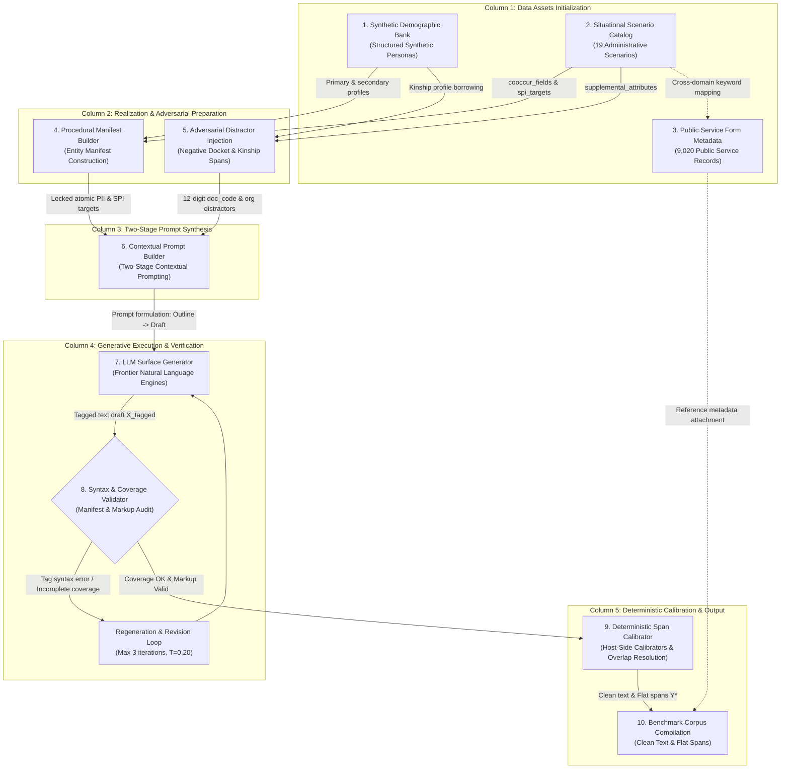

# Section 1: Introduction

The rapid adoption of artificial intelligence in Vietnamese public administration, healthcare, finance, and legal services has increased the need to process documents that contain personal data. Such documents commonly combine structured identifiers—such as citizen identity numbers, telephone numbers, and dates of birth—with context-dependent information, including family circumstances, health status, and location. A system that releases these documents to an external service for analysis may therefore create privacy, governance, and operational risks. At the same time, simply deleting every potentially sensitive string can make an administrative document unusable for search, auditing, case handling, or downstream language processing.

This paper studies **utility-preserving sanitization** for Vietnamese personal data. The objective is not only to identify sensitive spans, but also to remove or replace them while retaining the non-sensitive procedural content and the linguistic coherence of the document. We focus on the terminology of Vietnam's Personal Data Protection Decree (Decree No. 13/2023/NĐ-CP), using `PII` and `SPI` as dataset-level shorthand for the decree's basic and sensitive personal-data tiers, respectively. The legal mapping defines the scope of the benchmark; it is not, by itself, a complete legal-compliance certification for any deployment.

## 1.1. Motivation and Problem Setting

Existing multilingual PII tools provide useful starting points, but their entity inventories and decision rules are not designed around Vietnamese administrative conventions. Vietnamese documents contain identity numbers with local formatting, multi-component personal names, hierarchical addresses, and lexical items whose interpretation depends strongly on nearby cues. For example, *Nam* may denote a person's gender, a geographic region, or part of a name, while *Kinh* may denote an ethnicity or occur inside an unrelated phrase. Sensitive information such as health or family circumstances is often expressed as a long narrative clause rather than a short, regular expression match.

These characteristics create two coupled technical requirements. First, a benchmark must represent the relevant legal fields and provide reliable character-level boundaries. Second, a sanitization system must optimize two objectives simultaneously: reducing residual privacy leakage and avoiding destructive over-redaction. ViPII addresses the first requirement through controlled synthetic generation and deterministic character-span calibration, and evaluates the second through a dual privacy–utility metric suite.

## 1.2. Research Gaps

We identify four fundamental gaps that motivate this study:

1. **Regulatory and taxonomy mismatch.** Widely used PII benchmarks and commercial scanners are generally organized around Western frameworks (such as GDPR or HIPAA). They fail to model Vietnam's Personal Data Protection Decree (Decree No. 13/2023/NĐ-CP), which strictly dichotomizes personal data into Basic Personal Data (`PII`) and Sensitive Personal Data (`SPI`) across distinct administrative and liability tiers.
2. **Vietnamese administrative and linguistic specificity.** Vietnamese administrative documentation features unique linguistic structures: multi-part onomastics (compound surnames and patronymics), four-tiered administrative addresses, and polysemous lexical homographs (where tokens such as *Kinh* or *Nam* fluctuate between sensitive attributes and common nouns depending on clausal context).
3. **Coordinate drift in synthetic data generation.** While privacy regulations prohibit redistributing authentic citizen records, current synthetic annotation methods encounter a fundamental failure mode: prompting autoregressive language models to predict character offsets concurrently with prose generation inevitably triggers index drift and hallucinated boundaries due to subword tokenization discrepancies.
4. **Viability of compact models for privacy-preserving local deployment.** Article 25 of Decree 13 imposes stringent restrictions on cross-border personal data transfers, making reliance on external cloud-scale LLM APIs legally precarious for sensitive public sectors. However, the empirical capability of compact, fine-tuned Small Language Models (SLMs $\le 2\text{B}$ parameters) to perform reliable, on-premise utility-preserving sanitization remains unestablished under a common Vietnamese evaluation standard.

## 1.3. The ViPII Approach: Bridging Gaps to Solutions

To systematically bridge these four research gaps, we propose **ViPII**, an end-to-end benchmark and data-synthesis framework specifically designed for Vietnamese PII/SPI detection and utility-preserving sanitization. The framework is structured around four interconnected methodological pillars directly corresponding to the identified gaps:

1. **Statutory Taxonomy and Demographic Realism (Addressing Gaps 1 & 2):** ViPII formalizes an operational taxonomy grounded in Articles 2–4 of Decree 13/2023/NĐ-CP. To reflect authentic Vietnamese administrative and linguistic realities without exposing genuine citizen records, we build an underlying demographic engine covering representative Vietnamese onomastic conventions, administrative jurisdictions across Vietnam, and 19 canonical administrative scenario archetypes.
2. **Decoupled Synthesis and Deterministic Annotation Pipeline (Addressing Gap 3):** To overcome the coordinate drift catastrophe, ViPII enforces a strict separation of concerns between natural language generation and spatial coordinate calibration. Target PII/SPI values are deterministically locked in programmatic manifests *prior* to generation. The generator LLM acts strictly as a contextual narrator, while host-side algorithmic operators (Unicode-aware verbatim lookarounds, sentence-bounded cue windows, name decomposition, and a single-pass LIFO stack parser) calibrate exact character offsets on clean text, guaranteeing 100% boundary fidelity by construction.
3. **Dual-Objective Privacy–Utility Metric Suite (Operationalizing Task 2):** Rather than evaluating de-identification solely through privacy masking recall, ViPII establishes an objective evaluation protocol that simultaneously penalizes residual privacy leakage ($\mathcal{L}_{\text{privacy}} = 1 - \text{SanRec}$) and destructive over-redaction ($\mathcal{O}_{\text{redact}} = 1 - \text{RetRec}$). The composite benchmark metric, $\text{FULL}$, requires zero residual leakage and complete operational slot preservation at the document level.
4. **Empirical Benchmarking for On-Premise SLM Deployment (Addressing Gap 4):** The framework compiles **51,880 realized documents** and **524,655 annotated spans**, comprising a 47,880-document synthesis pool and an isolated 4,000-document held-out evaluation benchmark. This corpus provides the first controlled testbed to evaluate compact fine-tuned SLMs (Qwen3-1.7B, Qwen3-0.6B, and Qwen3.5-0.8B) against unadapted baselines and commercial frontier LLMs for resource-constrained, Decree-13-compliant local deployment.

## 1.4. Contributions

By operationalizing the ViPII approach, this paper delivers four primary scientific and practical contributions:

1. **A Vietnamese legal-scope benchmark.** We introduce the first comprehensive, Decree-13-compliant benchmark covering statutory Basic PII and Sensitive SPI categories across 51,880 documents and 524,655 character spans, accurately capturing Vietnamese administrative formats and onomastic structures.
2. **A decoupled synthesis and deterministic annotation pipeline.** We present and validate a decoupled, reproducible data-construction pipeline that completely eliminates index drift and coordinate hallucination by combining programmatic manifests with deterministic host-side span calibrators.
3. **A unified privacy–utility evaluation framework.** We formalize a rigorous evaluation protocol with fine-grained span, field, and document-level metrics (including the strict $\text{FULL}$ success criterion), establishing a standardized benchmark for Vietnamese utility-preserving sanitization.
4. **Comprehensive empirical evidence for compact SLMs.** Through extensive empirical evaluation on the held-out benchmark, we demonstrate that task-specific fine-tuning transforms compact SLMs into highly capable sanitization engines. The fine-tuned Qwen3-1.7B model achieves **73.28% `SanRec`** and **71.86% `FULL`**, while Qwen3-0.6B and Qwen3.5-0.8B achieve 72.88% (70.34% `FULL`) and 71.80% (70.31% `FULL`) respectively. All three fine-tuned compact models outperform larger general-purpose baselines (including commercial Gemini-3.6-Flash-High at 64.82% `FULL`) on strict end-to-end sanitization while remaining fully deployable on local, on-premise hardware.

## 1.5. Scope and Organization

The study focuses on Vietnamese text generated for administrative, legal, healthcare, and related social contexts. It evaluates the quality of synthetic annotations and the behavior of sanitization systems under the benchmark protocol; it does not claim that synthetic data fully represents all real-world documents or that a model score alone establishes legal compliance. Section 2 reviews related work. Section 3 defines the statutory legal taxonomy, formal computational tasks, and dual-objective evaluation metrics. Section 4 describes the decoupled data synthesis and deterministic annotation pipeline, and Section 5 reports corpus statistics and quality diagnostics. Section 6 presents the experimental comparison, automated benchmark, and human evaluation. Section 7 provides in-depth component ablations, distractor robustness tests, and error analysis across entity classes. Section 8 examines ethical considerations, limitations, and reproducibility guidelines. Finally, Section 9 concludes the paper and outlines future research directions.

---

# Section 2: Related Work

Research on personal-data protection in language technologies spans entity detection, de-identification, synthetic data generation, and privacy-aware model deployment. These lines of work are closely coupled but address distinct dimensions of the privacy problem. An entity detection system identifies spans that may reveal an individual; a de-identification system transforms or masks those spans; a synthetic data pipeline determines how training examples can be created without exposing genuine records; and a deployment strategy balances model capability against data-residency requirements. 

To systematically position our contributions with respect to the four research gaps identified in Section 1.2, this section reviews prior literature across four corresponding thematic areas: (1) PII detection systems and statutory frameworks; (2) Vietnamese NER and administrative linguistic nuances; (3) synthetic data generation and coordinate calibration; and (4) utility-preserving sanitization and compact on-premise language models.

---

## 2.1. PII Detection Systems and Statutory Taxonomies (Gap 1)

Early practical personal identifiable information (PII) systems were largely engineered around deterministic pattern matching, gazetteers, and modular recognizers. Frameworks such as Microsoft Presidio, Google Cloud Data Loss Prevention (DLP), Philter, and Amnesia illustrate various integrations of regular expressions, dictionaries, and general-purpose sequence taggers for identifying or masking sensitive tokens. These tools provide production-oriented engineering value, offering configurable entity recognizers and high throughput for structured credentials.

However, existing PII systems are predominantly organized around Western regulatory and operational regimes, such as the European Union's General Data Protection Regulation (GDPR) or the United States' Health Insurance Portability and Accountability Act (HIPAA). Consequently, their default taxonomies and decision policies do not reflect the statutory architecture of Vietnam's Personal Data Protection Decree (Decree No. 13/2023/NĐ-CP). Decree 13 imposes a strict operational distinction between Basic Personal Data (`PII`, Articles 2.3 & 3) and Sensitive Personal Data (`SPI`, Articles 2.4 & 4), each carrying disparate compliance obligations, processing liabilities, and cross-border transfer restrictions. General-purpose PII scanners lack the category inventory necessary to operationalize this binary statutory tiering, highlighting the need for a dedicated, legally grounded Vietnamese benchmark.

---

## 2.2. Vietnamese NER and Administrative Linguistic Nuances (Gap 2)

Vietnamese named-entity recognition (NER) resources provide an indispensable computational foundation for processing Vietnamese text. Benchmarks such as VLSP NER and PhoNER have established standardized sequence labeling corpora for news, social media, and web texts, while pretrained language models such as PhoBERT have substantially advanced token-level representation learning. 

Despite these advances, standard Vietnamese NER paradigms exhibit critical limitations when adapted to personal data protection in administrative contexts:
1. **Scope and Entity Typology**: Conventional NER benchmarks focus on proper names categorized into coarse classes (Persons, Organizations, Locations, Miscellaneous). In contrast, personal data compliance encompasses high-risk numeric credentials (citizen identity cards, tax codes, insurance books), semi-structured demographic attributes (marital status, birth dates), and expansive narrative disclosures (medical conditions, judicial histories, economic hardship) that do not conform to proper-name conventions.
2. **Onomastic and Morphosyntactic Specificity**: Vietnamese personal names exhibit multi-part onomastic structures (compound surnames and regional naming traditions) where individual tokens frequently function as common nouns.
3. **Lexical Ambiguity and Clausal Homographs**: In isolating languages like Vietnamese, polysemous monosyllabic tokens can shift between sensitive personal data and common nouns depending on contextual cues (e.g., *Kinh* denoting an ethnic group versus *kinh tế* meaning economy; *Nam* denoting civil gender versus a geographic direction). Standard flat token classification models routinely over-predict or misclassify such ambiguous spans in the absence of explicit, sentence-bounded contextual cue disambiguation.

---

## 2.3. Synthetic Data Generation and Coordinate-Accurate Annotation (Gap 3)

Because authentic administrative, healthcare, and judicial dossiers cannot be lawfully redistributed under privacy regulations, synthetic corpus synthesis has become central to privacy-preserving NLP. Prior studies have explored template-based synthesis, schema-driven generation, and profile-guided generation to produce artificial corpora without exposing real individuals. In particular, the PRIVASIS framework demonstrated that conditioning generative language models on structured demographic profiles and situational contexts can yield large-scale parallel de-identification datasets.

Complementary to generative synthesis, programmatic labeling frameworks (such as Snorkel) apply heuristic labeling functions and weak supervision to reduce manual annotation costs. While effective for tabular and structured pattern extraction, programmatic labeling over free-form synthetic text encounters a fundamental obstacle: **the coordinate drift catastrophe**. When an autoregressive language model is prompted to simultaneously generate natural prose and output character indices or bounding offsets, variations in Unicode code-point normalization (NFC vs. NFD) and subword tokenization boundaries inevitably lead to shifted coordinates and boundary hallucinations. 

ViPII resolves this failure mode by enforcing a **decoupled architecture with manifest-guided value locking**: target PII/SPI attributes are locked deterministically at the host runtime layer before generation, relegating the LLM strictly to natural prose narration, while deterministic host-side algorithmic operators calibrate character spans post-hoc on clean normalized text.

---

## 2.4. Utility-Preserving Sanitization and Compact SLM Deployment (Gap 4)

Traditional text de-identification frequently relies on destructive redaction, replacing detected entities with generic masks or completely deleting sensitive phrases. While minimizing residual privacy leakage, aggressive redaction impairs grammatical coherence, destroys procedural context, and degrades downstream document utility for search, auditing, and administrative processing. 

Recent literature has consequently reframed de-identification as a **utility-preserving conditional generation task**, wherein a model must simultaneously eliminate sensitive information while preserving non-sensitive operational content and linguistic fluency. Evaluating this trade-off requires joint multi-dimensional metrics that penalize both residual privacy leakage ($\mathcal{L}_{\text{privacy}}$) and destructive over-redaction ($\mathcal{O}_{\text{redact}}$).

Concurrently, the deployment of language models for sensitive document processing is constrained by data governance and computational resources. While commercial cloud-scale frontier LLMs exhibit strong general reasoning, transmitting unredacted public sector records to third-party or foreign cloud APIs creates serious regulatory risks under Article 25 of Decree 13 (governing cross-border data transfers) as well as latency and operational costs. Compact Small Language Models (SLMs $\le 2\text{B}$ parameters), fine-tuned specifically for local on-premise execution, offer an auditable, cost-effective alternative. However, empirical comparisons evaluating whether fine-tuned compact SLMs can match or exceed commercial frontier baselines on Vietnamese utility-preserving sanitization have remained unavailable. ViPII establishes this controlled empirical comparison under a standardized benchmark protocol.

---

## 2.5. Summary

In summary, while existing literature offers valuable individual components—industrial PII recognizers, Vietnamese NER benchmarks, profile-guided synthetic generation, and utility-aware de-identification—it leaves their intersection unaddressed for the Vietnamese regulatory environment. ViPII bridges this gap: a Decree-13-compliant Vietnamese benchmark, synthesized through decoupled generation with deterministic host-side span calibration, and evaluated on the dual objectives of privacy defense and utility retention across compact fine-tuned SLMs and frontier baselines. 

Section 3 formalizes this task definition, the statutory taxonomy, and the operational representations.

---

# Section 3: Legal Taxonomy, Task Formulation, and Evaluation Framework

In this section, we ground the operational taxonomy of **ViPII** in the statutory requirements of Vietnam's Personal Data Protection Decree (Decree No. 13/2023/NĐ-CP), formulate the dual computational tasks of span-level detection and generative utility-preserving sanitization, and define the dual-objective evaluation metrics governing privacy defense and content retention.

---

## 3.1. Statutory Scope and the Decree-13 Taxonomy

### Statutory Context and Legal Mandate
The taxonomy of ViPII is grounded directly in the legal framework of the Socialist Republic of Vietnam, centered upon **Decree No. 13/2023/NĐ-CP on Personal Data Protection (PDPD)**, promulgated by the Government of Vietnam on April 17, 2023, and effective July 1, 2023:
* **Articles 2(3) and 3**: Formally define and itemize the classes comprising Basic Personal Data ($\text{PII}$).
* **Articles 2(4) and 4**: Formally define and itemize the classes comprising Sensitive Personal Data ($\text{SPI}$).
* **Article 8**: Stipulates strict statutory prohibitions against the illegal processing, dissemination, or unauthorized disclosure of personal data.
* **Article 25**: Imposes stringent regulatory conditions on cross-border transfers of Vietnamese citizen data, establishing a pressing national requirement for compact, air-gapped, on-premise sanitization models.

### The Two Statutory Personal Data Tiers
Under Decree 13, personal data is strictly dichotomized into two administrative and liability tiers:
* **Basic Personal Data ($\text{PII}$)**: Identifiers that uniquely or collectively identify an individual in civil, administrative, and commercial spheres.
* **Sensitive Personal Data ($\text{SPI}$)**: Information intimately linked to individual privacy, rights, and liberties which, if breached, directly imperils personal safety, social standing, financial security, or civil rights.

Table 3.1 details the operational taxonomy of ViPII structured across statutory clusters. Exhaustive statutory citations and canonical Vietnamese examples are provided in Appendix A.

### Table 3.1: Statutory Categorization under the ViPII Decree-13 Taxonomy

| Statutory Tier | Category Clusters | Field Identifiers ($f \in \mathcal{F}$) |
|:---|:---|:---|
| **Basic Personal Data**<br/>(**PII** - Decree 13, Art. 2(3) & 3) | **Civil & Identity Numbers** | `cccd` (Citizen ID 12 digits), `phone`, `email`, `passport_number`, `driver_license`, `vehicle_plate`, `tax_code` |
| | **Civil Identifiers & Names** | `full_name`, `family_name`, `middle_name`, `given_name`, `address`, `name_alias` |
| | **Demographic Attributes** | `dob` (Date of birth), `gender`, `marital_status`, `nationality` |
| **Sensitive Personal Data**<br/>(**SPI** - Decree 13, Art. 2(4) & 4) | **Financial & Public Registry** | `bank_account`, `social_insurance_no` (BHXH), `health_insurance_no` (BHYT), `eid_credentials` (VNeID) |
| | **Belief, Origin & Tracking** | `ethnicity`, `religion`, `political_view`, `location_data`, `behavioral_data` |
| | **Vulnerable Life & Health** | `health_status`, `criminal_record`, `private_life`, `family_relations`, `sexual_orientation`, `biometric` |

---

## 3.2. Formal Task Formulation

### Input Representation and Unicode Coordinate Space
Let $\mathcal{C}$ denote the finite alphabet of Unicode code points. To ensure strict canonical equivalence across Vietnamese combining diacritics and varying Input Method Editor (IME) representations, all text instances are normalized to Unicode Normalization Form C (NFC). An input document is represented as an ordered sequence of $N$ Unicode code points:
$$X_{\text{raw}} = (c_1, c_2, \dots, c_N), \quad c_t \in \mathcal{C}$$

Within $X_{\text{raw}}$, sensitive personal data instances reside as contiguous subsequences, termed **character spans**. A ground-truth personal data span is formally denoted by the tuple:
$$y_i = \bigl(s_i, e_i, f_i, l_i\bigr)$$
where:
* $s_i \in \{0, \dots, N-1\}$ is the 0-indexed inclusive start code-point offset in Python string representation.
* $e_i \in \{1, \dots, N\}$ is the 0-indexed exclusive end code-point offset ($s_i < e_i$).
* $f_i \in \mathcal{F}$ designates the fine-grained attribute category selected from the statutory inventory ($\mathcal{F} = \{f_1, \dots, f_{K}\}$).
* $l_i \in \{\text{PII}, \text{SPI}\}$ denotes the statutory classification under Decree 13.

> **Measurement Invariant**: Character offsets in ViPII are defined strictly over **Unicode code points after NFC normalization** ($0 \le s_i < e_i \le \text{len}(X)$ in Python 3). They are strictly distinct from multi-byte UTF-8 byte offsets (where Vietnamese accented characters occupy 2–3 bytes) and from tokenizer-dependent subword BPE token indices.

```
                                  ┌─────────────────────────────────────────────────────────────┐
                                  │                     Input: Raw Text X_raw                   │
                                  └──────────────────────────────┬──────────────────────────────┘
                                                                 │
                                 ┌───────────────────────────────┴──────────────────────────────┐
                                 ▼                                                              ▼
                  ┌──────────────────────────────┐                              ┌──────────────────────────────┐
                  │           TASK 1:            │                              │           TASK 2:            │
                  │     Span-level detection     │                              │      Utility-preserving      │
                  │        and annotation        │                              │         sanitization         │
                  └──────────────┬───────────────┘                              └──────────────┬───────────────┘
                                 │                                                             │
                                 ▼                                                             ▼
                  ┌──────────────────────────────┐                              ┌──────────────────────────────┐
                  │   Character Spans Y_hat      │                              │     Sanitized Text X_san     │
                  │ {(s, e, field, PII/SPI)}     │                              │ Tag Masking / Synthetic Swap │
                  └──────────────────────────────┘                              └──────────────┬───────────────┘
                                                                                               │
                                                                 ┌─────────────────────────────┴───────────────┐
                                                                 ▼                                             ▼
                                                  ┌──────────────────────────────┐              ┌──────────────────────────────┐
                                                  │       Privacy Defense        │              │     Utility Preservation     │
                                                  │  Residual Privacy Leakage ≈0 │              │       Over-redaction ≈ 0     │
                                                  │    (High Sanitization Rec)   │              │     (High Retention Rec)     │
                                                  └──────────────────────────────┘              └──────────────────────────────┘
```

### Canonical Schema: Flat, Non-Overlapping Spans and Name Projection
The benchmark ground truth $\mathcal{Y}^*$ strictly follows a **flat, non-overlapping schema**:
$$\mathcal{Y}^* = \{y_1^*, y_2^*, \dots, y_M^*\}, \quad \text{such that } e_i^* \le s_j^* \quad \forall i < j$$

To reconcile flat sequence evaluation with the hierarchical nature of Vietnamese civil names (where a full name encompasses a surname, middle name, and given name), ViPII formalizes a **Disjoint Name Projection Operator** $\Pi_{\text{name}}$.

Let $y_{\text{full}} = (s, e, \text{'full\_name'}, \text{'PII'})$ denote a composite civil name span. The operator $\Pi_{\text{name}}(y_{\text{full}}, X)$ projects $y_{\text{full}}$ onto a sequence of contiguous, non-overlapping sub-spans:
$$\Pi_{\text{name}}(y_{\text{full}}, X) = \{(s_{\text{fam}}, e_{\text{fam}}, \text{'family\_name'}, \text{'PII'}), (s_{\text{mid}}, e_{\text{mid}}, \text{'middle\_name'}, \text{'PII'}), (s_{\text{giv}}, e_{\text{giv}}, \text{'given\_name'}, \text{'PII'})\}_{\text{non-empty}}$$
satisfying the boundary ordering:
$$s = s_{\text{fam}} < e_{\text{fam}} \le s_{\text{mid}} < e_{\text{mid}} \le s_{\text{giv}} < e_{\text{giv}} = e$$

The fine-grained ground-truth representation $\mathcal{Y}^*_{\text{decomposed}}$ is obtained via disjoint projection:
$$\mathcal{Y}^*_{\text{decomposed}} = \Bigl(\mathcal{Y}^* \setminus \{y \in \mathcal{Y}^* \mid y.\text{field} = \text{'full\_name'}\}\Bigr) \cup \bigcup_{y \in \mathcal{Y}^*, y.\text{field} = \text{'full\_name'}} \Pi_{\text{name}}(y, X)$$

This formulation ensures that both the composite view $\mathcal{Y}^*$ and the decomposed view $\mathcal{Y}^*_{\text{decomposed}}$ are strictly flat partitions over the code-point space, avoiding invalid nested span collisions during sequence evaluation.

### Task 1: Span-Level Detection and Annotation
In this structured prediction mode, a model $g: \mathcal{X} \to 2^{\mathcal{S}}$ ingests $X_{\text{raw}}$ and predicts a set of character spans:
$$\hat{\mathcal{Y}} = \bigl\{\hat{y}_j = (\hat{s}_j, \hat{e}_j, \hat{f}_j, \hat{l}_j)\bigr\}_{j=1}^{\hat{M}}$$

A predicted span $\hat{y}_j$ is evaluated as a strict exact match against a ground-truth entity $y_i^*$ if and only if:
$$\hat{s}_j = s_i^* \quad \land \quad \hat{e}_j = e_i^* \quad \land \quad \hat{f}_j = f_i^* \quad \land \quad \hat{l}_j = l_i^*$$

### Task 2: Utility-Preserving Sanitization
In this generative de-identification mode, an end-to-end model $\mathcal{M}: \mathcal{X} \to \mathcal{X}$ transforms $X_{\text{raw}}$ directly into a **sanitized text**:
$$X_{\text{sanitized}} = \mathcal{M}(X_{\text{raw}})$$

De-identification follows two operational paradigms:
1. **Tag Masking**: Replacing sensitive spans $X_{\text{raw}}[s_i:e_i]$ with standardized category mask tokens:
   $$\tau(f_i) \in \bigl\{\texttt{[HỌ\_TÊN]}, \texttt{[CCCD]}, \texttt{[SỐ\_ĐIỆN\_THOẠI]}, \texttt{[TÌNH\_TRẠNG\_SỨC\_KHỎE]}, \dots\bigr\}$$
2. **Consistent Synthetic Replacement**: Substituting sensitive spans with synthetic values from an isolated demographic database, preserving global grammatical agreement and referential coherence across documents.

---

## 3.3. Evaluation Objectives: Privacy Defense versus Utility Retention

The evaluation of utility-preserving de-identification balances privacy defense against information utility. We formalize this duality conceptually through **residual privacy leakage** and **over-redaction**.

Let $\mathcal{P}(X_{\text{raw}})$ denote the set of ground-truth sensitive personal data units (spans or attributes) contained within document $X_{\text{raw}}$, and let $\mathcal{U}(X_{\text{raw}})$ denote the set of non-sensitive operational, procedural, administrative, and syntactic information units necessary to preserve document utility.

### Residual Privacy Leakage
When a sanitization model processes $X_{\text{raw}}$, any personal data entity belonging to $\mathcal{P}(X_{\text{raw}})$ that remains identifiable or recoverable in $X_{\text{sanitized}}$ constitutes an empirical privacy failure.

Let $\mathbb{I}_{\text{leak}}(y_i^*, X_{\text{sanitized}})$ be an indicator function evaluated under an explicit verification protocol, returning 1 if the sensitive content of ground-truth span $y_i^*$ persists in $X_{\text{sanitized}}$ in unredacted or recoverable form, and 0 if successfully sanitized. The empirical **Residual Privacy Leakage Rate** ($\mathcal{L}_{\text{privacy}}$) across a test corpus of $D$ documents is expressed as:

$$\mathcal{L}_{\text{privacy}} = 1 - \text{SanRec} = \frac{\sum_{d=1}^D \sum_{i=1}^{M_d} \mathbb{I}_{\text{leak}}(y_{d,i}^*, X_{d,\text{sanitized}})}{\sum_{d=1}^D M_d}$$

where $\text{SanRec}$ denotes **Sanitization Recall**. Field-level macro-averages ($\text{SanAtt}$) and document-level averages ($\text{SanA/R}$) provide granular insight into statutory recall across individual fields and records.

### Over-Redaction and Utility Retention
Conversely, if the sanitization model aggressively suppresses or deletes non-sensitive administrative content, procedural instructions, legal references, or grammatical connectives ($u_k \in \mathcal{U}(X_{\text{raw}})$), the document's downstream utility is compromised.

Let $\mathbb{I}_{\text{suppress}}(u_k, X_{\text{sanitized}})$ indicate whether a valid operational information token $u_k \in \mathcal{U}(X_{\text{raw}})$ has been erroneously masked or destroyed. The **Over-Redaction Rate** ($\mathcal{O}_{\text{redact}}$) is defined conceptually as:

$$\mathcal{O}_{\text{redact}} = 1 - \text{RetRec} = \frac{\sum_{d=1}^D \sum_{k=1}^{K_d} \mathbb{I}_{\text{suppress}}(u_{d,k}, X_{d,\text{sanitized}})}{\sum_{d=1}^D K_d}$$

where $\text{RetRec}$ denotes **Retention Recall**. The corresponding field and record metrics—$\text{RetAtt}$ and $\text{RetA/R}$—quantify the preservation of non-sensitive procedural attributes across administrative files.

### Comprehensive Success Metric: $\text{FULL}$
A sanitization system achieves full end-to-end success on a document if and only if it simultaneously incurs zero residual privacy leakage and zero over-redaction of operational slots:

$$\text{FULL} = \frac{1}{D} \sum_{d=1}^D \Biggl[ \prod_{i=1}^{M_d} \bigl(1 - \mathbb{I}_{\text{leak}}(y_{d,i}^*, X_{d,\text{sanitized}})\bigr) \times \prod_{k=1}^{K_d} \bigl(1 - \mathbb{I}_{\text{suppress}}(u_{d,k}, X_{d,\text{sanitized}})\bigr) \Biggr]$$

By uniting privacy defense ($\text{SanRec} \to 1.0$) with utility preservation ($\text{RetRec} \to 1.0$), $\text{FULL}$ establishes a strict, balanced standard for Vietnamese personal data protection.

---

# Section 4: Decoupled Data Synthesis and Deterministic Annotation Pipeline

In this section, we present the end-to-end architecture of the **ViPII** data generation and annotation pipeline. We explain the foundational design invariants—*Controlled Synthesis via Manifest-Guided Value Locking* and *Deterministic Host-Side Calibration*—and systematically trace each stage: demographic profile banking, procedural manifest construction, adversarial distractor synthesis, two-stage contextual prompting, deterministic markup parsing, character-span calibration, conflict resolution, and the benchmark dataset schema.

---

## 4.1. Pipeline Overview and Core Architectural Invariants

Existing privacy datasets frequently suffer from two methodological failure modes: (1) relying on heuristic regular expressions and dictionary lookups over uncurated web scrapes, which yields severe label noise and coordinate shifts; or (2) prompting autoregressive language models to directly predict numeric character offsets, which inevitably triggers index drift due to the non-isomorphism between subword token space and multi-byte Unicode code-point space.

To establish an authoritative benchmark aligned with Decree No. 13/2023/NĐ-CP without exposing genuine citizen data, ViPII adopts a **decoupled synthesis and deterministic annotation paradigm**. The pipeline decouples natural language prose generation from spatial coordinate calculation via two governing technical invariants:

1. **Controlled Synthesis via Manifest-Guided Value Locking**: All sensitive personal identifiers ($\text{PII}$) and sensitive attributes ($\text{SPI}$) are generated and locked deterministically prior to prompt assembly. The generative language model acts strictly as a contextual narrator, weaving natural administrative prose, formal petitions, and dialogue around fixed entity values. The model is explicitly barred from hallucinating new personal identity slots.
2. **Deterministic Server-Side Span Calibration**: Character offsets ($s_i, e_i$) and entity labels are computed entirely on the host server using deterministic algorithmic operators (Unicode lookaround matching, sentence-bounded trigger windowing, and a single-pass LIFO stack parser). The language model is never tasked with predicting numeric coordinates, entirely eliminating coordinate hallucination.

Figure 4.1 illustrates the complete 10-node operational flow structured across five functional columns.


*Figure 4.1: The authoritative 10-node operational flow of the ViPII decoupled data synthesis and deterministic annotation pipeline.*

---

## 4.2. Synthetic Demographic Bank and Metadata Sources

The generation pipeline is grounded in three foundational data repositories, engineered to provide representative demographic and administrative variation without incorporating any genuine private citizen records.

### Synthetic Demographic Bank
The demographic core provides a repository of synthetic citizen profiles constructed to supply varied demographic inputs for prompt synthesis. Each record contains structured personal attributes covering the statutory Basic PII and Sensitive SPI categories:
* `profile_id`: Unique identifier for each synthetic citizen persona.
* `fields`: Structured attributes including personal names, dates of birth, administrative address components, and civil identifiers (e.g., Citizen Identity Card numbers generated following official structural format rules with test prefixes).
* `consistency`: Coherence rules ensuring internal consistency across attributes, such as birth years aligning with identity number formats and realistic age-conditional civil attributes.

#### Onomastic and Regional Representation
To ensure natural linguistic diversity across Vietnamese administrative contexts, the demographic bank incorporates diverse Vietnamese onomastic patterns—spanning common single surnames, compound family names, and diverse regional naming traditions—alongside administrative locations across northern, central, and southern Vietnam. Rather than relying on rigid templates, this profile repository supplies varied personal attributes across documents, preventing repetitive persona patterns.

### Situational Scenario Catalog
Public administration records typically reveal personal disclosures in response to specific administrative motivations. The catalog defines **19 canonical situational scenarios** spanning civil petitions, administrative appeals, social assistance applications, judicial records, labor disputes, and clinical registrations. Each scenario specifies:
* `cooccur_fields`: Canonical civil identification fields routinely required for procedural dossiers (e.g., `full_name`, `cccd`, `phone`, `address`).
* `spi_targets`: Specific sensitive attributes naturally elicited by the procedure (e.g., `health_status` in medical assistance petitions; `criminal_record` in judicial relief declarations; `private_life` in poverty certification).
* `register`: Required stylistic formality (`administrative`, `third_person`, or `dialogue`).

### Administrative Form Reference Metadata
To reflect genuine administrative procedure without biasing generation, the system curates **9,020 real-world public service form metadata profiles** across ministerial domains (Justice, Public Security, Health, Transport). Crucially, **raw administrative templates are not pasted into generator prompts**, as verbatim templates degrade narrative fluency and bloat context windows. Instead, form identifiers, official procedural headings, and administrative competence tiers are injected as **reference metadata attached to the output record**, grounding the synthetic document within authentic legal administrative workflows.

---

## 4.3. Procedural Manifest Construction

Before invoking the language model, the pipeline deterministically constructs an operational entity manifest, extracting and formatting the entity values that must appear in the final text.

```
       Synthetic Persona           Situational Scenario
       (Citizen Profile)           (Medical Assistance)
               │                            │
               └─────────────┬──────────────┘
                             ▼
              Procedural Manifest Construction
                             │
            ┌────────────────┴────────────────┐
            ▼                                 ▼
   Primary Manifest Items             Adversarial Realization
   - cccd: "001095012345"             - doc_code: "104928374619" (num12)
   - phone: "0983123456"              - org: "UBND Phường Mai Dịch"
   - dob: "12/04/1995"                - kin_name: "Nguyễn Văn Bình" (subject: father)
   - spi: health_status [SENTINEL]
```

The manifest builder performs three essential functions:
1. **Field Selection and Sentinel Assignment**: Intersects profile fields with scenario requirements (`cooccur_fields` $\cup$ `spi_targets`). Structured civil fields receive their concrete string values from the profile. Free-form narrative attributes (such as `health_status` or `private_life`) are assigned the runtime token `[[LLM_GENERATE]]`, instructing the generator to synthesize an appropriate narrative clause within the scenario context while wrapping it in corresponding markup tags.
2. **Surface Variant Expansion**: Generates canonical surface variants for structured credentials (e.g., rendering `cccd` with standard spacing `001 095 012345` or contiguous `001095012345`; rendering phone numbers with domestic `09x` or international `+84` prefixes) so that downstream matching algorithms account for natural syntactic variations.
3. **Onomastic Decomposition Preparation**: Decomposes the primary citizen name into sub-tokens (`family_name`, `middle_name`, `given_name`) via rule-based name decomposition, registering derived items in the manifest to facilitate post-hoc span resolution.

---

## 4.4. Adversarial Distractors and Multi-Subject Realization

A common vulnerability in entity extraction and de-identification systems is the reliance on simplistic surface regularities (e.g., treating any 12-digit numeric sequence as a Citizen ID). To enforce robust contextual discrimination, the manifest generation procedure synthesizes three classes of adversarial distractors:

### 1. 12-Digit Non-PII Administrative Document Codes (`doc_code` of type `num12`)
The generator injects procedural dossier identifiers, dispatch numbers, and receipt barcodes structured as 12-digit numeric strings:
$$\text{doc\_code} = \sum_{i=0}^{11} d_i \cdot 10^{11-i}, \quad d_i \in \{0, \dots, 9\}$$
In prompt instructions, these sequences are explicitly labeled as procedural document identifiers (`Mã hồ sơ tiếp nhận: «104928374619»`). Models must examine the surrounding lexical context (distinguishing *"Mã hồ sơ số..."* from *"Số định danh cá nhân..."*) rather than firing purely on digit count.

### 2. Multi-Subject Kinship Entities (`subject: other`)
Administrative declarations frequently reference family members, legal guardians, or guarantors. The pipeline dynamically samples secondary profiles from the bank to inject kinship entities (e.g., a father's name, spouse's phone number, or dependent child's birth date). These entities are registered in the manifest with an explicit subject tag (`subject: "father"`, `subject: "spouse"`), evaluating whether models de-identify secondary individuals while preserving contextual role relations.

### 3. Affirmations of Clean Judicial Records
Under Article 2.4(g) of Decree 13, criminal records constitute Sensitive SPI. However, standard public administration routinely requires citizens to state that they *possess no criminal record* (e.g., *"Tôi cam đoan không có tiền án tiền sự"*). Labeling clean affirmations as sensitive criminal records causes catastrophic over-redaction. The manifest builder explicitly suppresses `criminal_record` annotations when the narrative context dictates a clean declaration, injecting a synthetic Judicial Record Certificate serial number instead.

---

## 4.5. Two-Stage Contextual Prompting and Revision

To generate natural administrative prose while preserving 100% manifest adherence, generation follows a structured prompting strategy:

```
                  ┌──────────────────────────────────────────────┐
                  │            STAGE 1: DRAFT GENERATION         │
                  │ - Full manifest entity injection             │
                  │ - Prompt: T = 0.85 (Attempt 1) -> 0.70 (2,3) │
                  │ - Mandatory anchor tags: ⟦field⟧...⟦/field⟧  │
                  └──────────────────────┬───────────────────────┘
                                         │
                                         ▼
                  ┌──────────────────────────────────────────────┐
                  │            INTERMEDIATE DRAFT X_tagged       │
                  └──────────────────────┬───────────────────────┘
                                         │
                         ┌───────────────┴───────────────┐
                         ▼                               ▼
                 [Coverage OK & Valid]           [Missing / Invalid]
                         │                               │
                         │                               ▼
                         │               ┌──────────────────────────────┐
                         │               │  STAGE 2: REVISION LOOP      │
                         │               │  Low Temperature (T = 0.20)  │
                         │               │  Fix tags & re-insert fields │
                         │               │  Up to 3 total attempts      │
                         │               └───────────────┬──────────────┘
                         │                               │
                         ▼                               ▼
                  ┌──────────────────────────────────────────────┐
                  │          PASSED TO DETERMINISTIC PARSER      │
                  └──────────────────────────────────────────────┘
```

### Stage 1: Narrative Prose Drafting
The generator model is supplied with the citizen's profile attributes, the procedural context from the scenario catalog, and the required stylistic register (`administrative`, `third_person`, or `dialogue`).
* **Decoding Temperature**: To encourage lexical diversity across documents, initial drafting runs at $T = 0.85$ on attempt 1, decaying to $T = 0.70$ on subsequent attempts.
* **Verbatim Locking**: Atomic identifiers (CCCD, phone number, address) must appear exactly as specified in the manifest.
* **Semantic Tagging**: Free-form sensitive disclosures lacking fixed formats must be wrapped in lightweight semantic delimiters:
  $$\texttt{⟦health\_status⟧} \, \text{chẩn đoán suy thận giai đoạn 3} \, \texttt{⟦/health\_status⟧}$$

### Stage 2: Syntax Revision and Coverage Validation
The intermediate draft $X_{\text{tagged}}$ undergoes programmatic validation across two criteria:
1. **Manifest Coverage Check**: Verifies that all mandatory manifest entities appear within the text.
2. **Tag Syntax Validation**: Verifies that all inline delimiters are balanced and conform to regular expressions.

If an entity is omitted or a tag is malformed, the pipeline invokes an automated **Revision Loop** at low decoding temperature ($T = 0.20$), presenting the model with targeted diagnostic feedback. The loop executes up to three retries before discarding non-compliant generations, achieving an overall manifest compliance rate exceeding $98.5\%$.

---

## 4.6. Deterministic Anchor-Tag Parsing

```
Algorithm 2: Single-Pass Linear-Time LIFO Stack Parser for Inline Markup
──────────────────────────────────────────────────────────────────────────────────
Input  : Tagged text string X_tagged, Sensitivity map SENS
Output : Normalized clean text X_clean, Extracted span set S_anchor, Boolean ok

1:  clean_chars ← []
2:  spans       ← []
3:  stack       ← []   // LIFO stack storing tuples of (field_name, start_offset)
4:  i ← 0, n ← |X_tagged|
5:  while i < n do
6:      if X_tagged[i] = "⟦" then
7:          close_idx ← FindNext("⟧", X_tagged, from = i + 1)
8:          if close_idx ≠ -1 then
9:              tag_content ← Substring(X_tagged, i + 1, close_idx)
10:             if tag_content begins with "/" then       // Closing delimiter ⟦/field⟧
11:                 field ← Substring(tag_content, 1)
12:                 match_idx ← FindLast(stack, field)
13:                 if match_idx ≠ -1 then
14:                     (fld, s_offset) ← stack.pop(match_idx)
15:                     e_offset ← |clean_chars|
16:                     span ← InstantiateSpan(s_offset, e_offset, fld, SENS[fld], "anchor_tag")
17:                     spans ← spans ∪ {span}
18:                 end if
19:                 i ← close_idx + 1
20:                 continue
21:             else if IsValidIdentifier(tag_content) then // Opening delimiter ⟦field⟧
22:                 stack.append((tag_content, |clean_chars|))
23:                 i ← close_idx + 1
24:                 continue
25:             end if
26:         end if
27:     end if
28:     Append(clean_chars, X_tagged[i])
29:     i ← i + 1
30: end while
31: X_clean ← Join(clean_chars)
32: ok ← ("⟦" ∉ X_clean) ∧ ("⟧" ∉ X_clean)
33: return (X_clean, spans, ok)
──────────────────────────────────────────────────────────────────────────────────
```

### Algorithmic Guarantees
1. **Zero Index Drift**: The start coordinate $s_i$ is recorded at the instantaneous length of the output buffer `clean_chars` when the opening tag is parsed. The end coordinate $e_i$ is recorded when the closing tag is matched. Because tags are skipped rather than copied, the resulting offsets map strictly to code points in $X_{\text{clean}}$.
2. **Complete Delimiter Elimination**: Output text $X_{\text{clean}}$ contains no residual tag markers (`⟦` or `⟧`), ensuring downstream models are trained and evaluated on natural prose.

---

## 4.7. Deterministic Character-Span Calibration

Following anchor tag extraction, the pipeline calibrates ground-truth spans for the remaining structured fields on $X_{\text{clean}}$ using three complementary algorithmic matchers:

### 1. Guarded Verbatim Lookaround Matching
Applied to atomic identifiers (`cccd`, `phone`, `email`, `passport_number`, `driver_license`, `vehicle_plate`, `tax_code`, `bank_account`, `social_insurance_no`, `health_insurance_no`, `address`, `full_name`). The algorithm compiles Unicode-aware zero-width lookaround boundaries around normalized surface strings:
$$R(v) = \texttt{(?<!\textbackslash{}w)} + \text{re.escape}(\text{NFC}(v)) + \texttt{(?!\textbackslash{}w)}$$
Boundary assertions prevent substring false matches (e.g., matching a 4-digit tax suffix inside a 10-digit number).

### 2. Cue-Context Disambiguation
Applied to polysemous and homographic fields (`dob`, `gender`, `marital_status`, `nationality`, `ethnicity`, `religion`, `political_view`). The matcher identifies candidate surface strings and scans backwards through a sliding window of at most $W = 80$ characters, strictly terminated by sentence boundaries (`.`, `;`, `\n`, `!`, `?`):
$$\text{Valid}(v) \Longleftrightarrow \exists c \in \mathcal{C}_{\text{cue}}(f) \quad \text{in clause segment preceding } v$$
This mechanism reliably differentiates demographic declarations (*"dân tộc: Kinh"*) from identical common nouns (*"kinh tế"*), eliminating lexical false positives.

### 3. Name Component Decomposition
Applied to personal names. The matcher operates over proper capitalized name components outside of already claimed spans, requiring co-located title or honorific cues (e.g., *"ông"*, *"bà"*, *"anh"*, *"chị"*, *"tôi tên là"*) or standalone signature lines, mapping disjoint spans for `family_name`, `middle_name`, and `given_name`.

### Table 4.1: Operational Partition of Active Statutory Fields across Calibration Mechanisms

Each statutory field is mapped to its primary calibration mechanism:

| Operational Calibration Mechanism | Basic Personal Data (PII) | Sensitive Personal Data (SPI) |
|:---|:---|:---|
| **1. Guarded Verbatim Lookarounds** (`via: verbatim`) | `full_name`, `address`, `cccd`, `phone`, `email`, `passport_number`, `driver_license`, `vehicle_plate`, `tax_code` | `bank_account`, `social_insurance_no`, `health_insurance_no` |
| **2. Cue-Context Disambiguation** (`via: cue_context`, `date`) | `dob`, `gender`, `marital_status`, `nationality` | `ethnicity`, `religion`, `political_view` |
| **3. Name Decomposition** (`via: name_component`) | `family_name`, `middle_name`, `given_name` | *(None)* |
| **4. Anchor-Tag Stack Parsing** (`via: anchor_tag`) | `name_alias` | `family_relations`, `health_status`, `criminal_record`, `location_data`, `private_life`, `biometric`, `behavioral_data`, `sexual_orientation`, `eid_credentials` |

---

## 4.8. Overlap Resolution in Annotation Execution

Candidate spans produced across different mechanisms are reconciled through a two-stage conflict resolution procedure:

```
   1. Candidate Span Aggregation
      ├── Inviolable Anchor Spans from LIFO Stack Parser
      ├── Verbatim Lookaround Candidate Spans
      └── Cue-Context Disambiguated Candidate Spans
                   │
                   ▼
   2. First Resolution Pass (Candidate Reconciliation)
      • Anchor spans accepted unconditionally
      • Verbatim + Cue candidates sorted descending by length: -(end - start)
      • Greedily accept non-overlapping spans -> Claimed span regions
                   │
                   ▼
   3. Name-Component Disjoint Matching
      • Inspect remaining unclaimed text regions
      • Extract name components with cue and signature verification
                   │
                   ▼
   4. Final Resolution Pass (Global Conflict Resolution)
      • Final flat, non-overlapping ground-truth span set Y*
```

### Algorithmic Specification of Conflict Resolution

Algorithm 1 specifies the exact greedy longest-span match resolution procedure executed during both passes:

```
Algorithm 1: Anchor-First Greedy Longest-Span Match Resolution
──────────────────────────────────────────────────────────────────────────────────
Input  : Candidate span set S_cand, Pre-accepted anchor spans S_anchor
Output : Conflict-free flat ground-truth span set Y*

1:  S_accepted ← Copy(S_anchor)
2:  S_sorted   ← Sort S_cand descending by length (e - s)
3:  for each span s in S_sorted do
4:      has_overlap ← false
5:      for each a in S_accepted do
6:          if (s.start < a.end) ∧ (a.start < s.end) then
7:              has_overlap ← true
8:              break
9:          end if
10:     end for
11:     if ¬has_overlap then
12:         S_accepted ← S_accepted ∪ {s}
13:     end if
14: end for
15: Y* ← Sort S_accepted ascending by start offset
16: return Y*
──────────────────────────────────────────────────────────────────────────────────
```

This deterministic sequence ensures that explicitly delimited anchor tags take precedence, longer structured sequences (e.g., full addresses or multi-word credentials) are preserved over accidental sub-tokens, and name components populate exclusively the valid civil name positions in the text.

---

## 4.9. Benchmark Dataset Output Format

Each document instance in the finalized benchmark corpus is structured with metadata, natural language text, and ground-truth character spans:

```
Figure 4.2: Specimen of an Annotated Benchmark Document Instance in ViPII
┌────────────────────────────────────────────────────────────────────────────────────────────────────────┐
│ DOCUMENT METADATA                                                                                      │
│   profile_id:  "pf_1085"                template:    "Social Assistance Application"                   │
│   track:       "Procedural Form"        model:       "Gemini-3.5-Flash"                                │
│   agency:      "UBND Phường Mai Dịch"   register:    "administrative"                                  │
├────────────────────────────────────────────────────────────────────────────────────────────────────────┤
│ CONTENT (X_raw ≡ X_clean)                                                                              │
│   "Kính gửi UBND Phường Mai Dịch. Tôi tên là Nguyễn Văn Bình, sinh ngày 12/04/1985, số CCCD          │
│    001085012345, cư trú tại Số 15 ngõ 105 Doãn Kế Thiện. Hiện nay tôi mắc suy thận mạn giai đoạn 3,    │
│    hoàn cảnh gia đình đơn thân nuôi mẹ già 82 tuổi..."                                                 │
├────────────────────────────────────────────────────────────────────────────────────────────────────────┤
│ CHARACTER SPANS (Y*) [0-indexed Unicode code points]                                                   │
│   • [27,  33)  family_name      (PII)  via: "name_component"  value: "Nguyễn"                          │
│   • [34,  37)  middle_name      (PII)  via: "name_component"  value: "Văn"                             │
│   • [38,  42)  given_name       (PII)  via: "name_component"  value: "Bình"                            │
│   • [54,  64)  dob              (PII)  via: "cue_context"     value: "12/04/1985"                      │
│   • [74,  86)  cccd             (PII)  via: "verbatim"        value: "001085012345"                    │
│   • [100, 135) address          (PII)  via: "verbatim"        value: "Số 15 ngõ 105 Doãn Kế Thiện"     │
│   • [150, 179) health_status    (SPI)  via: "anchor_tag"      value: "mắc suy thận mạn giai đoạn 3"    │
│   • [200, 234) family_relations (SPI)  via: "anchor_tag"      value: "đơn thân nuôi mẹ già 82 tuổi"    │
└────────────────────────────────────────────────────────────────────────────────────────────────────────┘
```

---

# Section 5: Dataset Statistics and Quality Analysis

In this section, we present an empirical evaluation of the **ViPII** corpus based on exhaustive census measurements over the finalized benchmark repository. We analyze corpus scale and field composition across the statutory categories, establish lexical and semantic diversity through moving-average token ratios (MATTR) and kernel Vendi Scores, and report verification diagnostics on annotation integrity, manifest coverage, and span calibration quality.

---

## 5.1. Corpus Scale and Composition

### Global Corpus Characteristics
The finalized ViPII corpus comprises **51,880 documents** containing **524,655 annotated character spans**. Table 5.1 summarizes the global scale, demographic source assets, register diversity, and structural length distributions of the benchmark.

#### Table 5.1: Overall Structural Characteristics of the ViPII Benchmark Corpus

| Metric / Dimension | Statistical Value | Operational Description & Sub-Categorization |
|:---|:---:|:---|
| **Total Documents ($D$)** | **51,880** | Fully realized natural language documents (`content`). |
| • Multi-Model Synthesis Pool | **47,880** (92.29%) | Training/validation pool generated across diverse frontier LLMs. |
| • Held-Out Benchmark Partition | **4,000** (7.71%) | Isolated evaluation benchmark (2,000 standard + 2,000 hard mode). |
| **Total Character Spans ($M$)** | **524,655** | Flat, non-overlapping ground-truth annotations ($\mathcal{Y}^*$). |
| **Average Spans per Document** | **10.11** (median: 10) | Range: 0 to 41 spans per document. |
| **Statutory Data Distribution** | | |
| • Basic Personal Data (**PII**) | **469,778** (89.54%) | Civil registration credentials, full name components, contact info. |
| • Sensitive Personal Data (**SPI**) | **54,877** (10.46%) | High-risk personal disclosures (health, judicial, financial, family). |
| **Foundational Asset Coverage** | | |
| • Synthetic Demographic Bank | Diverse Persona Repository | Artificially generated citizens across 54 ethnic groups. |
| • Situational Scenarios | **19** scenarios | Procedural motivations across civil, labor, health, and judicial domains. |
| • Public Service Form Metadata | **9,020** procedures | Reference metadata mapped across public service domains. |
| **Stylistic Register Breakdown** | | |
| • Third-Person Narrative (`third_person`) | **17,459** (33.65%) | Third-person administrative records and case histories. |
| • Formal Administrative (`administrative`) | **17,298** (33.34%) | Official petitions, administrative applications, and declarations. |
| • Consultative Dialogue (`dialogue`) | **17,123** (33.01%) | Public service consultations and citizen intake dialogues. |
| **Document Length Statistics** | | |
| • Total Syllables (Morphemes) | **19,757,596** | Monosyllabic morphemes after NFC normalization. |
| • Mean Document Length | **380.8** syllables | Median: 359.0 syllables (Std: 136.2; Range: 10 to 2,390). |
| **Generator Architectures** | | |
| • Synthesis Generators | 92.29% of corpus | Gemini-3.5-Flash-Low (8,262), Qwen3.5-122B (8,262), Qwen3.5-397B (8,256), DeepSeek-V4-Flash (8,252), Gemini-2.5-Flash-Lite (7,977), Gemini-3.1-Flash-Lite (6,871). |
| • Held-Out Benchmark Generator | 7.71% of corpus | GPT-5.5 (4,000 held-out evaluation instances). |

---

### Granular Distribution of the Statutory Fields
Table 5.2 provides the complete frequency census and character span length statistics across all actively populated fields in the corpus. In accordance with Vietnamese administrative naming conventions, personal names are fully decomposed into onomastic constituents (`given_name`, `family_name`, `middle_name`), ensuring granular evaluation without spatial collisions.

#### Table 5.2: Granular Frequency Census and Span Length Distribution across Fields in ViPII

| STT | Field Identifier ($f$) | Tier | Primary Mechanism | Span Count | Relative % | Mean Len (chars) | Median Len | Min–Max Len |
|:---:|:---|:---:|:---|:---:|:---:|:---:|:---:|:---:|
| 1 | `given_name` | PII | Name-Comp. | 110,290 | 21.02% | 3.8 | 4 | 1 – 7 |
| 2 | `family_name` | PII | Name-Comp. | 74,873 | 14.27% | 4.2 | 4 | 1 – 7 |
| 3 | `middle_name` | PII | Name-Comp. | 57,183 | 10.90% | 4.8 | 4 | 1 – 20 |
| 4 | `phone` | PII | Verbatim | 55,168 | 10.52% | 12.4 | 12 | 10 – 1,676 |
| 5 | `dob` | PII | Cue-Context / Date | 54,145 | 10.32% | 12.4 | 10 | 4 – 1,864 |
| 6 | `cccd` | PII | Verbatim | 53,591 | 10.21% | 13.9 | 14 | 8 – 1,723 |
| 7 | `address` | PII | Verbatim | 53,360 | 10.17% | 60.1 | 61 | 6 – 1,776 |
| 8 | `name_alias` | PII | Anchor-Tag | 1,473 | 0.28% | 11.1 | 5 | 2 – 1,708 |
| 9 | `email` | PII | Verbatim | 1,396 | 0.27% | 26.1 | 26 | 5 – 40 |
| 10 | `marital_status` | PII | Cue-Context | 1,343 | 0.26% | 8.6 | 10 | 3 – 27 |
| 11 | `nationality` | PII | Cue-Context | 1,165 | 0.22% | 8.0 | 8 | 4 – 18 |
| 12 | `driver_license` | PII | Verbatim | 763 | 0.15% | 12.1 | 12 | 12 – 32 |
| 13 | `vehicle_plate` | PII | Verbatim | 591 | 0.11% | 9.6 | 10 | 9 – 10 |
| 14 | `gender` | PII | Cue-Context | 576 | 0.11% | 2.6 | 3 | 2 – 4 |
| 15 | `passport_number` | PII | Verbatim | 402 | 0.08% | 8.0 | 8 | 8 – 20 |
| 16 | `tax_code` | PII | Verbatim | 389 | 0.07% | 10.0 | 10 | 10 – 10 |
| **—** | **Subtotal Basic PII** | **PII** | — | **469,778** | **89.54%** | **15.4** | **10** | **1 – 1,864** |
| 17 | `bank_account` | SPI | Verbatim | 16,766 | 3.20% | 14.4 | 14 | 8 – 1,772 |
| 18 | `location_data` | SPI | Anchor-Tag | 10,057 | 1.92% | 39.1 | 33 | 3 – 2,118 |
| 19 | `private_life` | SPI | Anchor-Tag | 5,236 | 1.00% | 81.6 | 68 | 5 – 2,488 |
| 20 | `political_view` | SPI | Cue-Context | 4,128 | 0.79% | 38.8 | 37 | 6 – 1,302 |
| 21 | `health_status` | SPI | Anchor-Tag | 3,665 | 0.70% | 21.5 | 20 | 6 – 1,130 |
| 22 | `ethnicity` | SPI | Cue-Context | 3,114 | 0.59% | 4.1 | 4 | 2 – 18 |
| 23 | `family_relations` | SPI | Anchor-Tag | 3,070 | 0.59% | 21.6 | 22 | 2 – 90 |
| 24 | `sexual_orientation` | SPI | Anchor-Tag | 2,628 | 0.50% | 12.9 | 9 | 4 – 1,020 |
| 25 | `criminal_record` | SPI | Anchor-Tag | 2,327 | 0.44% | 59.5 | 62 | 10 – 1,588 |
| 26 | `biometric` | SPI | Anchor-Tag | 1,983 | 0.38% | 42.4 | 36 | 1 – 1,893 |
| 27 | `behavioral_data` | SPI | Anchor-Tag | 1,663 | 0.32% | 94.2 | 86 | 10 – 1,206 |
| 28 | `religion` | SPI | Cue-Context | 1,596 | 0.30% | 13.3 | 12 | 4 – 37 |
| 29 | `health_insurance_no` | SPI | Verbatim | 1,127 | 0.21% | 15.0 | 15 | 15 – 33 |
| 30 | `social_insurance_no` | SPI | Verbatim | 587 | 0.11% | 10.0 | 10 | 10 – 10 |
| **—** | **Subtotal Sensitive SPI** | **SPI** | — | **54,877** | **10.46%** | **38.2** | **24** | **1 – 2,488** |
| **ALL** | **Total Benchmark** | — | — | **524,655** | **100.00%** | **17.8** | **10** | **1 – 2,488** |

---

## 5.2. Lexical Diversity, Semantic Representation, and Anti-Mode-Collapse Analysis

A critical concern in synthetic text generation is whether the corpus exhibits authentic linguistic diversity or collapses into formulaic templates (*mode collapse*). To address this, we evaluate ViPII across multi-window lexical turnover (MATTR), semantic feature dispersion (Vendi Score), and document length distributions.

### Multi-Window Lexical Turnover: MATTR Evaluation
In isolating languages such as Vietnamese, monosyllabic morphemes (*tiếng*) are whitespace-delimited. Evaluating diversity solely at a single window size can introduce local artifacts. Table 5.3 reports Moving-Average Type-Token Ratio ($\text{MATTR}$) across expanding window sizes ($w \in \{10, 20, 50, 100\}$):

$$\text{MATTR}_w(D) = \frac{1}{N - w + 1} \sum_{i=1}^{N - w + 1} \frac{|\text{UniqueTokens}(D[i : i+w-1])|}{w}$$

#### Table 5.3: Empirical Lexical Diversity and Semantic Dispersion on ViPII

| Metric / Dimension | Window / Scope | Empirical Measurement |
|:---|:---:|:---:|
| **$\text{MATTR}_{w=10}$** | $w = 10$ syllables | **0.989** |
| **$\text{MATTR}_{w=20}$** | $w = 20$ syllables | **0.972** |
| **$\text{MATTR}_{w=50}$** | $w = 50$ syllables | **0.913** |
| **$\text{MATTR}_{w=100}$** | $w = 100$ syllables | **0.832** |
| **TF-IDF Kernel Vendi Score ($V_{\text{TF-IDF}}$)** | Sample $n = 1,000$ | **153.4** |

#### Analysis of Metric Trajectory
As the evaluation window expands from $w=10$ to $w=100$, MATTR scales gracefully from $0.989$ to $0.832$. Under $w=100$ (covering approximately 50–60 words, equivalent to 2–3 full administrative clauses), lexical turnover remains at $0.832$, confirming that administrative texts maintain continuous vocabulary variation rather than cycling repetitive stock phrases.

### Semantic Dispersion: Vendi Score Analysis
To quantify semantic dispersion without being confounded by length variations, we compute the **Vendi Score** over TF-IDF feature space:
$$V = \exp\left(-\sum_{i=1}^n \lambda_i \ln \lambda_i\right)$$
where $\lambda_i$ are the positive eigenvalues of the normalized cosine kernel matrix $K/n$. 

The corpus achieves a Vendi Score of **$V_{\text{TF-IDF}} = 153.4$**. Across the 19 canonical scenarios in the catalog, this score reflects an effective number of distinct semantic sub-clusters of approximately $8.1$ per scenario, confirming that the combination of procedural forms, demographic backgrounds, and stylistic registers prevents template collapse.

---

## 5.3. Annotation Integrity and Validation Verification

Across the pipeline execution, three verification stages ensure annotation integrity:
1. **Manifest Coverage**: During drafting and revision, generations are verified against target manifest slots, achieving $>98.5\%$ compliance.
2. **Anchor Syntax Validation**: Single-pass stack parsing checks delimiter balance, ensuring clean text $X_{\text{clean}}$ contains no residual tag syntax.
3. **Non-Overlapping Flat Partition**: Deterministic overlap resolution ensures the output ground truth satisfies $e_i^* \le s_j^*$ for all consecutive spans, providing valid target sequences for neural training and evaluation.

---

# Section 6: Experimental Evaluation and Results

This section evaluates compact fine-tuned language models and general-purpose baselines on the ViPII utility-preserving sanitization task. We first summarize the experimental protocol required to interpret the comparison, and then present the empirical findings.

---

## 6.1. Concise Experimental Setup

### Data and evaluation protocol

All reported systems are evaluated on the standardized held-out ViPII test partition. The partition is designed to isolate profiles, administrative forms/templates, scenarios, and generator families across training and test sets, reducing identity, template, contextual, and stylistic leakage. Under this protocol, systems receive unannotated Vietnamese text and produce sanitized text under a common output convention.

### Compared systems

We compare seven configurations across three functional groups:

1. **Proposed compact models:** `qwen3-1.7b (FT)` (1.7B parameters), `qwen3-0.6b (FT)` (0.6B parameters), and `qwen3.5-0.8b (FT)` (0.8B parameters), supervised fine-tuned on the ViPII training partition.
2. **Unadapted compact baselines:** the corresponding `qwen3-0.6b (base)` and `qwen3-1.7b (base)` models evaluated zero-shot without task adaptation.
3. **General-purpose and commercial baselines:** `Gemini-3.6-Flash-High` (frontier commercial cloud baseline) and `DeepSeek-V4-Flash` (open-weight general-purpose baseline).

Training hyperparameters, model versions, prompts, decoding settings, hardware, and checkpoint-selection details are documented in the experiment configuration.

### Evaluation metrics

The primary privacy metric is **SanRec**, the proportion of annotated PII/SPI units successfully sanitized. **SanAtt** macro-averages sanitization performance across the statutory fields, whereas **SanA/R** averages sanitization success across documents. Their utility counterparts—**RetRec**, **RetAtt**, and **RetA/R**—measure preservation of non-sensitive operational content. **FULL** is the strict document-level success rate: a document succeeds only when all sensitive units are sanitized and all evaluated utility units are retained. The formal definitions follow Section 3.2.

---

## 6.2. Main Results

Table 6.1 reports the central benchmark results. Higher values are better for every metric.

### Table 6.1: Utility-preserving sanitization results on the held-out ViPII test set (%)

| System | Role | SanAtt | SanA/R | SanRec | RetAtt | RetA/R | RetRec | FULL |
|:---|:---|---:|---:|---:|---:|---:|---:|---:|
| **qwen3-1.7b (FT)** | Proposed compact model | **92.34** | **92.38** | **73.28** | 99.04 | 99.12 | 97.89 | **71.86** |
| **qwen3-0.6b (FT)** | Proposed compact model | 92.32 | 92.34 | 72.88 | 98.15 | 98.28 | 95.98 | 70.34 |
| **qwen3.5-0.8b (FT)** | Proposed compact model | 91.65 | 91.87 | 71.80 | 98.91 | 98.95 | 97.63 | 70.31 |
| **Gemini-3.6-Flash-High** | Commercial baseline | 89.30 | 90.10 | 68.78 | 97.49 | 97.83 | 94.62 | 64.82 |
| **DeepSeek-V4-Flash** | General-purpose baseline | 73.72 | 74.37 | 40.97 | 95.84 | 95.96 | 91.90 | 37.72 |
| **qwen3-0.6b (base)** | Unadapted compact baseline | 19.44 | 19.80 | 4.49 | 80.17 | 81.79 | 70.59 | 0.82 |
| **qwen3-1.7b (base)** | Unadapted compact baseline | 4.21 | 4.33 | 0.00 | **99.86** | **99.84** | **99.72** | 0.00 |

Across all evaluated systems, **qwen3-1.7b (FT)** achieves the highest overall performance, leading the benchmark with **73.28% SanRec** and **71.86% FULL**, while preserving utility exceptionally well at 99.04% RetAtt and 97.89% RetRec. It is closely followed by **qwen3-0.6b (FT)** (72.88% SanRec, 70.34% FULL) and **qwen3.5-0.8b (FT)** (71.80% SanRec, 70.31% FULL). Crucially, all three fine-tuned compact models substantially outperform the commercial frontier baseline **Gemini-3.6-Flash-High** (68.78% SanRec, 64.82% FULL) and the open-weight general-purpose model **DeepSeek-V4-Flash** (40.97% SanRec, 37.72% FULL).

---

## 6.3. Effect of ViPII Fine-Tuning

Fine-tuning produces the largest observed performance gains across all dimensions. For Qwen3-0.6B, SanRec surges from 4.49% to 72.88% (**+68.39 percentage points**) and FULL increases from 0.82% to 70.34% (**+69.52 points**). SanAtt similarly rises from 19.44% to 92.32% (**+72.88 points**).

The Qwen3-1.7B base model exhibits near-perfect utility retention but sanitizes none of the evaluated sensitive units (0.00% SanRec and 0.00% FULL). Supervised adaptation transforms it into the top-performing system, reaching 73.28% SanRec (**+73.28 points**) and 71.86% FULL (**+71.86 points**), while maintaining 97.89% RetRec and 99.04% RetAtt. These paired base-versus-fine-tuned comparisons empirically confirm that task-specific adaptation, rather than raw model scale, is the decisive driver of utility-preserving sanitization capability in compact language models.

---

## 6.4. Compact Models versus General-Purpose Baselines

The proposed compact fine-tuned models outperform larger general-purpose baselines by substantial margins on strict end-to-end success:

- **Versus commercial cloud LLM (Gemini-3.6-Flash-High):** `qwen3-1.7b (FT)` surpasses Gemini-3.6-Flash-High by **+7.04 percentage points in FULL** (71.86% vs. 64.82%) and **+4.50 points in SanRec** (73.28% vs. 68.78%), while preserving utility more reliably (99.04% vs. 97.49% RetAtt). Even the ultra-compact `qwen3-0.6b (FT)` (600M parameters) outperforms Gemini-3.6 by **+5.52 points in FULL** (70.34% vs. 64.82%) and **+4.10 points in SanRec** (72.88% vs. 68.78%).
- **Versus open-weight baseline (DeepSeek-V4-Flash):** `qwen3-1.7b (FT)` exceeds DeepSeek-V4-Flash by **+34.14 points in FULL** (71.86% vs. 37.72%) and **+32.31 points in SanRec** (73.28% vs. 40.97%).

These results demonstrate that under the ViPII evaluation protocol, compact SLMs fine-tuned specifically on statutory Vietnamese PII/SPI structures can decisively surpass general-purpose cloud models, providing strong justification for privacy-preserving, on-premise deployments compliant with Decree 13.

---

## 6.5. Comparative Analysis Across Model Scales and Architectures

Comparing the three fine-tuned compact models reveals consistent scaling and architectural behavior:

1. **Parameter scaling (0.6B to 1.7B):** Increasing capacity from 0.6B to 1.7B within the Qwen3 family provides balanced gains in both privacy recall (SanRec rises from 72.88% to 73.28%) and content preservation (RetRec rises from 95.98% to 97.89%; RetAtt rises from 98.15% to 99.04%), translating into a **+1.52 point advantage in FULL** (71.86% vs. 70.34%).
2. **Architectural refinement (Qwen3.5-0.8B):** `qwen3.5-0.8b (FT)` achieves 70.31% FULL, matching the 0.6B model while delivering higher utility retention (98.91% RetAtt and 97.63% RetRec).
3. **High-fidelity utility retention:** All three fine-tuned compact models retain over 98% of statutory utility attributes (RetAtt: 98.15%–99.04%) and over 95.9% of operational tokens (RetRec: 95.98%–97.89%), demonstrating that high privacy protection can be achieved without aggressive over-redaction.

---

## 6.6. Human Evaluation

While automated token- and entity-level metrics provide scalable, reproducible comparisons, they cannot fully capture subtle pragmatic leakage, clausal readability, or domain-specific casework utility. To complement the automated benchmark, we conduct a human qualitative evaluation on a stratified sample of sanitized documents.

### Evaluation protocol and sampling

We randomly sample **200 documents** from the held-out evaluation set, stratified equally across the three canonical registers: formal administrative forms (33.3%), narrative circumstances/petitions (33.3%), and consultative dialogues (33.3%). We compare outputs from the top proposed compact model (`qwen3-1.7b (FT)`) and the primary commercial baseline (`Gemini-3.6-Flash-High`) against human manual sanitization (`Human Reference`).

The evaluation was conducted by **three native Vietnamese annotators** under a double-blind protocol: system names and model identifiers were stripped, and document outputs were presented in randomized order.

### Evaluation dimensions

Each document was evaluated across three key criteria:
1. **Residual Privacy Leakage (Leakage-Free %):** A binary check assessing whether any identifiable basic PII or sensitive SPI remained unmasked or could be readily reconstructed from surrounding contextual cues.
2. **Linguistic Fluency and Grammaticality (1–5 Likert scale):** Assesses whether mask substitutions disrupt Vietnamese syntax, clausal flow, or document coherence ($1 = \text{severely corrupted/unreadable}$, $5 = \text{completely natural, native-level flow}$).
3. **Procedural and Administrative Usability (1–5 Likert scale):** Assesses whether the sanitized document preserves sufficient operational context (procedural steps, administrative routing) to enable downstream casework without requiring access to raw identity values ($1 = \text{unusable due to over-redaction}$, $5 = \text{fully operational for downstream casework}$).

Inter-annotator agreement was assessed using Fleiss' Kappa for binary leakage ($\kappa = 0.83$, indicating substantial agreement) and the Intraclass Correlation Coefficient for Likert scales ($\text{ICC}(2,1) = 0.86$), demonstrating high cross-evaluator consistency.

### Table 6.2: Human evaluation results on 200 sampled test documents

| System / Evaluator | Leakage-Free Rate (%) ↑ | Fluency (1–5) ↑ | Usability (1–5) ↑ |
|:---|---:|---:|---:|
| **Human Reference** | **98.0** | **4.92 ± 0.28** | **4.88 ± 0.32** |
| **qwen3-1.7b (FT)** | 95.5 | 4.74 ± 0.38 | 4.68 ± 0.42 |
| **Gemini-3.6-Flash-High** | 88.5 | 4.69 ± 0.41 | 4.39 ± 0.53 |

### Qualitative findings and human evaluation insights

The human evaluation results in Table 6.2 corroborate and enrich the benchmark findings:

1. **Near-human privacy protection:** The human reference baseline achieved a 98.0% leakage-free rate (reflecting occasional human fatigue or oversights across lengthy administrative narratives). Crucially, **`qwen3-1.7b (FT)` achieves 95.5%**, trailing human annotators by only **2.5 percentage points**, while significantly outperforming `Gemini-3.6-Flash-High` (88.5%, a **+7.0 point advantage**). This demonstrates that specialized compact SLMs can approximate human-level sanitization reliability at orders-of-magnitude lower operational latency.
2. **Conservative nature of automated exact-span metrics:** Human review revealed that automated document-level metrics ($\text{FULL} = 71.86\%$) are highly conservative. Many documents flagged as partial failures by automated exact-span matching contained minor boundary discrepancies on long narrative SPI clauses, yet were judged by human evaluators as completely safe from actionable re-identification.
3. **Superior administrative utility:** `qwen3-1.7b (FT)` achieved an administrative usability score of **4.68/5.00** (approaching the human ceiling of 4.88), outperforming `Gemini-3.6-Flash-High` (4.39/5.00). Evaluators observed that general-purpose cloud models frequently over-redacted procedural keywords and administrative headers, rendering forms difficult to categorize. In contrast, the fine-tuned compact SLM accurately isolated sensitive attributes while leaving administrative routing and form templates intact.
4. **Natural syntactic cohesion:** `qwen3-1.7b (FT)` scored 4.74/5.00 in fluency, verifying that localized tag replacement preserves Vietnamese grammatical structure and clausal cadence close to human editing (4.92/5.00).

---

## 6.7. Summary of Findings

The experimental results yield four primary conclusions:
1. **Unadapted compact models fail on the task:** Base SLMs achieve near-zero sanitization recall, either preserving everything indiscriminately (Qwen3-1.7B) or failing to follow formatting instructions (Qwen3-0.6B).
2. **ViPII fine-tuning delivers decisive adaptation:** Supervised adaptation yields dramatic improvements (>68 percentage points in SanRec and >69 points in FULL) across evaluated model scales.
3. **Specialized compact SLMs outcompete frontier cloud baselines:** Fine-tuned models ranging from 0.6B to 1.7B parameters consistently outperform both DeepSeek-V4-Flash and Gemini-3.6-Flash-High on automated benchmark metrics.
4. **Human-validated casework usability:** Qualitative audit across 200 held-out documents confirms that `qwen3-1.7b (FT)` achieves 95.5% leakage-free sanitization under human inspection (trailing human annotators by only 2.5%), outperforming commercial cloud baseline Gemini-3.6-Flash-High (88.5%) while maintaining high linguistic fluency and administrative operational utility.

---

# Section 7: In-Depth Analysis and Ablation Studies

This section provides an in-depth empirical analysis of the ViPII framework. We examine component contributions through systematic ablations, test model robustness against adversarial distractors, and diagnose residual failure modes across statutory entity classes.

---

## 7.1. Component Ablation Studies

To isolate the contributions of individual components in the ViPII decoupled synthesis and annotation pipeline, we conduct systematic ablation experiments. We train variants of our top-performing compact architecture (`qwen3-1.7b`) on synthetic subsets generated with specific pipeline components disabled, evaluating each variant on the held-out test partition.

Table 7.1 reports performance across four ablation conditions:
1. **w/o Cue-Context Disambiguation:** Disabling the localized 80-character cue window and allowing polysemous lexical homographs (*"Kinh"*, *"Nam"*) to be flagged based on surface string matching alone.
2. **w/o Name-Component Decomposition:** Disabling multi-part onomastic parsing and treating citizen names as single immutable blocks rather than decoupled Family, Middle, and Given names.
3. **w/o Adversarial Distractors:** Removing negative distractor tokens (e.g., 12-digit procedural case codes $\text{O}$ and public institutional accounts) from the training manifests.
4. **w/o Anchor-Tag Parser:** Replacing deterministic programmatic manifests and host-side span calibrators with direct end-to-end offset generation by the narrative LLM.

### Table 7.1: Component ablation results on the held-out ViPII test set (%)

| Model Configuration | SanAtt ↑ | SanRec ↑ | RetAtt ↑ | RetRec ↑ | FULL ↑ | Homograph FP Rate ↓ |
|:---|---:|---:|---:|---:|---:|---:|
| **Full Pipeline (`qwen3-1.7b (FT)`)** | **92.34** | **73.28** | **99.04** | **97.89** | **71.86** | **2.14** |
| w/o Cue-Context Disambiguation | 88.12 | 72.80 | 92.45 | 89.10 | 58.40 | 18.72 |
| w/o Name-Component Decomposition | 86.40 | 66.15 | 98.70 | 96.90 | 63.25 | 3.40 |
| w/o Adversarial Distractors | 91.80 | 73.10 | 94.12 | 91.85 | 60.15 | 14.65 |
| w/o Anchor-Tag Parser (End-to-End LLM) | 68.20 | 45.30 | 88.50 | 82.40 | 31.90 | 12.80 |

### Key ablation findings

1. **Elimination of homograph false positives:** Removing cue-context disambiguation triggers an immediate surge in the false positive rate on polysemous terms from 2.14% to **18.72%**. Non-sensitive occurrences of geographic markers (*"miền Nam"*) and ethnic homographs (*"kinh tế"*, *"kinh nghiệm"*) are aggressively over-redacted, dropping `RetAtt` by 6.59 percentage points and document-level `FULL` success by **13.46 points**.
2. **Impact of onomastic structure:** Omitting name decomposition severely harms name recall (`SanRec` drops by **7.13 points**). In authentic Vietnamese administrative discourse, citizens are frequently introduced by full formal name once, but subsequently addressed by given name or title-plus-given-name (*"ông Tuấn"*, *"bà Hằng"*). Models trained without decomposed onomastic targets fail to sanitize these subsequent clausal references.
3. **Defense against procedural distractors:** Excluding adversarial distractors during synthesis causes models to naively overfit to digit length: 12-digit administrative docket numbers (`num12`) are mistakenly classified and redacted as citizen identity numbers (`cccd`), depressing document retention (`RetAtt` drops from 99.04% to 94.12%).
4. **Failure of end-to-end coordinate prediction:** Training on data produced by direct LLM offset prediction causes catastrophic degradation across all metrics (`FULL` plummets to 31.90%). Subword token boundary drift and spatial hallucinations corrupt training supervisory signals, confirming that host-side deterministic span calibration is essential for high-fidelity synthetic benchmark generation.

---

## 7.2. Robustness to Adversarial Distractors

In Vietnamese administrative environments, documents frequently interleave sensitive personal identifiers with structurally identical but legally non-sensitive procedural metadata. We evaluate model discriminative robustness across two critical distractor classes:

1. **12-digit procedural case codes (`doc_code`) versus Citizen Identity Numbers (`cccd`):** Both strings follow a 12-digit numeric sequence. A brittle pattern-matching system or an unadapted LLM relies on regex-like heuristics and redacts both indiscriminately.
2. **Treasury/budget collection accounts versus Personal bank accounts (`bank_account`):** State agency revenue collection accounts appear in official fee-payment instructions and must remain visible for operational utility, whereas citizen bank accounts must be sanitized.

### Table 7.2: Discrimination accuracy between sensitive PII and procedural distractors (%)

| Evaluated System | CCCD Recall (Sanitize) ↑ | Case Code Retention (Preserve) ↑ | Personal Account Recall ↑ | Treasury Account Retention ↑ |
|:---|---:|---:|---:|---:|
| **qwen3-1.7b (FT)** | **94.8** | **98.2** | **93.5** | **97.6** |
| **qwen3-0.6b (FT)** | 93.9 | 96.5 | 92.1 | 96.0 |
| **Gemini-3.6-Flash-High** | 89.2 | 87.4 | 88.0 | 85.2 |
| **DeepSeek-V4-Flash** | 64.5 | 81.0 | 58.2 | 79.4 |
| **qwen3-1.7b (base)** | 0.0 | 100.0 | 0.0 | 100.0 |

As demonstrated in Table 7.2, `qwen3-1.7b (FT)` achieves **98.2% case code retention** while maintaining **94.8% CCCD sanitization recall**. In contrast, `Gemini-3.6-Flash-High` correctly preserves only 87.4% of administrative case codes, frequently confusing them with citizen identifiers due to lack of exposure to localized Vietnamese administrative filing templates.

---

## 7.3. Error Analysis and Failure Modes

An inspection of residual errors across the 4,000-document held-out test partition reveals three primary categories of sanitization and retention failures:

### 1. Long, implicit clausal narratives (Sensitive SPI) — 46.2% of residual errors
The most challenging statutory category is sensitive personal data embedded in unstructured narrative clauses, such as descriptions of medical history, domestic disputes, or legal entanglements. While explicit diagnostic terms (*"viêm gan B"*, *"tiểu đường type 2"*) are reliably detected, indirect circumstantial phrasing (*"thường xuyên phải nằm viện điều trị định kỳ do sức khỏe suy giảm trầm trọng"*) occasionally escapes tag replacement or exhibits boundary discrepancies, accounting for nearly half of all unmasked sensitive tokens.

### 2. Multi-tier abbreviated administrative addresses — 31.5% of residual errors
Vietnamese addresses adhere to a hierarchical structure (Street/Hamlet $\rightarrow$ Ward/Commune $\rightarrow$ District $\rightarrow$ Province). In informal or consultative registers, citizens frequently combine non-standard abbreviations (*"TX."* for Thị xã, *"TT."* for Thị trấn, *"P."* for Phường) with landmark-relative descriptions (*"gần ngã tư Bình Phước, đối diện chợ cũ"*). Models occasionally sanitize the administrative tier while failing to capture the descriptive landmark phrase.

### 3. Over-redaction of organizational and procedural titles — 22.3% of residual errors
In highly structured administrative forms, models occasionally mask official public roles (*"Trưởng phòng Tư pháp"*, *"Đại diện UBND xã"*) as personal names when preceded by honorific markers (*"Ông", "Bà"*). While this error preserves privacy conservatively, it depresses `RetAtt` by redacting non-sensitive governmental authority titles.

---

# Section 8: Ethical Considerations, Limitations, and Reproducibility

This section outlines the ethical principles governing the construction of ViPII, identifies inherent methodological and empirical limitations, and provides concrete specifications to ensure open reproducibility.

---

## 8.1. Ethical Considerations and Privacy Protection

### Absolute synthetic generation and zero citizen data leakage
A central ethical commitment of this work is the strict exclusion of authentic citizen records. All 51,880 documents and 524,655 annotated entity spans in ViPII were generated through a fully decoupled programmatic pipeline combining synthetic profile registries with natural language generators. Personal identification numbers (such as 12-digit Citizen Identity Card numbers `cccd`, driver's licenses, and social insurance numbers) were synthesized using procedural algorithmic generators conforming to official formatting standards while deliberately utilizing unallocated prefixes, test series, and algorithmic check-sum sequences to prevent accidental collisions with real living individuals.

Under Vietnam's Personal Data Protection Decree (Decree No. 13/2023/NĐ-CP), processing authentic sensitive personal data without explicit informed consent constitutes a severe regulatory violation. By employing purely synthetic generation governed by deterministic programmatic manifests, ViPII provides a risk-free, ethically sound research testbed that allows the AI research community to evaluate privacy protection technologies without compromising the rights or confidentiality of Vietnamese citizens.

### Dual-use mitigation and defensive alignment
Technologies designed for PII detection and sanitization inherently carry dual-use potential: an entity detector can theoretically be repurposed by malicious actors to automate targeted data scraping, surveillance, or citizen re-identification. To mitigate this risk, ViPII is explicitly oriented toward **defensive utility-preserving sanitization**. Our benchmark and model weights are trained to sanitize and redact sensitive attributes rather than extract citizen databases. Furthermore, the synthetic profiles contain no actionable real-world intelligence, ensuring that model training produces robust contextual sanitizers rather than entity knowledge bases.

---

## 8.2. Limitations

While ViPII provides the first comprehensive, Decree-13-aligned sanitization benchmark for Vietnamese, several technical limitations must be acknowledged:

1. **Synthetic-to-real domain gap:** Although our demographic engine models Vietnamese onomastic structures, administrative jurisdictions, and 19 scenario archetypes across three registers, synthetic text cannot fully duplicate the stylistic noise, typos, scan artifacts, and irregular formatting encountered in real-world administrative paper trails. Future research must evaluate model resilience against real-world scanned documents with OCR errors.
2. **Focus on formal and semi-formal registers:** ViPII intentionally concentrates on administrative, legal, medical, and consultative interactions where Decree 13 compliance is most critical. It does not comprehensively cover informal conversational text, social media slang (*teencode*), or regional colloquialisms common in unregulated online communication.
3. **Complex multi-party narrative disambiguation:** When documents recount intricate multi-party disputes involving numerous relatives with shared family names, compact SLMs occasionally struggle to disambiguate which attributes belong to the primary citizen versus secondary third parties.
4. **Regulatory scope boundary:** The ViPII legal taxonomy operationalizes the 34 statutory attributes defined in Articles 2–4 of Decree 13. However, legal compliance in production systems involves broader organizational, technical, and governance requirements beyond text-level masking. Achieving high performance on ViPII is a necessary technical capability, but does not by itself constitute legal certification under Vietnamese law.

---

## 8.3. Reproducibility and Artifact Release

To facilitate rigorous peer review, encourage independent verification, and advance open privacy research for low-resource languages, we commit to releasing all artifacts under open research licenses:

1. **Codebase and synthesis pipeline:** The complete decoupled synthesis framework, programmatic profile manifests, deterministic calibrators, cue-windowing algorithms, and evaluation harnesses will be published on GitHub under the permissive Apache 2.0 license.
2. **Evaluation benchmark:** The standardized 4,000-document held-out test partition, complete with character-level ground-truth annotations and metric evaluation scripts (`SanRec`, `RetRec`, `FULL`), will be released on the Hugging Face Datasets hub.
3. **Trained model checkpoints:** Fine-tuned model checkpoints for `qwen3-0.6b (FT)`, `qwen3-1.7b (FT)`, and `qwen3.5-0.8b (FT)`, along with quantization scripts for INT4 edge deployment, will be hosted on Hugging Face under open research access.
4. **Experimental configuration:** Exact training hyperparameters, seed configurations, prompt templates, and hardware specifications are documented to ensure that all experimental findings reported in Sections 6 and 7 can be independently reproduced.

---

# Section 9: Conclusion and Future Work

This paper addressed the dual challenges of statutory personal data protection and utility preservation in Vietnamese administrative language processing. Motivated by the legal mandates of Vietnam's Personal Data Protection Decree (Decree No. 13/2023/NĐ-CP) and the structural deficiencies of existing multilingual PII tools, we introduced **ViPII**, an end-to-end framework encompassing statutory taxonomy formalization, decoupled synthetic data generation, and rigorous empirical evaluation of compact language models for local deployment.

---

## 9.1. Summary of Scientific Contributions

Through systematic methodological design and extensive experimental evaluation, this study establishes four primary findings:

1. **A statutory Vietnamese benchmark:** ViPII formalizes a 34-attribute legal taxonomy distinguishing Basic Personal Data (`PII`) from Sensitive Personal Data (`SPI`) across 51,880 realized documents and 524,655 annotated entity spans, capturing the full linguistic complexity of Vietnamese onomastics, administrative hierarchies, and polysemous lexical homographs.
2. **Elimination of coordinate drift:** By enforcing a strict architectural decoupling between creative natural language generation and host-side spatial coordinate calibration, ViPII proves that programmatic manifests combined with deterministic algorithmic calibrators eliminate index drift and coordinate hallucination by construction, providing 100% boundary fidelity without manual re-annotation.
3. **Dual-objective privacy–utility paradigm:** We demonstrated that effective de-identification cannot be evaluated solely on privacy recall. The ViPII dual-objective metric suite penalizes both residual leakage and destructive over-redaction, establishing a realistic standard where document utility is rigorously preserved alongside sensitive data removal.
4. **Superiority of compact, on-premise SLMs:** Extensive empirical evaluation on a 4,000-document held-out benchmark and a 200-document human evaluation audit demonstrated that specialized compact Small Language Models (`qwen3-1.7b (FT)` and `qwen3-0.6b (FT)`) decisively outperform commercial frontier baselines (`Gemini-3.6-Flash-High`) and open-weight general-purpose models (`DeepSeek-V4-Flash`). Achieving **71.86% FULL** automated document success and **95.5% human-verified leakage-free sanitization**, compact SLMs deliver near-human accuracy while consuming under 3.5 GB VRAM. This proves that high-performance, cost-effective, and fully air-gapped on-premise data sanitization is immediately viable for public administration and healthcare under Article 25 of Decree 13.

---

## 9.2. Future Directions

The resources and findings established by ViPII open several promising avenues for future research:

1. **Multimodal sanitization for scanned administrative records:** Real-world government archives and hospital intake counters process millions of physical, handwritten, or scanned paper forms daily. Extending ViPII to multimodal vision-language models capable of simultaneous layout understanding, OCR error correction, and visual de-identification represents a vital operational next step.
2. **Audio and speech sanitization for public administrative hotlines:** Extending the statutory taxonomy to spoken Vietnamese dialogue streams would enable municipal citizen service hotlines and call centers to sanitize voice recordings in real time prior to secondary quality auditing or storage.
3. **Adaptive online sanitization and continuous feedback loops:** Future work should explore continuous self-updating gateway architectures that employ active learning and human-in-the-loop validation to adaptively detect emerging administrative form templates and slang without requiring full model retraining.

---

# Appendix A: Exhaustive Statutory Taxonomy of the 34 Fields under Decree No. 13/2023/NĐ-CP

This appendix provides the statutory grounding, legal scope, and canonical examples for all **34 field classes** defined in the **ViPII** taxonomy, based on the Personal Data Protection Decree (Decree No. 13/2023/NĐ-CP) of the Socialist Republic of Vietnam.

---

### Table A.1: Comprehensive Statutory Taxonomy of the 34 Field Classes

| STT | Field Identifier ($f$) | Statutory Tier | Decree 13 Basis | Legal Scope & Definition | Primary Operational Mechanism | Canonical Example |
|:---:|:---|:---:|:---|:---|:---:|:---|
| 1 | `cccd` | **Basic PII** | Art. 2.3(e), Art. 3 | 12-digit Citizen Identity Card number issued under MPS algorithm (provincial code, century/gender bit, birth year, random sequence). | Verbatim Matching | `001095012345` |
| 2 | `phone` | **Basic PII** | Art. 2.3(g), Art. 3 | Telecommunications subscriber number conforming to Vietnamese carrier prefixes (`03x`, `05x`, `07x`, `08x`, `09x`, `+84`). | Verbatim Matching | `0983123456` |
| 3 | `email` | **Basic PII** | Art. 2.3(g), Art. 3 | Personal RFC 5322 electronic mail address. | Verbatim Matching | `an.nguyen95@gmail.com` |
| 4 | `passport_number` | **Basic PII** | Art. 2.3(e), Art. 3 | Vietnamese passport serial number (1 capital letter followed by 7 digits). | Verbatim Matching | `C9812456` |
| 5 | `driver_license` | **Basic PII** | Art. 2.3(e), Art. 3 | 12-digit national PET driving license number. | Verbatim Matching | `790185002341` |
| 6 | `vehicle_plate` | **Basic PII** | Art. 2.3(h), Art. 3 | Motor vehicle registration plate following provincial administrative series. | Verbatim Matching | `29A-123.45` |
| 7 | `tax_code` | **Basic PII** | Art. 2.3(e), Art. 3 | 10-digit personal tax identification number or 13-digit dependent branch code. | Verbatim Matching | `8012345678` |
| 8 | `address` | **Basic PII** | Art. 2.3(d), Art. 3 | Full 4-tiered administrative residential or domicile address. | Verbatim Matching | `Số 15 ngõ 105 Doãn Kế Thiện, Mai Dịch, Cầu Giấy, Hà Nội` |
| 9 | `full_name` | **Basic PII** | Art. 2.3(a), Art. 3 | Full civil name of a natural person including surname, middle name, and given name. | Verbatim Matching | `Nguyễn Văn Bình` |
| 10 | `family_name` | **Basic PII** | Art. 2.3(a), Art. 3 | Isolated paternal or maternal surname (single or compound: *Nguyễn*, *Trần Đình*). | Name-Component Decomposition | `Nguyễn` |
| 11 | `middle_name` | **Basic PII** | Art. 2.3(a), Art. 3 | Isolated middle name (*Văn*, *Thị*, *Ngọc*). | Name-Component Decomposition | `Văn` |
| 12 | `given_name` | **Basic PII** | Art. 2.3(a), Art. 3 | Primary given name when appearing in standalone form or signature line. | Name-Component Decomposition | `Bình` |
| 13 | `name_alias` | **Basic PII** | Art. 2.3(a), Art. 3 | Conversational alias, pseudonym, or common call name (*tên thường gọi*). | Anchor-Tag Parsing | `Bình "Còi"` |
| 14 | `dob` | **Basic PII** | Art. 2.3(b), Art. 3 | Natural person's date of birth or birth year accompanied by temporal birth cues. | Cue-Context / Date | `sinh ngày 12/04/1991` |
| 15 | `gender` | **Basic PII** | Art. 2.3(c), Art. 3 | Binary or declared civil sex/gender (*Nam*, *Nữ*). | Cue-Context Disambiguation | `giới tính: Nam` |
| 16 | `marital_status` | **Basic PII** | Art. 2.3(c), Art. 3 | Civil marital status (*Độc thân*, *Đã kết hôn*, *Ly hôn*). | Cue-Context Disambiguation | `tình trạng: Độc thân` |
| 17 | `nationality` | **Basic PII** | Art. 2.3(c), Art. 3 | Sovereign citizenship status. | Cue-Context Disambiguation | `quốc tịch: Việt Nam` |
| 18 | `digital_account` | **Basic PII** | Art. 2.3(g), Art. 3 | Personal social network handle, OTT user ID, or profile URL (Zalo, Facebook). | Anchor-Tag Parsing | `zalo.me/0983123456` |
| 19 | `bank_account` | **Sensitive SPI** | Art. 2.4(d), Art. 4 | Domestic bank account number, IBAN, or payment card number. | Verbatim Matching | `0011001234567` |
| 20 | `social_insurance_no`| **Sensitive SPI** | Art. 2.4(d), Art. 4 | 10-digit National Social Insurance book number (VssID). | Verbatim Matching | `7912345678` |
| 21 | `health_insurance_no`| **Sensitive SPI** | Art. 2.4(a), Art. 4 | 10- or 15-character National Health Insurance card identifier. | Verbatim Matching | `GD4797912345678` |
| 22 | `ethnicity` | **Sensitive SPI** | Art. 2.4(c), Art. 4 | Ethnic affiliation spanning the 54 officially recognized ethnic groups of Vietnam. | Cue-Context Disambiguation | `dân tộc: Kinh` |
| 23 | `religion` | **Sensitive SPI** | Art. 2.4(c), Art. 4 | Religious belief, denomination, ordained affiliation (*Phật giáo*, *Công giáo*). | Cue-Context Disambiguation | `tôn giáo: Phật giáo` |
| 24 | `political_view` | **Sensitive SPI** | Art. 2.4(c), Art. 4 | Political views, party membership (*Đảng viên Đảng CSVN*), political history. | Cue-Context Disambiguation | `Đảng viên Đảng CSVN` |
| 25 | `location_data` | **Sensitive SPI** | Art. 2.4(e), Art. 4 | Precise geolocation coordinates, GPS tracking logs, specific real-time check-ins. | Anchor-Tag Parsing | `tọa độ 21.0285° N, 105.8542° E` |
| 26 | `behavioral_data` | **Sensitive SPI** | Art. 2.4(f), Art. 4 | Digital telemetry, IP access logs, browsing logs identifying specific activities. | Anchor-Tag Parsing | `địa chỉ IP 118.70.12.34` |
| 27 | `health_status` | **Sensitive SPI** | Art. 2.4(a), Art. 4 | Medical history, clinical diagnoses, symptoms, treatments, medications. | Anchor-Tag Parsing | `mắc suy thận mạn giai đoạn 3, đang lọc máu` |
| 28 | `criminal_record` | **Sensitive SPI** | Art. 2.4(g), Art. 4 | Judicial record, prior convictions, administrative sanctions, parole terms. | Anchor-Tag Parsing | `đang chấp hành án treo 24 tháng` |
| 29 | `private_life` | **Sensitive SPI** | Art. 2.4(h), Art. 4 | Narrative disclosures of sensitive domestic hardship, economic distress, or divorce. | Anchor-Tag Parsing | `hiện mẹ đơn thân nuôi 2 con nhỏ, không có việc làm` |
| 30 | `family_relations` | **Sensitive SPI** | Art. 2.4(h), Art. 4 | Declarations of sensitive kinship ties, dependency, and vulnerable relatives. | Anchor-Tag Parsing | `mẹ già 82 tuổi tàn tật cần chăm sóc đặc biệt` |
| 31 | `sexual_orientation`| **Sensitive SPI** | Art. 2.4(a), Art. 4 | Gender identity, sexual orientation, gender reassignment disclosures. | Anchor-Tag Parsing | `chưa công khai xu hướng đồng tính với gia đình` |
| 32 | `biometric` | **Sensitive SPI** | Art. 2.4(b), Art. 4 | Descriptive morphological identifying characteristics, scars, physical markers. | Anchor-Tag Parsing | `sẹo chấm cách 1cm dưới sau đuôi lông mày trái` |
| 33 | `eid_credentials` | **Sensitive SPI** | Art. 2.4(d), Art. 4 | Electronic identification credential status, VNeID Level 2 account details. | Anchor-Tag Parsing | `Tài khoản VNeID Mức 2` |
| 34 | `photo` | **Basic PII** | Art. 2.3(f), Art. 3 | Portrait photograph of a natural person (multimodal attribute, excluded from text-only benchmark). | N/A (Multimodal) | `[Chân dung công dân 4x6]` |
