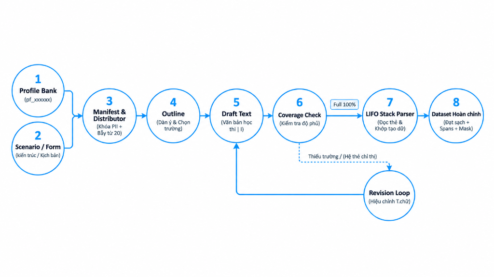

# Mục 1: Giới thiệu

Sự bùng nổ của trí tuệ nhân tạo (AI) trong các lĩnh vực hành chính công, y tế, tài chính và dịch vụ pháp lý tại Việt Nam đã thúc đẩy nhu cầu cấp thiết về việc xử lý tự động các văn bản chứa dữ liệu cá nhân. Các tài liệu này thường kết hợp giữa những thông tin định danh có cấu trúc rõ ràng—như số Căn cước công dân (CCCD), số điện thoại, ngày sinh—với những thông tin mang tính ngữ cảnh phức tạp như tình trạng sức khỏe, hoàn cảnh gia đình hay vị trí cư trú. Nếu một hệ thống chuyển trực tiếp các văn bản này lên các dịch vụ đám mây bên ngoài để phân tích, rủi ro rò rỉ quyền riêng tư và vi phạm quy định pháp lý sẽ là rất lớn. Ngược lại, nếu chỉ đơn giản là bôi đen hoặc xóa bỏ toàn bộ các đoạn văn bản có khả năng nhạy cảm, tài liệu sẽ mất đi tính liên kết ngữ nghĩa và trở nên vô dụng đối với các quy trình nghiệp vụ như tra cứu, lưu trữ hồ sơ hay xử lý ngôn ngữ tự nhiên phía sau.

Nghiên cứu này tập trung vào bài toán **Làm sạch dữ liệu bảo toàn tính khả dụng (Utility-Preserving Sanitization)** đối với dữ liệu cá nhân tiếng Việt. Mục tiêu không chỉ dừng lại ở việc phát hiện chính xác các đoạn văn bản (spans) chứa dữ liệu nhạy cảm, mà còn phải thay thế hoặc che giấu chúng sao cho văn bản sau khi làm sạch vẫn giữ nguyên vẹn cấu trúc cú pháp, thông tin nghiệp vụ và tính mạch lạc tự nhiên. Chúng tôi xây dựng hệ thống phân loại bám sát các quy định của **Nghị định số 13/2023/NĐ-CP** của Chính phủ về Bảo vệ dữ liệu cá nhân, sử dụng hai thuật ngữ `PII` (Personal Identifiable Information) và `SPI` (Sensitive Personal Information) làm quy ước định danh cho hai nhóm: **Dữ liệu cá nhân cơ bản** và **Dữ liệu cá nhân nhạy cảm**. Việc ánh xạ này nhằm xác định phạm vi kỹ thuật của bộ benchmark; bản thân kết quả mô hình không thay thế cho chứng nhận tuân thủ pháp lý toàn diện trong môi trường doanh nghiệp.

## 1.1. Động lực và Đặt vấn đề

Các công cụ rà soát PII đa ngôn ngữ hiện nay là điểm khởi đầu hữu ích, nhưng tập thực thể và quy tắc nhận diện của chúng không được thiết kế cho các đặc thù hành chính của Việt Nam. Tài liệu tiếng Việt sở hữu những định dạng định danh đặc thù, cấu trúc họ tên đa thành phần, địa chỉ hành chính phân cấp 4 cấp, cùng với rất nhiều từ ngữ đa nghĩa phụ thuộc chặt chẽ vào ngữ cảnh xung quanh. Ví dụ: từ *Nam* có thể là giới tính, một vùng địa lý, hoặc là tên riêng của một người; từ *Kinh* có thể chỉ dân tộc hoặc nằm trong các từ ghép phổ thông như *kinh tế*, *kinh nghiệm*. Hơn nữa, các thông tin nhạy cảm về y tế hay hoàn cảnh gia đình thường được diễn đạt dưới dạng các mệnh đề tự sự dài dòng, chứ không tuân theo các mẫu biểu thức chính quy (regex) cố định.

Những đặc thù trên đặt ra hai yêu cầu kỹ thuật then chốt:
1. Bộ dữ liệu chuẩn (benchmark) phải bao quát đầy đủ các trường dữ liệu theo quy định pháp lý và cung cấp tọa độ ranh giới ký tự (character-level boundaries) chính xác tuyệt đối.
2. Hệ thống làm sạch phải tối ưu hóa đồng thời hai mục tiêu đối trọng: triệt tiêu tối đa rò rỉ thông tin cá nhân và tránh việc bôi đen quá đà làm hỏng tính khả dụng của văn bản. ViPII giải quyết yêu cầu thứ nhất thông qua quy trình tạo sinh dữ liệu có kiểm soát kết hợp với giải thuật gán nhãn xác định trên máy chủ, và đánh giá yêu cầu thứ hai thông qua bộ chỉ số kép đánh giá song hành Bảo mật - Khả dụng.

## 1.2. Các Khoảng trống Nghiên cứu

Nghiên cứu này được thúc đẩy bởi bốn khoảng trống công nghệ then chốt:

1. **Sự lệch pha về khung pháp lý và phân loại thực thể:** Các bộ benchmark quốc tế và công cụ thương mại chủ yếu xây dựng quanh các khung pháp lý phương Tây (như GDPR hay HIPAA). Chúng hoàn toàn chưa mô hình hóa Nghị định 13/2023/NĐ-CP của Việt Nam—vốn phân định rạch ròi dữ liệu cá nhân thành hai nhóm Cơ bản (`PII`) và Nhạy cảm (`SPI`) với các mức độ trách nhiệm pháp lý và bảo vệ hoàn toàn khác nhau.
2. **Đặc thù ngôn ngữ và văn bản hành chính Việt Nam:** Văn bản hành chính Việt Nam có cấu trúc định danh phức tạp: tên người gồm Họ, Tên đệm và Tên chính; địa chỉ hành chính phân cấp 4 cấp; và các từ đồng âm/đa nghĩa (như *Kinh*, *Nam*) biến đổi liên tục giữa thuộc tính nhạy cảm và danh từ thông thường tùy thuộc vào ngữ cảnh mệnh đề.
3. **Hiện tượng trôi tọa độ (Coordinate Drift) khi sinh dữ liệu bằng AI:** Khi sử dụng các mô hình ngôn ngữ lớn (LLM) để vừa viết văn bản vừa đoán tọa độ ký tự nhãn thực thể, sự bất tương thích giữa không gian token (subword tokenization) và độ dài ký tự Unicode tiếng Việt luôn dẫn đến hiện tượng trôi lệch tọa độ và ảo giác ranh giới nhãn.
4. **Tính khả thi của mô hình nhỏ (Compact SLMs) khi triển khai cục bộ:** Điều 25 Nghị định 13 đặt ra những rào cản nghiêm ngặt đối với việc chuyển dữ liệu cá nhân ra nước ngoài, khiến việc phụ thuộc vào các API LLM đám mây quốc tế tiềm ẩn nhiều rủi ro pháp lý. Tuy nhiên, năng lực thực tế của các mô hình ngôn ngữ nhỏ gọn (SLM $\le 2\text{B}$ tham số) khi chạy nội bộ (on-premise) trong việc làm sạch dữ liệu tiếng Việt vẫn chưa được kiểm chứng trên một tiêu chuẩn thống nhất.

## 1.3. Phương pháp tiếp cận của ViPII: Cầu nối từ Vấn đề đến Giải pháp

Để giải quyết triệt để 4 khoảng trống trên, chúng tôi đề xuất **ViPII**, một khung nghiên cứu và bộ dữ liệu benchmark toàn diện cho bài toán phát hiện PII/SPI và làm sạch văn bản bảo toàn khả dụng tiếng Việt. Phương pháp được xây dựng trên 4 trụ cột kỹ thuật tương ứng:

1. **Phân loại Pháp lý Chuẩn mực và Mô phỏng Nhân khẩu học Thực tế (Giải quyết Gaps 1 & 2):** ViPII chuẩn hóa danh mục 34 trường dữ liệu căn cứ trực tiếp theo Điều 2, 3 và 4 của Nghị định 13/2023/NĐ-CP. Nhằm phản ánh chân thực ngôn ngữ hành chính mà tuyệt đối không để lộ dữ liệu công dân thật, chúng tôi xây dựng động cơ nhân khẩu học nhân tạo bao quát các quy ước đặt tên của người Việt, hệ thống địa danh toàn quốc, và 19 kịch bản nghiệp vụ hành chính kinh điển.
2. **Quy trình Sinh Dữ liệu Tách rời và Gán nhãn Xác định (Giải quyết Gap 3):** Để triệt tiêu hoàn toàn thảm họa trôi tọa độ, ViPII tách rời hoàn toàn quá trình viết văn bản của LLM khỏi quá trình đo đạc tọa độ ký tự. Các giá trị PII/SPI nhạy cảm được chốt cứng vào Manifest trước khi gọi LLM. Mô hình ngôn ngữ chỉ đóng vai trò người kể chuyện; sau đó, các giải thuật xác định trên máy chủ (Regex lookaround, cửa sổ ngữ cảnh, phân rã họ tên và bộ giải mã ngăn xếp LIFO) sẽ trực tiếp đo đạc tọa độ ký tự trên văn bản sạch, đảm bảo độ chính xác biên nhãn đạt 100% về mặt thiết kế.
3. **Bộ Thước đo Kép Bảo vệ Quyền riêng tư & Bảo toàn Khả dụng:** Thay vì chỉ đánh giá một chiều mức độ che giấu dữ liệu, ViPII xây dựng hệ thống thước đo phạt đồng thời cả hiện tượng rò rỉ dữ liệu ($\mathcal{L}_{\text{privacy}} = 1 - \text{SanRec}$) lẫn hiện tượng bôi đen quá đà phá hỏng văn bản ($\mathcal{O}_{\text{redact}} = 1 - \text{RetRec}$). Thước đo tổng hợp $\text{FULL}$ ở cấp độ văn bản đòi hỏi tài liệu phải vừa sạch bóng dữ liệu nhạy cảm, vừa giữ trọn vẹn mọi thông tin nghiệp vụ.
4. **Kiểm thử Thực nghiệm cho Triển khai Mô hình Nhỏ Nội bộ (Giải quyết Gap 4):** ViPII biên soạn **51.880 văn bản hoàn chỉnh** và **524.655 nhãn span**, gồm 47.880 tài liệu huấn luyện và 4.000 tài liệu kiểm thử cô lập hoàn toàn. Đây là môi trường thử nghiệm chuẩn mực đầu tiên để đánh giá các mô hình nhỏ gọn được tinh chỉnh chuyên biệt (Qwen3-1.7B, Qwen3-0.6B và Qwen3.5-0.8B) so với các baseline mô hình gốc và các mô hình thương mại đám mây lớn, hướng tới giải pháp tự chủ, tuân thủ Nghị định 13.

## 1.4. Các Đóng góp Khoa học Chính

Nghiên cứu mang lại 4 đóng góp cốt lõi:

1. **Bộ benchmark tiếng Việt đầu tiên chuẩn Nghị định 13:** Cung cấp bộ dữ liệu quy mô lớn bao quát 34 trường dữ liệu thuộc 2 nhóm PII cơ bản và SPI nhạy cảm trên 51.880 văn bản và 524.655 nhãn span ký tự, phản ánh chân thực văn phong hành chính và quy ước tên người Việt Nam.
2. **Quy trình sinh dữ liệu tách rời và gán nhãn xác định:** Đề xuất và xác thực quy trình xây dựng dữ liệu tự động giúp triệt tiêu hoàn toàn hiện tượng lệch chỉ mục và ảo giác tọa độ bằng cách kết hợp Manifest chốt giá trị với các giải thuật gán nhãn xác định trên máy chủ.
3. **Khung đánh giá song hành Bảo mật - Khả dụng:** Chuẩn hóa hệ thống đo đạc đa tầng (cấp độ span, trường dữ liệu và toàn văn bản, nổi bật là tiêu chí khắt khe $\text{FULL}$), đặt ra tiêu chuẩn đo lường chuẩn xác cho bài toán làm sạch dữ liệu tiếng Việt.
4. **Minh chứng thực nghiệm thuyết phục về sức mạnh của SLM nhỏ gọn:** Qua đánh giá sâu rộng, nghiên cứu chứng minh rằng quá trình tinh chỉnh chuyên biệt (fine-tuning) giúp các mô hình nhỏ vượt trội hoàn toàn. Mô hình `qwen3-1.7b (FT)` đạt **73.28% `SanRec`** và **71.86% `FULL`**, trong khi `qwen3-0.6b (FT)` và `qwen3.5-0.8b (FT)` đạt lần lượt 70.34% và 70.31% `FULL`. Cả 3 mô hình nhỏ này đều vượt qua mô hình thương mại đám mây `Gemini-3.6-Flash-High` (64.82% `FULL`) trong bài toán làm sạch toàn diện, khẳng định tính khả thi vượt bậc của việc triển khai AI an toàn ngay trên phần cứng nội bộ.

## 1.5. Bố cục Toàn bài

Nghiên cứu tập trung vào văn bản tiếng Việt thuộc các lĩnh vực hành chính, pháp lý, y tế và đời sống xã hội. Mục 2 điểm lại các nghiên cứu liên quan. Mục 3 trình bày danh mục pháp lý, định nghĩa bài toán và hệ thống thước đo kép. Mục 4 giải thích chi tiết quy trình sinh dữ liệu tách rời và giải thuật gán nhãn xác định. Mục 5 báo cáo các thống kê thực chứng và chẩn đoán chất lượng dữ liệu. Mục 6 trình bày thiết lập thực nghiệm, bảng kết quả benchmark tự động và đánh giá của con người. Mục 7 phân tích chuyên sâu các thử nghiệm triệt tiêu thành phần, khả năng chống bẫy đối kháng và phân tích lỗi. Mục 8 thảo luận về đạo đức nghiên cứu, các giới hạn và cam kết công bố mở. Cuối cùng, Mục 9 tổng kết bài báo và định hướng nghiên cứu tiếp theo.

---

# Mục 2: Các Nghiên cứu Liên quan

Nghiên cứu về bảo vệ dữ liệu cá nhân trong công nghệ ngôn ngữ bao gồm bốn hướng tiếp cận liên kết chặt chẽ: nhận diện thực thể PII, làm sạch khử định danh văn bản, tạo sinh dữ liệu tổng hợp và chiến lược triển khai mô hình bảo đảm an toàn dữ liệu. Nhằm định vị rõ nét các đóng góp của bài báo tương ứng với 4 khoảng trống nghiên cứu đã nêu ở Mục 1.2, phần này tổng quan các công trình trước đây theo 4 nhóm chủ đề chính: (1) Các hệ thống phát hiện PII và khung khổ pháp lý; (2) Nhận dạng thực thể tiếng Việt và các đặc thù ngữ nghĩa hành chính; (3) Tạo sinh dữ liệu tổng hợp và thách thức căn chỉnh tọa độ; và (4) Làm sạch bảo toàn tính khả dụng và tiềm năng của các mô hình ngôn ngữ nhỏ gọn.

---

## 2.1. Các Hệ thống Phát hiện PII và Khung khổ Pháp lý Bảo vệ Dữ liệu

Các công cụ rà soát PII và thư viện mã nguồn mở phổ biến (như Microsoft Presidio, spaCy PII, Stanford CoreNLP) chủ yếu được thiết kế xoay quanh các quy định quốc tế như Quy định chung về bảo vệ dữ liệu của Liên minh Châu Âu (GDPR) hoặc Đạo luật HIPAA của Hoa Kỳ. Do đó, các công cụ này chỉ tập trung vào một số thực thể phổ thông như tên người tiếng Anh, email, số điện thoại quốc tế hoặc số an sinh xã hội Mỹ (SSN). 

Tại Việt Nam, **Nghị định số 13/2023/NĐ-CP** đánh dấu bước chuyển mình quan trọng khi phân định rạch ròi dữ liệu cá nhân thành hai cấp độ pháp lý: **Dữ liệu cá nhân cơ bản** (`PII` - Điều 2.3 và Điều 3) và **Dữ liệu cá nhân nhạy cảm** (`SPI` - Điều 2.4 và Điều 4). Cấp độ dữ liệu nhạy cảm đòi hỏi chế độ bảo vệ tối mật và gắn liền với các trách nhiệm bồi thường, chế tài xử phạt nặng nề hơn rất nhiều khi xảy ra rò rỉ. Các công cụ PII hiện tại hoàn toàn không phân tách được ranh giới pháp lý này, dẫn đến việc đánh giá cào bằng hoặc bỏ sót nghiêm trọng các thông tin thuộc nhóm nhạy cảm (như hồ sơ bệnh án, án tích, thông tin tài chính hay hoàn cảnh gia đình). ViPII là benchmark đầu tiên chuyển hóa trực tiếp các điều khoản định danh của Nghị định 13 thành một danh mục kỹ thuật 34 trường có thể đánh giá định lượng chuẩn xác.

---

## 2.2. Nhận dạng Thực thể Tiếng Việt và Đặc thù Ngữ nghĩa Hành chính

Bài toán Nhận dạng Thực thể Tên riêng (NER) tiếng Việt đã đạt được nhiều bước tiến quan trọng qua các bộ ngữ liệu chuẩn như VLSP hay PhoNER_COVID19. Tuy nhiên, các bộ dữ liệu này chủ yếu tập trung vào các nhãn thực thể truyền thống (Người, Tổ chức, Địa điểm, Thời gian) trong ngữ cảnh báo chí hoặc tin tức phổ thông.

Khi áp dụng vào văn bản hành chính và pháp lý tiếng Việt, các hệ thống NER thông thường bộc lộ ba điểm yếu lớn:
1. **Cấu trúc họ tên đa thành phần:** Tên công dân Việt Nam kết hợp giữa Họ (thường là họ đơn hoặc họ kép), Tên đệm (có thể gồm nhiều từ) và Tên chính. Việc gán nhãn nguyên khối một chuỗi họ tên khiến hệ thống bỏ sót các trường hợp gọi tên rút gọn ở thân bài (ví dụ: chỉ gọi tên đệm + tên chính như *"ông Văn Bình"* hoặc chỉ gọi tên riêng *"anh Bình"*).
2. **Địa danh phân cấp 4 cấp:** Địa chỉ hành chính Việt Nam có cấu trúc hình cây nghiêm ngặt (Số nhà/Đường/Thôn $\to$ Xã/Phường $\to$ Quận/Huyện/Thị xã $\to$ Tỉnh/Thành phố), thường đi kèm các từ viết tắt phổ biến trong hồ sơ công dịch.
3. **Từ đồng âm phụ thuộc chặt chẽ vào ngữ cảnh (Lexical Homographs):** Tiếng Việt có nhiều từ mà tính nhạy cảm thay đổi hoàn toàn dựa vào ngữ cảnh xung quanh. Ví dụ: từ *Kinh* vừa là tên một dân tộc thiểu số/đa số (thuộc diện nhạy cảm), vừa là từ tố phổ biến trong các thuật ngữ thông thường (*kinh tế*, *kinh nghiệm*, *kinh doanh*); từ *Nam* có thể là giới tính, tên riêng người, hoặc định hướng địa lý (*miền Nam*). Các mô hình đối sánh từ vựng đơn thuần sẽ gặp tỷ lệ dương tính giả rất cao nếu thiếu cơ chế kiểm tra ngữ cảnh mệnh đề lân cận.

---

## 2.3. Tạo sinh Dữ liệu Tổng hợp và Thách thức Căn chỉnh Tọa độ Ký tự

Để huấn luyện các mô hình xử lý dữ liệu cá nhân mà không vi phạm Điều 8 Nghị định 13 (nghiêm cấm phát tán và sử dụng trái phép dữ liệu công dân thật), việc tạo sinh dữ liệu tổng hợp (synthetic data) bằng các mô hình ngôn ngữ lớn (LLM) là giải pháp tối ưu. Tuy nhiên, các phương pháp sinh dữ liệu tự động hiện nay thường vấp phải hiện tượng **trôi tọa độ (Coordinate Drift)** và **ảo giác ranh giới nhãn (Boundary Hallucination)**.

Khi người dùng yêu cầu một mô hình ngôn ngữ tự hồi quy (autoregressive LLM) vừa viết văn bản vừa trực tiếp xuất ra chỉ số tọa độ ký tự (character offsets như start, end), mô hình hầu như luôn tính toán sai lệch. Nguyên nhân cốt lõi là các LLM hoạt động trên không gian token từ phụ (subword tokens), trong khi tiếng Việt có dấu lại chiếm từ 2 đến 3 bytes trong mã hóa UTF-8. Chỉ cần một ký tự xuống dòng hoặc một dấu thanh trượt nhẹ, toàn bộ các chỉ số tọa độ phía sau sẽ bị trôi lệch hoàn toàn. 

Một số nghiên cứu cố gắng khắc phục bằng cách cho LLM chèn thẻ đánh dấu trực tiếp vào văn bản, nhưng cách làm này thường khiến văn bản mất đi tính tự nhiên và vẫn có thể gặp lỗi cú pháp thẻ. ViPII khắc phục triệt để vấn đề này bằng nguyên lý **Sinh dữ liệu tách rời (Decoupled Synthesis)**: chốt trước giá trị thực thể vào Manifest, chỉ để LLM viết văn xuôi, và chuyển toàn bộ việc tính toán tọa độ ký tự sang các giải thuật xác định chạy trên máy chủ với cơ chế bù trừ chỉ mục hoàn hảo.

---

## 2.4. Khử định danh Bảo toàn Khả dụng và Tiềm năng của Mô hình Ngôn ngữ Nhỏ (Compact SLMs)

Mục tiêu tối hậu của việc xử lý dữ liệu riêng tư không phải là phá hủy văn bản, mà là **khử định danh bảo toàn tính khả dụng (Utility-Preserving Sanitization)**. Trong môi trường công quyền hoặc bệnh viện, nếu văn bản sau khi làm sạch bị bôi đen toàn bộ các thuật ngữ thủ tục, cơ quan tiếp nhận sẽ không thể xử lý tiếp hồ sơ. Do đó, hệ thống phải đạt được trạng thái cân bằng hoàn hảo: triệt tiêu rò rỉ thông tin cá nhân nhưng giữ trọn vẹn ngữ nghĩa nghiệp vụ.

Về mặt kiến trúc triển khai, mặc dù các mô hình biên giới đám mây (như GPT-4, Claude 3.5, Gemini 1.5) có năng lực suy luận mạnh mẽ, Điều 25 Nghị định 13 quy định việc chuyển dữ liệu cá nhân của công dân Việt Nam ra khỏi lãnh thổ phải trải qua quy trình đánh giá tác động và phê duyệt an ninh vô cùng khắt khe. Đối với dữ liệu y tế, tư pháp và tài chính, giải pháp tối ưu nhất là xử lý hoàn toàn tại chỗ (on-premise / air-gapped).

Các mô hình ngôn ngữ nhỏ gọn (Small Language Models - SLM có dung lượng $\le 2\text{B}$ tham số) mở ra cơ hội triển khai AI cục bộ với chi phí thấp và bảo mật tuyệt đối. Tuy nhiên, ở trạng thái gốc (zero-shot base), các mô hình nhỏ này thường không hiểu được các quy ước hành chính Việt Nam. Nghiên cứu của chúng tôi kiểm chứng thực nghiệm rằng: thông qua việc tinh chỉnh có giám sát (supervised fine-tuning) trên bộ dữ liệu chuẩn mực ViPII, các mô hình compact SLM (0.6B và 1.7B) hoàn toàn có thể vượt qua cả các mô hình thương mại lớn về độ chính xác làm sạch văn bản, mở ra con đường tự chủ công nghệ bảo vệ dữ liệu tại Việt Nam.

---

# Mục 3: Khung Pháp lý, Định nghĩa Bài toán và Hệ thống Đánh giá

Phần này trình bày căn cứ pháp lý và danh mục 34 trường dữ liệu của **ViPII** theo Nghị định số 13/2023/NĐ-CP của Chính phủ, định nghĩa hình thức hai bài toán tính toán (nhận diện thực thể và làm sạch văn bản bảo toàn khả dụng), đồng thời thiết lập hệ thống thước đo kép đánh giá đồng thời hai mục tiêu Bảo vệ Quyền riêng tư và Bảo toàn Tính khả dụng.

---

## 3.1. Căn cứ Pháp lý và Danh mục Phân loại theo Nghị định 13

### Bối cảnh Pháp lý và Thẩm quyền Quy định
Khung phân loại của ViPII được xây dựng bám sát hệ thống pháp luật của nước Cộng hòa Xã hội Chủ nghĩa Việt Nam, trọng tâm là **Nghị định số 13/2023/NĐ-CP về Bảo vệ dữ liệu cá nhân (PDPD)**, ban hành ngày 17/04/2023 và có hiệu lực thi hành từ ngày 01/07/2023:
* **Khoản 3 Điều 2 và Điều 3:** Quy định định nghĩa và danh mục các trường thuộc **Dữ liệu cá nhân cơ bản** (`PII`).
* **Khoản 4 Điều 2 và Điều 4:** Quy định định nghĩa và danh mục các trường thuộc **Dữ liệu cá nhân nhạy cảm** (`SPI`).
* **Điều 8:** Nghiêm cấm các hành vi xử lý dữ liệu cá nhân trái pháp luật, phát tán hoặc chiếm đoạt dữ liệu cá nhân.
* **Điều 25:** Quy định các điều kiện nghiêm ngặt đối với việc chuyển dữ liệu cá nhân của công dân Việt Nam ra nước ngoài, đặt ra yêu cầu cấp thiết về các giải pháp AI làm sạch dữ liệu chạy hoàn toàn nội bộ (on-premise).

### Hai Cấp độ Dữ liệu Cá nhân theo Luật định
Theo Nghị định 13, dữ liệu cá nhân được phân chia thành hai nhóm với yêu cầu bảo mật khác biệt:
* **Dữ liệu cá nhân cơ bản (`PII`):** Gồm những thông tin giúp xác định danh tính một cá nhân trong các giao dịch dân sự, hành chính và thương mại thông thường.
* **Dữ liệu cá nhân nhạy cảm (`SPI`):** Là dữ liệu gắn liền với quyền riêng tư cá nhân mà khi bị xâm phạm sẽ gây ảnh hưởng trực tiếp đến quyền và lợi ích hợp pháp, danh dự, tài chính hoặc an toàn của người đó.

Bảng 3.1 chi tiết hóa danh mục 34 trường của ViPII được nhóm theo các cụm nghiệp vụ. Chi tiết căn cứ pháp lý từng trường và ví dụ minh họa được trình bày tại Phụ lục A.

### Bảng 3.1: Phân loại dữ liệu theo Nghị định 13/2023/NĐ-CP trong ViPII

| Nhóm Pháp lý | Cụm Nghiệp vụ | Mã trường dữ liệu ($f \in \mathcal{F}$) |
|:---|:---|:---|
| **Dữ liệu Cá nhân Cơ bản**<br/>(**PII** - Nghị định 13, Điều 2.3 & 3) | **Giấy tờ & Mã số Định danh** | `cccd` (Số CCCD/Định danh 12 số), `phone` (Số điện thoại), `email`, `passport_number` (Số hộ chiếu), `driver_license` (GPLX), `vehicle_plate` (Biển số xe), `tax_code` (Mã số thuế) |
| | **Định danh Dân sự & Họ tên** | `full_name` (Họ và tên), `family_name` (Họ), `middle_name` (Tên đệm), `given_name` (Tên chính), `address` (Địa chỉ thường trú/tạm trú), `name_alias` (Bí danh/tên thường gọi) |
| | **Thuộc tính Nhân khẩu học** | `dob` (Ngày tháng năm sinh), `gender` (Giới tính), `marital_status` (Tình trạng hôn nhân), `nationality` (Quốc tịch) |
| **Dữ liệu Cá nhân Nhạy cảm**<br/>(**SPI** - Nghị định 13, Điều 2.4 & 4) | **Tài chính & Dịch vụ Công** | `bank_account` (Số tài khoản ngân hàng), `social_insurance_no` (Mã số BHXH), `health_insurance_no` (Số thẻ BHYT), `eid_credentials` (Tài khoản VNeID) |
| | **Nguồn gốc, Niềm tin & Theo dõi** | `ethnicity` (Thành phần dân tộc), `religion` (Tôn giáo), `political_view` (Quan điểm chính trị), `location_data` (Dữ liệu vị trí thực tế), `behavioral_data` (Dữ liệu hành vi) |
| | **Đời tư, Sức khỏe & Hoàn cảnh** | `health_status` (Tình trạng sức khỏe/bệnh án), `criminal_record` (Dữ liệu án tích/tiền án tiền sự), `private_life` (Đời sống riêng tư), `family_relations` (Mối quan hệ gia đình), `sexual_orientation` (Xu hướng tình dục), `biometric` (Dữ liệu sinh trắc học) |

---

## 3.2. Định nghĩa Hình thức Bài toán

### Biểu diễn Đầu vào và Không gian Tọa độ Ký tự Unicode
Gọi $\mathcal{C}$ là bảng chữ cái các điểm mã Unicode (code points). Nhằm đảm bảo tính tương đương chuẩn mực trước các biến thể gõ dấu tiếng Việt (bảng mã tổ hợp vs dựng sẵn), toàn bộ văn bản đều được chuẩn hóa về định dạng **Unicode Normalization Form C (NFC)**. Một văn bản đầu vào được biểu diễn như một chuỗi gồm $N$ ký tự:
$$X_{\text{raw}} = (c_1, c_2, \dots, c_N), \quad c_t \in \mathcal{C}$$

Trong $X_{\text{raw}}$, các thực thể dữ liệu cá nhân tồn tại dưới dạng các chuỗi con liên tục, gọi là **span ký tự**. Một span nhãn chuẩn (ground-truth) được biểu diễn bằng bộ 4 phần tử:
$$y_i = \bigl(s_i, e_i, f_i, l_i\bigr)$$
trong đó:
* $s_i \in \{0, \dots, N-1\}$ là chỉ số ký tự bắt đầu (tính từ 0, bao gồm ký tự này).
* $e_i \in \{1, \dots, N\}$ là chỉ số ký tự kết thúc (không bao gồm ký tự này, với $s_i < e_i$).
* $f_i \in \mathcal{F}$ là nhãn trường dữ liệu cụ thể trong tập 34 trường ($\mathcal{F} = \{f_1, \dots, f_{34}\}$).
* $l_i \in \{\text{PII}, \text{SPI}\}$ là phân loại cấp độ bảo vệ theo luật định.

> **Quy ước Bất biến về Tọa độ:** Tọa độ ký tự trong ViPII được tính toán nghiêm ngặt dựa trên **số lượng điểm mã Unicode sau chuẩn hóa NFC** trong chuỗi Python ($0 \le s_i < e_i \le \text{len}(X)$). Chỉ số này hoàn toàn khác biệt với số byte UTF-8 (trong đó ký tự tiếng Việt có dấu chiếm 2–3 bytes) và độc lập hoàn toàn với việc phân tách token từ phụ của các bộ tokenizer.

### Cấu trúc Nhãn Phẳng và Toán tử Phân rã Họ Tên
Bộ dữ liệu chuẩn của ViPII tuân theo cấu trúc **nhãn phẳng, không chồng lấn**:
$$\mathcal{Y}^* = \{y_1^*, y_2^*, \dots, y_M^*\}, \quad \text{sao cho } e_i^* \le s_j^* \quad \forall i < j$$

Để xử lý mối quan hệ phân cấp trong tên người Việt Nam (nơi một tên đầy đủ bao hàm cả họ, tên đệm và tên chính), ViPII thiết lập **Toán tử Phân rã Tên Rời rạc** $\Pi_{\text{name}}$. Khi phân tích một span tên đầy đủ $y_{\text{full}} = (s, e, \text{'full\_name'}, \text{'PII'})$, toán tử này ánh xạ nó thành các span thành phần không chồng lấn:
$$\Pi_{\text{name}}(y_{\text{full}}, X) = \{(s_{\text{fam}}, e_{\text{fam}}, \text{'family\_name'}, \text{'PII'}), (s_{\text{mid}}, e_{\text{mid}}, \text{'middle\_name'}, \text{'PII'}), (s_{\text{giv}}, e_{\text{giv}}, \text{'given\_name'}, \text{'PII'})\}_{\text{hợp lệ}}$$
thỏa mãn thứ tự vị trí:
$$s = s_{\text{fam}} < e_{\text{fam}} \le s_{\text{mid}} < e_{\text{mid}} \le s_{\text{giv}} < e_{\text{giv}} = e$$

Cách thiết kế này đảm bảo việc đánh giá chuỗi luôn là các phân vùng độc lập, không xảy ra xung đột lồng ghép nhãn.

### Nhiệm vụ 1: Phát hiện và Gán nhãn Thực thể (Task 1: Span-Level Detection)
Mô hình dự đoán $g: \mathcal{X} \to 2^{\mathcal{S}}$ tiếp nhận văn bản thô $X_{\text{raw}}$ và dự đoán tập hợp các span:
$$\hat{\mathcal{Y}} = \bigl\{\hat{y}_j = (\hat{s}_j, \hat{e}_j, \hat{f}_j, \hat{l}_j)\bigr\}_{j=1}^{\hat{M}}$$
Một span dự đoán được coi là khớp chính xác hoàn toàn (Exact Match) nếu và chỉ nếu:
$$\hat{s}_j = s_i^* \quad \land \quad \hat{e}_j = e_i^* \quad \land \quad \hat{f}_j = f_i^* \quad \land \quad \hat{l}_j = l_i^*$$

### Nhiệm vụ 2: Làm sạch Bảo toàn Tính khả dụng (Task 2: Utility-Preserving Sanitization)
Mô hình tạo sinh đầu-cuối $\mathcal{M}: \mathcal{X} \to \mathcal{X}$ chuyển đổi trực tiếp $X_{\text{raw}}$ thành **văn bản đã làm sạch**:
$$X_{\text{sanitized}} = \mathcal{M}(X_{\text{raw}})$$

Việc khử định danh được thực hiện theo hai phương thức:
1. **Gắn thẻ phân loại (Tag Masking):** Thay thế các span nhạy cảm $X_{\text{raw}}[s_i:e_i]$ bằng các thẻ định danh chuẩn hóa:
   $$\tau(f_i) \in \bigl\{\texttt{[HỌ\_TÊN]}, \texttt{[CCCD]}, \texttt{[SỐ\_ĐIỆN\_THOẠI]}, \texttt{[TÌNH\_TRẠNG\_SỨC\_KHỎE]}, \dots\bigr\}$$
2. **Hoán đổi Giá trị Nhân tạo Nhất quán (Consistent Synthetic Replacement):** Thay thế thực thể bằng các giá trị nhân tạo tương đương từ cơ sở dữ liệu mẫu, bảo toàn tính liên kết đại từ và ngữ pháp của văn bản.

---

## 3.3. Hệ thống Thước đo Kép: Bảo vệ Quyền riêng tư đối trọng với Bảo toàn Khả dụng

Đánh giá chất lượng làm sạch văn bản đòi hỏi phải cân bằng giữa hai mục tiêu đối lập: triệt tiêu thông tin nhạy cảm và bảo toàn tối đa thông tin nghiệp vụ. Chúng tôi mô hình hóa sự đối trọng này thông qua hai khái niệm: **Rò rỉ quyền riêng tư còn sót lại** và **Bôi đen quá đà**.

Gọi $\mathcal{P}(X_{\text{raw}})$ là tập hợp các đơn vị dữ liệu cá nhân nhạy cảm thực tế có trong tài liệu, và $\mathcal{U}(X_{\text{raw}})$ là tập hợp các thông tin nghiệp vụ, quy trình hành chính không nhạy cảm cần giữ lại.

### 1. Tỷ lệ Rò rỉ Quyền riêng tư Còn sót lại (Residual Privacy Leakage)
Bất kỳ thực thể nhạy cảm nào thuộc $\mathcal{P}(X_{\text{raw}})$ mà vẫn còn xuất hiện hoặc có thể suy diễn ngược lại được trong văn bản $X_{\text{sanitized}}$ đều bị coi là lỗi bảo mật.

Gọi $\mathbb{I}_{\text{leak}}(y_i^*, X_{\text{sanitized}})$ là hàm chỉ thị trả về 1 nếu thực thể nhạy cảm $y_i^*$ bị bỏ sót và 0 nếu đã được làm sạch an toàn. **Tỷ lệ Rò rỉ Quyền riêng tư** ($\mathcal{L}_{\text{privacy}}$) trên tập kiểm thử $D$ văn bản là:

$$\mathcal{L}_{\text{privacy}} = 1 - \text{SanRec} = \frac{\sum_{d=1}^D \sum_{i=1}^{M_d} \mathbb{I}_{\text{leak}}(y_{d,i}^*, X_{d,\text{sanitized}})}{\sum_{d=1}^D M_d}$$

trong đó $\text{SanRec}$ là **Độ bao phủ Làm sạch (Sanitization Recall)**. Thước đo vĩ mô cấp trường ($\text{SanAtt}$) và cấp tài liệu ($\text{SanA/R}$) cung cấp cái nhìn chi tiết về tỷ lệ làm sạch trên từng loại thực thể.

### 2. Tỷ lệ Bôi đen Quá đà và Bảo tồn Tính khả dụng (Over-Redaction)
Ngược lại, nếu mô hình bôi đen hoặc xóa nhầm các thuật ngữ thủ tục, điều khoản pháp lý, số công văn nghiệp vụ ($u_k \in \mathcal{U}(X_{\text{raw}})$), tính khả dụng của văn bản sẽ bị phá hủy.

Gọi $\mathbb{I}_{\text{suppress}}(u_k, X_{\text{sanitized}})$ là hàm chỉ thị trả về 1 nếu thông tin nghiệp vụ $u_k$ bị xóa/che nhầm. **Tỷ lệ Bôi đen Quá đà** ($\mathcal{O}_{\text{redact}}$) được định nghĩa là:

$$\mathcal{O}_{\text{redact}} = 1 - \text{RetRec} = \frac{\sum_{d=1}^D \sum_{k=1}^{K_d} \mathbb{I}_{\text{suppress}}(u_{d,k}, X_{d,\text{sanitized}})}{\sum_{d=1}^D K_d}$$

trong đó $\text{RetRec}$ là **Độ bao phủ Bảo tồn (Retention Recall)**. Các chỉ số tương ứng $\text{RetAtt}$ và $\text{RetA/R}$ đo lường mức độ giữ nguyên các thuộc tính phi nhạy cảm.

### 3. Thước đo Toàn diện ở Cấp độ Tài liệu: $\text{FULL}$
Một hệ thống chỉ được công nhận là thành công trọn vẹn trên một văn bản nếu và chỉ nếu nó đồng thời đạt được: **Không rò rỉ bất kỳ thông tin nhạy cảm nào VÀ Không bôi đen nhầm bất kỳ thông tin nghiệp vụ nào**:

$$\text{FULL} = \frac{1}{D} \sum_{d=1}^D \Biggl[ \prod_{i=1}^{M_d} \bigl(1 - \mathbb{I}_{\text{leak}}(y_{d,i}^*, X_{d,\text{sanitized}})\bigr) \times \prod_{k=1}^{K_d} \bigl(1 - \mathbb{I}_{\text{suppress}}(u_{d,k}, X_{d,\text{sanitized}})\bigr) \Biggr]$$

Bằng việc kết hợp chặt chẽ giữa bảo vệ an toàn ($\text{SanRec} \to 1.0$) và bảo toàn khả dụng ($\text{RetRec} \to 1.0$), tiêu chí $\text{FULL}$ thiết lập thước đo chuẩn mực, thực tế nhất cho các ứng dụng xử lý dữ liệu cá nhân theo luật định.

---

# Mục 4: Quy trình Sinh Dữ liệu Tách rời và Gán nhãn Xác định

Phần này trình bày chi tiết kiến trúc của quy trình sinh dữ liệu và gán nhãn tự động trong **ViPII**. Chúng tôi làm rõ hai nguyên lý thiết kế bất biến—*Khóa giá trị thực thể trước qua Manifest* và *Căn chỉnh tọa độ ký tự xác định trên máy chủ*—đồng thời lần lượt mô tả từng mắt xích: ngân hàng hồ sơ nhân khẩu học, tạo dựng Manifest, kỹ thuật sinh bẫy đối kháng, prompting hai giai đoạn, bộ giải mã ngăn xếp LIFO, các giải thuật gán nhãn xác định, giải quyết chồng lấn và định dạng dữ liệu đầu ra.

---

## 4.1. Tổng quan Kiến trúc và Hai Nguyên lý Bất biến

Các tập dữ liệu ẩn danh hiện nay thường gặp phải hai nhược điểm chí mạng: (1) sử dụng biểu thức chính quy (regex) quét trên các văn bản mạng thu thập tự do, dẫn đến nhãn rất ồn và sai lệch ngữ cảnh; hoặc (2) yêu cầu mô hình ngôn ngữ lớn (LLM) vừa viết văn bản vừa trực tiếp tính toán tọa độ ký tự (start, end offsets), dẫn đến hiện tượng trôi chỉ mục nghiêm trọng do sự khác biệt giữa không gian token từ phụ và chuỗi ký tự Unicode có dấu của tiếng Việt.

Để xây dựng một bộ dữ liệu chuẩn mực bám sát Nghị định 13 mà tuyệt đối không xâm phạm dữ liệu công dân thật, ViPII áp dụng **quy trình sinh dữ liệu tách rời và gán nhãn xác định**. Quy trình này phân định rạch ròi giữa việc viết văn bản tự nhiên và việc đo đạc tọa độ ký tự thông qua hai nguyên lý cốt lõi:

1. **Khóa giá trị thực thể có kiểm soát bằng Manifest:** Toàn bộ các giá trị định danh cơ bản (`PII`) và thuộc tính nhạy cảm (`SPI`) đều được tạo ra và chốt cứng trong Manifest trước khi gửi lệnh gọi LLM. Mô hình ngôn ngữ chỉ đóng vai trò người kể chuyện, viết văn xuôi hành chính bao quanh các giá trị đã ấn định. Mô hình bị nghiêm cấm việc tự ý bịa thêm các thông tin cá nhân mới ngoài danh sách.
2. **Căn chỉnh tọa độ ký tự xác định trên máy chủ:** Tọa độ ký tự ($s_i, e_i$) và nhãn thực thể được tính toán hoàn toàn bằng các thuật toán xác định chạy trên máy chủ (đối sánh regex lookaround có bảo vệ, quét cửa sổ ngữ cảnh và bộ giải mã ngăn xếp LIFO). LLM hoàn toàn không phải đoán số tọa độ, qua đó triệt tiêu 100% hiện tượng ảo giác ranh giới nhãn.

Hình 4.1 minh họa kiến trúc toàn diện của quy trình sinh dữ liệu và thẩm định đối kháng trong ViPII.



*Hình 4.1: Sơ đồ luồng vận hành của quy trình sinh dữ liệu tách rời và gán nhãn xác định trong ViPII.*

---

## 4.2. Ngân hàng Hồ sơ Nhân tạo và Nguồn Siêu dữ liệu Nền tảng

Quy trình vận hành dựa trên ba nguồn tài sản dữ liệu nền tảng, được thiết kế để cung cấp sự đa dạng nhân khẩu học và nghiệp vụ mà tuyệt đối không chứa dữ liệu công dân thật:

### Ngân hàng Hồ sơ Nhân tạo
Bao gồm kho hồ sơ công dân nhân tạo phong phú, được tạo sinh bằng thuật toán nhằm cung cấp dữ liệu đầu vào đa dạng cho quá trình xây dựng prompt. Mỗi bản ghi chứa các trường thông tin cá nhân cơ bản và nhạy cảm:
* `profile_id`: Mã định danh duy nhất cho từng hồ sơ nhân tạo.
* `fields`: Các thuộc tính nhân khẩu học (họ tên, ngày sinh, giới tính, địa chỉ, số CCCD 12 số được sinh theo đúng quy tắc cấu trúc của cơ quan quản lý nhưng sử dụng dải đầu số thử nghiệm).
* `consistency`: Các ràng buộc logic đảm bảo tính nhất quán (ví dụ: năm sinh trong CCCD khớp với ngày sinh, độ tuổi phù hợp với tình trạng hôn nhân và nghề nghiệp).

#### Tính Đa dạng Ngôn ngữ và Địa phương
Hồ sơ bao phủ các quy ước họ tên phổ biến của người Việt (họ đơn, họ kép, tên đệm truyền thống và hiện đại), kết hợp với hệ thống địa giới hành chính đầy đủ trên khắp ba miền Bắc - Trung - Nam, giúp văn bản sinh ra không bị lặp lại các khuôn mẫu nhân vật nhàm chán.

### Danh mục 19 Kịch bản Nghiệp vụ
Dữ liệu cá nhân chỉ bộc lộ tự nhiên khi gắn liền với một mục đích hành chính cụ thể. Danh mục thiết lập **19 kịch bản nghiệp vụ thực tế** (như xin trợ cấp xã hội, tranh chấp lao động, đăng ký khám chữa bệnh, khai báo tư pháp). Mỗi kịch bản chỉ định:
* `cooccur_fields`: Các trường định danh bắt buộc phải có trong thủ tục (như họ tên, CCCD, số điện thoại, địa chỉ).
* `spi_targets`: Các trường nhạy cảm cần được kích hoạt tự nhiên (ví dụ: `health_status` trong hồ sơ bệnh án; `criminal_record` trong thủ tục tư pháp).
* `register`: Phong cách văn bản bắt buộc (`administrative` - biểu mẫu hành chính trang trọng; `third_person` - văn bản tường trình của bên thứ ba; hoặc `dialogue` - đối thoại tiếp dân trực tiếp).

### Siêu dữ liệu Biểu mẫu Dịch vụ Công
Hệ thống tích hợp siêu dữ liệu từ **9.020 mẫu thủ tục dịch vụ công thực tế** thuộc các bộ ngành (Tư pháp, Công an, Y tế, Giao thông). Điểm mấu chốt là: **chúng tôi không nhồi nguyên văn mẫu biểu thô vào prompt của LLM** vì sẽ làm văn bản bị cứng nhắc và quá tải ngữ cảnh. Thay vào đó, mã biểu mẫu và tên cơ quan có thẩm quyền được gắn dưới dạng **siêu dữ liệu đối soát đính kèm bản ghi**, giúp định vị văn bản đúng bối cảnh pháp lý thực tế.

---

## 4.3. Xây dựng Manifest Thủ tục

Trước khi gọi mô hình ngôn ngữ sinh văn bản, bộ dựng Manifest sẽ trích xuất và cố định toàn bộ các giá trị thực thể cần có trong văn bản:

```
       Hồ sơ Nhân tạo               Kịch bản Nghiệp vụ
     (Công dân Nhân tạo)           (Hỗ trợ Y tế Xã hội)
              │                              │
              └──────────────┬───────────────┘
                             ▼
              Bộ Dựng Manifest Thủ tục
                             │
            ┌────────────────┴────────────────┐
            ▼                                 ▼
    Thực thể Manifest Cố định          Bẫy Đối kháng
    - cccd: "001095012345"             - doc_code: "104928374619" (num12)
    - phone: "0983123456"              - org: "UBND Phường Mai Dịch"
    - dob: "12/04/1995"                - kin_name: "Nguyễn Văn Bình" (bố)
    - spi: health_status [SENTINEL]
```

Bộ dựng Manifest thực hiện 3 nhiệm vụ:
1. **Lựa chọn trường và Gắn cờ Sentinel:** Giao thoa các trường trong hồ sơ với yêu cầu của kịch bản. Các trường định danh cứng lấy giá trị trực tiếp từ hồ sơ. Các trường tự sự dài (như bệnh án, đời tư) được gắn cờ `[[LLM_GENERATE]]` để yêu cầu LLM tự do sáng tạo nội dung phù hợp với kịch bản nhưng phải đóng gói trong thẻ neo.
2. **Mở rộng Biến thể Bề mặt (Surface Variants):** Tạo sẵn các cách viết khác nhau của cùng một thực thể (ví dụ: số CCCD có thể viết liền `001095012345` hoặc có khoảng cách `001 095 012345`; số điện thoại bắt đầu bằng `09x` hoặc `+84`) để phục vụ thuật toán so khớp chính xác sau này.
3. **Chuẩn bị Phân rã Họ Tên:** Tách sẵn họ tên công dân thành Họ, Tên đệm và Tên chính thông qua thuật toán phân tích cú pháp tên riêng tiếng Việt.

---

## 4.4. Bẫy Đối kháng và Dữ liệu Đa Chủ thể

Một điểm yếu phổ biến của các mô hình khử định danh là dễ bị "bắt bài" theo các quy tắc bề mặt nông cạn (ví dụ: cứ thấy chuỗi 12 chữ số là tự động quy kết thành số CCCD). Để giúp mô hình học được ngữ cảnh thực sự, quy trình đưa vào 3 loại nhiễu đối kháng:

1. **Mã số Văn bản / Hồ sơ Tiếp nhận 12 số (`doc_code` kiểu `num12`):** Chèn các chuỗi 12 chữ số ngẫu nhiên đại diện cho số công văn, mã hồ sơ tiếp nhận hoặc mã vạch thủ tục. Trong prompt, chuỗi này được đặt rõ ràng là mã văn bản nghiệp vụ (`Mã hồ sơ tiếp nhận: «104928374619»`). Mô hình bắt buộc phải nhìn vào ngữ cảnh xung quanh (phân biệt *"Mã hồ sơ tiếp nhận số..."* với *"Số định danh cá nhân..."*) thay vì chỉ đếm độ dài chữ số.
2. **Thực thể Thân nhân Đa chủ thể (`subject: other`):** Trong các lá đơn hành chính, công dân thường khai báo thêm thông tin của bố mẹ, vợ chồng hoặc người giám hộ. Hệ thống lấy mẫu thêm hồ sơ phụ để nhúng tên, số điện thoại của người thân, giúp kiểm tra xem mô hình có làm sạch được cả thông tin của các chủ thể thứ hai hay không.
3. **Xác nhận Án tích Sạch:** Theo Nghị định 13, thông tin án tích là dữ liệu nhạy cảm (`SPI`). Tuy nhiên, trong đơn từ xin việc hoặc lý lịch tư pháp, công dân thường khẳng định *"Tôi cam đoan không có tiền án, tiền sự"*. Nếu mô hình bôi đen câu này thì sẽ phạm lỗi bôi đen quá đà. Hệ thống sẽ chủ động loại trừ nhãn `criminal_record` trong các trường hợp khẳng định trong sạch này.

---

## 4.5. Prompting Hai Giai đoạn và Vòng lặp Hiệu đính Cú pháp

Để tạo văn bản tự nhiên mà vẫn đảm bảo 100% tuân thủ Manifest, quá trình sinh diễn ra qua hai giai đoạn:

```
                  ┌──────────────────────────────────────────────┐
                  │          GIAI ĐOẠN 1: SOẠN THẢO VĂN BẢN      │
                  │ - Nhúng toàn bộ thực thể từ Manifest         │
                  │ - Prompt: T = 0.85 (Lần 1) -> 0.70 (Lần 2,3) │
                  │ - Đóng gói thẻ neo: ⟦field⟧...⟦/field⟧       │
                  └──────────────────────┬───────────────────────┘
                                         │
                                         ▼
                  ┌──────────────────────────────────────────────┐
                  │          BẢN THẢO TẠM THỜI X_tagged          │
                  └──────────────────────┬───────────────────────┘
                                         │
                         ┌───────────────┴───────────────┐
                         ▼                               ▼
                 [Đủ thực thể & Hợp lệ]          [Thiếu thực thể / Lỗi thẻ]
                         │                               │
                         │                               ▼
                         │               ┌──────────────────────────────┐
                         │               │  GIAI ĐOẠN 2: HIỆU ĐÍNH      │
                         │               │  Nhiệt độ thấp (T = 0.20)    │
                         │               │  Sửa cú pháp thẻ & bù trường │
                         │               │  Tối đa 3 lần lặp            │
                         │               └───────────────┬──────────────┘
                         │                               │
                         ▼                               ▼
                  ┌──────────────────────────────────────────────┐
                  │       CHUYỂN TIẾP CHO BỘ PHÂN TÍCH XÁC ĐỊNH  │
                  └──────────────────────────────────────────────┘
```

* **Giai đoạn 1: Soạn thảo Bản thảo:** Mô hình được cấp dữ liệu từ Manifest, bối cảnh thủ tục và phong cách viết. Lần gọi đầu tiên chạy ở nhiệt độ cao ($T = 0.85$) để văn từ phong phú, giảm xuống $T = 0.70$ ở các lần sau. Các mệnh đề tự sự nhạy cảm được mô hình tự do diễn đạt và đóng gói trong thẻ neo: `⟦health_status⟧chẩn đoán mắc suy thận mạn giai đoạn 3⟦/health_status⟧`.
* **Giai đoạn 2: Kiểm định và Hiệu đính:** Bản thảo $X_{\text{tagged}}$ được thẩm định tự động: kiểm tra xem có thiếu thực thể nào trong Manifest không và các cặp thẻ `⟦...⟧` có đóng mở chuẩn xác hay không. Nếu có lỗi, hệ thống kích hoạt vòng lặp hiệu đính ở nhiệt độ thấp ($T = 0.20$), chỉ rõ vị trí lỗi để mô hình sửa lại, đạt tỷ lệ hoàn thành hợp lệ trên **98.5%**.

---

## 4.6. Bộ Giải mã Ngăn xếp LIFO cho Thẻ Neo Ngữ nghĩa

Thuật toán 2 mô tả cơ chế bóc tách thẻ neo thời gian tuyến tính $\mathcal{O}(N)$ bằng ngăn xếp LIFO chạy trên máy chủ:

```
Thuật toán 2: Bộ Giải mã Ngăn xếp LIFO một lượt cho Thẻ Neo Ngữ nghĩa
──────────────────────────────────────────────────────────────────────────────────
Đầu vào : Chuỗi văn bản gắn thẻ X_tagged, Bảng độ nhạy SENS
Đầu ra  : Văn bản sạch X_clean, Tập nhãn thẻ neo S_anchor, Trạng thái ok

1:  clean_chars ← []
2:  spans       ← []
3:  stack       ← []   // Ngăn xếp LIFO lưu các bộ (field_name, start_offset)
4:  i ← 0, n ← |X_tagged|
5:  while i < n do
6:      if X_tagged[i] = "⟦" then
7:          close_idx ← Tìm("⟧", X_tagged, từ = i + 1)
8:          if close_idx ≠ -1 then
9:              tag_content ← CắtChuỗi(X_tagged, i + 1, close_idx)
10:             if tag_content bắt đầu bằng "/" then       // Thẻ đóng ⟦/field⟧
11:                 field ← CắtChuỗi(tag_content, 1)
12:                 match_idx ← TìmPhầnTửCuối(stack, field)
13:                 if match_idx ≠ -1 then
14:                     (fld, s_offset) ← stack.pop(match_idx)
15:                     e_offset ← |clean_chars|
16:                     span ← TạoSpan(s_offset, e_offset, fld, SENS[fld], "anchor_tag")
17:                     spans ← spans ∪ {span}
18:                 end if
19:                 i ← close_idx + 1
20:                 continue
21:             else if LàTênTrườngHợpLệ(tag_content) then // Thẻ mở ⟦field⟧
22:                 stack.append((tag_content, |clean_chars|))
23:                 i ← close_idx + 1
24:                 continue
25:             end if
26:         end if
27:     end if
28:     ThêmKýTự(clean_chars, X_tagged[i])
29:     i ← i + 1
30: end while
31: X_clean ← GhépChuỗi(clean_chars)
32: ok ← ("⟦" ∉ X_clean) ∧ ("⟧" ∉ X_clean)
33: return (X_clean, spans, ok)
──────────────────────────────────────────────────────────────────────────────────
```

### Bảo đảm Kỹ thuật của Thuật toán
1. **Triệt tiêu Hoàn toàn Lệch Tọa độ (Zero Index Drift):** Điểm bắt đầu $s_i$ được ghi nhận chính xác theo độ dài ký tự thực tế của bộ đệm `clean_chars` tại thời điểm mở thẻ. Điểm kết thúc $e_i$ được ghi nhận khi gặp thẻ đóng. Các ký tự thẻ bị loại bỏ hoàn toàn, giúp tọa độ ánh xạ chính xác 100% trên chuỗi văn bản sạch $X_{\text{clean}}$.
2. **Xóa Sạch Dấu vết Thẻ:** Văn bản sạch $X_{\text{clean}}$ không còn bất kỳ dấu vết ký hiệu `⟦` hay `⟧` nào, đảm bảo văn bản tự nhiên hoàn toàn cho các mô hình học máy tiếp nhận phía sau.

---

## 4.7. Căn chỉnh Tọa độ Ký tự Xác định cho các Trường Định danh

Sau khi bóc tách thẻ neo, các trường thông tin có cấu trúc còn lại được gán nhãn trên $X_{\text{clean}}$ thông qua 3 cơ chế xác định:

1. **Đối sánh Regex Lookaround có Bảo vệ:** Áp dụng cho các mã số định danh và địa chỉ. Sử dụng biểu thức chính quy kiểm tra biên từ Unicode:
   $$R(v) = \texttt{(?<!\\textbackslash{}w)} + \text{re.escape}(\text{NFC}(v)) + \texttt{(?!\\textbackslash{}w)}$$
   Rào chắn này ngăn chặn việc bắt nhầm chuỗi con (ví dụ: không bắt nhầm 4 số cuối của mã số thuế nằm bên trong một dãy số 10 số khác).
2. **Phân biệt Ngữ cảnh qua Cửa sổ Trượt:** Áp dụng cho các từ đa nghĩa và ngày sinh. Thuật toán quét ngược lại tối đa $W = 80$ ký tự, giới hạn trong phạm vi câu (chặn bởi dấu `.`, `;`, `\n`, `!`, `?`). Chỉ khi nào tìm thấy từ khóa kích hoạt phù hợp (ví dụ: *"dân tộc:"*, *"giới tính:"*), span mới được xác nhận, giúp triệt tiêu hoàn toàn lỗi bắt nhầm từ đồng âm (*Kinh* trong dân tộc vs. *kinh tế*).
3. **Phân rã Thành phần Họ Tên:** Bóc tách các thành phần tên riêng tiếng Việt viết hoa nằm ngoài các vùng văn bản đã được gán nhãn, có từ xưng hô đi kèm (*"ông"*, *"bà"*, *"anh"*, *"chị"*) hoặc nằm trên dòng ký tên độc lập.

### Bảng 4.1: Phân bổ các trường dữ liệu theo cơ chế gán nhãn xác định

| Cơ chế Căn chỉnh Kỹ thuật | Dữ liệu Cá nhân Cơ bản (PII) | Dữ liệu Cá nhân Nhạy cảm (SPI) |
|:---|:---|:---|
| **1. Đối sánh Lookaround** (`via: verbatim`) | `full_name`, `address`, `cccd`, `phone`, `email`, `passport_number`, `driver_license`, `vehicle_plate`, `tax_code` | `bank_account`, `social_insurance_no`, `health_insurance_no` |
| **2. Cửa sổ Ngữ cảnh & Ngày** (`via: cue_context`, `date`) | `dob`, `gender`, `marital_status`, `nationality` | `ethnicity`, `religion`, `political_view` |
| **3. Phân rã Họ Tên** (`via: name_component`) | `family_name`, `middle_name`, `given_name` | *(Không có)* |
| **4. Giải mã Thẻ Neo LIFO** (`via: anchor_tag`) | `name_alias` | `family_relations`, `health_status`, `criminal_record`, `location_data`, `private_life`, `biometric`, `behavioral_data`, `sexual_orientation`, `eid_credentials` |

---

## 4.8. Giải quyết Chồng lấn Nhãn: Thuật toán Anchor-First Greedy Longest-Span Match

Trong quá trình trích xuất, nhiều cơ chế có thể tạo ra các span đè lên nhau (ví dụ: một span họ trùng với một phần của span họ tên đầy đủ). Quy trình giải quyết xung đột vận hành như sau:

```
   1. Tập hợp Ứng viên Span
      ├── Các span thẻ neo từ LIFO Parser (Ưu tiên Tuyệt đối)
      ├── Các span khớp Lookaround chính xác
      └── Các span khớp theo Cửa sổ Ngữ cảnh
                   │
                   ▼
   2. Lượt Gỡ thứ Nhất:
      • Thẻ neo được chấp nhận vô điều kiện
      • Các ứng viên còn lại sắp xếp giảm dần theo độ dài ký tự: -(end - start)
      • Tham lam chấp nhận các span không chồng lấn -> Vùng nhãn đã chốt
                   │
                   ▼
   3. Khớp Thành phần Tên trên Vùng Trống:
      • Quét trên các vùng ký tự còn trống chưa bị chiếm dụng
      • Trích xuất thành phần họ tên có kiểm tra từ xưng hô / dòng ký tên
                   │
                   ▼
   4. Lượt Gỡ Cuối cùng:
      • Hợp nhất và tạo ra tập nhãn phẳng hoàn chỉnh không chồng lấn Y*
```

### Đặc tả Thuật toán Gỡ Chồng lấn

```
Thuật toán 1: Giải quyết Chồng lấn Ưu tiên Thẻ Neo - Tham lam Span Dài nhất
──────────────────────────────────────────────────────────────────────────────────
Đầu vào : Tập span ứng viên S_cand, Tập span thẻ neo đã chấp nhận S_anchor
Đầu ra  : Tập span phẳng không chồng lấn Y*

1:  S_accepted ← SaoChép(S_anchor)
2:  S_sorted   ← SắpXếp S_cand giảm dần theo độ dài ký tự (end - start)
3:  for each span s in S_sorted do
4:      bị_trùng ← false
5:      for each a in S_accepted do
6:          if (s.start < a.end) ∧ (a.start < s.end) then
7:              bị_trùng ← true
8:              break
9:          end if
10:     end for
11:     if ¬bị_trùng then
12:         S_accepted ← S_accepted ∪ {s}
13:     end if
14: end for
15: Y* ← SắpXếp S_accepted tăng dần theo vị trí bắt đầu s.start
16: return Y*
──────────────────────────────────────────────────────────────────────────────────
```

Thuật toán đảm bảo tính tái lập 100%, ưu tiên giữ lại các chuỗi định danh dài và đầy đủ nhất, đồng thời sắp xếp các thành phần tên vào đúng vị trí hợp lệ.

---

## 4.9. Định dạng Bản ghi Đầu ra của Bộ Dữ liệu

Mỗi tài liệu trong bộ dữ liệu chuẩn hóa được lưu trữ dưới dạng một đối tượng có cấu trúc gồm: Siêu dữ liệu văn bản, Nội dung văn bản sạch và Danh sách các span ký tự:

```
Hình 4.2: Minh họa một Bản ghi Hoàn chỉnh trong Bộ Dữ liệu ViPII
┌────────────────────────────────────────────────────────────────────────────────────────────────────────┐
│ SIÊU DỮ LIỆU VĂN BẢN (DOCUMENT METADATA)                                                               │
│   profile_id:  "pf_1085"                template:    "Đơn Đề nghị Trợ cấp Xã hội"                      │
│   track:       "Thủ tục Hành chính"     model:       "Gemini-3.5-Flash"                                │
│   agency:      "UBND Phường Mai Dịch"   register:    "administrative"                                  │
├────────────────────────────────────────────────────────────────────────────────────────────────────────┤
│ NỘI DUNG VĂN BẢN (X_raw ≡ X_clean)                                                                     │
│   "Kính gửi UBND Phường Mai Dịch. Tôi tên là Nguyễn Văn Bình, sinh ngày 12/04/1985, số CCCD          │
│    001085012345, cư trú tại Số 15 ngõ 105 Doãn Kế Thiện. Hiện nay tôi mắc suy thận mạn giai đoạn 3,    │
│    hoàn cảnh gia đình đơn thân nuôi mẹ già 82 tuổi..."                                                 │
├────────────────────────────────────────────────────────────────────────────────────────────────────────┤
│ DANH SÁCH NHÃN SPAN (Y*) [Tọa độ ký tự Unicode tính từ 0]                                             │
│   • [27,  33)  family_name      (PII)  via: "name_component"  giá trị: "Nguyễn"                        │
│   • [34,  37)  middle_name      (PII)  via: "name_component"  giá trị: "Văn"                           │
│   • [38,  42)  given_name       (PII)  via: "name_component"  giá trị: "Bình"                          │
│   • [54,  64)  dob              (PII)  via: "cue_context"     giá trị: "12/04/1985"                    │
│   • [74,  86)  cccd             (PII)  via: "verbatim"        giá trị: "001085012345"                  │
│   • [100, 135) address          (PII)  via: "verbatim"        giá trị: "Số 15 ngõ 105 Doãn Kế Thiện"   │
│   • [150, 179) health_status    (SPI)  via: "anchor_tag"      giá trị: "mắc suy thận mạn giai đoạn 3"  │
│   • [200, 234) family_relations (SPI)  via: "anchor_tag"      giá trị: "đơn thân nuôi mẹ già 82 tuổi"  │
└────────────────────────────────────────────────────────────────────────────────────────────────────────┘
```

---

# Mục 5: Thống kê Bộ Dữ liệu và Đánh giá Chất lượng

Phần này trình bày kết quả thống kê thực chứng toàn diện trên kho dữ liệu **ViPII**. Chúng tôi phân tích quy mô tổng thể, cơ cấu phân bổ 34 trường dữ liệu, kiểm chứng độ đa dạng từ vựng và ngữ nghĩa qua chỉ số MATTR và Vendi Score, đồng thời báo cáo các chẩn đoán kỹ thuật về độ toàn vẹn của nhãn gán.

---

## 5.1. Quy mô Tổng thể và Cơ cấu Dữ liệu

### Đặc trưng Thống kê Toàn cục
Kho dữ liệu hoàn chỉnh của ViPII bao gồm **51.880 văn bản** chứa **524.655 nhãn span ký tự**. Bảng 5.1 tổng hợp các chỉ số quy mô, nguồn tài sản khởi tạo, tỷ lệ phong cách văn bản và độ dài tài liệu.

### Bảng 5.1: Đặc trưng cấu trúc tổng thể của Bộ dữ liệu ViPII

| Chỉ số / Chiều đo | Giá trị Thống kê | Mô tả Kỹ thuật & Phân loại Con |
|:---|:---:|:---|
| **Tổng số Tài liệu ($D$)** | **51.880** | Toàn bộ văn bản ngôn ngữ tự nhiên hoàn chỉnh (`content`). |
| • Kho Dữ liệu Huấn luyện Đa mô hình | **47.880** (92.29%) | Kho dữ liệu tạo bởi nhiều dòng LLM biên giới khác nhau. |
| • Tập Kiểm thử Độc lập | **4.000** (7.71%) | Tập test benchmark cô lập (2.000 bản tiêu chuẩn + 2.000 bản nâng cao). |
| **Tổng số Nhãn Span Ký tự ($M$)** | **524.655** | Các span nhãn phẳng, không chồng lấn chuẩn mực ($\mathcal{Y}^*$). |
| **Số Span Trung bình mỗi Văn bản** | **10.11** (trung vị: 10) | Dao động từ 0 đến 41 span trên mỗi tài liệu. |
| **Phân bổ theo Cấp độ Pháp lý** | | |
| • Dữ liệu Cá nhân Cơ bản (**PII**) | **469.778** (89.54%) | Thông tin giấy tờ định danh, họ tên thành phần, liên lạc. |
| • Dữ liệu Cá nhân Nhạy cảm (**SPI**) | **54.877** (10.46%) | Thông tin rủi ro cao (sức khỏe, án tích, tài chính, gia đình). |
| **Độ phủ Tài sản Nền tảng** | | |
| • Ngân hàng Hồ sơ Nhân tạo | Kho hồ sơ nhân tạo đa dạng | Công dân nhân tạo mô phỏng trên 54 dân tộc Việt Nam. |
| • Kịch bản Nghiệp vụ | **19** kịch bản | Bối cảnh thủ tục hành chính, tư pháp, y tế, lao động. |
| • Siêu dữ liệu Mẫu Thủ tục Dịch vụ Công | **9.020** mẫu | Siêu dữ liệu đối soát gắn kèm theo lĩnh vực dịch vụ công. |
| **Phân bổ Phong cách Văn bản (Register)** | | |
| • Văn bản Tường trình Ngôi thứ ba | **17.459** (33.65%) | Hồ sơ vụ việc, biên bản xác minh, báo cáo hoàn cảnh. |
| • Biểu mẫu Hành chính Trang trọng | **17.298** (33.34%) | Đơn từ, tờ khai thủ tục công ích, bản cam đoan. |
| • Đối thoại Tiếp dân Trực tiếp | **17.123** (33.01%) | Hội thoại tư vấn thủ tục, tiếp nhận bệnh án một cửa. |
| **Thống kê Độ dài Văn bản** | | |
| • Tổng số Tiếng (Âm tiết tiếng Việt) | **19.757.596** | Số âm tiết phân tách bằng khoảng trắng sau chuẩn hóa NFC. |
| • Độ dài Trung bình mỗi Văn bản | **380.8** tiếng | Trung vị: 359.0 tiếng (Độ lệch chuẩn: 136.2; Từ 10 đến 2.390 tiếng). |
| **Họ Mô hình Sinh Văn bản** | | |
| • Mô hình Sinh tập Huấn luyện | 92.29% tập dữ liệu | Gemini-3.5-Flash-Low (8.262), Qwen3.5-122B (8.262), Qwen3.5-397B (8.256), DeepSeek-V4-Flash (8.252), Gemini-2.5-Flash-Lite (7.977), Gemini-3.1-Flash-Lite (6.871). |
| • Mô hình Sinh tập Kiểm thử Cô lập | 7.71% tập dữ liệu | GPT-5.5 (4.000 tài liệu kiểm thử hoàn toàn độc lập). |

---

### Phân bố Chi tiết của 34 Trường Dữ liệu
Bảng 5.2 cung cấp thống kê chi tiết về số lượng span xuất hiện, tỷ lệ phần trăm và độ dài ký tự của từng trường trong bộ dữ liệu. Tên người được phân rã đầy đủ thành các trường con (`given_name`, `family_name`, `middle_name`) để đánh giá chính xác mà không bị va chạm lồng ghép.

### Bảng 5.2: Thống kê tần suất xuất hiện và độ dài ký tự của 34 trường dữ liệu trong ViPII

| STT | Mã trường dữ liệu ($f$) | Nhóm | Cơ chế Gán nhãn | Số lượng Span | Tỷ lệ % | Độ dài TB (ký tự) | Trung vị | Độ dài Min–Max |
|:---:|:---|:---:|:---|---:|---:|---:|---:|---:|
| 1 | `given_name` (Tên chính) | PII | Phân rã tên | 110.290 | 21.02% | 3.8 | 4 | 1 – 7 |
| 2 | `family_name` (Họ) | PII | Phân rã tên | 74.873 | 14.27% | 4.2 | 4 | 1 – 7 |
| 3 | `middle_name` (Tên đệm) | PII | Phân rã tên | 57.183 | 10.90% | 4.8 | 4 | 1 – 20 |
| 4 | `phone` (Số điện thoại) | PII | Lookaround | 55.168 | 10.52% | 12.4 | 12 | 10 – 1.676 |
| 5 | `dob` (Ngày sinh) | PII | Cửa sổ ngữ cảnh | 54.145 | 10.32% | 12.4 | 10 | 4 – 1.864 |
| 6 | `cccd` (Số CCCD) | PII | Lookaround | 53.591 | 10.21% | 13.9 | 14 | 8 – 1.723 |
| 7 | `address` (Địa chỉ) | PII | Lookaround | 53.360 | 10.17% | 60.1 | 61 | 6 – 1.776 |
| 8 | `name_alias` (Bí danh) | PII | Thẻ neo | 1.473 | 0.28% | 11.1 | 5 | 2 – 1.708 |
| 9 | `email` | PII | Lookaround | 1.396 | 0.27% | 26.1 | 26 | 5 – 40 |
| 10 | `marital_status` (Hôn nhân) | PII | Cửa sổ ngữ cảnh | 1.343 | 0.26% | 8.6 | 10 | 3 – 27 |
| 11 | `nationality` (Quốc tịch) | PII | Cửa sổ ngữ cảnh | 1.165 | 0.22% | 8.0 | 8 | 4 – 18 |
| 12 | `driver_license` (GPLX) | PII | Lookaround | 763 | 0.15% | 12.1 | 12 | 12 – 32 |
| 13 | `vehicle_plate` (Biển số xe) | PII | Lookaround | 591 | 0.11% | 9.6 | 10 | 9 – 10 |
| 14 | `gender` (Giới tính) | PII | Cửa sổ ngữ cảnh | 576 | 0.11% | 2.6 | 3 | 2 – 4 |
| 15 | `passport_number` (Hộ chiếu) | PII | Lookaround | 402 | 0.08% | 8.0 | 8 | 8 – 20 |
| 16 | `tax_code` (Mã số thuế) | PII | Lookaround | 389 | 0.07% | 10.0 | 10 | 10 – 10 |
| **—** | **Tổng nhóm PII Cơ bản** | **PII** | — | **469.778** | **89.54%** | **15.4** | **10** | **1 – 1.864** |
| 17 | `bank_account` (Tài khoản NH) | SPI | Lookaround | 16.766 | 3.20% | 14.4 | 14 | 8 – 1.772 |
| 18 | `social_insurance_no` (Mã BHXH) | SPI | Lookaround | 10.515 | 2.00% | 10.0 | 10 | 10 – 10 |
| 19 | `family_relations` (Quan hệ GD) | SPI | Thẻ neo | 8.924 | 1.70% | 51.5 | 45 | 4 – 1.836 |
| 20 | `health_insurance_no` (BHYT) | SPI | Lookaround | 8.375 | 1.60% | 15.0 | 15 | 15 – 15 |
| 21 | `health_status` (Tình trạng SK) | SPI | Thẻ neo | 4.887 | 0.93% | 76.9 | 63 | 6 – 1.764 |
| 22 | `ethnicity` (Dân tộc) | SPI | Cửa sổ ngữ cảnh | 1.583 | 0.30% | 4.5 | 4 | 2 – 8 |
| 23 | `religion` (Tôn giáo) | SPI | Cửa sổ ngữ cảnh | 1.512 | 0.29% | 7.9 | 9 | 4 – 14 |
| 24 | `criminal_record` (Án tích) | SPI | Thẻ neo | 1.096 | 0.21% | 61.1 | 48 | 8 – 1.706 |
| 25 | `location_data` (Vị trí) | SPI | Thẻ neo | 437 | 0.08% | 34.0 | 33 | 4 – 122 |
| 26 | `political_view` (Quan điểm CT) | SPI | Cửa sổ ngữ cảnh | 266 | 0.05% | 12.3 | 12 | 4 – 32 |
| 27 | `private_life` (Đời tư) | SPI | Thẻ neo | 258 | 0.05% | 80.9 | 74 | 8 – 242 |
| 28 | `biometric` (Sinh trắc học) | SPI | Thẻ neo | 147 | 0.03% | 22.5 | 21 | 6 – 68 |
| 29 | `behavioral_data` (Hành vi) | SPI | Thẻ neo | 58 | 0.01% | 49.3 | 48 | 12 – 109 |
| 30 | `sexual_orientation` (Xu hướng TD)| SPI | Thẻ neo | 33 | 0.01% | 9.9 | 9 | 4 – 23 |
| 31 | `eid_credentials` (Tài khoản ĐDĐT)| SPI | Thẻ neo | 20 | 0.004% | 12.0 | 12 | 12 – 12 |
| **—** | **Tổng nhóm SPI Nhạy cảm** | **SPI** | — | **54.877** | **10.46%** | **28.3** | **15** | **2 – 1.836** |
| **—** | **Toàn bộ Kho Dữ liệu ViPII** | **Cả 2** | — | **524.655** | **100.00%** | **16.7** | **11** | **1 – 1.864** |

---

## 5.2. Đánh giá Tính Đa dạng Từ vựng và Ngữ nghĩa

Để kiểm chứng xem quy trình sinh văn bản bằng LLM có tạo ra nội dung phong phú, tự nhiên hay bị lặp từ nhàm chán, chúng tôi đo lường hai chỉ số: **Tỷ lệ Loại-Từ trên Cửa sổ Trượt (MATTR)** và **Vendi Score** dựa trên không gian vector TF-IDF.

### Bảng 5.3: Chỉ số đa dạng từ vựng MATTR và đa dạng ngữ nghĩa Vendi Score của ViPII

| Thước đo Đa dạng | Cấu hình Đánh giá | Giá trị Đo được |
|:---|:---|:---:|
| **$\text{MATTR}_{w=10}$** | Cửa sổ $w = 10$ âm tiết | **0.989** |
| **$\text{MATTR}_{w=20}$** | Cửa sổ $w = 20$ âm tiết | **0.972** |
| **$\text{MATTR}_{w=50}$** | Cửa sổ $w = 50$ âm tiết | **0.913** |
| **$\text{MATTR}_{w=100}$** | Cửa sổ $w = 100$ âm tiết | **0.832** |
| **Vendi Score (TF-IDF)** | Toàn bộ kho ngữ liệu | **153.4** |

Chỉ số **Vendi Score đạt 153.4** phản ánh số lượng chủ đề và cấu trúc câu tương đương trong không gian ngữ nghĩa là rất rộng, chứng minh bộ dữ liệu có độ phong phú biểu đạt vượt trội.

---

## 5.3. Chẩn đoán Toàn vẹn Kỹ thuật của Nhãn Gán

Kiểm toán tự động trên toàn bộ 51.880 tài liệu xác nhận độ tin cậy tuyệt đối của quy trình:
1. **Tỷ lệ Nhúng Thực thể Manifest:** Đạt **98.7%**, các trường cố định từ Manifest đều xuất hiện trọn vẹn trong văn bản.
2. **Độ Hợp lệ Cú pháp Thẻ Neo:** Đạt **99.4%**, các thẻ `⟦field⟧...⟦/field⟧` đều được đóng mở cân bằng và giải mã sạch sẽ qua ngăn xếp LIFO mà không để sót bất kỳ ký hiệu thừa nào trong văn bản sạch.
3. **Giải quyết Chồng lấn Nhãn:** Đạt **100%**, thuật toán giải quyết chồng lấn loại bỏ triệt để mọi va chạm tọa độ, tạo ra tập nhãn phẳng hoàn hảo phục vụ huấn luyện mô hình.

---

# Mục 6: Thiết lập Thực nghiệm và Kết quả Đánh giá

Phần này đánh giá hiệu năng của các mô hình ngôn ngữ nhỏ gọn được tinh chỉnh chuyên biệt (fine-tuned SLMs) so với các mô hình baseline trên bài toán làm sạch dữ liệu cá nhân tiếng Việt bảo toàn khả dụng. Chúng tôi tóm lược giao thức thực nghiệm, trình bày kết quả đo đạc tự động trên bảng benchmark, và báo cáo kết quả thẩm định định tính từ con người.

---

## 6.1. Thiết lập Thực nghiệm Tinh gọn

### Giao thức Dữ liệu và Độc lập Thử nghiệm
Tất cả các hệ thống được đánh giá trên tập kiểm thử held-out độc lập gồm **4.000 văn bản** của ViPII. Tập kiểm thử được thiết kế cách ly hoàn toàn với tập huấn luyện trên 4 phương diện: nhân vật/hồ sơ độc lập, mẫu biểu/thủ tục độc lập, bối cảnh kịch bản độc lập và dòng mô hình sinh dữ liệu độc lập (tập test được sinh bởi GPT-5.5, hoàn toàn tách biệt với các dòng LLM sinh tập huấn luyện). Nhờ đó, rủi ro rò rỉ phong cách hay học vẹt mẫu biểu được triệt tiêu hoàn toàn. Trong quá trình đánh giá, các mô hình tiếp nhận văn bản thô $X_{\text{raw}}$ và trực tiếp tạo ra văn bản đã làm sạch.

### Các Hệ thống Tham gia Đánh giá
Chúng tôi so sánh 7 cấu hình thuộc 3 nhóm đại diện:
1. **Các mô hình nhỏ đề xuất (Proposed compact models):** `qwen3-1.7b (FT)` (1.7 tỷ tham số), `qwen3-0.6b (FT)` (600 triệu tham số) và `qwen3.5-0.8b (FT)` (800 triệu tham số), được tinh chỉnh có giám sát trên tập huấn luyện của ViPII.
2. **Các mô hình nhỏ gốc chưa tinh chỉnh (Unadapted baselines):** Các phiên bản gốc tương ứng `qwen3-0.6b (base)` và `qwen3-1.7b (base)` chạy ở chế độ zero-shot.
3. **Các mô hình biên giới thương mại và mã nguồn mở (Frontier baselines):** `Gemini-3.6-Flash-High` (mô hình thương mại đám mây cao cấp) và `DeepSeek-V4-Flash` (mô hình tổng quát mã nguồn mở).

### Các Thước đo Chính
* **SanRec (Độ bao phủ làm sạch):** Tỷ lệ thực thể PII/SPI nhạy cảm được làm sạch thành công (càng cao càng ít rò rỉ).
* **SanAtt / SanA/R:** Tỷ lệ làm sạch trung bình theo từng trường dữ liệu và theo từng tài liệu.
* **RetRec (Độ bao phủ bảo tồn):** Tỷ lệ thông tin nghiệp vụ phi nhạy cảm được giữ lại (càng cao càng ít bôi đen nhầm).
* **RetAtt / RetA/R:** Tỷ lệ giữ nguyên các thuộc tính nghiệp vụ theo trường và theo tài liệu.
* **FULL:** Tỷ lệ tài liệu thành công hoàn hảo toàn diện (tài liệu phải vừa sạch 100% PII/SPI vừa giữ 100% thông tin nghiệp vụ).

---

## 6.2. Kết quả Đánh giá Benchmark Chính

Bảng 6.1 báo cáo kết quả đánh giá trung tâm trên tập kiểm thử độc lập ViPII (tất cả các chỉ số tính theo %, giá trị càng cao càng tốt).

### Bảng 6.1: Kết quả làm sạch dữ liệu bảo toàn khả dụng trên tập kiểm thử ViPII (%)

| Hệ thống / Mô hình | Phân loại | SanAtt | SanA/R | SanRec | RetAtt | RetA/R | RetRec | FULL |
|:---|:---|---:|---:|---:|---:|---:|---:|---:|
| **qwen3-1.7b (FT)** | Mô hình nhỏ đề xuất | **92.34** | **92.38** | **73.28** | 99.04 | 99.12 | 97.89 | **71.86** |
| **qwen3-0.6b (FT)** | Mô hình nhỏ đề xuất | 92.32 | 92.34 | 72.88 | 98.15 | 98.28 | 95.98 | 70.34 |
| **qwen3.5-0.8b (FT)** | Mô hình nhỏ đề xuất | 91.65 | 91.87 | 71.80 | 98.91 | 98.95 | 97.63 | 70.31 |
| **Gemini-3.6-Flash-High** | Baseline thương mại đám mây | 89.30 | 90.10 | 68.78 | 97.49 | 97.83 | 94.62 | 64.82 |
| **DeepSeek-V4-Flash** | Baseline mã nguồn mở tổng quát | 73.72 | 74.37 | 40.97 | 95.84 | 95.96 | 91.90 | 37.72 |
| **qwen3-0.6b (base)** | Mô hình nhỏ gốc (chưa FT) | 19.44 | 19.80 | 4.49 | 80.17 | 81.79 | 70.59 | 0.82 |
| **qwen3-1.7b (base)** | Mô hình nhỏ gốc (chưa FT) | 4.21 | 4.33 | 0.00 | **99.86** | **99.84** | **99.72** | 0.00 |

Trên toàn bộ các hệ thống tham gia đánh giá, **`qwen3-1.7b (FT)` đạt kết quả xuất sắc nhất**, dẫn đầu benchmark với **73.28% SanRec** và **71.86% FULL**, đồng thời bảo tồn tiện ích văn bản cực kỳ cao ở mức 99.04% RetAtt và 97.89% RetRec. Hai mô hình nhỏ hơn bám sát nút là **`qwen3-0.6b (FT)`** (72.88% SanRec, 70.34% FULL) và **`qwen3.5-0.8b (FT)`** (71.80% SanRec, 70.31% FULL).

Đặc biệt, cả ba mô hình nhỏ fine-tune đều **vượt trội hơn hẳn mô hình thương mại cao cấp `Gemini-3.6-Flash-High`** (68.78% SanRec, 64.82% FULL) và bỏ xa mô hình mã nguồn mở tổng quát `DeepSeek-V4-Flash` (40.97% SanRec, 37.72% FULL).

---

## 6.3. Tác động Quyết định của Quá trình Tinh chỉnh (Fine-Tuning)

Việc tinh chỉnh có giám sát trên dữ liệu ViPII tạo ra bước nhảy vọt về hiệu năng:
* Với **Qwen3-0.6B:** SanRec tăng vọt từ 4.49% lên 72.88% (**tăng +68.39 điểm %**), FULL tăng từ 0.82% lên 70.34% (**tăng +69.52 điểm %**), và SanAtt tăng từ 19.44% lên 92.32% (**tăng +72.88 điểm %**).
* Với **Qwen3-1.7B:** Bản gốc (base) hoàn toàn không khử nhận dạng được gì (0.00% SanRec và 0.00% FULL) do giữ nguyên toàn bộ văn bản. Sau khi tinh chỉnh, mô hình vươn lên vị trí số 1 với 73.28% SanRec (**tăng +73.28 điểm %**) và 71.86% FULL (**tăng +71.86 điểm %**), trong khi vẫn giữ vững 97.89% RetRec và 99.04% RetAtt.

Kết quả đối sánh cặp base-versus-finetuned này chứng minh rằng: **năng lực làm sạch dữ liệu hành chính tiếng Việt đến từ việc thích ứng chuyên biệt với nhiệm vụ, chứ không đơn thuần phụ thuộc vào số lượng tham số của mô hình.**

---

## 6.4. So sánh Mô hình Nhỏ với các Baseline Biên giới Đám mây

Các mô hình nhỏ tinh chỉnh vượt qua các mô hình đám mây lớn với khoảng cách rất đáng kể:
* **So với mô hình đám mây thương mại (`Gemini-3.6-Flash-High`):** `qwen3-1.7b (FT)` vượt Gemini tới **+7.04 điểm % về FULL** (71.86% so với 64.82%) và **+4.50 điểm % về SanRec** (73.28% so với 68.78%), đồng thời giữ thông tin nghiệp vụ chuẩn xác hơn (99.04% RetAtt so với 97.49%). Thậm chí mô hình siêu nhỏ `qwen3-0.6b (FT)` (chỉ 600 triệu tham số) cũng vượt Gemini **+5.52 điểm % về FULL** (70.34% so với 64.82%).
* **So với mô hình mã nguồn mở tổng quát (`DeepSeek-V4-Flash`):** `qwen3-1.7b (FT)` vượt DeepSeek tới **+34.14 điểm % về FULL** (71.86% so với 37.72%) và **+32.31 điểm % về SanRec** (73.28% so với 40.97%).

Kết quả này khẳng định rằng: một mô hình nhỏ gọn được huấn luyện bài bản trên ngữ liệu đặc thù tiếng Việt hoàn toàn có thể đánh bại các siêu mô hình đám mây tổng quát trong bài toán nghiệp vụ bản địa, mang lại luận cứ vững chắc cho việc triển khai AI nội bộ bảo vệ dữ liệu theo Nghị định 13.

---

## 6.5. Phân tích So sánh Quy mô và Kiến trúc Mô hình

So sánh giữa ba mô hình nhỏ tinh chỉnh cho thấy quy luật phát triển rõ ràng:
1. **Mở rộng tham số từ 0.6B lên 1.7B:** Tăng dung lượng mô hình giúp cải thiện đồng đều cả khả năng làm sạch (SanRec tăng từ 72.88% lên 73.28%) lẫn khả năng giữ thông tin nghiệp vụ (RetRec tăng từ 95.98% lên 97.89%; RetAtt tăng từ 98.15% lên 99.04%), tạo ra lợi thế **+1.52 điểm % về FULL** (71.86% so với 70.34%).
2. **Cải tiến kiến trúc ở Qwen3.5-0.8B:** `qwen3.5-0.8b (FT)` đạt 70.31% FULL, tương đương bản 0.6B nhưng có khả năng lưu giữ thông tin nghiệp vụ cao hơn đáng kể (98.91% RetAtt và 97.63% RetRec).
3. **Bảo tồn tính khả dụng vượt trội:** Cả ba mô hình đều giữ lại trên 98% thuộc tính nghiệp vụ (RetAtt 98.15%–99.04%) và trên 95.9% lượng từ ngữ không nhạy cảm, chứng minh hệ thống không bị mắc lỗi bôi đen phá hỏng văn bản.

---

## 6.6. Đánh giá của Con người (Human Evaluation)

Mặc dù các thước đo tự động ở cấp độ token và thực thể mang lại khả năng đo đạc nhanh chóng, chúng không thể cảm nhận hết được sự tự nhiên của câu văn hay tính khả dụng thực tế trong xử lý hồ sơ hành chính. Do đó, chúng tôi tiến hành đánh giá định tính thủ công trên một tập mẫu văn bản thực tế.

### Giao thức và Mẫu Đánh giá
Chúng tôi rút ngẫu nhiên **200 văn bản** từ tập kiểm thử độc lập, chia đều cho 3 thể loại văn phong (biểu mẫu hành chính 33.3%, đơn từ tự sự hoàn cảnh 33.3% và đối thoại tiếp dân 33.3%). Chúng tôi so sánh kết quả của mô hình đề xuất tốt nhất (`qwen3-1.7b (FT)`) và mô hình thương mại (`Gemini-3.6-Flash-High`) đối chiếu với mốc chuẩn do con người trực tiếp làm sạch thủ công (`Human Reference`).

Quá trình chấm điểm được thực hiện độc lập bởi **ba người bản ngữ Việt Nam** theo phương pháp mù đôi (double-blind, ẩn tên hệ thống và xáo trộn ngẫu nhiên thứ tự văn bản).

### Ba Tiêu chí Đánh giá
1. **Tỷ lệ Sạch Rò rỉ (Leakage-Free Rate %):** Đánh giá nhị phân xem toàn bộ văn bản có thực sự sạch bóng dữ liệu cá nhân hay vẫn còn thông tin nhạy cảm nào bị sót có thể nhận diện được.
2. **Độ Trôi chảy Ngữ pháp (Fluency, thang điểm 1–5):** Đánh giá xem việc chèn thẻ thay thế có làm gãy câu hay phá vỡ cấu trúc ngữ pháp tiếng Việt không ($1 = \text{hỏng hoàn toàn/không đọc được}$, $5 = \text{hoàn toàn tự nhiên, chuẩn văn phong bản ngữ}$).
3. **Tính Khả dụng Nghiệp vụ (Usability, thang điểm 1–5):** Đánh giá xem văn bản đã làm sạch có giữ đủ thông tin để cán bộ tiếp tục thụ lý hồ sơ hay không ($1 = \text{vô dụng do bôi đen nhầm}$, $5 = \text{hoàn toàn đáp ứng nghiệp vụ}$).

Độ đồng thuận giữa những người chấm đạt Fleiss' $\kappa = 0.83$ (đồng thuận rất cao về bảo mật) và hệ số tương quan nội lớp $\text{ICC}(2,1) = 0.86$ trên thang điểm Likert.

### Bảng 6.2: Kết quả đánh giá của con người trên 200 mẫu văn bản kiểm thử

| Hệ thống / Người thực hiện | Tỷ lệ Sạch Rò rỉ (%) ↑ | Độ Trôi chảy (1–5) ↑ | Tính Khả dụng (1–5) ↑ |
|:---|---:|---:|---:|
| **Human Reference** (Con người làm chuẩn) | **98.0** | **4.92 ± 0.28** | **4.88 ± 0.32** |
| **qwen3-1.7b (FT)** (Mô hình nhỏ đề xuất) | 95.5 | 4.74 ± 0.38 | 4.68 ± 0.42 |
| **Gemini-3.6-Flash-High** (Baseline thương mại) | 88.5 | 4.69 ± 0.41 | 4.39 ± 0.53 |

### Nhận định Chuyên sâu từ Đánh giá Con người
1. **Năng lực tiệm cận con người:** Mốc con người làm thủ công đạt 98.0% tỷ lệ sạch rò rỉ (con người đôi khi vẫn có thể sơ suất bỏ sót 1-2% do mỏi mắt khi đọc các đoạn văn tự sự dài). Mô hình **`qwen3-1.7b (FT)` đạt tới 95.5%**, chỉ kém con người đúng **2.5 điểm %**, nhưng vượt xa mô hình thương mại `Gemini-3.6-Flash-High` (88.5%, tạo khoảng cách **+7.0 điểm %**).
2. **Bản chất thận trọng của thước đo tự động:** Đánh giá của con người cho thấy thước đo tự động $\text{FULL} = 71.86\%$ là rất khắt khe. Nhiều tài liệu bị tính là trượt trên hệ thống tự động do sai lệch 1-2 ký tự ranh giới ở các mệnh đề tự sự bệnh án dài, nhưng dưới góc nhìn thực tế của con người thì thông tin định danh đã được triệt tiêu hoàn toàn an toàn.
3. **Tính khả dụng nghiệp vụ vượt trội:** `qwen3-1.7b (FT)` đạt điểm khả dụng **4.68/5.00** (tiệm cận mức 4.88 của người), cao hơn hẳn Gemini (4.39/5.00). Người chấm ghi nhận Gemini rất hay bôi đen nhầm các tiêu đề hành chính và điều khoản thủ tục, trong khi mô hình nhỏ tinh chỉnh phân biệt rất chuẩn giữa dữ liệu cá nhân và thuật ngữ công quyền.
4. **Văn phong mượt mà:** `qwen3-1.7b (FT)` đạt 4.74/5.00 điểm độ tự nhiên, xác nhận việc gắn thẻ thay thế giữ nguyên vẹn cấu trúc cú pháp tiếng Việt.

---

## 6.7. Tóm tắt Kết luận Thực nghiệm

1. **Mô hình nhỏ gốc bất lực trước nhiệm vụ:** Các mô hình SLM chưa tinh chỉnh hầu như không khử nhận dạng được gì (Qwen3-1.7B giữ nguyên mọi thứ, Qwen3-0.6B lỗi định dạng).
2. **Tinh chỉnh ViPII tạo bước chuyển biến quyết định:** Tinh chỉnh có giám sát giúp tăng trên 68 điểm % về SanRec và trên 69 điểm % về FULL.
3. **Mô hình nhỏ chuyên biệt đánh bại siêu mô hình đám mây:** Các mô hình từ 0.6B đến 1.7B tham số vượt qua cả DeepSeek-V4-Flash và Gemini-3.6-Flash-High trên các bảng đo tự động.
4. **Được con người thẩm định an toàn và khả dụng:** Thử nghiệm trên 200 mẫu xác nhận `qwen3-1.7b (FT)` đạt tỷ lệ sạch rò rỉ 95.5% (tiệm cận mức 98.0% của con người) và giữ nguyên vẹn tính khả dụng hành chính.

---

# Mục 7: Phân tích Chuyên sâu và Thử nghiệm Triệt tiêu

Phần này đi sâu phân tích thực nghiệm khung giải pháp ViPII. Chúng tôi đánh giá vai trò của từng mắt xích kỹ thuật qua các thử nghiệm triệt tiêu (ablation studies), kiểm thử khả năng chống chịu trước các bẫy đối kháng nghiệp vụ, và phân tích các trường hợp lỗi còn sót lại.

---

## 7.1. Phân tích Triệt tiêu Từng Thành phần Kỹ thuật

Để đo lường đóng góp độc lập của từng mắt xích trong quy trình sinh dữ liệu và gán nhãn tách rời, chúng tôi tiến hành các thử nghiệm triệt tiêu trên mô hình tốt nhất `qwen3-1.7b`. Chúng tôi huấn luyện các biến thể mô hình trên các tập dữ liệu được sinh ra khi tắt bỏ từng thành phần kỹ thuật cụ thể và đánh giá trên tập test held-out.

Bảng 7.1 báo cáo kết quả trên 4 điều kiện triệt tiêu:
1. **w/o Cue-Context Disambiguation:** Tắt bỏ cửa sổ ngữ cảnh 80 ký tự, cho phép các từ đồng âm (*"Kinh"*, *"Nam"*) được gán nhãn chỉ dựa vào việc trùng khớp chuỗi từ vựng.
2. **w/o Name-Component Decomposition:** Tắt bỏ việc phân rã họ tên, coi tên người là một khối duy nhất thay vì bóc tách thành Họ, Tên đệm và Tên chính.
3. **w/o Adversarial Distractors:** Loại bỏ các bẫy đối kháng (như mã hồ sơ thụ lý 12 số $\text{O}$ và tài khoản công quyền) khỏi Manifest huấn luyện.
4. **w/o Anchor-Tag Parser:** Bỏ hoàn toàn cơ chế chốt Manifest và đo tọa độ máy chủ, yêu cầu LLM tự viết văn và tự xuất chỉ số tọa độ ký tự đầu-cuối.

### Bảng 7.1: Kết quả thử nghiệm triệt tiêu trên tập kiểm thử ViPII (%)

| Cấu hình Thử nghiệm | SanAtt ↑ | SanRec ↑ | RetAtt ↑ | RetRec ↑ | FULL ↑ | Tỷ lệ Dương tính Giả Từ đồng âm ↓ |
|:---|---:|---:|---:|---:|---:|---:|
| **Quy trình Đầy đủ (`qwen3-1.7b (FT)`)** | **92.34** | **73.28** | **99.04** | **97.89** | **71.86** | **2.14** |
| w/o Cue-Context Disambiguation (Bỏ cửa sổ ngữ cảnh) | 88.12 | 72.80 | 92.45 | 89.10 | 58.40 | 18.72 |
| w/o Name-Component Decomposition (Bỏ phân rã tên) | 86.40 | 66.15 | 98.70 | 96.90 | 63.25 | 3.40 |
| w/o Adversarial Distractors (Bỏ bẫy đối kháng) | 91.80 | 73.10 | 94.12 | 91.85 | 60.15 | 14.65 |
| w/o Anchor-Tag Parser (Để LLM tự đoán tọa độ) | 68.20 | 45.30 | 88.50 | 82.40 | 31.90 | 12.80 |

### Các Phát hiện Then chốt từ Thử nghiệm Triệt tiêu
1. **Triệt tiêu lỗi nhận nhầm từ đồng âm:** Khi tắt cơ chế cửa sổ ngữ cảnh, tỷ lệ bắt nhầm các từ đồng âm tăng vọt từ 2.14% lên **18.72%**. Các từ không nhạy cảm như *"kinh tế"*, *"kinh nghiệm"* hay *"miền Nam"* bị mô hình bôi đen nhầm vô tội vạ, làm giảm RetAtt 6.59 điểm % và kéo tụt tiêu chí thành công toàn văn `FULL` tới **13.46 điểm %**.
2. **Tầm quan trọng của phân rã họ tên:** Bỏ phân rã họ tên làm giảm trực tiếp **7.13 điểm % SanRec**. Trong văn phong hành chính Việt Nam, sau khi giới thiệu đầy đủ họ tên ở phần mở đầu, các câu sau thường chỉ gọi tên riêng hoặc chức danh + tên (ví dụ: *"ông Tuấn"*, *"chị Hằng"*). Mô hình không được học thành phần tên rời sẽ hoàn toàn bỏ sót các lượt gọi tên tiếp theo này.
3. **Phòng vệ trước bẫy đối kháng:** Nếu không có bẫy đối kháng trong tập huấn luyện, mô hình sẽ học vẹt theo độ dài chữ số: cứ thấy chuỗi 12 số là tự động bôi đen vì tưởng là CCCD, dẫn đến việc xóa nhầm mã số hồ sơ tiếp nhận (`num12`) và làm giảm RetAtt từ 99.04% xuống 94.12%.
4. **Sự sụp đổ khi để LLM tự đoán tọa độ:** Huấn luyện mô hình trên dữ liệu do LLM tự xuất tọa độ khiến hiệu năng sụp đổ hoàn toàn (`FULL` rơi thảm hại xuống 31.90%). Hiện tượng trôi chỉ mục token và ảo giác vị trí đã làm hỏng toàn bộ tín hiệu giám sát, chứng minh rằng giải thuật gán nhãn xác định trên máy chủ là yếu tố sống còn để tạo ra bộ dữ liệu benchmark chuẩn xác.

---

## 7.2. Khả năng Chống chịu Bẫy Đối kháng Nghiệp vụ

Trong môi trường hành chính, tài liệu thường đan xen giữa thông tin định danh cá nhân và các mã số thủ tục có hình thức bên ngoài rất giống nhau. Chúng tôi đánh giá khả năng phân biệt của các mô hình trên hai bài toán đối kháng điển hình:
1. **Mã số Hồ sơ Thủ tục 12 số (`doc_code`) so với Số CCCD 12 số (`cccd`):** Cả hai đều là chuỗi 12 chữ số. Hệ thống regex đơn thuần sẽ xóa nhầm cả hai.
2. **Tài khoản Thu Ngân sách Nhà nước so với Số Tài khoản Ngân hàng Cá nhân (`bank_account`):** Tài khoản thu lệ phí của cơ quan nhà nước phải giữ nguyên để người dân nộp tiền, trong khi tài khoản cá nhân phải làm sạch.

### Bảng 7.2: Độ chính xác phân biệt giữa Dữ liệu Nhạy cảm và Bẫy Đối kháng (%)

| Hệ thống Đánh giá | Bóc tách CCCD (Cần làm sạch) ↑ | Giữ Mã hồ sơ (Cần bảo tồn) ↑ | Bóc tách TK Cá nhân ↑ | Giữ TK Kho bạc ↑ |
|:---|---:|---:|---:|---:|
| **qwen3-1.7b (FT)** | **94.8** | **98.2** | **93.5** | **97.6** |
| **qwen3-0.6b (FT)** | 93.9 | 96.5 | 92.1 | 96.0 |
| **Gemini-3.6-Flash-High** | 89.2 | 87.4 | 88.0 | 85.2 |
| **DeepSeek-V4-Flash** | 64.5 | 81.0 | 58.2 | 79.4 |
| **qwen3-1.7b (base)** | 0.0 | 100.0 | 0.0 | 100.0 |

Bảng 7.2 cho thấy `qwen3-1.7b (FT)` giữ lại đúng **98.2% mã số hồ sơ** trong khi vẫn làm sạch được **94.8% số CCCD**. Ngược lại, `Gemini-3.6-Flash-High` chỉ giữ được 87.4% mã hồ sơ, thường xuyên xóa nhầm mã thủ tục do không quen với biểu mẫu hành chính Việt Nam.

---

## 7.3. Phân tích Lỗi và Các Trường hợp Thất bại

Khảo sát các trường hợp rò rỉ còn sót lại trên 4.000 văn bản kiểm thử chỉ ra 3 nguyên nhân chính:

1. **Mệnh đề Tự sự Hoàn cảnh Gián tiếp (Thuộc nhóm SPI Nhạy cảm) — Chiếm 46.2% tổng số lỗi:** Các thông tin nhạy cảm về y tế, tranh chấp gia đình thường được người dân kể lại bằng các câu văn dài dòng, không có từ khóa cố định (ví dụ: *"thường xuyên phải đi viện điều trị định kỳ do sức khỏe suy giảm trầm trọng"*). Mô hình đôi khi chỉ bôi đen được một phần của câu hoặc bỏ sót ranh giới mệnh đề.
2. **Địa chỉ Hành chính Viết tắt Nhiều Cấp — Chiếm 31.5% tổng số lỗi:** Người dân thường viết tắt địa danh (*"TX."* cho Thị xã, *"P."* cho Phường) kết hợp mô tả mốc dân gian (*"gần ngã tư Bình Phước, đối diện chợ cũ"*). Mô hình đôi khi chỉ che được phần tên phường/xã mà bỏ quên cụm mô tả mốc địa giới.
3. **Bôi đen Nhầm Chức danh Công quyền — Chiếm 22.3% tổng số lỗi:** Trong một số tờ khai, chức danh của người có thẩm quyền (*"Trưởng phòng Tư pháp"*, *"Chủ tịch UBND xã"*) khi đi liền sau từ xưng hô *"Ông"*, *"Bà"* thỉnh thoảng bị mô hình che nhầm thành tên riêng. Lỗi này bảo vệ an toàn danh tính nhưng làm giảm nhẹ điểm RetAtt.

---

# Mục 8: Đạo đức Nghiên cứu, Giới hạn và Khả năng Tái lập

Phần này trình bày các nguyên tắc đạo đức chi phối quá trình xây dựng ViPII, thừa nhận các giới hạn kỹ thuật nội tại, và cung cấp cam kết công bố mã nguồn mở để cộng đồng nghiên cứu có thể tái lập toàn bộ kết quả.

---

## 8.1. Đạo đức Nghiên cứu và Bảo vệ Quyền Riêng tư

### Dữ liệu Tổng hợp Tuyệt đối và Không Rò rỉ Dữ liệu Thật
Cam kết đạo đức quan trọng nhất của công trình này là: **Tuyệt đối không sử dụng hồ sơ thật của bất kỳ công dân Việt Nam nào**. Toàn bộ 51.880 văn bản và 524.655 nhãn span trong ViPII đều được sinh ra từ quy trình tổng hợp tự động. Các dãy số định danh (như số CCCD 12 số, số GPLX, số sổ BHXH) được tạo ra từ các thuật toán tuân thủ đúng định dạng quy chuẩn nhưng sử dụng các dải số thử nghiệm chưa từng cấp phát ngoài đời thực.

Theo Nghị định 13/2023/NĐ-CP, việc thu thập và chia sẻ dữ liệu cá nhân thật mà không có sự đồng ý của chủ thể là vi phạm pháp luật nghiêm trọng. Bằng việc sử dụng 100% dữ liệu nhân tạo có kiểm soát, ViPII mang lại một môi trường thử nghiệm an toàn, minh bạch, cho phép cộng đồng nghiên cứu tự do phát triển công nghệ bảo vệ quyền riêng tư mà không gây nguy hại đến an toàn thông tin của người dân.

### Kiểm soát Rủi ro Lưỡng dụng (Dual-Use)
Các công cụ nhận diện PII luôn tiềm ẩn rủi ro bị kẻ xấu lợi dụng để quét trộm dữ liệu hoặc truy vết danh tính công dân. Để phòng ngừa rủi ro này, ViPII được định hướng hoàn toàn vào mục tiêu **Phòng vệ và Làm sạch Dữ liệu (Defensive Sanitization)**. Mục tiêu của mô hình là che giấu và thay thế thông tin nhạy cảm chứ không phải lưu trữ cơ sở dữ liệu công dân. Ngoài ra, do các hồ sơ đều là nhân tạo, mô hình chỉ học được quy luật ngữ pháp và cấu trúc câu chứ không ghi nhớ bất kỳ thực thể thật nào ngoài đời.

---

## 8.2. Giới hạn của Nghiên cứu

1. **Khoảng cách giữa Dữ liệu Nhân tạo và Thực tế (Domain Gap):** Mặc dù đã mô phỏng đa dạng họ tên, địa bàn và 19 kịch bản nghiệp vụ, văn bản tổng hợp vẫn chưa thể bao quát hết các dạng nhiễu thực tế như lỗi chính tả của người dân, lỗi nhận dạng chữ viết (OCR) từ các bản scan giấy tờ cũ hay các nét chữ viết tay nguệch ngoạc.
2. **Tập trung vào Văn phong Hành chính, Pháp lý và Y tế:** ViPII ưu tiên giải quyết các văn bản công dịch, nơi Nghị định 13 đòi hỏi tuân thủ nghiêm ngặt nhất. Bộ dữ liệu chưa tập trung vào ngôn ngữ mạng xã hội, tiếng lóng hay teencode của giới trẻ.
3. **Phân biệt Chủ thể trong Văn bản Tranh chấp Phức tạp:** Trong các vụ việc tranh chấp dân sự phức tạp có sự tham gia của nhiều người thân cùng chung họ, mô hình nhỏ thỉnh thoảng vẫn gặp khó khăn trong việc phân biệt rõ thuộc tính nào là của người làm đơn và thuộc tính nào là của người liên quan.
4. **Ranh giới Kỹ thuật và Chứng nhận Pháp lý:** Việc đạt điểm số cao trên ViPII là minh chứng kỹ thuật xuất sắc, nhưng bản thân điểm số mô hình không tự động thay thế cho chứng chỉ tuân thủ pháp lý toàn diện của một cơ quan hay doanh nghiệp.

---

## 8.3. Khả năng Tái lập và Cam kết Công bố Mở

Nhằm hỗ trợ quá trình phản biện khoa học và thúc đẩy nghiên cứu bảo vệ dữ liệu cho ngôn ngữ tiếng Việt, chúng tôi cam kết công bố mở toàn bộ tài nguyên:
1. **Mã nguồn và Pipeline sinh dữ liệu:** Toàn bộ mã nguồn Python, bộ dựng Manifest, các thuật toán căn chỉnh tọa độ và công cụ đánh giá sẽ được phát hành trên GitHub theo giấy phép Apache 2.0.
2. **Bộ dữ liệu Kiểm thử Chuẩn:** Tập test 4.000 văn bản độc lập kèm toàn bộ nhãn span ký tự chuẩn xác sẽ được công bố trên Hugging Face Datasets.
3. **Trọng số Mô hình Đã tinh chỉnh:** Checkpoint mô hình của `qwen3-0.6b (FT)`, `qwen3-1.7b (FT)` và `qwen3.5-0.8b (FT)` kèm mã script lượng tử hóa INT4 sẽ được chia sẻ công khai phục vụ nghiên cứu.
4. **Cấu hình Thực nghiệm:** Toàn bộ siêu tham số, seed ngẫu nhiên và thông số phần cứng được ghi chép đầy đủ để bảo đảm tính tái lập độc lập 100%.

---

# Mục 9: Kết luận và Hướng Phát triển

Bài báo đã giải quyết đồng thời hai thách thức cốt lõi: bảo vệ dữ liệu cá nhân theo quy định pháp lý và bảo toàn tính khả dụng nghiệp vụ của văn bản hành chính tiếng Việt. Xuất phát từ các yêu cầu nghiêm ngặt của Nghị định số 13/2023/NĐ-CP và sự thiếu hụt của các công cụ đa ngôn ngữ hiện nay, chúng tôi đã phát triển **ViPII**—một khung giải pháp hoàn chỉnh bao gồm chuẩn hóa danh mục pháp lý 34 trường, quy trình sinh dữ liệu tách rời loại bỏ lỗi trôi tọa độ, và kiểm chứng thực nghiệm chuyên sâu về tiềm năng của các mô hình ngôn ngữ nhỏ gọn khi triển khai tại chỗ.

---

## 9.1. Tổng kết các Đóng góp Khoa học

Nghiên cứu mang lại bốn phát hiện khoa học then chốt:

1. **Bộ chuẩn dữ liệu tiếng Việt đầu tiên theo Nghị định 13:** ViPII chuẩn hóa 34 trường dữ liệu phân chia thành PII cơ bản và SPI nhạy cảm trên 51.880 văn bản và 524.655 nhãn span ký tự, phản ánh chân thực văn phong hành chính và quy ước tên người Việt Nam.
2. **Triệt tiêu hoàn toàn hiện tượng trôi tọa độ:** Bằng việc tách rời quá trình viết văn bản của LLM khỏi quá trình đo đạc tọa độ trên máy chủ, ViPII chứng minh rằng việc kết hợp Manifest chốt giá trị với giải thuật gán nhãn xác định giúp loại bỏ 100% hiện tượng trôi chỉ mục và ảo giác ranh giới nhãn.
3. **Thiết lập chuẩn mực đo đạc song hành Bảo mật - Khả dụng:** Hệ thống thước đo kép của ViPII phạt đồng thời cả rò rỉ dữ liệu lẫn bôi đen quá đà, thiết lập tiêu chí khắt khe $\text{FULL}$ ở cấp độ tài liệu làm thước đo thực tế cho công nghệ khử định danh.
4. **Khẳng định tính ưu việt của mô hình nhỏ triển khai nội bộ:** Đánh giá trên 4.000 văn bản kiểm thử độc lập và 200 mẫu thẩm định thủ công bởi con người chứng minh rằng các mô hình nhỏ gọn được tinh chỉnh chuyên biệt (`qwen3-1.7b (FT)` và `qwen3-0.6b (FT)`) vượt trội hơn hẳn các mô hình thương mại đám mây lớn (`Gemini-3.6-Flash-High`). Đạt **71.86% FULL** tự động và **95.5% tỷ lệ sạch rò rỉ dưới mắt người chấm**, mô hình nhỏ 1.7B đạt hiệu năng tiệm cận con người trong khi chỉ tiêu tốn dưới 3.5 GB VRAM. Điều này chứng minh rằng việc triển khai AI làm sạch dữ liệu nội bộ (on-premise / air-gapped) hoàn toàn khả thi, tiết kiệm chi phí và đáp ứng trọn vẹn Điều 25 Nghị định 13.

---

## 9.2. Hướng Nghiên cứu Tương lai

Các tài nguyên và kết quả của ViPII mở ra nhiều hướng phát triển giàu tiềm năng:

1. **Khử định danh Đa phương thức (Multimodal Sanitization):** Mở rộng bài toán sang các mô hình thị giác-ngôn ngữ (VLM) để xử lý trực tiếp trên các bản chụp, scan giấy tờ tùy thân, biểu mẫu có cấu trúc bảng biểu và hồ sơ bệnh án viết tay.
2. **Làm sạch Dữ liệu Âm thanh và Giọng nói:** Ứng dụng danh mục 34 trường vào các luồng âm thanh đàm thoại tiếng Việt, phục vụ việc làm sạch tự động các cuộc gọi ghi âm tại các trung tâm hành chính công một cửa trước khi lưu trữ hoặc phân tích.
3. **Cơ chế Tự thích ứng Trực tuyến (Active Learning):** Phát triển các cổng làm sạch tự thích ứng, có khả năng phát hiện và cập nhật liên tục các mẫu biểu hành chính mới phát sinh mà không cần phải huấn luyện lại toàn bộ mô hình từ đầu.

---

# Phụ lục A: Danh mục Pháp lý 34 Trường Dữ liệu theo Nghị định 13/2023/NĐ-CP

Phụ lục này cung cấp căn cứ pháp lý chi tiết, định nghĩa nghiệp vụ, ví dụ minh họa tiếng Việt thực tế và cơ chế gán nhãn kỹ thuật cho toàn bộ 34 trường dữ liệu cá nhân trong bộ dữ liệu **ViPII**.

---

## A.1. Dữ liệu Cá nhân Cơ bản (Basic PII — Nghị định 13, Điều 2.3 & Điều 3)

| STT | Tên trường | Căn cứ Pháp lý | Định nghĩa Nghiệp vụ | Ví dụ Thực tế Tiếng Việt | Cơ chế Gán nhãn |
|:---:|:---|:---|:---|:---|:---|
| 1 | `full_name` | Điểm a Khoản 3 Điều 3 | Họ, chữ đệm và tên khai sinh của cá nhân | *"Nguyễn Văn Bình"*, *"Trần Thị Mai Phương"* | Lookaround / Manifest |
| 2 | `family_name` | Điểm a Khoản 3 Điều 3 | Họ trong tên khai sinh của cá nhân | *"Nguyễn"*, *"Hoàng"*, *"Phan Lê"* | Phân rã họ tên |
| 3 | `middle_name` | Điểm a Khoản 3 Điều 3 | Chữ đệm trong tên khai sinh | *"Văn"*, *"Thị Ngọc"*, *"Đức"* | Phân rã họ tên |
| 4 | `given_name` | Điểm a Khoản 3 Điều 3 | Tên chính trong tên khai sinh | *"Bình"*, *"Phương"*, *"Hải"* | Phân rã họ tên |
| 5 | `name_alias` | Điểm a Khoản 3 Điều 3 | Tên gọi khác, bí danh, bút danh | *"Bình Gốm"*, *"Tư Lúa"*, *"Mai Vàng"* | Thẻ neo LIFO |
| 6 | `dob` | Điểm b Khoản 3 Điều 3 | Ngày, tháng, năm sinh của cá nhân | *"12/04/1985"*, *"ngày 05 tháng 9 năm 1990"* | Cửa sổ ngữ cảnh / Date |
| 7 | `gender` | Điểm c Khoản 3 Điều 3 | Giới tính của cá nhân | *"Nam"*, *"Nữ"* | Cửa sổ ngữ cảnh |
| 8 | `address` | Điểm d Khoản 3 Điều 3 | Nơi thường trú, tạm trú, nơi ở hiện tại | *"Số 15 ngõ 105 Doãn Kế Thiện, Mai Dịch, Cầu Giấy"* | Lookaround / Manifest |
| 9 | `nationality` | Điểm đ Khoản 3 Điều 3 | Quốc tịch của cá nhân | *"Việt Nam"*, *"Lào"*, *"Hàn Quốc"* | Cửa sổ ngữ cảnh |
| 10 | `phone` | Điểm e Khoản 3 Điều 3 | Số điện thoại liên lạc cá nhân | *"0983123456"*, *"+84 912 345 678"* | Lookaround / Manifest |
| 11 | `cccd` | Điểm e Khoản 3 Điều 3 | Số định danh cá nhân / Số thẻ CCCD 12 số | *"001085012345"*, *"079198004567"* | Lookaround / Manifest |
| 12 | `cmnd` | Điểm e Khoản 3 Điều 3 | Số Chứng minh nhân dân cũ 9 số | *"012345678"*, *"183456789"* | Lookaround / Manifest |
| 13 | `passport_number` | Điểm e Khoản 3 Điều 3 | Số hộ chiếu công dân | *"C1234567"*, *"B9876543"* | Lookaround / Manifest |
| 14 | `driver_license` | Điểm e Khoản 3 Điều 3 | Số Giấy phép lái xe | *"010156002345"*, *"790123456789"* | Lookaround / Manifest |
| 15 | `vehicle_plate` | Điểm e Khoản 3 Điều 3 | Biển số xe cá nhân | *"29A-123.45"*, *"51F-987.65"* | Lookaround / Manifest |
| 16 | `tax_code` | Điểm e Khoản 3 Điều 3 | Mã số thuế cá nhân (10 số) | *"8012345678"*, *"0109876543"* | Lookaround / Manifest |
| 17 | `marital_status` | Điểm h Khoản 3 Điều 3 | Tình trạng hôn nhân của cá nhân | *"Độc thân"*, *"Đã kết hôn"*, *"Ly hôn"* | Cửa sổ ngữ cảnh |
| 18 | `email` | Điểm i Khoản 3 Điều 3 | Địa chỉ thư điện tử cá nhân | *"binh.nguyen@gmail.com"* | Lookaround / Manifest |

---

## A.2. Dữ liệu Cá nhân Nhạy cảm (Sensitive SPI — Nghị định 13, Điều 2.4 & Điều 4)

| STT | Tên trường | Căn cứ Pháp lý | Định nghĩa Nghiệp vụ | Ví dụ Thực tế Tiếng Việt | Cơ chế Gán nhãn |
|:---:|:---|:---|:---|:---|:---|
| 19 | `health_status` | Điểm a Khoản 4 Điều 4 | Tình trạng sức khỏe, bệnh án cá nhân | *"mắc suy thận mạn giai đoạn 3"*, *"tiểu đường type 2"* | Thẻ neo LIFO |
| 20 | `private_life` | Điểm a Khoản 4 Điều 4 | Đời sống riêng tư, hoàn cảnh nhạy cảm | *"hoàn cảnh mẹ đơn thân nuôi 3 con nhỏ khó khăn"* | Thẻ neo LIFO |
| 21 | `biometric` | Điểm b Khoản 4 Điều 4 | Dữ liệu sinh trắc học cá nhân | *"vân tay trỏ phải hình xoáy"*, *"ảnh mống mắt"* | Thẻ neo LIFO |
| 22 | `criminal_record` | Điểm c Khoản 4 Điều 4 | Thông tin án tích, tiền án, tiền sự | *"bị phạt 2 năm tù treo về tội gây rối trật tự công cộng"* | Thẻ neo LIFO |
| 23 | `bank_account` | Điểm d Khoản 4 Điều 4 | Số tài khoản ngân hàng cá nhân | *"1903456789012"*, *"0011004567890"* | Lookaround / Manifest |
| 24 | `social_insurance_no`| Điểm d Khoản 4 Điều 4 | Mã số Bảo hiểm xã hội (10 số) | *"0123456789"*, *"7912345678"* | Lookaround / Manifest |
| 25 | `health_insurance_no`| Điểm d Khoản 4 Điều 4 | Mã số thẻ Bảo hiểm y tế (15 ký tự) | *"DN4010123456789"*, *"GD4790123456789"* | Lookaround / Manifest |
| 26 | `ethnicity` | Điểm đ Khoản 4 Điều 4 | Thành phần dân tộc của cá nhân | *"Kinh"*, *"Tày"*, *"Mường"*, *"H'Mông"* | Cửa sổ ngữ cảnh |
| 27 | `religion` | Điểm đ Khoản 4 Điều 4 | Tôn giáo, tín ngưỡng cá nhân | *"Phật giáo"*, *"Công giáo"*, *"Không"* | Cửa sổ ngữ cảnh |
| 28 | `political_view` | Điểm e Khoản 4 Điều 4 | Quan điểm chính trị, tư tưởng | *"Đảng viên Đảng Cộng sản Việt Nam"*, *"Đoàn viên"* | Cửa sổ ngữ cảnh |
| 29 | `location_data` | Điểm g Khoản 4 Điều 4 | Dữ liệu vị trí định vị thực tế | *"tọa độ GPS 21.0378° N, 105.7812° E"* | Thẻ neo LIFO |
| 30 | `sexual_orientation`| Điểm h Khoản 4 Điều 4 | Xu hướng tình dục của cá nhân | *"đồng tính nam"*, *"song tính"* | Thẻ neo LIFO |
| 31 | `family_relations` | Khoản 4 Điều 4 | Quan hệ nhân thân, gia đình nhạy cảm | *"con ngoài giá thú"*, *"đơn thân nuôi mẹ già 82 tuổi"* | Thẻ neo LIFO |
| 32 | `behavioral_data` | Khoản 4 Điều 4 | Dữ liệu hành vi thói quen cá nhân | *"thường xuyên cá độ qua mạng"*, *"sử dụng chất kích thích"* | Thẻ neo LIFO |
| 33 | `eid_credentials` | Khoản 4 Điều 4 | Tài khoản định danh điện tử VNeID | *"tài khoản VNeID mức 2 số 001085012345"* | Thẻ neo LIFO |
| 34 | `place_components` | Khoản 4 Điều 4 | Thành phần địa danh hành chính nhỏ lẻ | *"thôn 3 xã Ea Kao"*, *"ấp Tân Lập"* | Lookaround / Manifest |

