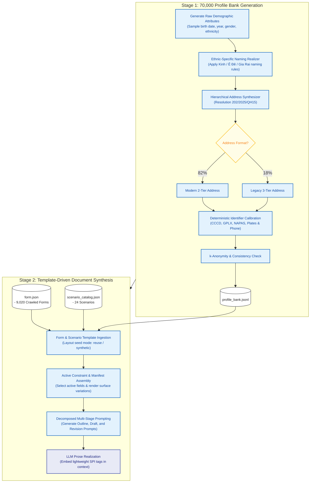
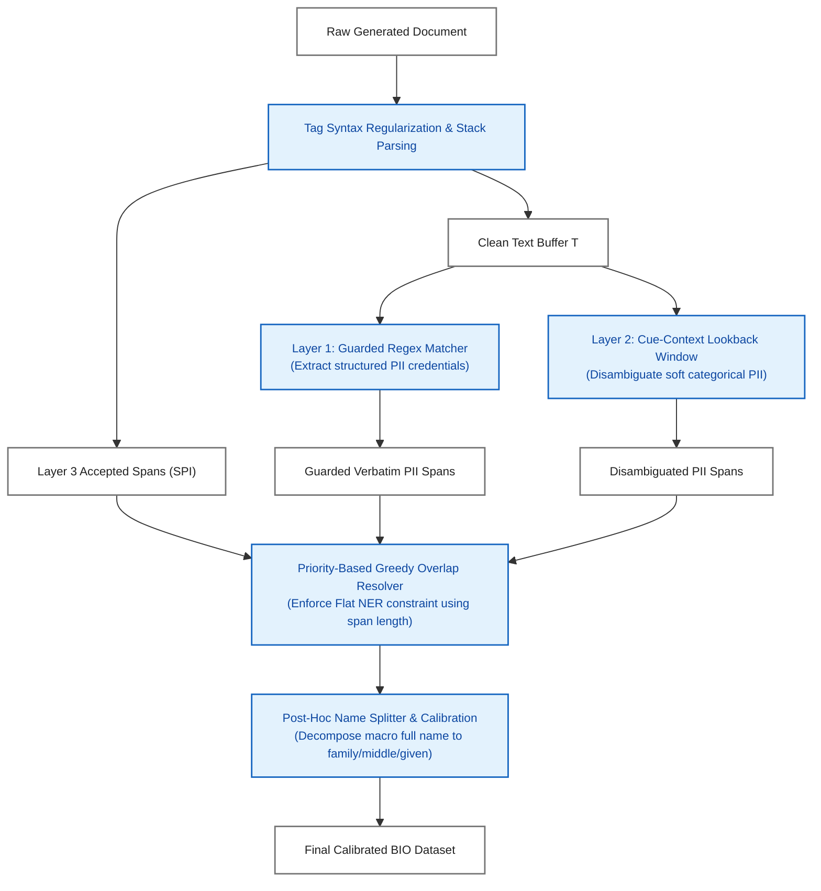
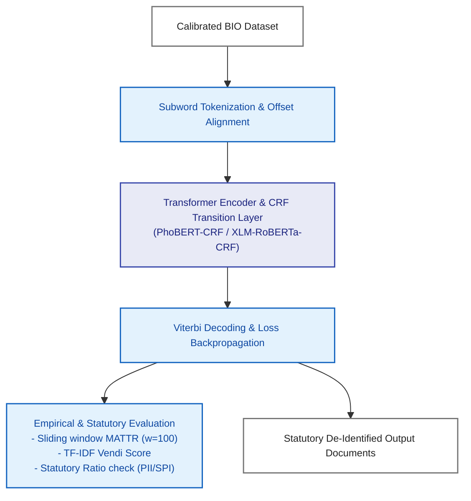

# SecurePrep: Detailed Architectural and Workflow Diagrams

This document contains simplified, grouped, and print-friendly visual flowcharts for the **SecurePrep** framework. Following professional graphic design and publication standards (such as IEEE, Elsevier, and Springer), all diagrams use a consistent color-coded scheme designed for high contrast on light backgrounds:
*   **Blue nodes (`fill:#E3F2FD`, `stroke:#1565C0`, `color:#0D47A1`)**: System processes and algorithms.
*   **Yellow nodes (`fill:#FFFDE7`, `stroke:#FBC02D`, `color:#F57F17`)**: Decisions and branching logic.
*   **White nodes (`fill:#FFFFFF`, `stroke:#757575`, `color:#212121`)**: Input/output datasets, databases, and files.
*   **Indigo nodes (`fill:#E8EAF6`, `stroke:#3949AB`, `color:#1A237E`)**: Large Language Models (LLMs) and downstream neural network architectures.

All code filenames (such as `build_profiles.py` and `annotation.py`) have been removed from the nodes and replaced with descriptive method names.

---

## Fig. 1: Overall System Architecture of SecurePrep

This diagram represents the high-level decoupled stages of the framework, showing the flow from seeds through generation and calibration to downstream evaluation.

```mermaid
graph LR
    %% Style Definitions
    classDef process fill:#E3F2FD,stroke:#1565C0,stroke-width:1.5px,color:#0D47A1,font-size:13px;
    classDef decision fill:#FFFDE7,stroke:#FBC02D,stroke-width:1.5px,color:#F57F17,font-size:13px;
    classDef io fill:#FFFFFF,stroke:#757575,stroke-width:1.5px,color:#212121,font-size:13px;
    classDef model fill:#E8EAF6,stroke:#3949AB,stroke-width:1.5px,color:#1A237E,font-size:13px;

    %% Nodes
    A1["Demographic & Sovereign Seeds"]:::io --> B1["Profile Bank Builder"]:::process
    B1 --> B2["70,000 Profile Bank"]:::io
    B2 --> B3["Template-Driven Document Synthesizer"]:::process
    B3 --> B4["Delimited Raw Documents"]:::io
    B4 --> C1["3-Layer Calibration & Overlap Resolver"]:::process
    C1 --> C2["Calibrated BIO Dataset"]:::io
    C2 --> D1["Downstream Model Training<br>(PhoBERT-CRF / XLM-R-CRF)"]:::model
    D1 --> D2["Empirical & Statutory Evaluation"]:::process
```

---

## Fig. 2: Profile Bank Generation & Document Synthesis Workflow

This diagram combines Stage 1 (Profile Generation) and Stage 2 (Document Synthesis) into two vertically stacked, horizontal subgraphs. Minor steps are grouped into high-level sub-processes to keep the layout compact and prevent over-stretching.

---

## Fig. 3: Granular 3-Layer Calibration & Overlap Resolution Workflow

This flowchart details how raw generated documents are parsed by the 3-layer engine and resolved for Flat NER overlap conflicts.

---

## Fig. 4: Downstream Model Training & Evaluation Pipeline

This diagram maps out the downstream model training process. It arranges the sequential preprocessing, encoding, and decoding steps in a vertical pipeline, and branches the final evaluation metrics horizontally to optimize space.

